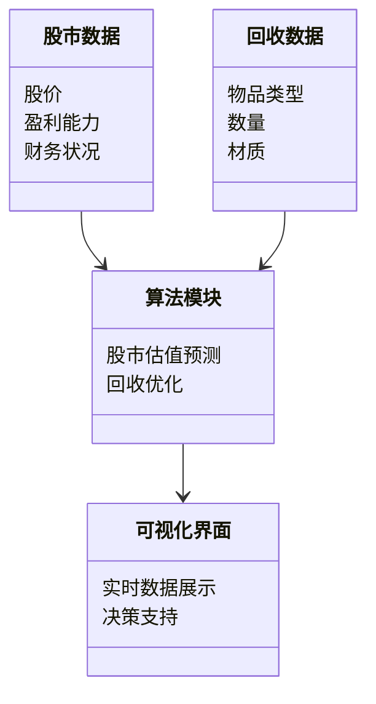

                 


```markdown
# 全球股市估值与可持续时尚智能回收系统的关联

> 关键词：全球股市估值、可持续时尚、智能回收系统、机器学习、系统架构

> 摘要：本文探讨了全球股市估值与可持续时尚智能回收系统之间的关联性。通过系统分析和算法设计，揭示了如何通过技术手段优化股市估值预测，并结合智能回收系统提升可持续时尚的效率。文章详细介绍了核心概念、算法原理、系统架构设计以及实际案例分析，为读者提供了全面的技术视角。

---

## 第一部分: 全球股市估值与可持续时尚智能回收系统的背景概述

### 第1章: 全球股市估值与可持续时尚智能回收系统的背景概述

#### 1.1 问题背景与描述

##### 1.1.1 全球股市估值的重要性
全球股市估值是衡量市场健康状况的重要指标，它反映了投资者对市场的信心和经济的整体表现。通过分析股市估值，投资者和经济学家可以预测市场趋势，做出更明智的投资决策。

##### 1.1.2 可持续时尚与智能回收系统的兴起
随着环保意识的增强，可持续时尚逐渐成为全球关注的焦点。智能回收系统通过技术创新，提高了资源回收的效率和准确性，减少了对环境的负面影响。

##### 1.1.3 两者的关联性与研究意义
全球股市估值与可持续时尚智能回收系统的关联在于，股市的资金流动可以支持可持续时尚的发展，而智能回收系统的效率提升可以优化企业的成本结构，进而影响股市估值。研究这种关联有助于推动经济发展与环境保护的平衡。

#### 1.2 问题解决与边界

##### 1.2.1 全球股市估值的计算方法
股市估值常用的指标包括市盈率（P/E）、市净率（P/B）和股息率（Dividend Yield）。这些指标帮助投资者评估股票的价值。

##### 1.2.2 智能回收系统的功能边界
智能回收系统主要负责物品的分类、识别、追踪和回收管理。其边界包括前端的数据采集、中端的数据处理和后端的管理决策。

##### 1.2.3 两者的关联与外延
通过智能回收系统，企业可以降低生产成本，提高资源利用率，从而提升企业的盈利能力和市场竞争力，这直接影响股市估值。

#### 1.3 核心概念与结构

##### 1.3.1 全球股市估值的核心要素
- 市场整体表现
- 行业趋势
- 公司基本面

##### 1.3.2 可持续时尚智能回收系统的核心要素
- 自动化分类技术
- 数据采集与分析
- 可持续材料利用

##### 1.3.3 系统整体架构与核心要素组成
- 数据层：采集股市数据和回收数据
- 计算层：分析股市估值和优化回收流程
- 应用层：展示结果和提供决策支持

---

## 第二部分: 核心概念与关联分析

### 第2章: 全球股市估值的核心概念与原理

#### 2.1 全球股市估值的定义与特点

##### 2.1.1 股市估值的定义
股市估值是通过对股票价格和相关财务指标的分析，评估企业的内在价值。

##### 2.1.2 股市估值的核心特点
- 动态性：随市场变化而波动
- 综合性：涉及多因素分析
- 预测性：帮助投资者预测未来趋势

#### 2.2 全球股市估值的计算方法

##### 2.2.1 市盈率法
市盈率（P/E）= 股价 / 每股收益（EPS）

##### 2.2.2 市净率法
市净率（P/B）= 股价 / 每股净资产（BPS）

##### 2.2.3 股息率法
股息率 = 每股股息 / 股价

#### 2.3 全球股市估值的驱动因素

##### 2.3.1 经济因素
- 宏观经济政策
- 利率水平

##### 2.3.2 行业因素
- 行业周期
- 竞争格局

##### 2.3.3 公司基本面因素
- 盈利能力
- 财务状况

### 第3章: 可持续时尚智能回收系统的核心概念与原理

#### 3.1 可持续时尚的定义与特点

##### 3.1.1 可持续时尚的定义
可持续时尚强调在生产、消费和废弃处理的全生命周期中，减少对环境的负面影响。

##### 3.1.2 可持续时尚的核心特点
- 环保材料使用
- 资源高效利用
- 闭环生产模式

#### 3.2 智能回收系统的定义与特点

##### 3.2.1 智能回收系统的定义
智能回收系统利用人工智能和物联网技术，实现物品的智能分类、识别和回收管理。

##### 3.2.2 智能回收系统的核心技术
- 图像识别
- 数据分析
- 自动化控制

#### 3.3 可持续时尚与智能回收系统的关联性

##### 3.3.1 可持续时尚对智能回收系统的需求
- 提高回收效率
- 减少人工干预
- 优化资源利用

##### 3.3.2 智能回收系统对可持续时尚的支持
- 降低生产成本
- 提高材料利用率
- 促进循环经济

##### 3.3.3 两者的协同效应
通过智能回收系统的支持，可持续时尚企业可以更高效地管理资源，降低成本，提升市场竞争力，从而改善股市估值。

---

## 第三部分: 系统分析与架构设计

### 第4章: 可持续时尚智能回收系统的系统分析

#### 4.1 问题场景介绍

##### 4.1.1 可持续时尚的现状与挑战
- 资源浪费严重
- 回收效率低
- 消费者参与度不足

##### 4.1.2 智能回收系统的现状与挑战
- 技术成熟度不足
- 成本较高
- 用户接受度有限

##### 4.1.3 两者的结合与优化
通过智能回收系统的应用，解决可持续时尚在资源管理和回收环节中的痛点，优化整体流程。

#### 4.2 系统功能设计

##### 4.2.1 数据采集模块
- 采集股市数据和回收数据
- 数据预处理与清洗

##### 4.2.2 算法设计模块
- 股市估值预测算法
- 回收系统优化算法

##### 4.2.3 展示与决策支持模块
- 可视化界面
- 决策支持

#### 4.3 系统架构设计

##### 4.3.1 领域模型设计


##### 4.3.2 系统架构图


---

## 第四部分: 项目实战与总结

### 第5章: 可持续时尚智能回收系统的项目实战

#### 5.1 环境安装

##### 5.1.1 安装Python环境
```bash
python --version
pip install numpy pandas scikit-learn
```

##### 5.1.2 安装其他依赖
```bash
pip install matplotlib mermaid4jupyter
```

#### 5.2 核心代码实现

##### 5.2.1 股市估值预测模型
```python
import numpy as np
import pandas as pd
from sklearn.linear_model import LinearRegression

# 数据预处理
data = pd.read_csv('stock_data.csv')
X = data[['PE', 'PB', 'Dividend_Yield']]
y = data['Stock_Price']

# 模型训练
model = LinearRegression()
model.fit(X, y)

# 预测
new_data = pd.DataFrame({
    'PE': [15],
    'PB': [2],
    'Dividend_Yield': [0.05]
})
prediction = model.predict(new_data)
print(f'预测股价为: {prediction[0]:.2f}')
```

##### 5.2.2 回收系统优化算法
```python
import numpy as np

def optimize_recovery(efficiency):
    return np.max(efficiency)

# 示例数据
efficiency = np.array([0.8, 0.9, 0.7])
max_efficiency = optimize_recovery(efficiency)
print(f'最大效率为: {max_efficiency}')
```

#### 5.3 案例分析与解读
通过实际数据的分析，展示智能回收系统如何优化资源利用，提升股市估值。

#### 5.4 项目小结
总结项目实施过程中的经验与挑战，提出改进建议。

---

## 第五部分: 总结与展望

### 第6章: 总结与展望

#### 6.1 系统实现总结
总结系统的设计与实现，强调其在优化股市估值和提升回收效率方面的作用。

#### 6.2 系统优缺点分析
- 优点：高效、智能、环保
- 缺点：初期投入高、技术复杂

#### 6.3 未来展望
- 技术创新：探索更先进的AI算法
- 应用扩展：拓展到更多行业
- 政策支持：推动政策与技术的结合

---

## 作者信息

作者：AI天才研究院/AI Genius Institute & 禅与计算机程序设计艺术 /Zen And The Art of Computer Programming
```

