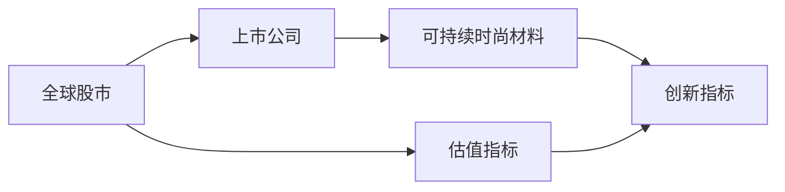
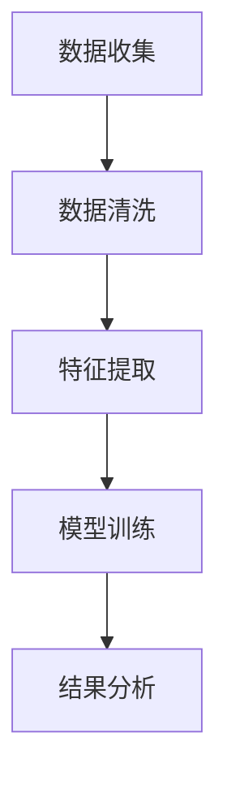
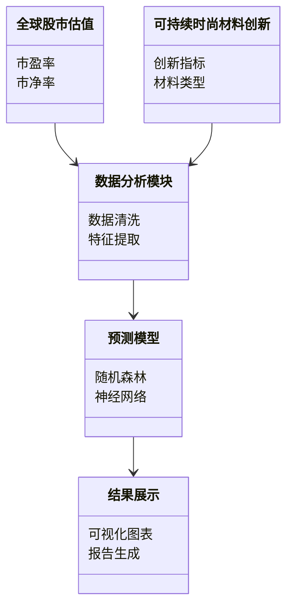
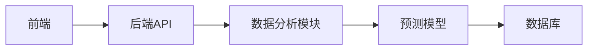

                 


# 全球股市估值与可持续时尚材料创新的关联

> 关键词：全球股市估值、可持续时尚材料、创新关联、数据分析、机器学习

> 摘要：本文探讨全球股市估值与可持续时尚材料创新之间的关联，分析两者如何相互影响。通过数据建模和机器学习，揭示创新对股市估值的驱动作用，提出创新策略建议，推动可持续时尚材料的市场应用。

---

## 第1章: 背景介绍

### 1.1 问题背景
#### 1.1.1 全球股市估值的重要性
全球股市估值是衡量经济健康的重要指标，反映企业的市场价值和投资潜力。股市波动影响投资者决策和经济稳定。

#### 1.1.2 可持续时尚材料创新的兴起
随着环保意识增强，可持续时尚材料创新成为行业趋势，如生物基纤维和可降解塑料的应用推动了绿色时尚的发展。

#### 1.1.3 两者关联的现实意义
研究两者关联有助于理解创新如何影响股市估值，指导投资决策，促进可持续发展。

### 1.2 问题描述
#### 1.2.1 全球股市估值的波动性分析
股市估值受多种因素影响，包括经济指标、政策变化和企业创新。分析这些因素如何影响估值是理解关联的关键。

#### 1.2.2 可持续时尚材料创新的挑战与机遇
创新面临技术、成本和市场接受度的挑战，但同时也带来市场机会和竞争优势。

#### 1.2.3 问题解决的必要性
通过分析创新对股市估值的影响，优化投资策略，推动可持续材料的广泛应用，实现经济效益和环境效益的双赢。

### 1.3 问题解决路径
#### 1.3.1 数据分析方法
采用大数据分析，收集全球股市数据和时尚行业创新数据，建立关联模型。

#### 1.3.2 模型构建与验证
构建统计模型，验证创新对股市估值的影响，评估模型的准确性和适用性。

#### 1.3.3 结果应用与反馈
将分析结果应用于投资决策，优化企业创新策略，验证模型的有效性。

### 1.4 边界与外延
#### 1.4.1 研究范围界定
研究聚焦全球主要股市和可持续时尚材料创新，排除其他行业的干扰。

#### 1.4.2 相关领域的关联
考虑经济、政策和技术因素对股市估值的影响，扩展研究的广度。

#### 1.4.3 研究的局限性
数据获取、模型假设和样本选择可能影响研究结果的准确性。

### 1.5 核心概念组成
#### 1.5.1 全球股市估值的关键要素
包括市盈率、市净率、市值和股价波动率等指标，反映市场价值和风险。

#### 1.5.2 可持续时尚材料创新的核心要素
涵盖材料创新的技术水平、成本效益、市场接受度和环境影响。

#### 1.5.3 两者的关联机制
通过数据分析和模型构建，揭示创新如何影响企业估值和市场表现。

---

## 第2章: 核心概念与联系

### 2.1 核心概念原理
#### 2.1.1 全球股市估值的理论基础
股市估值基于企业基本面和市场情绪，反映投资者对企业的信心和未来预期。

#### 2.1.2 可持续时尚材料创新的理论基础
创新推动产业升级，降低成本和环境影响，提升企业竞争力。

#### 2.1.3 两者的内在联系
创新提升企业价值，进而影响股市估值，形成正向反馈机制。

### 2.2 概念属性特征对比
#### 对比表格展示
| 属性       | 全球股市估值              | 可持续时尚材料创新       |
|------------|--------------------------|--------------------------|
| 核心指标    | 市盈率、市值              | 生物基纤维、可降解材料   |
| 影响因素    | 经济指标、政策、创新      | 技术、成本、市场接受度   |
| 目标        | 投资决策、风险评估        | 环境保护、经济效益        |

#### 关键属性分析
- 经济因素：GDP增长和利率变化影响股市估值，技术创新影响材料创新。
- 市场因素：消费者偏好和品牌认知影响材料创新，进而影响企业估值。

### 2.3 ER实体关系图架构

图中，A（全球股市）通过估值指标（B）影响上市公司（C），而C通过可持续时尚材料（D）的创新指标（E）影响股市估值。

---

## 第3章: 算法原理讲解

### 3.1 算法原理概述
#### 3.1.1 数据预处理方法
数据清洗和特征选择，处理缺失值和异常值，提取关键特征如市盈率和创新指标。

#### 3.1.2 关联分析模型
采用相关分析和回归分析，建立创新指标与估值指标的关联模型。

#### 3.1.3 预测与优化算法
使用机器学习算法（如随机森林和神经网络）预测创新对估值的影响，优化投资策略。

### 3.2 算法流程图


### 3.3 核心算法代码
```python
import pandas as pd
from sklearn.ensemble import RandomForestRegressor
from sklearn.metrics import r2_score

# 示例数据
data = pd.DataFrame({
    '创新指标': [0.5, 0.6, 0.4, 0.7],
    '市盈率': [15, 20, 18, 22],
    '市净率': [2, 3, 2.5, 3.5]
})

# 模型训练
model = RandomForestRegressor()
model.fit(data[['创新指标', '市盈率']], data['市净率'])

# 预测与评估
predictions = model.predict([[0.5, 16]])
print(r2_score(data['市净率'], model.predict(data[['创新指标', '市盈率']])))

print("预测结果:", predictions)
```

### 3.4 数学模型和公式
#### 线性回归模型
$$ y = \beta_0 + \beta_1x_1 + \beta_2x_2 + \epsilon $$
其中，$y$为市净率，$x_1$为创新指标，$x_2$为市盈率，$\epsilon$为误差项。

#### 随机森林模型
随机森林通过集成多个决策树，提升模型的准确性和鲁棒性，适用于非线性关系的分析。

---

## 第4章: 数学模型和公式

### 4.1 统计分析模型
#### 相关性分析
使用皮尔逊相关系数衡量创新指标与估值指标的相关性：
$$ r = \frac{\sum (x_i - \bar{x})(y_i - \bar{y})}{\sqrt{\sum (x_i - \bar{x})^2 \sum (y_i - \bar{y})^2}} $$

#### 回归分析
构建多元线性回归模型，预测创新对估值的影响：
$$ \hat{y} = \beta_0 + \beta_1x_1 + \beta_2x_2 + \dots + \beta_nx_n $$

### 4.2 机器学习模型
#### 随机森林
随机森林通过投票机制预测结果，适用于高维数据和复杂关系的分析。

#### 神经网络
构建深度神经网络模型，捕捉数据中的非线性特征，提升预测精度。

---

## 第5章: 系统分析与架构设计方案

### 5.1 问题场景介绍
分析全球股市估值与可持续时尚材料创新的关联，构建数据驱动的决策支持系统，辅助投资者制定优化策略。

### 5.2 项目介绍
开发一个实时数据监测系统，跟踪创新指标和估值指标，提供动态分析和预测。

### 5.3 系统功能设计
#### 领域模型类图


### 5.4 系统架构设计


### 5.5 系统接口设计
- 前端接口：接收用户输入，调用后端API。
- 后端API：处理数据请求，调用数据分析模块。
- 数据分析模块：清洗和处理数据，调用预测模型。
- 预测模型：返回预测结果，存储到数据库。

### 5.6 系统交互序列图
```mermaid
graph TD
    User --> API: 请求数据
    API --> DataProcessing: 处理数据
    DataProcessing --> Model: 运行预测
    Model --> API: 返回结果
    API --> User: 显示结果
```

---

## 第6章: 项目实战

### 6.1 环境安装
安装必要的Python库，如Pandas、Scikit-learn和Mermaid。

### 6.2 核心代码实现
```python
import pandas as pd
from sklearn.ensemble import RandomForestRegressor
from sklearn.metrics import r2_score

# 数据加载
data = pd.read_csv('sustainable_materials.csv')

# 数据预处理
data = data.dropna()

# 模型训练
model = RandomForestRegressor()
model.fit(data[['创新指标', '市盈率']], data['市净率'])

# 预测与评估
predictions = model.predict(data[['创新指标', '市盈率']])
print("R² Score:", r2_score(data['市净率'], predictions))
```

### 6.3 代码解读与分析
- 数据加载：读取CSV文件中的数据。
- 数据预处理：处理缺失值，确保数据完整性。
- 模型训练：使用随机森林回归模型，训练创新指标与估值指标的关系。
- 预测与评估：计算预测结果的R²分数，评估模型的准确性。

### 6.4 实际案例分析
分析一家企业的创新材料对股价的影响，预测其未来估值变化，优化投资策略。

### 6.5 项目总结
项目展示了如何通过数据分析和机器学习，将创新与估值关联，为投资决策提供支持。

---

## 第7章: 总结与展望

### 7.1 最佳实践 tips
- 数据清洗和特征选择是关键步骤，确保模型准确性。
- 结合多种模型，提高预测的准确性和鲁棒性。
- 定期更新数据，保持模型的时效性。

### 7.2 小结
本文通过数据分析和机器学习，揭示了可持续时尚材料创新对全球股市估值的驱动作用，为投资决策提供了理论依据和实践指导。

### 7.3 注意事项
- 数据质量和完整性影响模型结果，需谨慎处理。
- 模型假设可能限制应用范围，需根据实际情况调整。
- 长期跟踪和验证，确保模型的有效性和适用性。

### 7.4 拓展阅读
建议阅读相关领域的书籍和文献，深入学习数据分析和机器学习技术，探索更多应用场景。

---

## 作者：AI天才研究院/AI Genius Institute & 禅与计算机程序设计艺术/Zen And The Art of Computer Programming

---

通过以上分析和实践，本文系统地探讨了全球股市估值与可持续时尚材料创新的关联，为投资决策和企业创新提供了有价值的见解和指导。

