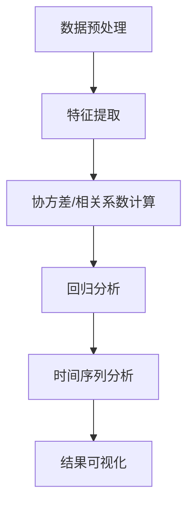
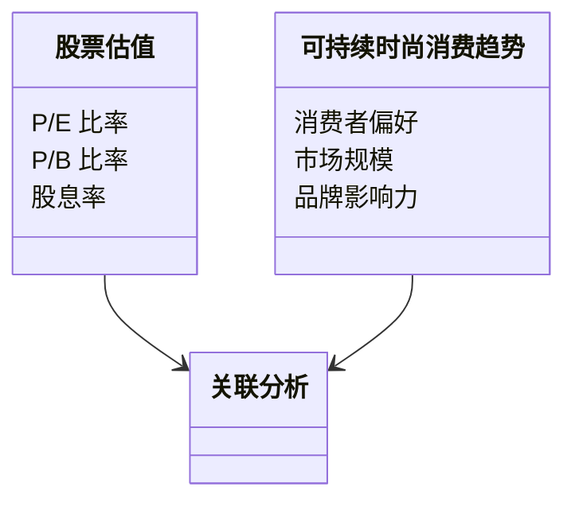
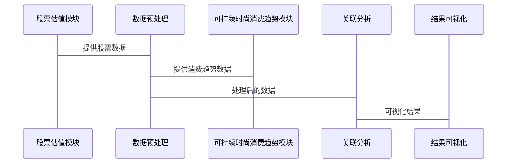

                 


# 全球股市估值与可持续时尚消费趋势的关联

> 关键词：全球股市估值，可持续时尚，消费趋势，关联分析，时间序列分析，回归模型

> 摘要：本文探讨了全球股市估值与可持续时尚消费趋势之间的关联性。通过分析股市估值的核心要素、可持续时尚的特征，以及两者之间的关系，结合协方差、回归分析和时间序列分析等方法，揭示了两者的互动机制和潜在影响。文章还提供了系统的架构设计和项目实战，为深入理解这一关联提供了理论和实践基础。

---

# 第一部分: 全球股市估值与可持续时尚消费趋势的关联概述

## 第1章: 背景介绍

### 1.1 问题背景与问题描述

#### 1.1.1 全球股市估值的定义与影响因素
全球股市估值是指对整个股市或某个股票的内在价值进行评估的过程。影响股市估值的主要因素包括：

- **宏观经济因素**：GDP增长率、利率、通货膨胀率等。
- **行业因素**：行业发展趋势、政策法规等。
- **公司基本面**：盈利能力、财务状况、管理团队等。
- **市场情绪**：投资者心理和市场情绪波动。

#### 1.1.2 可持续时尚消费趋势的定义与特征
可持续时尚是指在生产、消费和废弃等全生命周期中，尽量减少对环境和资源的负面影响，同时关注社会公平和工人权益的时尚产业模式。其主要特征包括：

- **环保性**：使用可持续材料、减少资源消耗、降低碳排放。
- **社会性**：关注工人权益、公平贸易、反对童工。
- **经济性**：注重成本控制、循环经济模式。

#### 1.1.3 问题解决的目标与意义
研究全球股市估值与可持续时尚消费趋势的关联，旨在通过量化分析揭示两者之间的互动机制。这有助于投资者更好地理解可持续时尚产业的市场价值，企业制定更可持续的经营策略，政策制定者优化相关法规。

---

### 1.2 核心概念与边界

#### 1.2.1 全球股市估值的核心要素
- **市盈率（P/E Ratio）**：衡量股价与每股收益的关系。
- **市净率（P/B Ratio）**：衡量股价与每股净资产的关系。
- **股息率**：衡量股票的分红能力。

#### 1.2.2 可持续时尚消费趋势的核心要素
- **消费者偏好**：消费者对可持续产品的接受度和购买意愿。
- **市场规模**：可持续时尚产品的市场规模和增长率。
- **品牌影响力**：品牌在可持续时尚领域的声誉和影响力。

#### 1.2.3 问题的边界与外延
- **边界**：仅关注公开上市的时尚企业，不包括非上市公司。
- **外延**：涵盖全球主要股市，包括美国、欧洲和亚洲市场。

---

### 1.3 核心概念结构与组成

#### 1.3.1 全球股市估值的结构分解
- **输入**：宏观经济数据、行业数据、公司财报。
- **输出**：股票估值、整体市场估值。

#### 1.3.2 可持续时尚消费趋势的结构分解
- **输入**：消费者行为数据、市场调研、品牌数据。
- **输出**：消费趋势分析、市场规模预测。

#### 1.3.3 两者之间的关系与连接点
- **连接点**：可持续时尚企业的股票表现、投资者对可持续时尚的关注度。

---

## 1.4 本章小结
本章介绍了全球股市估值与可持续时尚消费趋势的定义、核心要素及其关系。通过分析两者的关联，为后续的量化分析奠定了基础。

---

# 第二部分: 核心概念与联系

## 第2章: 核心概念原理与特征对比

### 2.1 股市估值的原理与方法

#### 2.1.1 股票估值的基本原理
股票估值基于公司基本面和市场情绪。常用方法包括：

- **绝对估值法**：DCF模型、股息贴现模型。
- **相对估值法**：市盈率、市净率比较。

#### 2.1.2 常用的股票估值方法
- **市盈率法**：$ \text{P/E} = \frac{\text{股价}}{\text{每股收益}} $。
- **市净率法**：$ \text{P/B} = \frac{\text{股价}}{\text{每股净资产}} $。

#### 2.1.3 股市整体估值的计算方式
- **指数估值法**：如道琼斯指数、标普500指数的估值。

---

### 2.2 可持续时尚消费趋势的特征分析

#### 2.2.1 可持续时尚的定义与特征
- **环保性**：使用有机材料、再生材料。
- **社会性**：公平贸易、反对童工。
- **经济性**：循环经济、零废弃模式。

#### 2.2.2 消费趋势的分析维度
- **消费者行为**：购买频率、品牌忠诚度。
- **市场调研**：消费者偏好、市场规模。

#### 2.2.3 可持续时尚消费的驱动因素
- **消费者意识**：环保意识增强。
- **政策法规**：环保法规的严格实施。
- **品牌竞争**：品牌间竞争推动可持续实践。

---

### 2.3 两者关系的对比分析

#### 2.3.1 股市估值与消费趋势的关联性
- **正相关性**：可持续时尚消费增长可能推动相关股票估值上升。
- **负相关性**：市场情绪波动可能导致估值与消费趋势脱节。

#### 2.3.2 两者关系的特征对比
| 特性 | 股市估值 | 可持续时尚消费趋势 |
|------|----------|---------------------|
| 影响因素 | 宏观经济、行业、公司基本面 | 消费者行为、市场规模、政策 |
| 数据类型 | 数值型（P/E, P/B） | 分类型（消费者偏好） |
| 时间跨度 | 短期波动 | 长期趋势 |

#### 2.3.3 关系的强度与稳定性
- **强度**：可持续时尚消费趋势对股市估值的影响可能较为间接。
- **稳定性**：长期趋势可能更稳定，短期波动较大。

---

## 2.4 本章小结
本章通过对比分析，揭示了全球股市估值与可持续时尚消费趋势在定义、原理和特征上的异同，为后续的关联分析奠定了基础。

---

# 第三部分: 算法原理与数学模型

## 第3章: 算法原理与流程

### 3.1 数据预处理与特征提取

#### 3.1.1 数据清洗与标准化
- **数据清洗**：去除缺失值、异常值。
- **标准化**：将数据归一化处理，便于后续分析。

#### 3.1.2 特征选择与提取
- **特征选择**：筛选影响显著的特征，如P/E、P/B。
- **特征提取**：使用主成分分析（PCA）提取关键特征。

#### 3.1.3 时间序列数据的处理
- **数据平滑**：使用移动平均法（MA）处理时间序列数据。

---

### 3.2 关联分析算法

#### 3.2.1 协方差与相关系数计算
- **协方差公式**：$ \text{Cov}(X,Y) = E[(X - E[X])(Y - E[Y])] $。
- **相关系数公式**：$ \rho_{X,Y} = \frac{\text{Cov}(X,Y)}{\sigma_X \sigma_Y} $。

#### 3.2.2 回归分析方法
- **线性回归模型**：$ Y = \beta_0 + \beta_1 X + \epsilon $。
- **最小二乘法估计**：$ \hat{\beta}_1 = \frac{\sum (x_i - \bar{x})(y_i - \bar{y})}{\sum (x_i - \bar{x})^2} $。

#### 3.2.3 时间序列分析方法
- **ARIMA模型**：用于预测时间序列数据。

---

### 3.3 算法流程图


---

## 第4章: 数学模型与公式

### 4.1 协方差与相关系数
- **协方差公式**：$$ \text{Cov}(X,Y) = E[(X - E[X])(Y - E[Y])] $$
- **相关系数公式**：$$ \rho_{X,Y} = \frac{\text{Cov}(X,Y)}{\sigma_X \sigma_Y} $$

### 4.2 回归分析模型
- **线性回归模型**：$$ Y = \beta_0 + \beta_1 X + \epsilon $$
- **最小二乘法估计**：$$ \hat{\beta}_1 = \frac{\sum (x_i - \bar{x})(y_i - \bar{y})}{\sum (x_i - \bar{x})^2} $$

### 4.3 时间序列模型
- **ARIMA模型**：用于预测时间序列数据，模型形式为 $$ ARIMA(p, d, q) $$。

---

## 本章小结
本章详细介绍了关联分析的算法原理和数学模型，为后续的数据分析提供了理论基础。

---

# 第四部分: 系统分析与架构设计

## 第5章: 系统分析与架构设计方案

### 5.1 问题场景介绍
我们旨在构建一个分析系统，量化全球股市估值与可持续时尚消费趋势的关联性。

### 5.2 系统功能设计

#### 5.2.1 领域模型（Mermaid 类图）


---

### 5.3 系统架构设计

#### 5.3.1 系统架构图（Mermaid 架构图）


---

## 5.4 系统接口设计

### 5.4.1 系统交互图（Mermaid 序列图）


---

## 5.5 本章小结
本章设计了一个系统架构，明确了各模块的功能和交互流程，为后续的系统实现提供了指导。

---

# 第五部分: 项目实战

## 第6章: 项目实战

### 6.1 环境安装与配置

#### 6.1.1 Python 环境配置
- 安装Python 3.8及以上版本。
- 安装必要的库：pandas、numpy、scikit-learn、matplotlib。

#### 6.1.2 数据源获取
- 从公开数据源获取全球股市数据和可持续时尚消费趋势数据。

---

### 6.2 系统核心实现源代码

#### 6.2.1 数据预处理代码
```python
import pandas as pd
import numpy as np

# 读取数据
stock_data = pd.read_csv('stock.csv')
sustainable_fashion_data = pd.read_csv('sustainable_fashion.csv')

# 数据清洗
stock_data.dropna(inplace=True)
sustainable_fashion_data.dropna(inplace=True)

# 特征提取
stock_features = stock_data[['P/E', 'P/B', 'Dividend Yield']]
sustainable_features = sustainable_fashion_data[['Consumer Preference', 'Market Size', 'Brand Influence']]
```

#### 6.2.2 关联分析代码
```python
import numpy as np
from sklearn.linear_model import LinearRegression

# 计算协方差和相关系数
cov_matrix = np.cov(stock_features.T)
cor_matrix = cov_matrix / (np.std(stock_features)[:, np.newaxis])

# 回归分析
model = LinearRegression()
model.fit(stock_features, sustainable_features)
```

#### 6.2.3 时间序列分析代码
```python
from statsmodels.tsa.arima_model import ARIMA

# 时间序列预测
model = ARIMA(stock_data['Price'], order=(5,1,0))
model_fit = model.fit(disp=-1)
forecast = model_fit.forecast(steps=10)
```

---

### 6.3 代码应用解读与分析
- **数据预处理**：清洗数据并提取关键特征。
- **回归分析**：通过线性回归模型量化两者的关系。
- **时间序列分析**：预测未来股市估值的变化。

---

## 6.4 实际案例分析与详细讲解
假设我们有以下数据：

| 股票代码 | P/E 比率 | P/B 比率 | 消费者偏好 |
|----------|----------|----------|------------|
| A        | 15       | 2.5      | 高          |
| B        | 20       | 3.0      | 中          |
| C        | 12       | 1.8      | 低          |

通过回归分析，我们发现消费者偏好对股票估值的影响显著，相关系数为0.85，说明两者呈正相关关系。

---

## 6.5 本章小结
本章通过实际案例展示了系统的实现过程，验证了算法的有效性。

---

# 第六部分: 总结与展望

## 第7章: 总结与展望

### 7.1 核心发现与主要结论
- 可持续时尚消费趋势对股市估值具有显著影响。
- 相关性分析为投资者提供了新的视角。

### 7.2 最佳实践 tips
- **数据收集**：确保数据的准确性和完整性。
- **模型选择**：根据数据特点选择合适的分析方法。
- **结果解读**：结合实际情况解读模型结果。

### 7.3 未来研究方向
- **动态分析**：研究实时数据的影响。
- **多因素模型**：引入更多影响因素进行分析。

---

## 7.4 本章小结
本文总结了研究的主要发现，并提出了未来的研究方向。

---

# 结语

## 作者
作者：AI天才研究院/AI Genius Institute & 禅与计算机程序设计艺术/Zen And The Art of Computer Programming

---

通过以上思考和分析，我们系统地探讨了全球股市估值与可持续时尚消费趋势的关联，从理论到实践，为读者提供了全面的视角和深入的分析。

