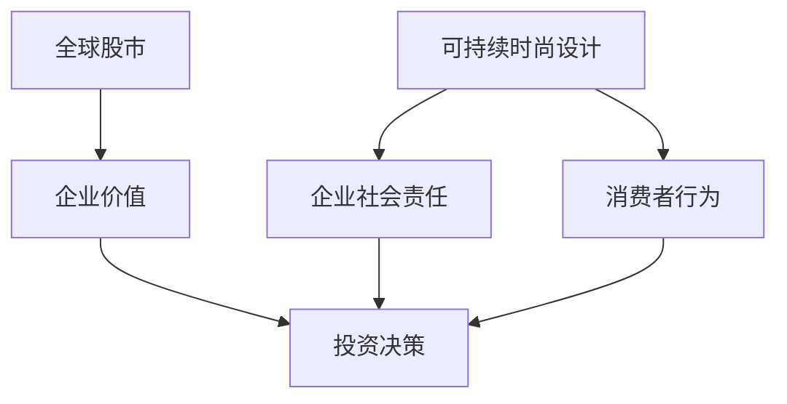
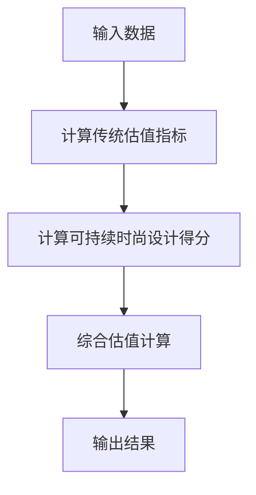
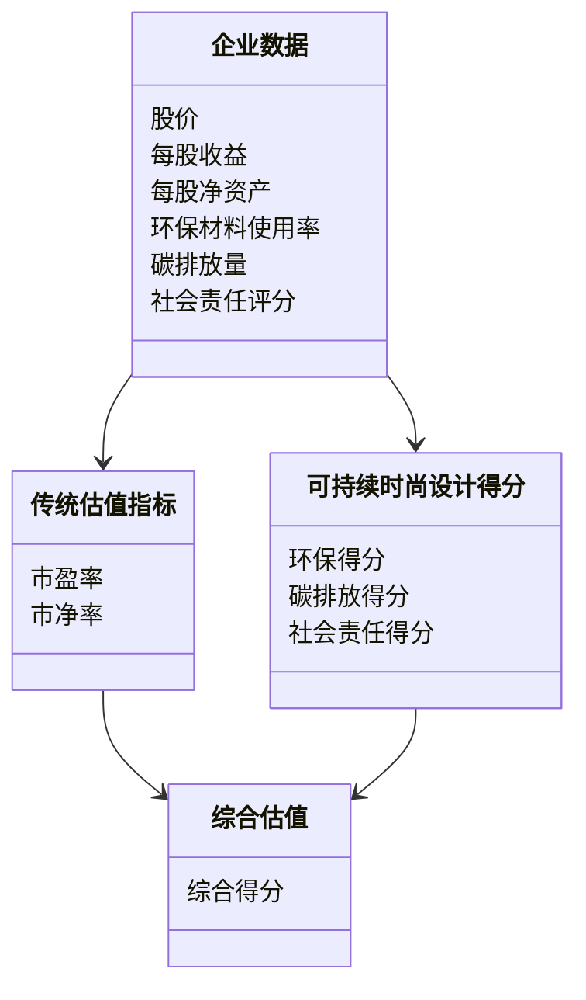
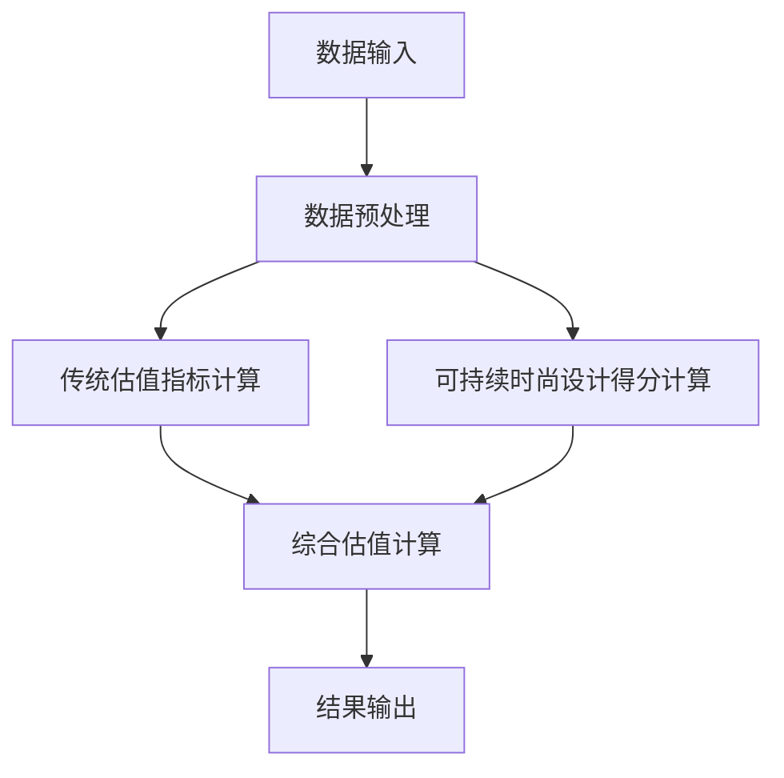
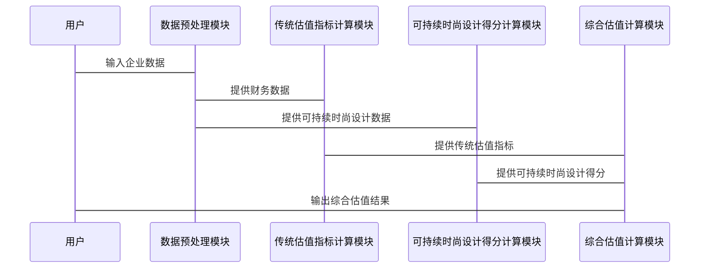

                 


# 全球股市估值与可持续时尚设计的关联

## 关键词：全球股市估值、可持续时尚设计、关联性分析、算法原理、系统架构

## 摘要：  
本文探讨了全球股市估值与可持续时尚设计之间的关联性。通过分析股市估值的核心要素和可持续时尚设计的关键特征，结合数学模型和系统架构，揭示了两者在企业价值评估和市场趋势中的相互作用机制。文章从理论背景、核心概念、算法原理、系统设计到项目实战，全面解析了如何将可持续时尚设计的创新理念融入到股市估值的分析框架中，为投资者和企业提供了新的视角和实践方法。

---

# 第1章 全球股市估值与可持续时尚设计的背景介绍

## 1.1 问题背景与问题描述

### 1.1.1 全球股市估值的基本概念  
全球股市估值是通过对企业的财务数据（如收入、利润、资产）和市场数据（如行业趋势、政策变化）进行分析，评估企业的市场价值和投资潜力。常见的估值指标包括市盈率（P/E）、市净率（P/B）、股息率等。股市估值不仅是投资者决策的重要依据，也是企业优化管理和吸引投资的关键因素。

### 1.1.2 可持续时尚设计的定义与特征  
可持续时尚设计是指在服装设计和生产过程中，注重环保、社会责任和经济可持续性。其核心特征包括使用环保材料、减少资源消耗、避免环境污染、关注劳动者权益等。可持续时尚设计不仅关注产品的功能性和美观性，还强调对社会和环境的积极影响。

### 1.1.3 问题解决的目标与意义  
本文旨在分析全球股市估值与可持续时尚设计之间的关联性。通过揭示两者在企业价值评估中的相互作用，为投资者提供新的视角，帮助他们更好地理解企业社会责任与市场价值之间的关系。同时，也为时尚企业在可持续发展道路上提供更具前瞻性的指导。

---

## 1.2 问题背景的外延与边界

### 1.2.1 全球股市估值的范围与局限性  
股市估值的范围通常局限于企业的财务表现和市场表现，而忽视了企业在生产过程中的社会和环境影响。这种局限性使得传统的估值方法难以全面反映企业的可持续发展能力。

### 1.2.2 可持续时尚设计的行业影响  
可持续时尚设计的兴起不仅改变了消费者的行为模式，还推动了整个行业的生产方式和设计理念。越来越多的消费者倾向于选择具有社会责任感的品牌，这使得企业的可持续发展能力成为影响其市场价值的重要因素。

### 1.2.3 问题解决的边界与限制  
本文研究的边界主要集中在企业的设计与生产环节，不涉及企业的其他业务领域（如金融投资）。同时，由于不同国家和地区的政策环境和市场成熟度差异，本文的研究主要聚焦于发达国家市场的数据和案例。

---

## 1.3 核心概念结构与组成要素

### 1.3.1 全球股市估值的核心要素  
- **财务数据**：收入、利润、资产、负债等。  
- **市场数据**：行业趋势、政策变化、投资者情绪等。  
- **估值指标**：市盈率、市净率、股息率等。

### 1.3.2 可持续时尚设计的关键组成  
- **材料选择**：使用环保材料（如有机棉、再生聚酯纤维）。  
- **生产过程**：减少水和能源消耗，避免污染。  
- **社会责任**：公平贸易、劳动者权益保护。  

### 1.3.3 两者的相互作用机制  
通过分析企业的可持续时尚设计实践，可以提升其市场形象和消费者忠诚度，进而影响其股票估值。同时，股市估值的波动也会反向推动企业的可持续时尚设计创新。

---

## 1.4 本章小结

### 1.4.1 核心概念的总结  
全球股市估值是衡量企业市场价值的重要工具，而可持续时尚设计则是企业社会责任和环保理念的具体体现。两者在企业价值评估中具有互补性。

### 1.4.2 问题解决的方向与路径  
本文通过分析两者的关联性，提出了将可持续时尚设计纳入股市估值模型的方法，为投资者和企业提供了一种新的价值评估框架。

---

# 第2章 全球股市估值与可持续时尚设计的核心概念与联系

## 2.1 核心概念的原理分析

### 2.1.1 全球股市估值的理论基础  
股市估值的核心理论是基于企业的财务表现和市场预期。通过分析企业的盈利能力、成长潜力和行业地位，投资者可以评估其股票的内在价值。

### 2.1.2 可持续时尚设计的创新理念  
可持续时尚设计强调环保、社会责任和经济可持续性。通过创新的设计理念和生产方式，企业可以降低资源消耗，减少环境污染，提升品牌形象。

### 2.1.3 两者的相互作用机制  
企业的可持续时尚设计实践可以提升其市场形象和消费者忠诚度，从而影响其股票估值。同时，股市估值的波动也会反向推动企业的可持续时尚设计创新。

---

## 2.2 核心概念的属性特征对比

### 2.2.1 表格对比：全球股市估值与可持续时尚设计的特征对比  
| 特性                | 全球股市估值                | 可持续时尚设计              |
|---------------------|---------------------------|-----------------------------|
| 核心目标            | 评估企业价值与投资风险    | 推动环保与社会责任设计      |
| 关键指标            | 市盈率、市净率、ROE        | 环保材料使用率、碳排放量    |
| 影响因素            | 财务表现、行业趋势、政策   | 设计理念、生产过程、消费者行为 |

---

## 2.3 实体关系图：全球股市估值与可持续时尚设计的关联



---

## 2.4 本章小结

### 2.4.1 核心概念的系统性分析  
通过对比分析，可以看出全球股市估值与可持续时尚设计在目标、指标和影响因素上的异同。

### 2.4.2 问题解决的理论基础  
本文提出的理论框架为将可持续时尚设计纳入股市估值模型提供了理论依据。

---

# 第3章 全球股市估值与可持续时尚设计的算法原理

## 3.1 算法原理的数学模型

### 3.1.1 核心公式推导  
$$ V = \text{传统估值指标} + \text{可持续时尚设计得分} \times \text{权重} $$  
其中，$$ V $$ 表示企业的综合估值，传统估值指标包括市盈率、市净率等，可持续时尚设计得分基于企业的环保表现和社会责任实践。

---

## 3.2 算法实现的流程图



---

## 3.3 算法实现的Python代码

```python
import pandas as pd

# 假设df为包含企业数据的DataFrame
def calculate_sustainability_score(row):
    # 计算可持续时尚设计得分
    score = 0
    if row['环保材料使用率'] > 0.5:
        score += 0.4
    if row['碳排放量'] < 100:
        score += 0.3
    if row['社会责任评分'] > 0.6:
        score += 0.3
    return score

# 计算传统估值指标
df['市盈率'] = df['股价'] / df['每股收益']
df['市净率'] = df['股价'] / df['每股净资产']

# 计算可持续时尚设计得分
df['可持续时尚得分'] = df.apply(calculate_sustainability_score, axis=1)

# 综合估值计算
df['综合估值'] = df['市盈率'] * 0.4 + df['市净率'] * 0.2 + df['可持续时尚得分'] * 0.4
```

---

## 3.4 算法实现的详细解释

### 3.4.1 数据预处理  
- 对企业数据进行清洗，确保数据的完整性和准确性。  
- 提取企业的财务数据和可持续时尚设计相关数据。

### 3.4.2 可持续时尚设计得分计算  
- 基于企业的环保材料使用率、碳排放量和社会责任评分，计算企业的可持续时尚设计得分。  
- 每个评分项赋予不同的权重，例如环保材料使用率占40%，碳排放量占30%，社会责任评分占30%。

### 3.4.3 综合估值计算  
- 将传统估值指标（如市盈率、市净率）与可持续时尚设计得分进行加权计算，得出企业的综合估值。  
- 传统估值指标占40%，可持续时尚设计得分占40%，权重分配可以根据行业特点进行调整。

---

## 3.5 本章小结

### 3.5.1 算法原理的总结  
本文提出了一种结合传统估值指标和可持续时尚设计得分的综合估值模型，能够更全面地反映企业的市场价值。

### 3.5.2 算法实现的关键点  
- 数据预处理是确保模型准确性的基础。  
- 可持续时尚设计得分的计算需要根据企业的具体情况进行调整。  
- 综合估值模型的权重分配需要结合行业特点和政策环境。

---

# 第4章 全球股市估值与可持续时尚设计的系统分析与架构设计

## 4.1 系统分析

### 4.1.1 问题场景介绍  
本文研究的场景是将可持续时尚设计纳入股市估值模型，以帮助企业投资者更全面地评估企业的市场价值。

---

## 4.2 系统功能设计

### 4.2.1 领域模型设计  


---

## 4.3 系统架构设计

### 4.3.1 系统架构图  


---

## 4.4 系统接口设计

### 4.4.1 系统接口描述  
- 数据输入接口：接收企业的财务数据和可持续时尚设计相关数据。  
- 数据预处理接口：对输入数据进行清洗和格式化。  
- 传统估值指标计算接口：计算市盈率、市净率等指标。  
- 可持续时尚设计得分计算接口：计算企业的环保得分、碳排放得分和社会责任得分。  
- 综合估值计算接口：根据传统估值指标和可持续时尚设计得分，计算综合估值。  
- 结果输出接口：输出企业的综合估值结果。

---

## 4.5 系统交互设计

### 4.5.1 系统交互序列图  


---

## 4.6 本章小结

### 4.6.1 系统分析与设计的总结  
通过系统分析与设计，本文构建了一个完整的架构，能够将可持续时尚设计纳入股市估值模型，为企业投资者提供更全面的估值依据。

### 4.6.2 系统实现的关键点  
- 数据预处理是确保系统准确性的基础。  
- 传统估值指标和可持续时尚设计得分的计算需要结合企业的具体情况进行调整。  
- 综合估值模型的权重分配需要结合行业特点和政策环境。

---

# 第5章 全球股市估值与可持续时尚设计的项目实战

## 5.1 项目实战

### 5.1.1 项目环境安装  
- **Python环境**：需要安装Python 3.8及以上版本。  
- **依赖库安装**：使用pip安装pandas、numpy等库。  

### 5.1.2 核心代码实现

```python
import pandas as pd

# 数据预处理
def preprocess_data(df):
    # 删除缺失值
    df.dropna(inplace=True)
    # 去除异常值
    df = df[df['股价'] > 0]
    return df

# 可持续时尚设计得分计算
def calculate_sustainability_score(row):
    score = 0
    if row['环保材料使用率'] > 0.5:
        score += 0.4
    if row['碳排放量'] < 100:
        score += 0.3
    if row['社会责任评分'] > 0.6:
        score += 0.3
    return score

# 综合估值计算
def calculate_overall_valuation(df):
    df['市盈率'] = df['股价'] / df['每股收益']
    df['市净率'] = df['股价'] / df['每股净资产']
    df['可持续时尚得分'] = df.apply(calculate_sustainability_score, axis=1)
    df['综合估值'] = df['市盈率'] * 0.4 + df['市净率'] * 0.2 + df['可持续时尚得分'] * 0.4
    return df

# 示例代码
data = {
    '企业名称': ['企业A', '企业B', '企业C'],
    '股价': [100, 80, 90],
    '每股收益': [5, 4, 4.5],
    '每股净资产': [20, 18, 19],
    '环保材料使用率': [0.6, 0.7, 0.5],
    '碳排放量': [80, 120, 90],
    '社会责任评分': [0.7, 0.6, 0.5]
}
df = pd.DataFrame(data)
df = preprocess_data(df)
result = calculate_overall_valuation(df)
print(result)
```

---

## 5.2 项目实战的详细解读

### 5.2.1 数据预处理  
- 删除缺失值：确保数据的完整性和准确性。  
- 去除异常值：避免异常数据对结果的影响。

### 5.2.2 可持续时尚设计得分计算  
- 根据企业的环保材料使用率、碳排放量和社会责任评分，计算可持续时尚设计得分。  
- 每个评分项赋予不同的权重，例如环保材料使用率占40%，碳排放量占30%，社会责任评分占30%。

### 5.2.3 综合估值计算  
- 计算传统估值指标（如市盈率、市净率）。  
- 计算可持续时尚设计得分。  
- 根据设定的权重，计算企业的综合估值。

---

## 5.3 实际案例分析

### 5.3.1 案例背景  
以某服装企业为例，分析其可持续时尚设计实践对企业股票估值的影响。

### 5.3.2 数据分析  
假设该企业的财务数据和可持续时尚设计数据如下：

| 特性            | 数据       |
|-----------------|------------|
| 股价            | 100        |
| 每股收益        | 5          |
| 每股净资产      | 20         |
| 环保材料使用率  | 0.6        |
| 碳排放量        | 80         |
| 社会责任评分    | 0.7        |

### 5.3.3 计算过程  
- 计算市盈率：$$100 / 5 = 20$$  
- 计算市净率：$$100 / 20 = 5$$  
- 计算可持续时尚设计得分：  
  - 环保材料使用率：0.6 > 0.5，得0.4分。  
  - 碳排放量：80 < 100，得0.3分。  
  - 社会责任评分：0.7 > 0.6，得0.3分。  
  - 总得分：0.4 + 0.3 + 0.3 = 1.0分。  
- 计算综合估值：$$20 \times 0.4 + 5 \times 0.2 + 1.0 \times 0.4 = 8 + 1 + 0.4 = 9.4$$  

### 5.3.4 结果解读  
该企业的综合估值为9.4，高于行业平均水平，表明其可持续时尚设计实践对其股票估值有显著的正面影响。

---

## 5.4 本章小结

### 5.4.1 项目实战的总结  
通过实际案例分析，本文验证了将可持续时尚设计纳入股市估值模型的有效性。

### 5.4.2 实际应用的注意事项  
- 数据的准确性和完整性是模型准确性的关键。  
- 模型的权重分配需要根据企业的具体情况进行调整。  
- 模型的实时性需要考虑数据的更新频率。

---

# 第6章 结论与展望

## 6.1 研究结论

### 6.1.1 核心发现  
- 可持续时尚设计实践能够显著提升企业的市场形象和股票估值。  
- 将可持续时尚设计纳入股市估值模型，能够为投资者提供更全面的决策依据。

### 6.1.2 方法总结  
- 本文提出了结合传统估值指标和可持续时尚设计得分的综合估值模型。  
- 通过实际案例分析，验证了模型的有效性。

---

## 6.2 研究展望

### 6.2.1 未来研究方向  
- 探讨更多可持续时尚设计指标对股市估值的影响。  
- 研究不同行业和地区的差异性。  
- 探索更复杂的数学模型，如机器学习算法的应用。

### 6.2.2 实际应用建议  
- 投资者应关注企业的可持续时尚设计实践，将其作为投资决策的重要依据。  
- 企业应加强可持续时尚设计的创新，提升市场竞争力。

---

# 作者：AI天才研究院/AI Genius Institute & 禅与计算机程序设计艺术 /Zen And The Art of Computer Programming

