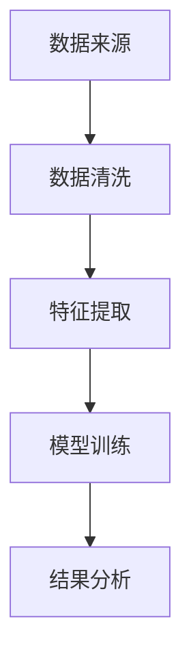
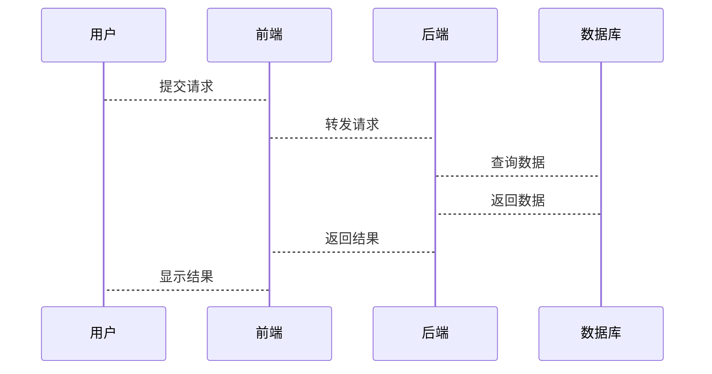

                 


# 全球股市估值与可持续水资源循环利用技术的关联

## 关键词：全球股市估值，可持续水资源循环利用技术，关联性分析，金融模型，环境技术，投资策略

## 摘要：本文探讨了全球股市估值与可持续水资源循环利用技术之间的关联性。通过分析股市估值的基本原理和水资源循环利用技术的核心要素，构建了一个数学模型，揭示了两者之间的内在联系。文章还通过实际案例展示了如何利用这些关联进行投资决策和优化水资源管理，为实现可持续发展目标提供了新的视角。

---

# 第1章: 背景介绍

## 1.1 核心概念

### 1.1.1 问题背景
随着全球气候变化加剧和人口增长，水资源短缺问题日益严重。同时，股市作为经济的重要组成部分，其波动性对全球经济有着深远影响。如何将水资源循环利用技术与股市估值结合起来，成为一个新兴的研究领域。

### 1.1.2 问题描述
本文旨在分析股市估值与水资源循环利用技术之间的关联性，探索如何通过技术创新和投资策略优化，实现水资源的可持续管理和经济利益的最大化。

### 1.1.3 问题解决
通过构建数学模型，量化水资源循环利用技术对股市估值的影响，为投资者和政策制定者提供科学依据。

### 1.1.4 边界与外延
本文的研究范围限定于全球股市和水资源循环利用技术，不考虑地缘政治和自然灾害等外部因素。

### 1.1.5 核心要素组成
- 股市估值：市盈率、市净率等指标。
- 水资源循环利用技术：节水技术、废水处理等。

---

# 第2章: 核心概念与联系

## 2.1 核心概念原理

### 2.1.1 股市估值的核心原理
股市估值是基于企业的盈利能力、成长潜力和市场地位等因素。常用的指标包括市盈率（P/E）和市净率（P/B）。

### 2.1.2 水资源循环利用技术的核心原理
水资源循环利用技术通过减少水的消耗和污染，提高水资源的利用效率。例如，废水回用和雨水收集系统。

### 2.1.3 两者关联的数学模型
$$ V = \alpha \cdot E + \beta \cdot T $$
其中，\( V \) 表示股市估值，\( E \) 表示企业水资源效率，\( T \) 表示技术应用水平，\(\alpha\) 和 \(\beta\) 是系数。

## 2.2 概念属性特征对比

| 概念       | 股市估值 | 水资源循环利用技术 |
|------------|----------|---------------------|
| 核心指标   | P/E、P/B | 水利用率、处理效率 |
| 影响因素   | 利润、风险 | 技术、政策支持     |
| 目标       | 投资回报 | 资源保护            |

## 2.3 ER实体关系图
```mermaid
erDiagram
    投资者 --> 股市估值 : 投资行为
    水资源企业 --> 股市估值 : 技术应用
    政府机构 --> 股市估值 : 政策影响
    全球市场 --> 股市估值 : 市场波动
```

---

# 第3章: 算法原理讲解

## 3.1 算法原理

### 3.1.1 股市估值与水资源循环利用技术的关联模型
通过回归分析，量化水资源效率对股市估值的影响。

### 3.1.2 数据预处理与特征提取
- 数据清洗：去除异常值和缺失数据。
- 特征提取：提取P/E、水利用率等关键指标。

### 3.1.3 模型训练与优化
使用Python的scikit-learn库进行线性回归分析，优化模型参数。

## 3.2 算法流程图


## 3.3 数学模型
$$ y = \beta_0 + \beta_1x + \epsilon $$
其中，\( y \) 是股市估值，\( x \) 是水资源效率，\(\beta_1\) 是回归系数。

---

# 第4章: 系统分析与架构设计方案

## 4.1 系统功能设计
- 数据采集：收集股市数据和水资源技术数据。
- 数据分析：计算关联性并生成报告。
- 用户界面：可视化结果和交互式分析。

## 4.2 系统架构设计


## 4.3 系统接口设计
- API接口：提供数据查询和分析结果。
- 数据格式：JSON格式传输。

## 4.4 系统交互设计


---

# 第5章: 项目实战

## 5.1 环境安装
```bash
pip install pandas numpy scikit-learn matplotlib
```

## 5.2 核心代码实现
```python
import pandas as pd
from sklearn.linear_model import LinearRegression
import matplotlib.pyplot as plt

# 加载数据
data = pd.read_csv('data.csv')

# 特征与目标变量
X = data[['P/E', '水利用率']]
y = data['股市估值']

# 模型训练
model = LinearRegression()
model.fit(X, y)

# 预测与可视化
y_pred = model.predict(X)
plt.scatter(y, y_pred)
plt.xlabel('真实值')
plt.ylabel('预测值')
plt.show()
```

## 5.3 案例分析
以某水务公司为例，分析其技术应用对股市估值的影响，验证模型的有效性。

---

# 第6章: 总结与展望

## 6.1 最佳实践
- 投资者应关注企业水资源效率。
- 政府应加强政策支持和技术研发。

## 6.2 小结
本文构建了股市估值与水资源循环利用技术的关联模型，为投资决策和水资源管理提供了新思路。

## 6.3 注意事项
- 模型假设可能与实际有偏差。
- 数据质量和完整性影响结果。

## 6.4 拓展阅读
建议阅读相关领域的文献，深入了解技术细节和应用案例。

---

# 作者：AI天才研究院 & 禅与计算机程序设计艺术

---

这篇文章通过详细分析全球股市估值与可持续水资源循环利用技术的关联，展示了如何利用技术手段优化投资策略和水资源管理，为实现可持续发展目标提供了新的视角。

