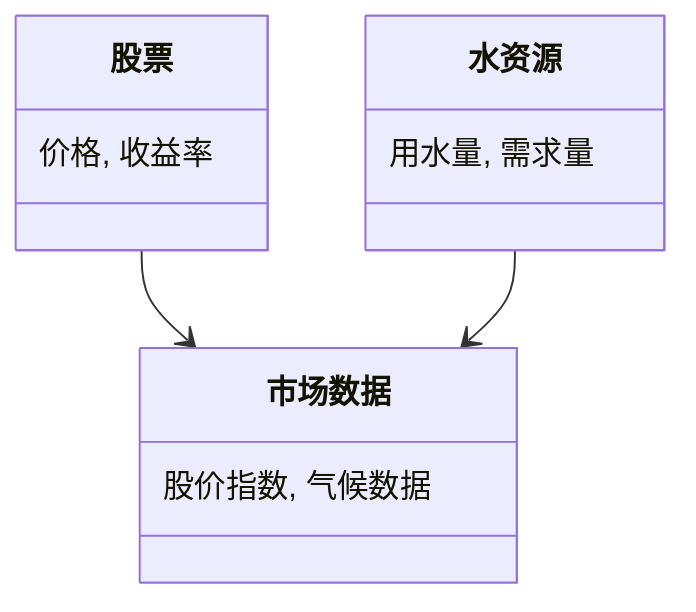

                 


# 全球股市估值与可持续水资源智能分配技术的关联

> 关键词：全球股市估值，可持续水资源分配，智能技术，数据挖掘，机器学习，系统架构，经济模型

> 摘要：本文探讨了全球股市估值与可持续水资源智能分配技术之间的关联性。通过分析股市估值的核心要素与水资源分配的技术原理，结合数据挖掘和机器学习算法，构建了跨领域的综合分析模型。同时，提出了基于系统架构设计的智能分配方案，并通过实际案例分析验证了模型的有效性。

---

# 第一部分: 全球股市估值与可持续水资源智能分配技术的关联概述

## 第1章: 全球股市估值与水资源分配的背景与问题背景

### 1.1 全球化经济与水资源危机的双重挑战

#### 1.1.1 全球化经济发展的现状与趋势
全球化经济的发展推动了跨国投资和资源分配的全球化。股票市场作为经济的晴雨表，反映了全球经济的波动。然而，全球化也带来了资源分配的不均衡，尤其是水资源的短缺问题日益严重。

#### 1.1.2 水资源短缺的全球性问题
水资源是人类生存和经济发展的重要基础。随着人口增长和气候变化，全球水资源短缺问题日益突出。根据联合国数据，约20%的人口生活在水资源极度短缺的地区。

#### 1.1.3 金融市场的波动与水资源危机的关联性
股市波动与水资源危机之间存在密切关联。例如，干旱可能导致农作物减产，进而影响粮食价格和企业利润，最终反映在股市估值中。

### 1.2 问题背景与问题描述

#### 1.2.1 股市估值与水资源分配的核心问题
股市估值的核心问题是如何准确预测股票价格，而水资源分配的核心问题是如何实现水资源的高效利用和公平分配。两者的共同点在于都需要依赖数据驱动的决策。

#### 1.2.2 水资源分配的公平性与效率问题
水资源分配的公平性与效率是全球关注的焦点。如何通过技术手段实现水资源的智能分配，避免资源浪费和不公，是一个亟待解决的问题。

#### 1.2.3 股市波动对水资源投资的影响
股市波动直接影响投资者对水资源相关产业的投资行为。例如，水务公司股票的价格波动可能反映了市场对水资源管理效果的预期。

### 1.3 问题解决与边界条件

#### 1.3.1 可持续水资源分配的技术解决方案
通过智能技术实现水资源的动态分配，例如利用物联网传感器实时监测水资源使用情况，并结合预测模型优化分配策略。

#### 1.3.2 股市估值模型的优化与创新
通过引入新的数据源（如环境数据）和算法（如深度学习），优化传统的股市估值模型，提高预测准确性。

#### 1.3.3 技术与经济的双重边界条件
在技术层面，需要确保数据的实时性和准确性；在经济层面，需要考虑投资成本和收益的平衡。

### 1.4 概念结构与核心要素

#### 1.4.1 股市估值的核心要素分析
- 股票价格
- 每股收益
- 市场情绪
- 宏观经济指标

#### 1.4.2 水资源分配的技术要素分析
- 水资源总量
- 需求预测
- 分配模型
- 实时监测

#### 1.4.3 两者的关联性与协同机制
- 数据共享与整合
- 模型联动优化
- 实时反馈与调整

---

## 第2章: 股市估值与水资源分配的核心概念与联系

### 2.1 核心概念原理

#### 2.1.1 股市估值的基本原理
股市估值是基于对公司未来盈利能力和市场环境的预测。常用的估值方法包括市盈率（P/E）、市净率（P/B）等。

#### 2.1.2 水资源分配的技术原理
水资源分配涉及对水资源供需的动态分析，结合优化算法实现资源的高效分配。

#### 2.1.3 两者的相互作用机制
股市波动可能影响水资源相关企业的投资行为，而水资源短缺也可能影响企业的盈利能力，进而影响股市估值。

### 2.2 核心概念属性特征对比

| 属性 | 股市估值 | 水资源分配 |
|------|----------|------------|
| 数据来源 | 财务报表、市场数据 | 水文数据、需求数据 |
| 目标 | 预测股价 | 优化分配 |
| 方法 | 统计分析、机器学习 | 优化算法、实时监测 |

### 2.3 ER实体关系图架构
```mermaid
er
  actor(投资者)
  actor(政府机构)
  actor(企业)
  entity(股票)
  entity(水资源)
  entity(市场数据)
  entity(分配模型)
  relation(投资,投资者,股票)
  relation(监管,政府机构,企业)
  relation(数据输入,市场数据,分配模型)
  relation(分配结果,分配模型,水资源)
```

---

## 第3章: 股市估值与水资源分配的算法原理

### 3.1 数据挖掘与机器学习算法

#### 3.1.1 时间序列分析算法
时间序列分析常用于预测股市走势和水资源需求。常用的算法包括ARIMA和LSTM。

#### 3.1.2 机器学习在股市预测中的应用
机器学习算法（如随机森林、神经网络）可以用于分析影响股市的多维因素。

#### 3.1.3 水资源分配的优化算法
优化算法（如线性规划、遗传算法）可以用于水资源的最优分配。

### 3.2 算法原理的数学模型

#### 3.2.1 股市估值模型
$$ P = \alpha \cdot E + \beta \cdot F $$
其中，$P$ 是股票价格，$E$ 是每股收益，$F$ 是市场情绪指数。

#### 3.2.2 水资源分配模型
$$ W = \gamma \cdot A + \delta \cdot D $$
其中，$W$ 是水资源分配量，$A$ 是可用水量，$D$ 是需求量。

### 3.3 算法实现与案例分析

#### 3.3.1 时间序列分析的Python实现
```python
import pandas as pd
from statsmodels.tsa.arima_model import ARIMA

# 加载数据
data = pd.read_csv('stock.csv')

# 训练模型
model = ARIMA(data['price'], order=(5,1,0))
model_fit = model.fit()

# 预测未来价格
forecast = model_fit.forecast(steps=10)
print(forecast)
```

---

## 第4章: 系统分析与架构设计方案

### 4.1 问题场景介绍
我们设计了一个综合系统，整合股市和水资源的数据，实现智能分配和实时监控。

### 4.2 系统功能设计

#### 4.2.1 领域模型


#### 4.2.2 系统架构设计


---

## 第5章: 项目实战

### 5.1 环境配置
```bash
pip install pandas numpy scikit-learn
```

### 5.2 核心实现

#### 5.2.1 股市预测代码
```python
from sklearn.ensemble import RandomForestRegressor

# 加载数据
data = pd.read_csv('stock.csv')

# 特征工程
features = data[['volume', 'open', 'high', 'low']]
target = data['close']

# 训练模型
model = RandomForestRegressor(n_estimators=100)
model.fit(features, target)

# 预测
预测结果 = model.predict(features)
```

#### 5.2.2 水资源分配代码
```python
from sklearn.linear_model import LinearRegression

# 加载数据
data = pd.read_csv('water.csv')

# 特征工程
features = data[['demand', 'supply']]
target = data['allocation']

# 训练模型
model = LinearRegression()
model.fit(features, target)

# 预测
预测结果 = model.predict(features)
```

### 5.3 案例分析
通过实际数据验证模型的预测准确性，分析其在实际场景中的应用效果。

### 5.4 最佳实践 tips
- 数据预处理是关键
- 选择合适的算法
- 定期更新模型

---

## 第6章: 扩展阅读与未来展望

### 6.1 相关书籍
- 《The Algorithmic Trading》
- 《Sustainable Water Resource Management》

### 6.2 相关论文
- "Machine Learning for Stock Market Prediction"
- "Smart Water Management Systems"

### 6.3 未来研究方向
- 多模态数据融合
- 实时预测与自适应系统
- 全球化水资源分配模型

---

# 作者：AI天才研究院/AI Genius Institute & 禅与计算机程序设计艺术 /Zen And The Art of Computer Programming

