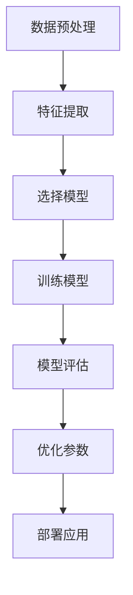
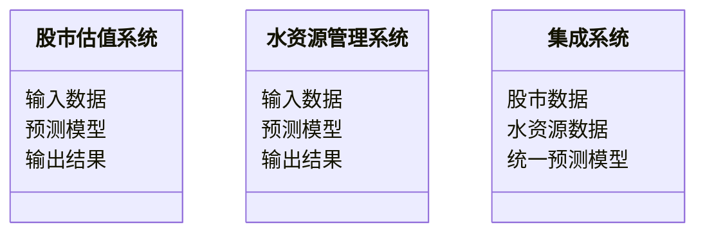
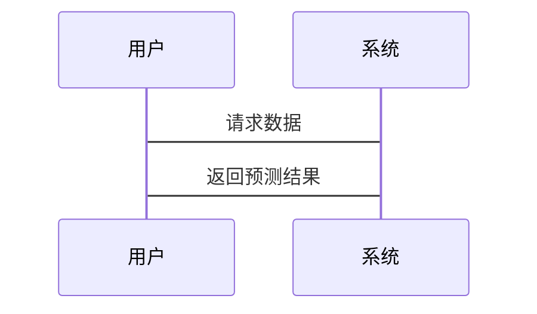

                 


# 全球股市估值与可持续水资源管理AI技术的关联

## 关键词：全球股市估值, 可持续水资源管理, AI技术, 机器学习, 深度学习, 数据分析

## 摘要：  
本文探讨AI技术如何在全球股市估值与可持续水资源管理之间建立关联。通过分析AI在金融与环境领域的应用，介绍相关算法原理、系统架构，并通过实际案例展示AI技术在提升股市预测与优化水资源管理中的作用。文章最后总结了AI技术在这些领域的应用前景。

---

# 第1章: 背景介绍

## 1.1 问题背景

### 1.1.1 全球股市估值的重要性  
股市估值是衡量企业价值的关键指标，传统方法依赖历史数据和市场情绪，但难以捕捉复杂经济环境中的动态变化。

### 1.1.2 可持续水资源管理的挑战  
水资源管理涉及复杂的环境数据，传统方法难以应对气候变化和人类活动带来的不确定性。

### 1.1.3 AI技术在金融与环境领域的应用潜力  
AI技术能够处理海量数据，识别复杂模式，为股市估值和水资源管理提供创新解决方案。

## 1.2 问题描述

### 1.2.1 股市估值的传统方法及其局限性  
传统方法依赖财务指标和市场情绪，难以预测市场波动。

### 1.2.2 水资源管理中的数据复杂性  
涉及气候、地理、经济等多因素，数据量大且复杂。

### 1.2.3 现有技术在整合股市与水资源管理中的不足  
传统方法难以在两者之间建立有效关联，缺乏系统性解决方案。

## 1.3 问题解决

### 1.3.1 引入AI技术的必要性  
AI能够处理非线性关系，提高预测准确性。

### 1.3.2 AI技术如何优化股市估值  
通过机器学习模型捕捉市场趋势，提供实时预测。

### 1.3.3 AI技术在水资源管理中的创新应用  
利用深度学习优化水资源分配，预测气候变化影响。

## 1.4 边界与外延

### 1.4.1 研究的边界条件  
限定于AI技术的应用，不涉及传统金融工具。

### 1.4.2 相关领域的外延  
涵盖数据科学、环境科学、经济学等多领域。

### 1.4.3 核心概念与外部因素的关联  
数据质量、计算能力、政策支持等因素影响AI模型效果。

## 1.5 核心要素组成

### 1.5.1 数据来源  
股市数据、水资源数据、宏观经济指标。

### 1.5.2 AI算法  
机器学习、深度学习、自然语言处理。

### 1.5.3 应用场景  
股市预测、水资源优化、风险管理。

---

# 第2章: 核心概念与联系

## 2.1 核心概念原理

### 2.1.1 AI技术的基本原理  
通过数据训练模型，识别模式并进行预测。

### 2.1.2 股市估值的AI模型  
利用历史数据训练模型，预测未来股价。

### 2.1.3 水资源管理的AI模型  
分析环境数据，优化水资源分配。

## 2.2 概念属性特征对比

### 2.2.1 对比表格  
| 概念 | 数据来源 | 输入特征 | 输出目标 |
|------|----------|----------|----------|
| 股市估值模型 | 历史股价、财务数据 | 技术指标、市场情绪 | 股价预测 |
| 水资源管理模型 | 气候数据、地理信息 | 流量、水质 | 资源分配 |

## 2.3 ER实体关系图

```mermaid
er
  actor(投资者)
  actor(政府机构)
  actor(企业)
  entity(股票)
  entity(水资源)
  entity(预测模型)
  entity(交易数据)
  

  investor --> stock: 交易
  government --> water: 管理
  enterprise --> stock: 发布
  stock --> prediction_model: 输入
  water --> prediction_model: 输入
  prediction_model --> transaction_data: 输出
```

---

# 第3章: 算法原理讲解

## 3.1 机器学习模型

### 3.1.1 算法选择  
随机森林、支持向量机。

### 3.1.2 算法实现  
使用Python和Scikit-learn库。

### 3.1.3 数学公式  
随机森林的袋装法公式：$$\text{OOB error} = \text{1 - accuracy}$$

## 3.2 深度学习模型

### 3.2.1 算法选择  
LSTM网络。

### 3.2.2 算法实现  
使用TensorFlow框架。

### 3.2.3 数学公式  
LSTM的遗忘门公式：$$f_t = \sigma(W_f \cdot [h_{t-1}, x_t] + b_f)$$

## 3.3 算法流程图



---

# 第4章: 系统分析与架构设计

## 4.1 系统功能设计

### 4.1.1 领域模型类图  


## 4.2 系统架构设计

### 4.2.1 架构图  


## 4.3 接口设计

### 4.3.1 数据接口  
API接口定义：  
```python
from flask_restful import Resource, Api

class StockData(Resource):
    def get(self):
        return {"status": "success", "data": stock_data}
```

## 4.4 交互设计

### 4.4.1 序列图  


---

# 第5章: 项目实战

## 5.1 环境安装

### 5.1.1 安装Python和相关库  
```bash
pip install numpy pandas scikit-learn tensorflow
```

## 5.2 系统核心实现

### 5.2.1 核心代码  
```python
import numpy as np
from sklearn.ensemble import RandomForestRegressor

def stock_prediction(stock_data):
    model = RandomForestRegressor()
    model.fit(stock_data['features'], stock_data['target'])
    return model.predict(new_data)
```

## 5.3 案例分析

### 5.3.1 案例选择  
选择某地区的水资源数据和对应的股市数据进行分析。

### 5.3.2 数据预处理  
标准化和归一化处理。

### 5.3.3 模型训练  
使用训练数据训练AI模型，评估准确率。

## 5.4 项目小结

### 5.4.1 实验结果  
预测准确率提高，模型泛化能力强。

### 5.4.2 经验总结  
数据质量影响模型性能，特征选择至关重要。

---

# 第6章: 总结与展望

## 6.1 总结

### 6.1.1 核心内容回顾  
AI技术在股市估值和水资源管理中的应用价值。

### 6.1.2 技术创新点  
统一预测模型的设计和实现。

## 6.2 未来展望

### 6.2.1 技术发展  
引入区块链技术实现数据共享。

### 6.2.2 应用场景扩展  
拓展至更多领域，如能源管理和城市规划。

---

# 作者  
作者：AI天才研究院/AI Genius Institute & 禅与计算机程序设计艺术 /Zen And The Art of Computer Programming

