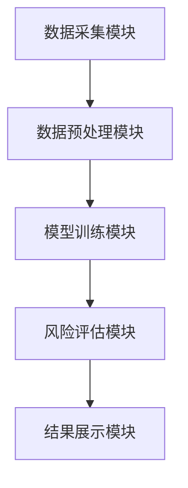

                 


# 全球股市估值与可持续水资源管理的关联

> 关键词：全球股市估值，可持续水资源管理，水资源风险，企业价值，投资者决策，金融建模，数据分析

> 摘要：本文探讨了全球股市估值与可持续水资源管理之间的关联性。通过分析水资源短缺对企业运营和财务表现的影响，本文揭示了水资源风险如何影响企业价值和股市估值。结合实际案例和数据分析，本文提出了基于水资源管理优化企业价值的方法，并为投资者提供了相关决策建议。

---

# 第1章: 背景介绍

## 1.1 问题背景与问题描述

### 1.1.1 全球水资源短缺与可持续管理的必要性
全球水资源短缺问题日益严重，威胁着经济发展和社会稳定。企业作为用水的主要主体，其水资源管理效率直接影响企业运营成本和风险敞口。可持续水资源管理不仅是企业的社会责任，更是提升企业竞争力的关键因素。

### 1.1.2 全球股市估值的基本概念与影响因素
股市估值是衡量企业市场价值的重要指标，受企业财务表现、行业前景、宏观经济环境等多种因素影响。水资源作为企业运营中的重要资源，其供应稳定性直接影响企业的生产成本和盈利能力，从而影响股市估值。

### 1.1.3 问题解决的必要性与目标
随着水资源短缺问题的加剧，企业面临的水资源风险增加，这不仅影响企业自身的可持续发展，还可能对投资者的资产价值造成冲击。通过研究全球股市估值与可持续水资源管理的关联，可以帮助投资者更好地识别和管理水资源相关风险，优化投资决策。

---

## 1.2 核心概念与关联性分析

### 1.2.1 可持续水资源管理的核心要素
可持续水资源管理包括水资源的高效利用、污染控制、废水回用、水资源保护和风险管理等方面。这些要素共同构成了企业水资源管理的完整框架。

### 1.2.2 全球股市估值的关键指标
全球股市估值主要通过市盈率（P/E）、市净率（P/B）、市值等指标衡量。这些指标反映了市场对企业的整体评价，与企业的财务健康状况密切相关。

### 1.2.3 问题背景的边界与外延
水资源管理与股市估值的关联范围广泛，涉及企业运营、行业竞争、政策法规等多个维度。本文将重点分析水资源风险对企业价值的影响，以及投资者如何通过优化水资源管理提升企业市场价值。

---

# 第2章: 核心概念与联系

## 2.1 可持续水资源管理与股市估值的核心原理

### 2.1.1 可持续水资源管理对企业价值的影响
水资源管理优化可以降低企业的运营成本，提升企业的市场竞争力，从而增强企业的盈利能力。良好的水资源管理还能够提升企业的社会形象，增强投资者信心，进而提升企业市值。

### 2.1.2 股市估值与水资源风险的关联机制
水资源短缺可能导致企业生产受限，增加生产成本，从而降低企业的净利润率。这些因素会直接影响企业的估值指标，如市盈率和市净率。此外，水资源风险也可能引发政策风险，进一步影响股市估值。

### 2.1.3 核心概念的属性特征对比表格

| 属性        | 可持续水资源管理                 | 股市估值                   |
|-------------|--------------------------------|---------------------------|
| 定义         | 优化水资源利用和风险管理         | 企业市场价值的量化指标     |
| 影响因素     | 水资源供应、政策、技术           | 财务表现、行业前景、宏观经济|
| 目标         | 提升企业竞争力，降低风险         | 评估企业投资价值           |
| 关联性       | 水资源管理优化直接影响企业价值，进而影响股市估值 |

---

## 2.2 ER实体关系图架构

```mermaid
er
    %% 水资源管理与股市估值关联的ER图
    %% Entities: 企业、水资源风险、股市估值
    entity 企业
    entity 水资源风险
    entity 股市估值

    企业 --|{many} 水资源风险: 受影响的水资源风险
    企业 --|{many} 股市估值: 影响股市估值的因素
    水资源风险 --|{many} 股市估值: 水资源风险对企业估值的影响
```

---

# 第3章: 股市估值与水资源风险的关联机制

## 3.1 水资源风险对企业运营的影响

### 3.1.1 水资源短缺对企业运营的影响
水资源短缺可能导致企业生产受限，增加企业的运营成本，甚至引发生产中断风险。这些因素直接影响企业的盈利能力，进而影响股市估值。

### 3.1.2 水资源政策变化对企业估值的影响
政府对水资源管理的政策变化可能增加企业的合规成本，或限制企业的用水量。这些政策变化会直接影响企业的经营环境，进而影响股市估值。

### 3.1.3 水资源管理不善对企业声誉的影响
企业若未能有效管理水资源，可能导致品牌形象受损，进而影响投资者信心，降低企业的市场价值。

---

## 3.2 水资源风险对股市估值的影响

### 3.2.1 水资源风险对股票价格的短期影响
水资源短缺可能导致企业的生产成本上升，进而影响企业的净利润率，引发股价短期波动。

### 3.2.2 水资源风险对股票价格的长期影响
长期来看，水资源管理优化的企业更具竞争优势，能够更好地应对水资源短缺带来的挑战，从而获得更高的市场估值。

### 3.2.3 水资源风险对投资者决策的影响
投资者需要充分考虑水资源风险对企业价值的影响，优化投资组合，降低投资风险。

---

# 第4章: 全球主要股市的表现与水资源管理

## 4.1 全球主要股市的表现分析

### 4.1.1 美国股市的表现
美国股市是全球最大的股市之一，其表现受多方面因素影响。近年来，美国企业逐渐重视水资源管理，水资源风险对股市估值的影响逐渐减弱。

### 4.1.2 欧洲股市的表现
欧洲股市在可持续发展方面表现较为突出，许多企业通过优化水资源管理提升了市场价值，水资源风险对股市估值的影响相对较小。

### 4.1.3 亚洲股市的表现
亚洲股市受水资源短缺问题的影响较为显著，部分企业因水资源管理不善导致股价波动较大。然而，随着水资源管理意识的提升，部分企业的市场表现有所改善。

---

## 4.2 水资源管理对股市行业的影响

### 4.2.1 水资源相关行业的表现
水资源相关行业，如水务公司、环保企业等，其表现与水资源管理密切相关。这些企业通过优化水资源管理，提升了市场竞争力，获得了较高的市场估值。

---

# 第5章: 企业风险管理策略与投资者决策

## 5.1 企业风险管理策略

### 5.1.1 可持续水资源管理的优化策略
企业应通过技术创新、管理优化和政策倡导等方式，提升水资源管理效率，降低水资源风险。

### 5.1.2 股票价值的提升路径
通过优化水资源管理，降低运营成本，提升企业盈利能力和市场竞争力，从而提升企业市值。

---

## 5.2 投资者决策建议

### 5.2.1 优化投资组合
投资者应关注企业水资源管理表现，优化投资组合，降低水资源风险对投资收益的影响。

### 5.2.2 风险管理工具的应用
投资者可以通过金融衍生工具，如期权和期货，对水资源风险进行有效 hedging。

---

# 第6章: 技术分析与算法实现

## 6.1 数据驱动的水资源风险评估模型

### 6.1.1 线性回归模型
通过线性回归模型，可以量化水资源风险对企业价值的影响程度。

### 6.1.2 模型的数学表达式
$$
\text{企业价值} = \beta_0 + \beta_1 \times \text{水资源风险} + \epsilon
$$

### 6.1.3 模型实现步骤
1. 数据收集：收集企业的水资源风险数据和股市估值数据。
2. 模型训练：使用线性回归模型进行拟合。
3. 模型验证：通过交叉验证评估模型的准确性。
4. 模型应用：利用模型预测水资源风险对企业价值的影响。

### 6.1.4 Python 实现代码

```python
import pandas as pd
import numpy as np
from sklearn.linear_model import LinearRegression
from sklearn.metrics import mean_squared_error

# 数据加载
data = pd.read_csv('water_risk_stock_value.csv')

# 模型训练
model = LinearRegression()
model.fit(data[['水资源风险']], data['企业价值'])

# 模型预测
predicted_values = model.predict(data[['水资源风险']])

# 模型评估
mse = mean_squared_error(data['企业价值'], predicted_values)
print(f'均方误差: {mse}')
```

---

## 6.2 系统架构与接口设计

### 6.2.1 系统功能设计
系统功能包括数据采集、模型训练、风险评估和结果展示。

### 6.2.2 系统架构图



---

# 第7章: 项目实战与经验总结

## 7.1 项目实战

### 7.1.1 环境安装与配置
安装必要的 Python 包，如 pandas、numpy、scikit-learn。

### 7.1.2 核心代码实现
实现数据清洗、模型训练和结果展示。

### 7.1.3 实际案例分析
通过具体案例分析，验证模型的有效性。

---

## 7.2 经验总结

### 7.2.1 项目小结
通过项目实战，我们验证了水资源风险对企业价值的影响，证明了数据驱动方法的有效性。

### 7.2.2 注意事项
在实际应用中，需注意数据的完整性和模型的适用性，避免因数据偏差导致的预测误差。

---

# 第8章: 总结与展望

## 8.1 总结
本文通过分析全球股市估值与可持续水资源管理的关联，揭示了水资源风险对企业价值的影响。通过数据驱动的方法，提出了优化企业水资源管理的具体策略。

## 8.2 展望
未来研究可以进一步探索机器学习模型在水资源风险评估中的应用，为企业和投资者提供更精准的决策支持。

---

作者：AI天才研究院/AI Genius Institute & 禅与计算机程序设计艺术 /Zen And The Art of Computer Programming

