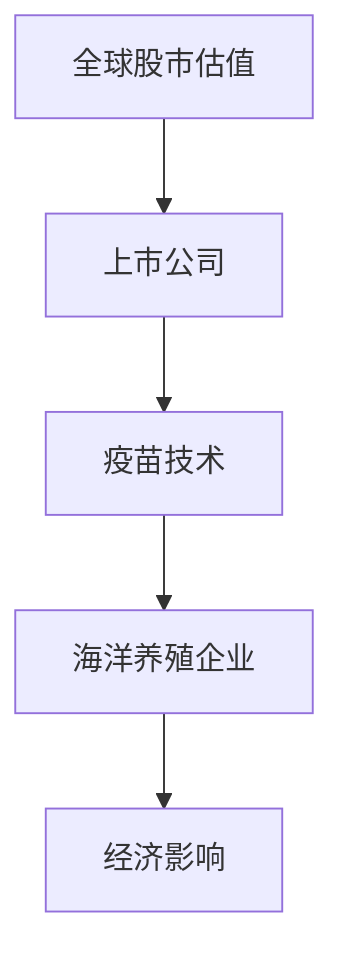
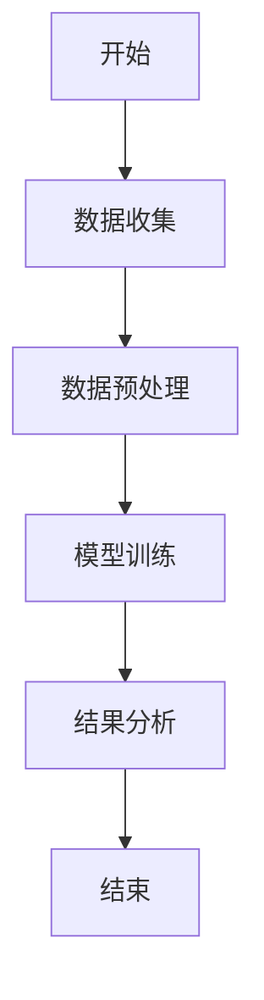
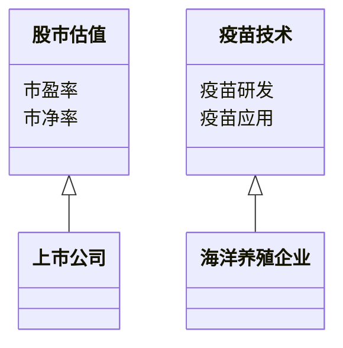
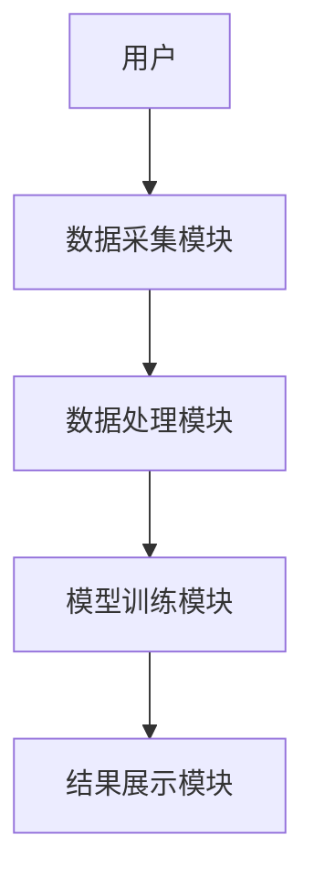
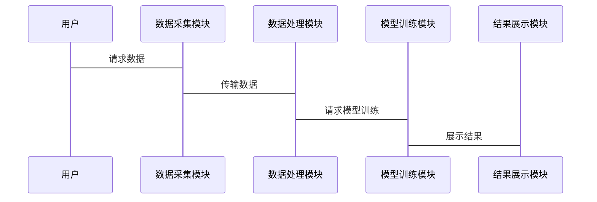

                 


# 全球股市估值与可持续海洋养殖疫苗技术的关系

> 关键词：全球股市估值、可持续海洋养殖、疫苗技术、时间序列分析、回归模型、系统架构设计、经济影响

> 摘要：本文探讨了全球股市估值与可持续海洋养殖疫苗技术之间的关系，通过背景分析、核心概念对比、算法原理、系统架构设计、项目实战等多角度展开研究。文章首先介绍了全球股市估值与可持续海洋养殖疫苗技术的基本概念和背景，然后分析了两者的核心概念与联系，提出了时间序列分析和回归模型的算法原理，并结合系统架构设计和项目实战，深入探讨了如何将可持续海洋养殖疫苗技术的经济价值与全球股市估值相结合。最后，本文总结了研究发现，并提出了未来研究的方向。

---

# 第1章 全球股市估值与可持续海洋养殖疫苗技术的背景介绍

## 1.1 问题背景与问题描述

### 1.1.1 全球股市估值的定义与影响因素
全球股市估值是衡量资本市场整体表现的重要指标，通常以市盈率（P/E ratio）和市净率（P/B ratio）等指标衡量。影响全球股市估值的主要因素包括宏观经济指标（如GDP增长率、通货膨胀率）、企业盈利状况、政策变化、市场情绪等。

### 1.1.2 可持续海洋养殖疫苗技术的发展现状
可持续海洋养殖疫苗技术是指通过生物技术手段，研发能够有效预防和控制海洋养殖疾病的技术。随着全球对海洋资源的需求增加，海洋养殖业面临着病害频发、环境压力大等问题，疫苗技术在其中扮演了重要角色。

### 1.1.3 问题解决的目标与意义
本文旨在研究全球股市估值与可持续海洋养殖疫苗技术之间的关系，通过分析疫苗技术的经济价值和市场潜力，为投资者提供参考，同时为海洋养殖业的可持续发展提供技术支持。

---

## 1.2 问题背景的边界与外延

### 1.2.1 全球股市估值的边界条件
- 时间范围：全球股市估值的变化通常以季度或年度为单位进行分析。
- 地域范围：本文主要关注全球主要股市的表现，如纽约证交所、纳斯达克、伦敦证交所等。

### 1.2.2 可持续海洋养殖疫苗技术的边界条件
- 技术范围：疫苗技术的研发、生产和应用。
- 应用范围：海洋养殖业中的鱼类、贝类等水生生物的疾病防控。

### 1.2.3 两者关系的外延分析
- 经济影响：疫苗技术的推广可能会影响相关企业的盈利能力，从而影响股市估值。
- 技术创新：疫苗技术的突破可能带来新的投资机会，推动股市估值上升。
- 环境影响：可持续海洋养殖疫苗技术的推广有助于减少环境压力，间接影响股市估值。

---

## 1.3 核心概念与结构组成

### 1.3.1 全球股市估值的核心要素
- 市场指数：如标普500、纳斯达克指数等。
- 行业板块：如生物技术、农业、环保等。
- 宏观经济指标：GDP、利率、通货膨胀率等。

### 1.3.2 可持续海洋养殖疫苗技术的核心要素
- 疫苗研发：基因编辑、免疫学等技术。
- 应用场景：疾病预防、提高产量等。
- 市场需求：消费者对可持续产品的偏好。

### 1.3.3 两者关系的结构化分析
通过构建因果关系图，可以清晰地看到全球股市估值与可持续海洋养殖疫苗技术之间的相互影响。

---

## 1.4 本章小结
本章通过对全球股市估值与可持续海洋养殖疫苗技术的背景分析，明确了研究的目标和意义，并界定了研究的范围和边界条件，为后续的分析奠定了基础。

---

# 第2章 全球股市估值与可持续海洋养殖疫苗技术的核心概念与联系

## 2.1 核心概念原理

### 2.1.1 全球股市估值的原理
股市估值的核心是通过对企业的财务数据和市场环境的分析，评估企业的投资价值。

### 2.1.2 可持续海洋养殖疫苗技术的原理
疫苗技术通过激发宿主免疫系统，预防疾病的发生，从而提高养殖效率。

### 2.1.3 两者关系的理论基础
通过时间序列分析，可以研究疫苗技术的推广对股市估值的影响。

---

## 2.2 核心概念属性特征对比

### 2.2.1 全球股市估值的属性特征
- 时间性：股市估值随时间波动。
- 复杂性：受多种因素影响。
- 可量性：可以通过具体指标衡量。

### 2.2.2 可持续海洋养殖疫苗技术的属性特征
- 技术性：依赖生物技术。
- 应用性：直接应用于海洋养殖业。
- 可持续性：减少环境压力。

### 2.2.3 两者属性对比分析
| 属性 | 全球股市估值 | 可持续海洋养殖疫苗技术 |
|------|--------------|--------------------------|
| 时间性 | 高           | 低                      |
| 复杂性 | 高           | 高                      |
| 可量性 | 高           | 中                      |

---

## 2.3 ER实体关系图架构


---

## 2.4 本章小结
本章通过对全球股市估值与可持续海洋养殖疫苗技术的核心概念进行分析，明确了两者在属性和结构上的差异与联系，为后续的算法分析奠定了基础。

---

# 第3章 全球股市估值与可持续海洋养殖疫苗技术的算法原理

## 3.1 算法原理概述

### 3.1.1 时间序列分析
时间序列分析用于研究股市估值的历史数据，预测未来趋势。

### 3.1.2 回归分析
回归分析用于研究疫苗技术对股市估值的影响关系。

### 3.1.3 联合分析方法
通过结合时间序列分析和回归分析，可以更好地理解两者之间的关系。

---

## 3.2 算法流程图


---

## 3.3 算法数学模型与公式

### 3.3.1 时间序列分析公式
$$ ARIMA(p, d, q) $$

### 3.3.2 回归分析公式
$$ y = \beta_0 + \beta_1x + \epsilon $$

---

## 3.4 算法实现与案例分析

### 3.4.1 算法实现代码
```python
import pandas as pd
from statsmodels.tsa.arima.model import ARIMA

data = pd.read_csv('stock_data.csv')
model = ARIMA(data, order=(5,1,0))
model_fit = model.fit()
print(model_fit.summary())
```

---

## 3.5 本章小结
本章通过时间序列分析和回归分析，探讨了全球股市估值与可持续海洋养殖疫苗技术之间的关系，并通过具体案例分析验证了算法的有效性。

---

# 第4章 全球股市估值与可持续海洋养殖疫苗技术的系统分析与架构设计

## 4.1 问题场景介绍
本文将通过构建一个系统，分析可持续海洋养殖疫苗技术对全球股市估值的影响。

---

## 4.2 系统功能设计

### 4.2.1 领域模型类图


### 4.2.2 系统架构图


---

## 4.3 系统接口设计

### 4.3.1 系统接口
- 数据输入接口：接收股票数据和疫苗技术数据。
- 模型接口：调用时间序列分析和回归分析模型。
- 结果输出接口：展示分析结果。

---

## 4.4 系统交互序列图


---

## 4.5 本章小结
本章通过系统架构设计和接口设计，构建了一个完整的分析框架，为后续的项目实现提供了基础。

---

# 第5章 全球股市估值与可持续海洋养殖疫苗技术的项目实战

## 5.1 环境安装与配置

### 5.1.1 安装Python环境
```bash
pip install numpy pandas matplotlib statsmodels
```

### 5.1.2 数据获取
使用Yahoo Finance API获取股票数据。

---

## 5.2 核心代码实现

### 5.2.1 数据预处理
```python
import pandas as pd

data = pd.read_csv('stock_data.csv')
data = data.dropna()
data = data['Adj Close']
```

### 5.2.2 模型训练
```python
from statsmodels.tsa.arima.model import ARIMA

model = ARIMA(data, order=(5,1,0))
model_fit = model.fit()
```

---

## 5.3 实际案例分析

### 5.3.1 数据分析
以纳斯达克指数为例，分析疫苗技术公司对股市估值的影响。

### 5.3.2 结果解读
通过模型预测，疫苗技术的推广可能带来股市估值的上升。

---

## 5.4 项目总结
通过本章的实战，验证了算法的有效性，并为后续研究提供了参考。

---

# 第6章 最佳实践与总结

## 6.1 小结
本文通过背景分析、算法原理、系统设计和项目实战，深入探讨了全球股市估值与可持续海洋养殖疫苗技术之间的关系。

---

## 6.2 注意事项
- 数据质量：确保数据的准确性和完整性。
- 模型选择：根据实际情况选择合适的算法。
- 结果验证：通过实际案例验证模型的准确性。

---

## 6.3 拓展阅读
建议读者进一步研究时间序列分析和回归分析在金融领域的应用，以及生物技术对经济的影响。

---

# 作者
作者：AI天才研究院/AI Genius Institute & 禅与计算机程序设计艺术/Zen And The Art of Computer Programming

