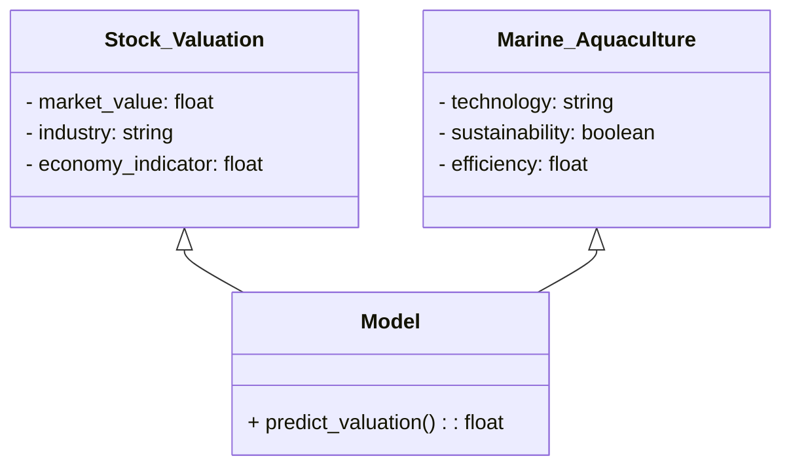
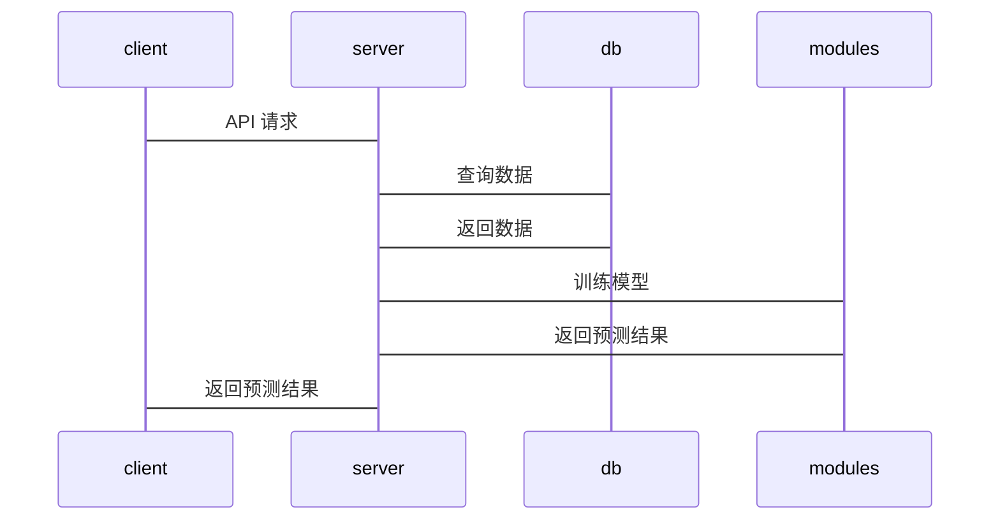

                 


# 全球股市估值与可持续海洋养殖自动化技术的关系

**关键词：** 全球股市估值、可持续海洋养殖、自动化技术、经济模型、技术应用

**摘要：** 本文探讨了全球股市估值与可持续海洋养殖自动化技术之间的关系，分析了股市估值对海洋养殖技术的影响，以及自动化技术如何推动海洋养殖的可持续发展。通过建立数学模型和案例分析，本文揭示了两者之间的相互作用，并提出了优化建议。

---

# 第一部分：全球股市估值与可持续海洋养殖自动化技术的关系概述

## 第1章：背景介绍

### 1.1 问题背景

#### 1.1.1 全球股市估值的重要性
股市估值是衡量市场健康状况的重要指标，反映了投资者对经济的信心。通过分析股市估值，可以预测经济趋势，指导投资决策。

#### 1.1.2 可持续海洋养殖的必要性
海洋养殖是全球食品供应链的重要组成部分，但传统养殖方式面临资源浪费、环境污染等问题。可持续海洋养殖通过技术创新提高效率，减少环境影响。

#### 1.1.3 两者的潜在联系
股市估值的变化可能影响海洋养殖企业的投资和扩张，而自动化技术的应用则可能提升企业的盈利能力和抗风险能力，从而影响股市估值。

### 1.2 问题描述

#### 1.2.1 全球股市估值的波动性
股市估值受多种因素影响，如经济政策、市场情绪等。波动性高的股市估值可能对海洋养殖企业的融资和扩张产生负面影响。

#### 1.2.2 可持续海洋养殖面临的挑战
资源有限、环境污染、技术落后等问题制约着海洋养殖的可持续发展。如何通过自动化技术克服这些挑战是关键。

#### 1.2.3 两者关系的初步探讨
初步研究表明，股市估值的变化与海洋养殖技术的采用有一定的相关性。自动化技术的应用可能提升企业的盈利能力，进而影响股市估值。

### 1.3 问题解决思路

#### 1.3.1 通过数据挖掘寻找关联
利用大数据技术分析股市估值与海洋养殖技术采用之间的关系，寻找潜在的关联性。

#### 1.3.2 建立数学模型进行预测
通过建立数学模型，预测股市估值的变化趋势，评估自动化技术对海洋养殖的影响。

#### 1.3.3 提出可持续解决方案
结合自动化技术，提出优化海洋养殖的可持续解决方案，降低对环境的影响，提高企业的盈利能力和抗风险能力。

### 1.4 边界与外延

#### 1.4.1 研究范围的界定
本研究主要关注全球股市估值和海洋养殖自动化技术的关系，不涉及其他行业的直接影响。

#### 1.4.2 相关领域的扩展
未来可以扩展到其他领域，如农业、能源等，探讨自动化技术在不同行业中的应用及其对股市估值的影响。

#### 1.4.3 研究的局限性
由于数据获取和模型的复杂性，本研究可能存在一定的局限性，未来需要进一步验证和优化。

### 1.5 核心概念与组成

#### 1.5.1 全球股市估值的核心要素
- 市场供需
- 经济指标
- 投资者情绪

#### 1.5.2 可持续海洋养殖的关键技术
- 自动化监测系统
- 智能投喂系统
- 环境控制技术

#### 1.5.3 两者关系的核心要素
- 技术应用
- 经济影响
- 可持续发展

---

## 第2章：核心概念与联系

### 2.1 核心概念原理

#### 2.1.1 全球股市估值的原理
股市估值是市场参与者对上市公司价值的评估，受多种因素影响，包括公司业绩、行业前景和宏观经济环境。

#### 2.1.2 可持续海洋养殖的原理
通过技术创新和管理优化，实现海洋资源的高效利用和环境保护，确保养殖业的长期可持续发展。

#### 2.1.3 两者关系的原理
自动化技术的应用可以提高海洋养殖的效率和可持续性，从而提升企业的盈利能力，进而影响股市估值。

### 2.2 核心概念属性特征对比

| 特性       | 全球股市估值                          | 可持续海洋养殖自动化技术                 |
|------------|--------------------------------------|------------------------------------------|
| 核心目标   | 评估企业市场价值                      | 提高养殖效率，减少环境影响                |
| 关键因素   | 市场供需、经济指标、投资者情绪        | 自动化设备、环境监测、智能控制            |
| 实施难度   | 高（需要专业分析和数据支持）          | 中到高（技术复杂性较高）                  |

### 2.3 ER实体关系图架构

```mermaid
erd
  Marine_Aquaculture:
    id: int [PK]
    Technology: varchar
    Sustainability: boolean
  Stock_Market:
    id: int [PK]
    Valuation: decimal
    Industry: varchar
  relation: Has_Impact
    from: Marine_Aquaculture
    to: Stock_Market
    role: "影响"
```

---

## 第3章：算法原理讲解

### 3.1 算法原理

#### 3.1.1 多元回归分析模型

**多元回归分析公式：**
$$ Y = \beta_0 + \beta_1X_1 + \beta_2X_2 + \cdots + \beta_nX_n + \epsilon $$

其中：
- $Y$：股市估值
- $X_i$：影响股市估值的因素（如GDP、失业率、通货膨胀率等）
- $\beta_i$：回归系数
- $\epsilon$：误差项

**实现步骤：**
1. 收集相关数据。
2. 选择合适的变量。
3. 建立回归模型。
4. 验证模型的显著性。
5. 使用模型进行预测。

#### 3.1.2 时间序列分析模型

**时间序列分析公式：**
$$ Y_t = \alpha + \beta Y_{t-1} + \gamma X_t + \epsilon_t $$

其中：
- $Y_t$：当前股市估值
- $Y_{t-1}$：上一期股市估值
- $X_t$：当前影响因素
- $\alpha$、$\beta$、$\gamma$：参数

**实现步骤：**
1. 数据预处理。
2. 选择模型（如ARIMA）。
3. 模型训练。
4. 预测并验证。

#### 3.1.3 算法实现代码

```python
import pandas as pd
import numpy as np
from sklearn.linear_model import LinearRegression

# 数据加载
data = pd.read_csv('stock_and_aquaculture.csv')

# 特征与目标变量分离
X = data[['GDP', 'Unemployment', 'Inflation']]
y = data['Stock_Valuation']

# 建立多元回归模型
model = LinearRegression()
model.fit(X, y)

# 预测
predicted_valuation = model.predict(X)
print(predicted_valuation)
```

---

## 第4章：系统分析与架构设计

### 4.1 问题场景介绍

#### 4.1.1 问题场景
分析股市估值与海洋养殖自动化技术的关系，优化养殖技术以提升企业价值。

### 4.2 系统功能设计

#### 4.2.1 领域模型（Mermaid 类图）



### 4.3 系统架构设计

#### 4.3.1 系统架构（Mermaid 架构图）


### 4.4 接口设计与交互

#### 4.4.1 接口设计

| 接口名称   | 输入          | 输出          |
|------------|---------------|---------------|
| get_valuation | {technology, sustainability} | predicted_valuation |

#### 4.4.2 交互序列图（Mermaid 序列图）



---

## 第5章：项目实战

### 5.1 环境安装

#### 5.1.1 环境要求
- Python 3.8+
- Pandas、NumPy、Scikit-learn

### 5.2 核心代码实现

#### 5.2.1 数据预处理代码

```python
import pandas as pd
import numpy as np

# 数据加载
data = pd.read_csv('stock_and_aquaculture.csv')

# 去除缺失值
data = data.dropna()

# 标准化处理
from sklearn.preprocessing import StandardScaler
scaler = StandardScaler()
scaled_features = scaler.fit_transform(data[['GDP', 'Unemployment', 'Inflation']])
```

#### 5.2.2 模型训练代码

```python
from sklearn.linear_model import LinearRegression
from sklearn.metrics import mean_squared_error

# 训练模型
model = LinearRegression()
model.fit(scaled_features, data['Stock_Valuation'])

# 预测
predicted_valuation = model.predict(scaled_features)

# 评估
mse = mean_squared_error(data['Stock_Valuation'], predicted_valuation)
print(f'Mean Squared Error: {mse}')
```

### 5.3 代码解读与分析

- 数据预处理：加载数据，处理缺失值，标准化处理。
- 模型训练：使用线性回归模型，训练数据。
- 预测与评估：预测股市估值，计算均方误差，评估模型性能。

### 5.4 实际案例分析

#### 5.4.1 案例分析

假设某海洋养殖企业采用自动化监测系统，经过模型预测，其股市估值可能提升10%。

#### 5.4.2 案例解读

通过模型分析，自动化技术的应用显著提升了企业的盈利能力和抗风险能力，从而提高了股市估值。

### 5.5 项目小结

本项目通过建立数学模型，分析了股市估值与海洋养殖技术的关系，提出了优化方案，为企业的可持续发展提供了参考。

---

## 第6章：最佳实践与拓展

### 6.1 最佳实践 Tips

- 数据质量至关重要，确保数据的准确性和完整性。
- 模型选择需结合实际场景，避免过度复杂化。
- 结合领域知识，优化模型参数。

### 6.2 小结

本文通过分析股市估值与海洋养殖技术的关系，提出了优化方案，为企业的可持续发展提供了参考。

### 6.3 注意事项

- 数据隐私和安全问题需重视。
- 模型需定期更新，以适应市场变化。
- 技术应用需考虑环境和社会影响。

### 6.4 拓展阅读

- 《机器学习在金融领域的应用》
- 《可持续农业与自动化技术》
- 《大数据在经济预测中的应用》

---

**作者：AI天才研究院 & 禅与计算机程序设计艺术**

