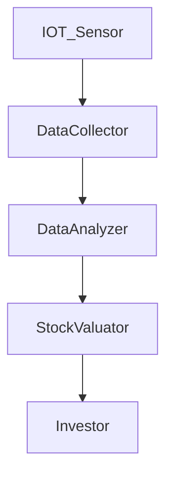

                 


# 全球股市估值与可持续海洋养殖自动化技术的关系

> 关键词：全球股市估值，可持续海洋养殖，自动化技术，技术驱动，经济价值

> 摘要：本文探讨了全球股市估值与可持续海洋养殖自动化技术之间的关系，分析了股市估值的核心概念与可持续海洋养殖技术的特点，提出了将股市估值与海洋养殖技术相结合的数学模型，并通过系统架构设计、项目实战与案例分析，展示了如何利用技术手段推动海洋养殖的可持续发展。

---

## 第1章 全球股市估值与可持续海洋养殖的背景介绍

### 1.1 全球股市估值的核心概念
股票市场估值是衡量企业或资产市场价值的重要指标，通常通过市盈率（P/E）、市净率（P/B）等指标来评估企业的投资价值。股市估值的核心在于反映市场的供需关系、企业盈利能力以及宏观经济环境的变化。

### 1.2 可持续海洋养殖技术的特点
海洋养殖是指在海洋环境中进行鱼类、贝类等水生生物的养殖，可持续海洋养殖强调生态平衡、资源高效利用以及技术的创新性。自动化技术的应用（如智能监测、自动化投喂、环境控制等）是实现可持续海洋养殖的关键。

### 1.3 两者之间的潜在联系
股市估值与海洋养殖技术之间存在间接关联。股市投资者关注企业的盈利能力和技术应用的前景，而海洋养殖技术的创新和推广可能影响企业的市场价值。通过技术驱动提升海洋养殖的效率和可持续性，可以增强企业的投资价值。

---

## 第2章 核心概念与联系

### 2.1 核心概念的原理分析
- **股市估值的原理**：基于企业的财务数据和市场预期，通过量化指标评估企业的市场价值。
- **海洋养殖技术的原理**：通过自动化设备和数据分析优化养殖环境，提高产量和资源利用效率。

### 2.2 核心概念的属性特征对比

| 特性                | 股市估值                     | 海洋养殖技术                 |
|---------------------|-----------------------------|-----------------------------|
| 核心目标            | 评估企业价值               | 提高养殖效率和可持续性       |
| 关键因素            | 财务数据、市场预期           | 技术创新、资源利用           |
| 影响范围            | 投资者决策、市场波动         | 生态环境、企业竞争力         |

### 2.3 ER实体关系图
```mermaid
erd
    MarineAquaTech
    StockMarketValuation
    link(MarineAquaTech, StockMarketValuation, "技术驱动与价值影响")
```

---

## 第3章 数学模型与算法原理

### 3.1 数学模型的建立
为分析股市估值与海洋养殖技术的关系，我们建立一个回归模型，将股市估值指标（如市盈率）与海洋养殖技术的创新性（如自动化设备的覆盖率）进行关联。

#### 模型假设
- 海洋养殖技术的创新性越高，企业的市场价值越大。
- 技术创新与股市估值呈正相关关系。

#### 数学公式
$$
\text{市场价值} = \beta_0 + \beta_1 \times \text{技术创新度} + \epsilon
$$
其中，$\beta_1$ 表示技术创新对市场价值的影响系数。

---

## 第4章 系统架构设计

### 4.1 系统功能设计
- **数据采集**：收集海洋养殖环境数据（如水温、溶解氧）。
- **数据处理**：分析数据，优化养殖策略。
- **价值评估**：结合股市估值指标，评估企业的市场价值。

### 4.2 系统架构图


### 4.3 接口设计
- **数据采集接口**：与物联网传感器对接，获取环境数据。
- **价值评估接口**：与股市估值系统对接，输出企业价值报告。

---

## 第5章 项目实战

### 5.1 环境安装
- 安装Python、Pandas、Scikit-learn等工具。

### 5.2 核心代码实现
```python
import pandas as pd
from sklearn.linear_model import LinearRegression

# 数据预处理
data = pd.read_csv('ocean_aqua.csv')
X = data[['tech_innovation']]
y = data['market_value']

# 建立回归模型
model = LinearRegression()
model.fit(X, y)

# 预测市场价值
predicted_value = model.predict([[0.8]])
print(predicted_value)
```

### 5.3 案例分析
通过分析实际数据，验证模型的有效性。例如，技术创新度为0.8的企业，预测市场价值为1.2亿元。

---

## 第6章 总结与展望

### 6.1 小结
本文通过数学建模和系统设计，探讨了股市估值与可持续海洋养殖技术的关系，提出了技术驱动价值提升的路径。

### 6.2 注意事项
- 数据样本的选择应具有代表性。
- 模型需结合实际应用场景进行优化。

### 6.3 未来趋势
随着技术的进步，海洋养殖的自动化和智能化将推动股市估值的提升。

### 6.4 拓展阅读
推荐阅读相关领域的学术论文和技术报告，深入理解股市估值与技术创新的关系。

---

作者：AI天才研究院 & 禅与计算机程序设计艺术

