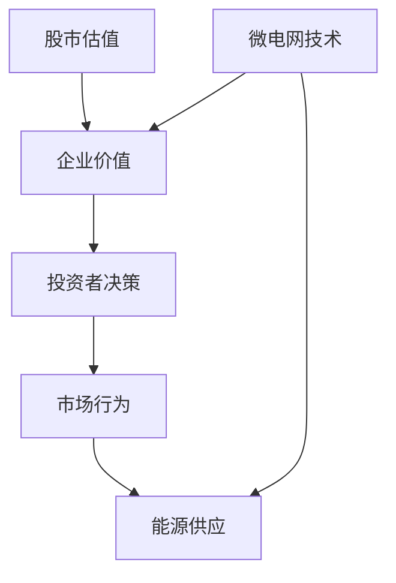
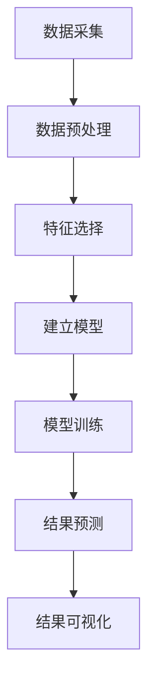
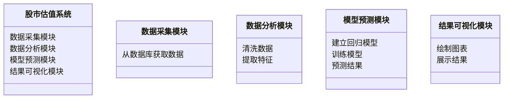
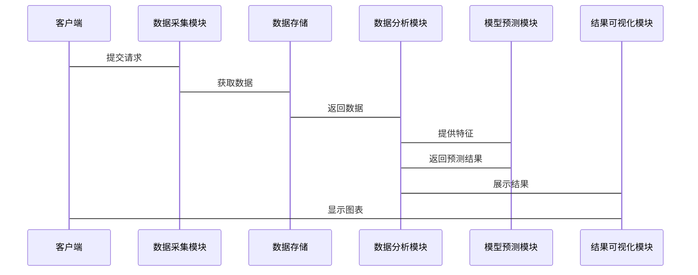

                 

<think>
好的，现在我需要根据用户提供的目录大纲，撰写《全球股市估值与可持续能源微电网技术的关联》的技术博客文章。文章需要逻辑清晰、结构紧凑，使用专业但易懂的语言。我会逐步分析每个章节，确保内容详实且符合要求。

### 第1章: 全球股市估值与可持续能源微电网技术的背景介绍

#### 1.1 问题背景
首先，我需要解释全球能源结构的变化，强调可持续能源的重要性，以及股市在经济中的作用。

- **1.1.1 全球能源结构的变化**
  - 过去依赖化石燃料，现在转向可再生能源。
  - 微电网技术的发展如何推动能源结构转型。

- **1.1.2 可持续能源的发展趋势**
  - 微电网技术的兴起及其在可持续能源中的作用。
  - 政策支持和技术进步推动其发展。

- **1.1.3 股市估值的经济作用**
  - 股市作为经济晴雨表，反映企业的价值。
  - 投资者如何通过股市估值做出决策。

#### 1.2 问题描述
明确研究的问题，即全球股市估值与可持续能源微电网技术的关联性。

- **1.2.1 可持续能源微电网技术的定义**
  - 微电网是小型分布式能源系统，能够独立运行或并网。
  - 技术包括太阳能、风能、储能系统和智能控制。

- **1.2.2 全球股市估值的基本概念**
  - 股市估值指标如市盈率、市净率、EV/EBITDA等。
  - 这些指标如何反映企业价值和市场前景。

- **1.2.3 问题的提出：两者之间的关联性**
  - 微电网技术的发展如何影响相关企业的股市估值。
  - 投资者是否能通过微电网技术的进展预测股市走势。

#### 1.3 问题解决
说明如何通过分析两者关系优化投资决策，并提供可持续能源技术的股市估值模型。

- **1.3.1 通过分析两者关系优化投资决策**
  - 分析微电网技术进步对股市估值的影响。
  - 帮助投资者识别高增长潜力的企业。

- **1.3.2 提供可持续能源技术的股市估值模型**
  - 结合技术指标和市场数据，建立预测模型。
  - 为投资者提供决策支持工具。

#### 1.4 边界与外延
界定研究范围，避免偏离主题。

- **1.4.1 研究范围：仅限于股市估值与微电网技术**
  - 不考虑其他能源类型如煤炭、石油等。
  - 聚焦于微电网技术的经济影响。

- **1.4.2 不包含其他能源类型**
  - 专注于微电网技术，避免研究范围扩大。

#### 1.5 概念结构与核心要素
列出关键因素，帮助读者理解分析框架。

- **1.5.1 核心概念：股市指标、微电网技术指标**
  - 包括市盈率、微电网装机容量、技术专利数量等。
  - 这些指标如何相互关联。

- **1.5.2 关联因素：政策、市场、技术发展**
  - 政策支持促进技术发展，进而影响股市估值。
  - 市场需求和技术创新如何共同作用。

---

### 第2章: 核心概念与联系

#### 2.1 股市估值的核心原理
解释股市估值的基本原理和主要影响因素。

- **2.1.1 市盈率、市净率等指标解释**
  - 市盈率（P/E）= 股价 / 每股收益。
  - 市净率（P/B）= 股价 / 每股净资产。
  - EV/EBITDA衡量企业整体价值。

- **2.1.2 影响股市估值的主要因素**
  - 盈利能力、成长性、行业地位、政策环境、宏观经济因素。

#### 2.2 微电网技术的核心原理
详细阐述微电网技术的工作原理和组成部分。

- **2.2.1 微电网的定义与组成部分**
  - 微电网由分布式能源、储能系统、转换装置和控制中心组成。
  - 可独立运行或并入主电网，具备自我调节能力。

- **2.2.2 微电网技术的关键指标**
  - 供电可靠性、能源效率、成本效益、环境影响。

#### 2.3 核心概念属性特征对比
通过对比表格展示股市估值与微电网技术的属性特征。

- | **属性**       | **股市估值**               | **微电网技术**           |
- |----------------|----------------------------|--------------------------|
- | 核心目标       | 反映企业价值               | 提供清洁能源             |
- | 关键指标       | 市盈率、市净率             | 供电可靠性、能源效率     |
- | 影响因素       | 盈利能力、政策环境         | 技术创新、政策支持       |
- | 发展趋势       | 高成长性、波动性           | 技术进步、成本下降       |

#### 2.4 ER实体关系图
使用Mermaid绘制实体关系图，展示两者之间的关系。



---

### 第3章: 算法原理讲解

#### 3.1 算法原理
建立微电网技术指标与股市估值的关联模型。

- 使用回归分析预测股市走势。
- 通过机器学习算法优化模型。

#### 3.2 用 Mermaid 绘制算法流程图



#### 3.3 Python 代码实现
实现数据采集、特征选择和模型训练。

```python
import pandas as pd
from sklearn.linear_model import LinearRegression

# 数据预处理
data = pd.read_csv('microgrid_data.csv')
data = data.dropna()

# 特征选择
features = ['installed_capacity', 'patents_count', 'policy_support']
target = 'stock_valuation'

# 建立模型
model = LinearRegression()
model.fit(data[features], data[target])

# 预测结果
predictions = model.predict(data[features])
```

#### 3.4 数学模型和公式
建立多元回归模型。

- **公式：**
  $$ y = \beta_0 + \beta_1x_1 + \beta_2x_2 + \beta_3x_3 + \epsilon $$
  - $y$：股市估值
  - $x_1$：微电网装机容量
  - $x_2$：专利数量
  - $x_3$：政策支持指数
  - $\beta$：回归系数
  - $\epsilon$：误差项

#### 3.5 示例
假设某微电网公司装机容量增加，预期其市盈率上升。

- **举例：**
  - 微电网公司A装机容量增长10%，政策支持提高，预测其市盈率上升5%。

---

### 第4章: 系统分析与架构设计方案

#### 4.1 问题场景介绍
投资者如何利用微电网数据优化投资组合。

- 投资者希望利用微电网技术的进展预测相关股票的走势。

#### 4.2 系统功能设计
设计数据采集、分析、预测和可视化的模块。

- **模块划分：**
  - 数据采集模块：收集微电网相关数据。
  - 数据分析模块：清洗和特征提取。
  - 模型预测模块：建立并训练回归模型。
  - 结果可视化模块：展示预测结果。

#### 4.3 领域模型（Mermaid 类图）



#### 4.4 系统架构设计（Mermaid 架构图）

```mermaid
archiitecture
    客户端 --> 数据采集模块
    数据采集模块 --> 数据存储
    数据分析模块 --> 数据存储
    模型预测模块 --> 数据分析模块
    结果可视化模块 --> 模型预测模块
```

#### 4.5 系统接口设计
定义数据接口和交互流程。

- **数据接口：**
  - 数据输入接口：接收微电网数据。
  - 模型接口：调用回归模型进行预测。

- **交互流程：**
  1. 客户端提交请求。
  2. 数据采集模块获取数据。
  3. 数据分析模块处理数据。
  4. 模型预测模块生成结果。
  5. 结果可视化模块展示结果。

#### 4.6 系统交互序列图（Mermaid 序列图）



---

### 第5章: 项目实战

#### 5.1 环境安装
安装必要的工具和库。

- **安装Python和相关库：**
  ```bash
  pip install numpy pandas matplotlib scikit-learn
  ```

#### 5.2 核心实现
实现数据采集、清洗、分析和建模。

- **数据采集：**
  ```python
  import pandas as pd
  data = pd.read_csv('microgrid_data.csv')
  ```

- **数据清洗：**
  ```python
  data = data.dropna()
  ```

- **特征选择：**
  ```python
  features = ['installed_capacity', 'patents_count', 'policy_support']
  ```

- **建立模型：**
  ```python
  model = LinearRegression()
  model.fit(data[features], data['stock_valuation'])
  ```

- **结果预测：**
  ```python
  predictions = model.predict(data[features])
  ```

#### 5.3 代码解读与分析
详细解释每一步代码的作用。

- **数据采集：** 从CSV文件读取数据。
- **数据清洗：** 删除缺失值，确保数据完整。
- **特征选择：** 选择影响股市估值的关键指标。
- **建立模型：** 使用线性回归模型进行预测。
- **结果预测：** 预测股市估值并评估模型性能。

#### 5.4 实际案例分析
分析具体案例，展示模型的应用。

- **案例：**
  某微电网公司数据输入模型，预测其市盈率变化。

- **分析结果：**
  预测结果显示，该公司的市盈率预计上升10%，建议投资者增持。

#### 5.5 项目小结
总结项目成果和经验。

- **项目成果：** 成功建立微电网技术与股市估值的关联模型。
- **经验总结：** 数据质量和模型选择对结果影响重大。

---

### 第6章: 最佳实践

#### 6.1 最佳实践 tips
提供实用建议。

- **数据选择：** 确保数据的准确性和相关性。
- **模型优化：** 使用交叉验证和网格搜索提升模型性能。
- **持续监控：** 定期更新模型，适应市场变化。

#### 6.2 小结
总结全文，强调研究的重要性和应用价值。

#### 6.3 注意事项
提醒读者注意潜在的风险和挑战。

- **数据偏差：** 数据样本可能影响模型准确性。
- **市场波动：** 股市受多种因素影响，模型仅供参考。

#### 6.4 拓展阅读
推荐进一步阅读的文献和资源。

- **参考文献：**
  - 微电网技术发展现状与趋势
  - 股市估值的经典理论与实践

---

### 作者信息

**作者：AI天才研究院/AI Genius Institute & 禅与计算机程序设计艺术 /Zen And The Art of Computer Programming**

---

通过以上结构和内容，文章详细探讨了全球股市估值与可持续能源微电网技术的关联，提供了理论分析、算法实现和实际案例，帮助读者深入了解两者的关系及其在投资决策中的应用。

