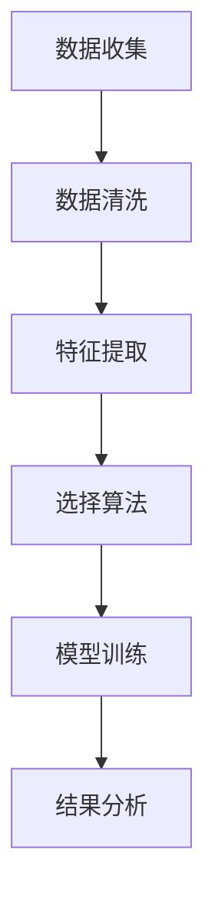
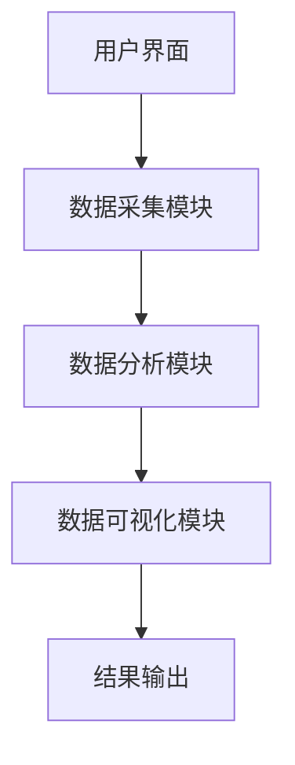
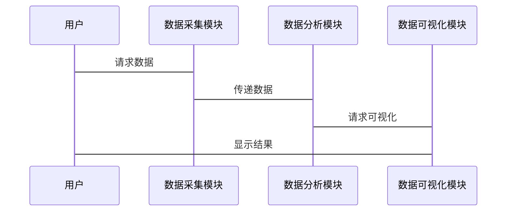

                 


```markdown
# 全球股市估值与可持续能源氢燃料电池技术的关联

> 关键词：全球股市估值，氢燃料电池技术，可持续能源，能源转型，投资分析，技术经济性

> 摘要：本文探讨了全球股市估值与氢燃料电池技术之间的关联性。通过分析氢燃料电池技术的基本原理、市场影响以及全球股市估值的计算方法，本文揭示了氢燃料电池技术如何影响股市估值，并提出了基于数据分析的投资策略。结合实际案例分析和系统架构设计，本文为投资者和研究人员提供了有价值的参考。

---

# 第一部分：全球股市估值与氢燃料电池技术的背景介绍

## 第1章：全球股市估值的基本概念

### 1.1 什么是全球股市估值
- 股市估值的定义
- 股市估值的主要指标：市盈率、市净率、市值等
- 全球股市估值的区域差异与特点

### 1.2 氢燃料电池技术的基本概念
- 氢燃料电池的定义与工作原理
- 氢燃料电池的优势：清洁、高效、可持续
- 氢燃料电池的技术挑战：成本、氢气储存与运输

### 1.3 问题背景与问题描述
- 全球能源结构转型的背景
- 氢燃料电池技术在能源转型中的作用
- 全球股市估值与氢燃料电池技术的关联性

## 第2章：全球股市估值与氢燃料电池技术的核心概念

### 2.1 全球股市估值的核心原理
- 股市估值的主要方法：基本面分析、技术分析
- 影响股市估值的关键因素：经济指标、政策变化、行业趋势
- 全球股市估值的区域差异与经济政策

### 2.2 氢燃料电池技术的核心原理
- 氢燃料电池的工作原理：电化学反应、氢氧反应生成水
- 氢燃料电池的关键技术：催化剂、质子交换膜、气体扩散层
- 氢燃料电池的技术发展与成本分析

### 2.3 全球股市估值与氢燃料电池技术的关联性
- 氢燃料电池技术对股市估值的影响路径：技术创新、市场前景、政策支持
- 氢燃料电池技术的市场表现与股市估值的关系：技术成熟度、市场接受度、行业竞争
- 全球能源政策对两者关联的影响：政府补贴、碳中和目标、绿色金融

---

# 第二部分：全球股市估值与氢燃料电池技术的算法原理

## 第3章：数据收集与处理

### 3.1 数据来源与采集方法
- 全球股市数据：标普500、纳斯达克、恒生指数等
- 氢燃料电池相关企业的财务数据：收入、利润、研发投入
- 行业报告与政策文件：政府发布的能源政策、行业研究报告

### 3.2 数据清洗与预处理
- 数据清洗：去除缺失值、异常值
- 数据转换：标准化、归一化
- 数据特征提取：选取关键指标，如市盈率、研发投入占比

### 3.3 数据特征分析
- 时间序列分析：分析股市估值与氢燃料电池技术发展的趋势
- 统计分析：计算相关系数，评估两者之间的关联性

## 第4章：关联性分析方法

### 4.1 回归分析方法
- 简单线性回归：分析氢燃料电池技术发展对股市估值的影响
- 多元回归分析：考虑多个变量，如政策支持、市场需求
- 回归模型的建立与验证：R²值、F检验、t检验

### 4.2 时间序列分析方法
- ARIMA模型：预测股市估值的变化趋势
- GARCH模型：分析股市估值的波动性
- 时间序列分解：趋势、季节性、随机性

### 4.3 聚类分析方法
- 聚类分析：将企业分为不同类别，分析技术与估值的关系
- 层次聚类与K-means聚类：比较不同方法的优缺点

## 第5章：算法实现与流程图

### 5.1 算法流程图


### 5.2 算法实现代码
```python
import pandas as pd
import numpy as np
from sklearn.linear_model import LinearRegression
from sklearn.metrics import mean_squared_error

# 数据加载与预处理
data = pd.read_csv('stock_valuation.csv')
data = data.dropna()
data['label'] = data['label'].astype(int)

# 特征提取
features = data[['feature1', 'feature2', 'feature3']]
labels = data['label']

# 模型训练
model = LinearRegression()
model.fit(features, labels)

# 预测与评估
predictions = model.predict(features)
mse = mean_squared_error(labels, predictions)
print(f'Mean Squared Error: {mse}')
```

### 5.3 数学模型与公式
- 线性回归模型：$y = \beta_0 + \beta_1 x + \epsilon$
- 回归系数解释：$\beta_1$表示氢燃料电池技术发展对股市估值的影响程度

---

# 第三部分：全球股市估值与氢燃料电池技术的系统分析与架构设计

## 第6章：系统功能设计

### 6.1 数据采集模块
- 功能：实时采集全球股市数据与氢燃料电池相关企业的数据
- 工具：API接口（如Yahoo Finance API）、数据库（如MySQL）

### 6.2 数据分析模块
- 功能：应用回归分析、时间序列分析等方法，评估氢燃料电池技术对股市估值的影响
- 工具：Python（Pandas、NumPy、Scikit-learn）、R语言

### 6.3 数据可视化模块
- 功能：生成图表，如趋势图、散点图，直观展示关联性
- 工具：Matplotlib、Seaborn、Tableau

## 第7章：系统架构设计

### 7.1 系统架构图


### 7.2 模块交互关系
- 数据采集模块与数据分析模块的交互：数据传输与处理
- 数据分析模块与数据可视化模块的交互：结果传递与展示

## 第8章：系统交互设计

### 8.1 用户需求分析
- 用户角色：投资者、研究人员
- 用户需求：实时数据监控、关联性分析、投资建议

### 8.2 系统功能流程图


---

# 第四部分：项目实战与案例分析

## 第9章：氢燃料电池技术的市场表现与股市估值

### 9.1 实际案例分析
- 案例：某氢燃料电池企业的股价预测
- 数据：过去5年的股市估值与研发投入数据
- 分析：应用线性回归模型，预测未来股价

### 9.2 案例分析代码
```python
import pandas as pd
import matplotlib.pyplot as plt

# 数据加载
data = pd.read_csv('hydrogen_fuel_cell_company.csv')

# 数据可视化
plt.plot(data['year'], data['stock_price'], label='Stock Price')
plt.xlabel('Year')
plt.ylabel('Stock Price')
plt.title('Stock Price Trend')
plt.legend()
plt.show()
```

## 第10章：投资策略与最佳实践

### 10.1 投资策略
- 短期投资：关注政策变化与市场波动
- 长期投资：关注技术创新与市场扩展

### 10.2 最佳实践
- 定期更新数据，保持模型的准确性
- 多模型对比，选择最优方案
- 结合行业专家意见，进行综合判断

---

# 结论

全球股市估值与氢燃料电池技术的关联性是一个复杂但具有重要研究价值的课题。通过数据分析与模型构建，我们可以量化技术发展对股市估值的影响，并为投资者提供科学的决策依据。未来的研究可以进一步考虑更多变量，如政策变化、技术突破等，以提升模型的预测能力。

---

# 作者

作者：AI天才研究院/AI Genius Institute & 禅与计算机程序设计艺术/Zen And The Art of Computer Programming
```

