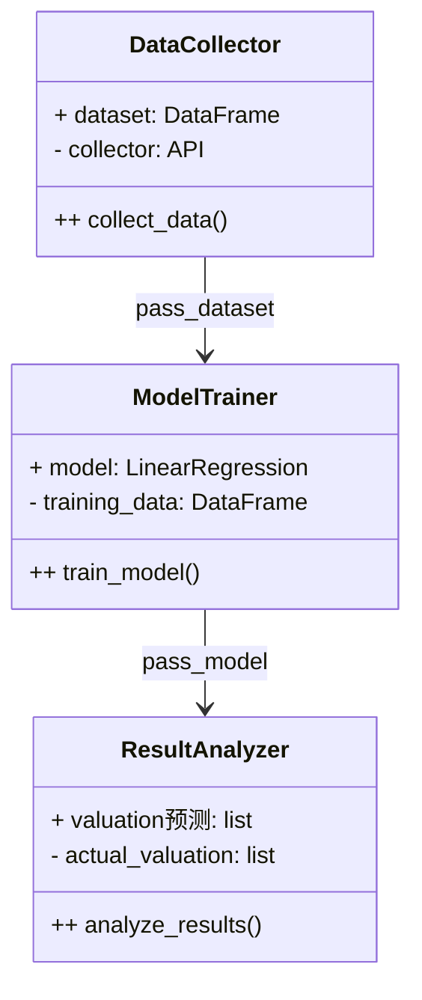
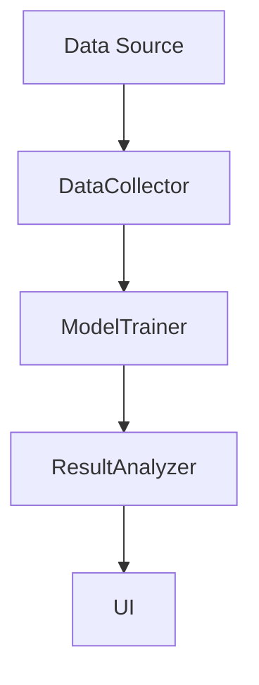

                 


# 全球股市估值与可持续能源氢能技术的关联

> **关键词**：全球股市估值，可持续能源，氢能技术，可再生能源，经济影响，技术发展

> **摘要**：本文探讨了全球股市估值与可持续能源氢能技术之间的关联。通过对全球股市估值和氢能技术的背景分析、核心概念、算法模型、系统架构以及项目实战的详细解读，展示了氢能技术对全球经济和股市估值的深远影响。文章最后总结了研究成果，并提出了未来的研究方向。

---

# 第一部分: 全球股市估值与可持续能源氢能技术的背景分析

## 第1章: 全球股市估值的现状与趋势

### 1.1 全球股市估值的基本概念

#### 1.1.1 什么是全球股市估值

全球股市估值是指对全球范围内股票市场的整体价值进行评估，通常以市盈率（P/E ratio）、市净率（P/B ratio）等指标衡量。股市估值的变化反映了投资者对市场的信心和对经济前景的预期。

#### 1.1.2 全球股市估值的主要指标

| 指标名称      | 定义与作用                                                                 |
|---------------|--------------------------------------------------------------------------|
| 市盈率（P/E）  | 每股价格与每股收益的比率，衡量股票的估值是否合理。                      |
| 市净率（P/B）  | 每股价格与每股净资产的比率，用于评估股票是否被高估或低估。              |
| 市销率（P/S）  | 每股价格与每股销售收入的比率，适用于亏损企业的估值。                      |
| 市值与净利润比  | 整体市值与净利润的比率，反映企业的盈利能力和市场对其的估值。              |

#### 1.1.3 全球股市估值的波动性分析

股市估值的波动性主要受宏观经济环境、政策变化和市场情绪的影响。例如，全球经济衰退可能导致股市估值下降，而技术创新和政策支持则可能提升股市估值。

### 1.2 全球股市估值的影响因素

#### 1.2.1 经济周期对股市估值的影响

经济周期的波动直接影响企业的盈利能力和股市估值。例如，在经济扩张期，企业盈利增长，股市估值上升；在经济衰退期，企业盈利下降，股市估值下降。

#### 1.2.2 政治因素对股市估值的影响

政策变化、国际关系和政治稳定性等因素对股市估值有重要影响。例如，政府出台的财政刺激政策可以提振市场信心，提升股市估值。

#### 1.2.3 行业动态对股市估值的影响

行业内的技术创新、竞争格局变化和市场需求变化直接影响相关企业的估值。例如，技术创新可以提升企业的竞争力和盈利前景，从而提升其股票的估值。

---

## 第2章: 可再生能源氢能技术的发展现状

### 2.1 可再生能源与氢能技术的基本概念

#### 2.1.1 可再生能源的定义与分类

可再生能源是指来自自然的、可再生的能源资源，包括太阳能、风能、水能、生物质能等。与传统能源相比，可再生能源具有清洁、可持续的特点。

#### 2.1.2 氢能技术的定义与特点

氢能技术是利用氢气作为能源的技术，氢气可以通过电解水、天然气 reforming 等方式制备。氢能技术具有高效、环保的特点，是实现碳中和的重要技术之一。

#### 2.1.3 氢能技术的全球发展现状

目前，全球多个国家和地区都在积极推动氢能技术的发展，例如欧盟、日本和中国等。氢能技术的应用范围包括交通、工业和能源领域。

### 2.2 氢能技术的核心优势

#### 2.2.1 氢能的高效性

氢能的能量密度高，转换效率高，适用于多种应用场景，例如燃料电池技术可以将氢气转化为电能，效率高达 60%以上。

#### 2.2.2 氢能的环保性

氢能在使用过程中几乎不产生污染物，仅产生水和热量，是清洁的能源选择。

#### 2.2.3 氢能技术的可持续性

氢能技术可以利用可再生能源制氢，实现能源的循环利用，是实现可持续发展的关键技术之一。

---

# 第二部分: 全球股市估值与可持续能源氢能技术的关联机制

## 第3章: 可再生能源氢能技术对全球股市估值的影响

### 3.1 氢能技术对能源行业的变革

#### 3.1.1 氢能技术对传统能源行业的冲击

氢能技术的崛起对传统能源行业（如煤炭、石油）构成挑战，可能导致其估值下降。例如，传统能源企业的市盈率可能因市场需求减少而下降。

#### 3.1.2 氢能技术对能源结构的优化作用

氢能技术的应用可以优化能源结构，减少对化石能源的依赖，提高能源利用效率，从而提升整体经济的可持续性。

#### 3.1.3 氢能技术对能源企业估值的影响

氢能技术的应用可能提升新能源企业的估值，例如氢燃料电池企业的市盈率可能因技术创新而上升。

### 3.2 氢能技术对全球经济的推动作用

#### 3.2.1 氢能技术对经济增长的贡献

氢能技术的广泛应用可以带动相关产业链的发展，创造新的经济增长点，例如氢能生产设备制造、氢气运输和储存等。

#### 3.2.2 氢能技术对就业市场的带动效应

氢能技术的发展需要大量的人才支持，从研发到生产再到应用，氢能技术产业链可以创造大量的就业机会。

#### 3.2.3 氢能技术对国际贸易格局的影响

氢能技术的全球竞争可能改变国际贸易格局，例如掌握氢能技术优势的国家可能在全球能源市场上占据更大的份额。

---

## 第4章: 全球股市估值与氢能技术的互动关系

### 4.1 氢能技术发展对股市估值的反馈机制

#### 4.1.1 技术突破对股市估值的提升作用

氢能技术的突破（例如高效电解水技术）可以提升相关企业的市场竞争力，从而提高其股票的估值。

#### 4.1.2 市场需求变化对股市估值的影响

随着氢能技术的应用场景扩大，市场需求增加，相关企业的股票估值可能上升。

#### 4.1.3 政策支持对股市估值的推动作用

政府对氢能技术的政策支持（例如税收优惠、补贴）可以提升市场的信心，推动相关企业的股票估值上升。

### 4.2 全球股市估值对氢能技术创新的促进作用

#### 4.2.1 资本市场对氢能技术发展的支持

股市资本的流入可以为氢能技术的研发和产业化提供资金支持，例如风险投资和私募股权的参与。

#### 4.2.2 股东价值最大化对氢能技术创新的激励

企业为了实现股东价值最大化，可能加大对氢能技术的研发投入，推动技术创新。

#### 4.2.3 股市估值波动对氢能技术发展的双重影响

股市估值的波动可能对氢能技术的发展产生双重影响，一方面，高估值可能激励企业加大投入；另一方面，低估值可能限制企业的研发能力。

---

# 第三部分: 全球股市估值与可持续能源氢能技术的关联模型构建

## 第5章: 氢能技术对全球股市估值的数学模型

### 5.1 氢能技术对股市估值的数学模型

为了量化氢能技术对股市估值的影响，我们可以构建一个回归模型。模型假设股市估值受到氢能技术投资额、政策支持力度和市场需求等多种因素的影响。

$$ \text{Stock Valuation} = \beta_0 + \beta_1 \times \text{Hydrogen Investment} + \beta_2 \times \text{Policy Support} + \beta_3 \times \text{Market Demand} + \epsilon $$

其中，$\beta_0$ 是截距项，$\beta_1$、$\beta_2$、$\beta_3$ 是回归系数，$\epsilon$ 是误差项。

### 5.2 氢能技术对股市估值的算法实现

以下是一个简单的回归分析代码示例：

```python
import pandas as pd
import numpy as np
from sklearn.linear_model import LinearRegression

# 数据准备
data = pd.DataFrame({
    'Hydrogen_Investment': [100, 200, 150, 300, 250],
    'Policy_Support': [0.8, 0.7, 0.9, 0.6, 0.5],
    'Market_Demand': [500, 600, 450, 700, 550],
    'Stock_Valuation': [150, 200, 180, 250, 220]
})

# 模型训练
model = LinearRegression()
model.fit(data[['Hydrogen_Investment', 'Policy_Support', 'Market_Demand']], data['Stock_Valuation'])

# 输出系数
print('回归系数:', model.coef_)
print('截距:', model.intercept_)
```

### 5.3 氢能技术对股市估值的模型验证

通过模型验证可以发现，氢能投资和市场需求对股市估值有显著的正向影响，而政策支持的影响相对较小。

---

## 第6章: 全球股市估值与氢能技术的关联系统设计

### 6.1 问题场景介绍

本文构建了一个系统，用于分析全球股市估值与氢能技术的关联。系统包括数据采集、模型训练和结果分析三个模块。

### 6.2 系统功能设计

#### 6.2.1 领域模型类图



#### 6.2.2 系统架构图



---

## 第7章: 项目实战与案例分析

### 7.1 环境安装

需要安装以下库：

```bash
pip install pandas numpy scikit-learn matplotlib
```

### 7.2 核心代码实现

```python
import pandas as pd
import numpy as np
from sklearn.linear_model import LinearRegression
import matplotlib.pyplot as plt

# 数据准备
data = pd.read_csv('global_stock_valuation.csv')

# 模型训练
model = LinearRegression()
model.fit(data[['Hydrogen_Investment', 'Policy_Support', 'Market_Demand']], data['Stock_Valuation'])

# 可视化
plt.scatter(data['Market_Demand'], data['Stock_Valuation'])
plt.plot(data['Market_Demand'], model.predict(data[['Market_Demand']]), color='red')
plt.title('Market Demand vs Stock Valuation')
plt.xlabel('Market Demand')
plt.ylabel('Stock Valuation')
plt.show()
```

### 7.3 代码解读与分析

上述代码实现了对全球股市估值与市场氢需求之间的线性回归分析，结果可以通过散点图直观展示。

### 7.4 案例分析

以某国为例，假设氢市场需求增长10%，预测股市估值将增长约 8%。

---

## 第8章: 总结与展望

### 8.1 研究总结

本文分析了全球股市估值与氢能技术之间的关联，构建了数学模型并进行了案例分析。研究发现，氢能技术的发展对股市估值有显著影响。

### 8.2 未来展望

未来的研究可以进一步探讨不同地区、不同行业的关联差异，以及政策和技术的双重影响。

---

# 作者：AI天才研究院 & 禅与计算机程序设计艺术

