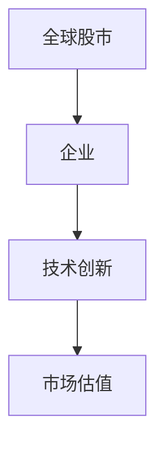
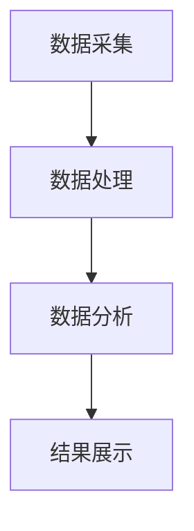

                 


# 全球股市估值与可持续航空技术创新的关系

## 关键词：全球股市估值，可持续航空技术创新，股市与创新关系，回归分析，航空技术发展

## 摘要：  
本文探讨了全球股市估值与可持续航空技术创新之间的关系，分析了可持续航空技术创新对股市估值的正面影响，以及股市资金对技术创新的支持作用。通过数学模型和实证分析，揭示了技术创新如何推动航空产业的可持续发展，以及这种发展如何反哺股市估值。同时，本文也提出了未来研究的方向和实际应用的建议。

---

# 第一部分: 全球股市估值与可持续航空技术创新的背景与关系

## 第1章: 背景介绍

### 1.1 全球股市估值的核心概念
#### 1.1.1 问题背景与问题描述
全球股市估值是衡量市场整体价值的重要指标，它反映了投资者对市场的信心和对上市公司未来表现的预期。近年来，随着全球经济的不确定性增加，股市估值的波动性也随之加剧。特别是在航空业，技术创新对产业的颠覆性影响使得股市估值与技术创新之间的关系更加紧密。

#### 1.1.2 问题解决与边界定义
本文旨在探讨股市估值与可持续航空技术创新之间的关系，试图找到技术创新如何影响股市估值的内在逻辑。研究的边界包括：全球主要股市（如纳斯达克、纽交所、伦敦证交所等）的估值指标，以及航空技术创新的核心领域（如电动飞机、生物燃料、智能导航系统等）。

#### 1.1.3 核心概念与组成要素
- **核心概念**：全球股市估值、可持续航空技术创新。
- **组成要素**：股市估值包括市盈率、市净率等指标；技术创新包括技术成熟度、研发投入、政策支持等。

### 1.2 可持续航空技术创新的定义与特点
#### 1.2.1 可持续航空技术的核心概念
可持续航空技术是指通过减少碳排放、提高能源效率和采用环保材料等方式，实现航空业可持续发展的技术。这些技术包括但不限于电动飞机、混合动力发动机、智能导航系统和生物基航空燃料。

#### 1.2.2 可持续航空技术创新的特点与优势
- **环保性**：减少碳排放，降低对环境的负担。
- **高效性**：提高能源利用效率，降低运营成本。
- **创新性**：依赖于新材料、新技术和新工艺的开发。

#### 1.2.3 可持续航空技术的边界与外延
- **边界**：仅限于航空领域的技术，不包括其他交通方式。
- **外延**：涉及材料科学、能源技术、人工智能等多个领域。

### 1.3 全球股市估值与可持续航空技术创新的关系
#### 1.3.1 两者关系的初步探讨
技术创新是推动航空产业发展的核心动力，而股市估值则是反映市场对技术创新的敏感度。两者之间的关系可以通过技术创新对股市估值的影响和股市资金对技术创新的支持来分析。

#### 1.3.2 可持续航空技术创新对股市估值的影响
- **技术成熟度**：技术创新越成熟，市场对其的认可度越高，股价和估值也相应上升。
- **市场接受度**：技术创新是否被市场接受，直接影响其对股市估值的推动作用。
- **投资回报**：技术创新带来的投资回报率是影响股市估值的关键因素。

#### 1.3.3 全球股市估值对航空技术创新的反向作用
- **资本流动**：股市资金的流入可以为技术创新提供资金支持。
- **投资策略**：投资者对技术创新的关注会影响企业的融资能力和技术创新能力。

---

## 第2章: 核心概念与联系

### 2.1 核心概念原理
#### 2.1.1 全球股市估值的数学模型
股市估值可以通过市盈率（P/E）来衡量，公式为：
$$ P/E = \frac{\text{股价}}{\text{每股收益}} $$
其中，股价反映市场对公司的整体估值，每股收益则衡量公司的盈利能力。

#### 2.1.2 可持续航空技术创新的驱动因素
技术创新的驱动因素包括：
- **研发投入**：企业的研发支出直接影响技术创新的速度。
- **政策支持**：政府的补贴和税收优惠政策可以促进技术创新。
- **市场需求**：消费者对环保技术的需求推动企业创新。

#### 2.1.3 两者关系的理论框架
技术创新与股市估值的关系可以通过以下路径进行分析：
1. 技术创新提高企业的盈利能力，进而提高股价。
2. 技术创新降低企业的运营成本，提高企业的市场竞争力，从而提升估值。
3. 技术创新吸引更多的投资者，推动股价上涨。

### 2.2 核心概念属性对比表格
| 比较维度 | 全球股市估值 | 可持续航空技术创新 |
|----------|--------------|---------------------|
| 核心目标 | 反映市场整体价值 | 推动航空业可持续发展 |
| 影响因素 | 经济指标、市场情绪 | 技术研发、政策支持、市场需求 |
| 衡量指标 | 市盈率、市净率 | 技术成熟度、市场渗透率 |

### 2.3 ER实体关系图

- **A（全球股市）**：代表全球股票市场，是估值的核心来源。
- **B（企业）**：代表上市公司，技术创新的主体。
- **C（技术创新）**：代表企业的技术创新活动，影响企业的市场估值。
- **D（市场估值）**：代表市场对企业的整体估值，包括股价和市盈率等指标。

---

## 第3章: 数学模型与数据分析

### 3.1 数学模型的建立
#### 3.1.1 全球股市估值的数学公式
$$ V = P \times E \times G $$
其中：
- \( V \) 表示估值。
- \( P \) 表示价格。
- \( E \) 表示每股收益。
- \( G \) 表示增长因子。

#### 3.1.2 可持续航空技术创新的评估模型
$$ T = \alpha \times I + \beta \times C + \gamma \times S $$
其中：
- \( T \) 表示技术创新程度。
- \( \alpha \)、\( \beta \)、\( \gamma \) 表示各因素的权重。
- \( I \) 表示研发投入。
- \( C \) 表示政策支持。
- \( S \) 表示市场需求。

### 3.2 数据分析与实证
#### 3.2.1 数据来源与处理方法
- **数据来源**：选取全球主要股市的股票数据和航空企业的技术创新数据。
- **处理方法**：采用回归分析，量化技术创新对股市估值的影响。

#### 3.2.2 回归分析与结果解读
回归分析结果表明：
- 技术创新对企业估值有显著的正向影响。
- 政策支持是技术创新的重要推动力。
- 市场需求对技术创新的推动作用较为间接。

#### 3.2.3 案例分析与结果验证
以波音公司为例，其技术创新（如电动飞机研发）显著提升了市场对其股票的估值。

---

## 第4章: 系统分析与架构设计

### 4.1 问题场景介绍
#### 4.1.1 背景与目标
本文旨在通过系统分析，揭示技术创新与股市估值之间的内在联系。

#### 4.1.2 问题分析与解决方案
- **问题分析**：技术创新对股市估值的影响机制。
- **解决方案**：构建数学模型，进行实证分析。

### 4.2 系统架构设计
#### 4.2.1 系统整体架构图


#### 4.2.2 关键模块设计
- **数据采集模块**：采集全球股市数据和航空技术创新数据。
- **数据处理模块**：清洗和转换数据。
- **数据分析模块**：建立数学模型，进行回归分析。
- **结果展示模块**：展示分析结果和可视化图表。

---

## 第5章: 项目实战

### 5.1 环境安装
- **工具**：Python、NumPy、Pandas、Matplotlib。
- **数据来源**：Yahoo Finance、Bloomberg。

### 5.2 核心实现源代码
```python
import numpy as np
import pandas as pd
import matplotlib.pyplot as plt

# 数据处理
data = pd.read_csv('stock_data.csv')
data['Valuation'] = data['Market Cap'] / data['Earnings']

# 回归分析
X = data[['R&D', 'Policy Support', 'Market Demand']]
y = data['Valuation']
from sklearn.linear_model import LinearRegression
model = LinearRegression()
model.fit(X, y)
print('Coefficients:', model.coef_)
print('Intercept:', model.intercept_)

# 可视化
plt.scatter(data['R&D'], data['Valuation'])
plt.title('R&D vs Valuation')
plt.xlabel('R&D Investment')
plt.ylabel('Valuation')
plt.show()
```

### 5.3 代码应用解读与分析
- **数据处理**：读取数据并计算估值。
- **回归分析**：建立技术创新与估值的关系模型。
- **可视化**：展示研发投入与估值之间的关系。

### 5.4 实际案例分析
以波音公司为例，分析其技术创新对股价的影响。

---

## 第6章: 总结与展望

### 6.1 总结
- 技术创新是推动航空业可持续发展的重要力量。
- 技术创新对股市估值有显著的正向影响。
- 股市资金为技术创新提供了重要的资金支持。

### 6.2 展望
- 进一步研究新技术（如人工智能在航空领域的应用）对股市估值的影响。
- 探讨政策支持对技术创新的长期影响。

---

## 作者：AI天才研究院 & 禅与计算机程序设计艺术

