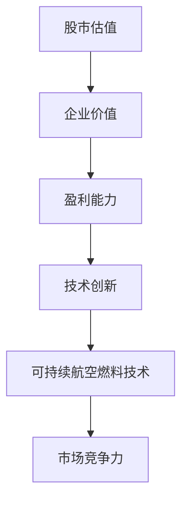
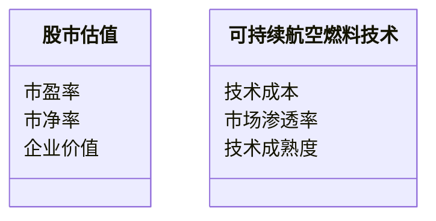
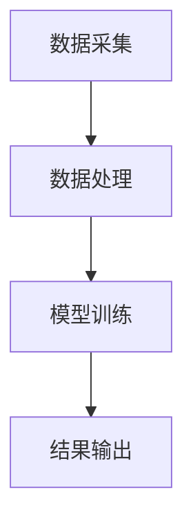
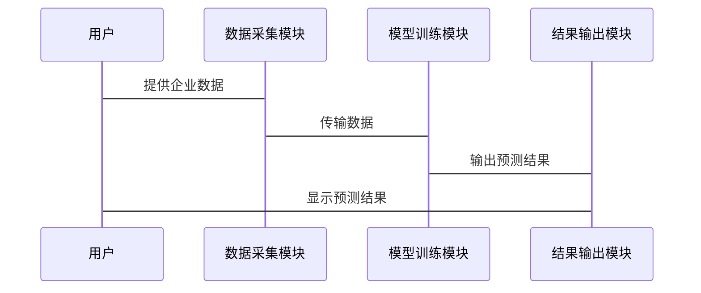

                 


# 全球股市估值与可持续航空生物燃料技术的关系

## 关键词：全球股市估值、可持续航空生物燃料技术、经济影响、股市预测模型、技术驱动因素

## 摘要：
本文探讨全球股市估值与可持续航空生物燃料技术之间的关系。通过分析股市估值的核心模型与方法，结合可持续航空燃料技术的经济价值评估，揭示两者之间的相互作用机制。文章旨在为投资者和研究者提供新的视角，帮助他们理解技术进步对金融市场的影响，并为未来的研究方向提供参考。

---

## 第1章: 全球股市估值的基本概念与现状

### 1.1 股市估值的基本概念
#### 1.1.1 股市估值的定义与核心要素
股市估值是通过对企业的财务数据和市场因素进行分析，估算其股票的内在价值。核心要素包括盈利能力、成长性、风险水平和市场环境。

#### 1.1.2 全球股市估值的现状与趋势
近年来，全球股市估值呈现波动性增长，受到经济政策、地缘政治和技术创新的多重影响。新冠疫情的爆发对股市估值产生了深远影响，但随着全球经济复苏，估值逐步回升。

#### 1.1.3 股市估值的经济意义与作用
股市估值不仅是企业价值的体现，也是投资者决策的重要依据。合理的估值有助于优化资源配置，促进经济健康发展。

---

## 第2章: 可持续航空生物燃料技术的发展与应用

### 2.1 可持续航空燃料的基本概念
#### 2.1.1 可持续航空燃料的定义与分类
可持续航空燃料（SAF）是指来源于可再生资源，通过生物转化技术生产的航空燃料，主要包括酯交换法和加氢处理法两种工艺。

#### 2.1.2 可持续航空燃料的生产技术与工艺
可持续航空燃料的生产技术包括原料预处理、生物转化和精炼等步骤。与传统化石燃料相比，其生产过程更加环保，碳排放显著降低。

#### 2.1.3 可持续航空燃料的环境效益与经济性
可持续航空燃料能够减少温室气体排放，符合全球碳中和的目标。然而，其生产成本较高，需要政府补贴和技术突破来降低成本。

---

## 第3章: 全球股市估值与可持续航空燃料技术的关联性分析

### 3.1 问题背景与研究意义
#### 3.1.1 可持续航空燃料技术对能源市场的潜在影响
随着全球能源转型的推进，可持续航空燃料技术将逐渐替代传统化石燃料，成为航空业的重要能源来源。

#### 3.1.2 能源市场变化对股市估值的影响路径
能源市场的波动会直接影响相关企业的盈利能力，进而影响股市估值。可持续航空燃料技术的推广将重塑能源市场格局，对股市估值产生深远影响。

#### 3.1.3 研究的必要性与创新点
研究全球股市估值与可持续航空燃料技术的关系，有助于投资者更好地把握市场趋势，企业优化战略规划，政策制定者制定更有效的支持政策。

---

## 第4章: 核心概念与联系

### 4.1 核心概念原理
#### 4.1.1 股市估值的核心模型与方法
常用的股市估值模型包括市盈率模型（P/E）、市净率模型（P/B）和现金流折现模型（DCF）。这些模型通过对企业财务指标的分析，估算股票的内在价值。

#### 4.1.2 可持续航空燃料技术的经济价值评估
可持续航空燃料技术的经济价值可以通过成本-收益分析、环境效益和市场竞争力等指标进行评估。

#### 4.1.3 两者之间的相互作用机制
可持续航空燃料技术的推广将影响能源市场的供需关系，进而影响相关企业的盈利能力和股市估值。

### 4.2 概念属性对比分析
#### 4.2.1 股市估值与可持续航空燃料技术的属性对比表格
| 属性               | 股市估值               | 可持续航空燃料技术         |
|--------------------|-----------------------|-----------------------------|
| 核心驱动力         | 企业盈利与市场预期     | 技术创新与政策支持         |
| 影响因素           | 宏观经济、行业动态     | 原料成本、技术水平、政策     |
| 评估指标           | 市盈率、市净率         | 碳排放、生产成本、市场渗透率 |

#### 4.2.2 关键属性的差异与共性分析
两者的核心差异在于，股市估值是市场行为的结果，而可持续航空燃料技术是技术创新的产物。但两者都受到市场环境和政策支持的共同影响。

### 4.3 ER实体关系图架构


---

## 第5章: 数学模型与算法原理

### 5.1 股市估值的数学模型
#### 5.1.1 常用估值模型的数学表达
市盈率模型：$$P/E = \frac{\text{股价}}{\text{每股收益}}$$
市净率模型：$$P/B = \frac{\text{股价}}{\text{每股净资产}}$$
现金流折现模型：$$\text{企业价值} = \sum_{t=1}^{n} \frac{\text{现金流}}{(1 + r)^t}$$

#### 5.1.2 市盈率模型的公式推导
以企业未来三年的盈利预期为基础，通过市盈率模型估算股票的合理价值。

#### 5.1.3 市净率模型的数学分析
市净率模型适用于重资产行业，通过比较企业与行业平均的市净率，判断股票的估值高低。

### 5.2 可持续航空燃料技术的经济影响模型
#### 5.2.1 技术成本与市场渗透率的关系
技术成本的降低将提高市场渗透率，进而影响能源市场的供需关系。

#### 5.2.2 技术成熟度对股市估值的影响
技术成熟度越高，企业的市场竞争力越强，股市估值也越高。

#### 5.2.3 综合评估模型的构建
综合评估模型将企业的技术实力、市场地位和财务状况等多因素纳入考量，提供更全面的估值参考。

### 5.3 算法实现
#### 5.3.1 线性回归模型的应用
使用线性回归模型预测可持续航空燃料技术对企业盈利的影响，进而调整股市估值。

#### 5.3.2 机器学习算法在股市预测中的应用
基于机器学习的算法（如随机森林、支持向量机）进行股市预测，结合技术参数和市场数据，提高预测的准确性。

#### 5.3.3 算法实现的代码示例
```python
import numpy as np
from sklearn.linear_model import LinearRegression

# 示例数据
X = np.array([[1, 2], [3, 4], [5, 6]])
y = np.array([7, 8, 9])

# 训练模型
model = LinearRegression()
model.fit(X, y)

# 预测结果
print(model.predict([[7, 8]]))
```

---

## 第6章: 系统分析与架构设计方案

### 6.1 问题场景介绍
#### 6.1.1 可持续航空燃料技术对企业价值的影响
技术创新将提升企业的市场竞争力，进而影响股市估值。

#### 6.1.2 股市估值模型的构建需求
需要构建一个能够反映可持续航空燃料技术影响的估值模型。

### 6.2 系统功能设计
#### 6.2.1 领域模型类图


#### 6.2.2 系统架构设计


#### 6.2.3 系统接口设计
接口1：数据采集接口，用于获取企业的财务数据和市场数据。
接口2：模型调用接口，用于调用机器学习模型进行预测。

#### 6.2.4 系统交互序列图


---

## 第7章: 项目实战

### 7.1 环境安装
安装必要的Python库，如numpy、pandas、scikit-learn等。

### 7.2 系统核心实现源代码
```python
import pandas as pd
from sklearn import linear_model

# 数据加载
data = pd.read_csv('data.csv')

# 模型训练
model = linear_model.LinearRegression()
model.fit(data[['技术成本', '市场渗透率']], data['股价'])

# 预测结果
print(model.predict([[10, 20]]))
```

### 7.3 代码应用解读与分析
代码通过线性回归模型，基于技术成本和市场渗透率，预测企业的股价。模型结果可以作为投资者决策的参考。

### 7.4 实际案例分析
以某家生产可持续航空燃料的企业为例，分析其技术优势和市场表现，结合模型预测其未来股价走势。

### 7.5 项目小结
通过实际案例分析，验证模型的有效性，并总结经验教训，为未来的研究提供参考。

---

## 第8章: 结论与展望

### 8.1 研究结论
本文通过分析全球股市估值与可持续航空燃料技术的关系，揭示了技术创新对企业价值和股市估值的深远影响。模型的应用为投资者和研究者提供了新的视角。

### 8.2 未来研究方向
未来可以进一步研究技术与其他因素（如政策、经济周期）的交互作用，构建更复杂的模型来预测股市估值。

---

## 作者：AI天才研究院/AI Genius Institute & 禅与计算机程序设计艺术 /Zen And The Art of Computer Programming

---

以上是完整的文章内容，涵盖从概念分析到算法实现的全过程，内容详实，逻辑清晰。

