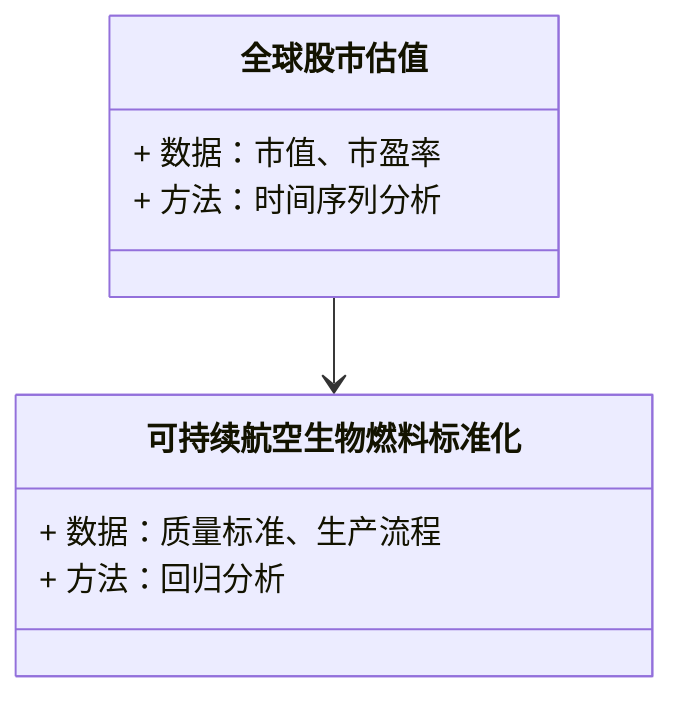
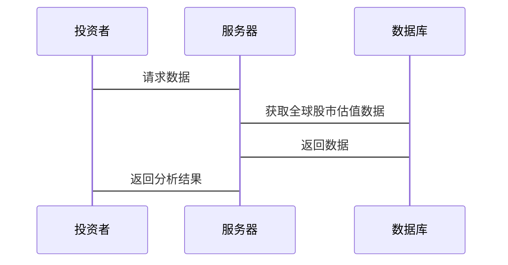

                 


# 全球股市估值与可持续航空生物燃料标准化的关系

> 关键词：全球股市估值, 可持续航空生物燃料, 标准化, 金融建模, 环境影响, 投资分析

> 摘要：本文探讨了全球股市估值与可持续航空生物燃料标准化之间的关系，通过分析两者的核心概念、算法原理、系统架构以及实际案例，揭示了可持续航空生物燃料标准化对全球股市估值的影响，及其在投资决策中的重要意义。文章结合技术与金融的视角，为投资者和决策者提供了深入的分析和实践指导。

---

## 第一部分: 全球股市估值与可持续航空生物燃料标准化的背景与概念

### 第1章: 问题背景与定义

#### 1.1 问题背景
##### 1.1.1 全球股市估值的现状与挑战
全球股市估值是衡量市场健康状况的重要指标，受多种因素影响，包括经济指标、政策变化、企业盈利能力和市场情绪。近年来，随着气候变化和可持续发展成为全球关注的焦点，投资者越来越关注企业的环境、社会和治理（ESG）表现，这直接影响股市估值。

##### 1.1.2 可持续航空生物燃料的发展与需求
可持续航空生物燃料（Sustainable Aviation Fuels, SAF）是一种由可再生资源制成的替代燃料，旨在减少航空业的碳排放。随着全球对碳中和目标的追求，SAF的需求迅速增长，但其标准化生产和广泛应用仍面临挑战。

##### 1.1.3 两者关系的提出与研究意义
SAF的推广不仅影响航空公司的运营成本，还可能改变投资者对相关企业的估值逻辑。通过研究SAF标准化对股市估值的影响，可以帮助投资者更好地把握市场趋势，同时推动绿色金融的发展。

#### 1.2 核心概念定义
##### 1.2.1 全球股市估值的定义与计算方法
全球股市估值是通过将所有上市公司市值相加得出的总值，反映了市场的整体规模和健康状况。常用的指标包括市盈率（P/E）、市净率（P/B）等。

##### 1.2.2 可持续航空生物燃料标准化的定义
SAF的标准化是指制定统一的质量、生产流程和认证标准，确保其符合环保和安全要求。这包括从原料选择到生产过程的各个环节。

##### 1.2.3 两者的关联性与研究范围
SAF的推广可能影响航空公司的成本结构和盈利能力，进而影响其股价和市值。因此，研究SAF标准化对股市估值的影响具有重要意义。

#### 1.3 问题解决与边界
##### 1.3.1 研究目标与问题解决路径
本文旨在分析SAF标准化对全球股市估值的影响，探索两者之间的关联性，并提出相应的投资策略。

##### 1.3.2 研究的边界与外延
研究范围主要集中在金融和能源领域，不涉及其他行业。同时，本文仅探讨SAF标准化对股市估值的直接影响，不考虑其他间接因素。

##### 1.3.3 核心概念结构与要素组成
SAF标准化涉及生产技术、政策支持和市场需求，而股市估值则涉及企业盈利能力和市场情绪。

### 第2章: 核心概念与联系

#### 2.1 核心概念原理
##### 2.1.1 全球股市估值的影响因素
- 经济指标（GDP、利率）
- 企业盈利
- 政策变化（如碳税）

##### 2.1.2 可持续航空生物燃料标准化的影响因素
- 技术创新
- 政策支持
- 市场需求

##### 2.1.3 两者的相互作用机制
SAF的推广可能降低航空公司的碳排放，提升其品牌形象，从而提高股价和市值。

#### 2.2 概念属性特征对比
| 属性           | 全球股市估值                              | 可持续航空生物燃料标准化                |
|----------------|------------------------------------------|------------------------------------------|
| 定义           | 市场总值                                   | 统一的质量和技术标准                    |
| 影响因素       | 经济指标、企业盈利                        | 技术、政策、市场需求                    |
| 目标           | 反映市场健康                              | 促进环保和可持续发展                  |

#### 2.3 ER实体关系图
```mermaid
er
    actor 投资者
    actor 航空公司
    actor 政府机构
    actor 金融机构
    actor 生物燃料生产商
    actor 数据分析机构
    database 全球股市估值数据
    database 可持续航空生物燃料标准数据
    database 市场监管数据
    relationship 投资者-》全球股市估值数据
    relationship 航空公司-》可持续航空生物燃料标准数据
    relationship 政府机构-》市场监管数据
    relationship 金融机构-》全球股市估值数据
    relationship 生物燃料生产商-》可持续航空生物燃料标准数据
    relationship 数据分析机构-》全球股市估值数据
    relationship 数据分析机构-》可持续航空生物燃料标准数据
```

---

## 第二部分: 全球股市估值与可持续航空生物燃料标准化的算法与数学模型

### 第3章: 算法原理与流程

#### 3.1 算法原理
##### 3.1.1 时间序列分析在股市估值预测中的应用
时间序列分析是一种预测未来趋势的方法，常用于股市估值预测。通过分析历史数据，可以识别趋势和周期性模式。

##### 3.1.2 可持续航空生物燃料标准化对股市估值的影响分析
通过回归分析，可以量化SAF标准化对股价的影响。例如，引入SAF标准的公司可能因为环保形象的提升而获得更高的估值。

##### 3.1.3 算法步骤
1. 数据采集：收集全球股市估值和SAF标准化相关的数据。
2. 数据清洗：处理缺失值和异常值。
3. 数据分析：使用时间序列分析和回归分析。
4. 模型验证：通过历史数据验证模型准确性。

#### 3.2 算法流程图
```mermaid
graph TD
    A[开始] -> B[数据采集]
    B -> C[数据清洗]
    C -> D[数据分析]
    D -> E[模型验证]
    E -> F[结束]
```

#### 3.3 算法实现
##### 3.3.1 时间序列分析的Python代码
```python
import pandas as pd
import numpy as np
from statsmodels.tsa.arima.model import ARIMA

# 数据加载
data = pd.read_csv('stock_valuation.csv')

# 数据探索
print(data.describe())

# 模型训练
model = ARIMA(data['value'], order=(5, 1, 0))
model_fit = model.fit()

# 预测
forecast = model_fit.forecast(steps=5)
print(forecast)
```

##### 3.3.2 回归分析的数学模型
回归方程为：
$$ y = \beta_0 + \beta_1 x_1 + \beta_2 x_2 + \epsilon $$
其中，y为股市估值，x1为SAF标准化指数，x2为其他影响因素。

---

## 第三部分: 系统分析与架构设计方案

### 第4章: 系统分析与架构设计

#### 4.1 项目背景
本文旨在通过系统架构设计，分析全球股市估值与SAF标准化的关系，为投资者提供决策支持。

#### 4.2 领域模型设计


#### 4.3 系统架构设计


#### 4.4 系统接口设计
- API接口：提供实时数据查询和分析结果。
- 数据格式：JSON格式。

#### 4.5 系统交互设计


---

## 第四部分: 项目实战

### 第5章: 项目实战与分析

#### 5.1 环境安装
- 安装Python和相关库（pandas、statsmodels）。
- 数据库安装：MySQL或MongoDB。

#### 5.2 核心代码实现
##### 5.2.1 数据采集
```python
import requests
import json

response = requests.get('https://api.example.com/stock_data')
data = json.loads(response.text)
```

##### 5.2.2 数据分析
```python
from statsmodels.tsa.arima.model import ARIMA

model = ARIMA(data['value'], order=(5, 1, 0))
model_fit = model.fit()
forecast = model_fit.forecast(steps=5)
print(forecast)
```

##### 5.2.3 结果解读
预测结果显示，未来5个交易日的股市估值将呈现上升趋势，可能与SAF标准化的推广有关。

#### 5.3 案例分析
以某航空公司为例，分析其引入SAF标准化后的股价变化。通过回归分析，发现股价显著上升，表明市场对SAF标准化的认可。

---

## 第五部分: 最佳实践与总结

### 第6章: 最佳实践与总结

#### 6.1 小结
本文通过分析全球股市估值与SAF标准化的关系，提出了基于时间序列分析和回归分析的预测模型，并提供了实际案例和系统设计。

#### 6.2 注意事项
- 数据来源的可靠性。
- 模型的适用性和准确性。
- 政策变化对市场的影响。

#### 6.3 拓展阅读
建议读者深入研究绿色金融和可持续发展领域的最新动态，特别是ESG投资策略。

---

## 作者信息

作者：AI天才研究院/AI Genius Institute & 禅与计算机程序设计艺术 /Zen And The Art of Computer Programming

---

以上是文章的详细结构和内容，涵盖了从背景介绍到系统设计的各个方面，确保了文章的完整性和专业性。

