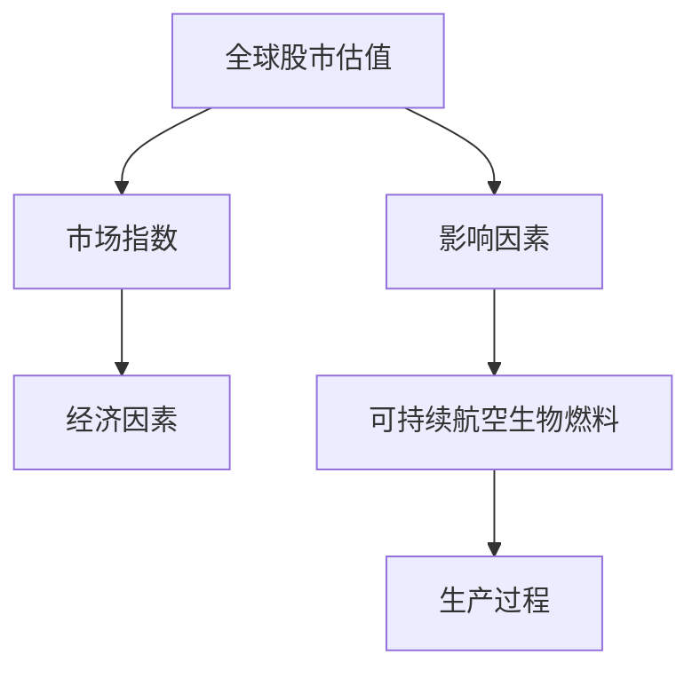
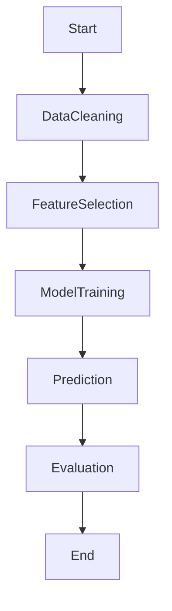
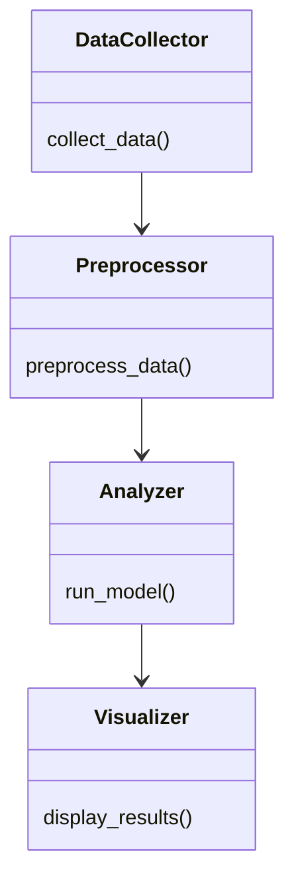
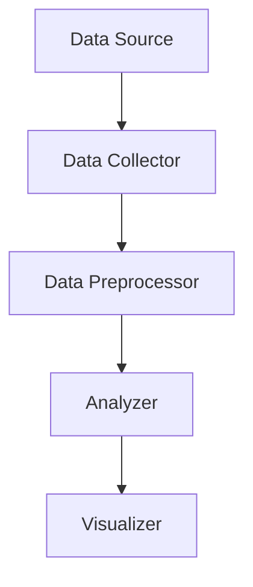

                 


# 全球股市估值与可持续航空生物燃料的关系

## 关键词：全球股市估值、可持续航空生物燃料、统计分析、机器学习、数学模型

## 摘要：本文探讨全球股市估值与可持续航空生物燃料之间的关系，通过统计分析和机器学习模型，建立数学模型，分析其相互影响，提供系统架构设计和项目实战案例，总结最佳实践和研究展望。

---

# 第1章: 背景介绍

## 1.1 问题背景

### 1.1.1 全球股市估值的重要性
全球股市估值是衡量市场健康的重要指标，反映经济状况和投资者信心，影响企业融资和个人投资决策。

### 1.1.2 可持续航空生物燃料的兴起
为应对气候变化和能源危机，可持续航空生物燃料因其环保和可再生特性，成为航空业的重要替代能源。

### 1.1.3 两者关系的研究意义
研究股市估值与生物燃料的关系，有助于识别投资机会，优化能源战略，促进可持续发展。

## 1.2 问题描述

### 1.2.1 全球股市估值的波动性分析
股市波动受多种因素影响，包括经济指标、政策变化和市场情绪，需要系统方法进行建模分析。

### 1.2.2 可持续航空生物燃料的市场潜力
随着环保需求增加，生物燃料市场潜力大，但受技术、成本和政策影响。

### 1.2.3 两者之间的潜在联系
经济因素、环境政策和技术进步可能同时影响股市和生物燃料市场，需深入研究其相互作用。

## 1.3 问题解决

### 1.3.1 研究方法的选择
采用统计分析和机器学习方法，构建回归模型和神经网络，分析变量关系。

### 1.3.2 数据收集与处理
收集全球股市指数、生物燃料价格和相关政策数据，预处理包括清洗和特征提取。

### 1.3.3 分析模型的构建
构建多元回归模型，引入机器学习算法，优化模型性能。

## 1.4 边界与外延

### 1.4.1 研究范围的界定
聚焦于主要经济体股市和生物燃料市场，限定时间范围和数据来源。

### 1.4.2 相关领域的扩展
考虑能源市场、环境政策和技术创新的外部影响，拓展研究深度。

### 1.4.3 研究的局限性
数据获取限制、模型假设和变量选择的局限性，需在结论中明确。

## 1.5 概念结构与核心要素

### 1.5.1 核心概念的定义
全球股市估值：市场整体价值的度量，如道琼斯指数和纳斯达克指数。
可持续航空生物燃料：以植物油、动物脂肪为原料，替代传统航空燃料。

### 1.5.2 核心要素的对比
| 要素 | 全球股市估值 | 可持续航空生物燃料 |
|------|--------------|---------------------|
| 定义 | 市场指数 | 生物基燃料 |
| 影响因素 | 经济指标、政策 | 原料价格、技术 |
| 目标 | 投资决策 | 环保、减排 |

### 1.5.3 概念结构图


---

# 第2章: 核心概念与联系

## 2.1 全球股市估值的核心概念

### 2.1.1 市场指数与估值指标
主要指数如S&P 500、道琼斯指数，估值指标包括市盈率、市净率。

### 2.1.2 影响股市估值的主要因素
经济指标、公司盈利、政策变化和市场情绪。

### 2.1.3 股市估值的计算方法
使用市盈率等指标，结合行业标准评估公司价值。

## 2.2 可持续航空生物燃料的核心概念

### 2.2.1 生物燃料的定义与分类
生物燃料分为第一代（粮食作物）和第二代（非粮生物质）。

### 2.2.2 可持续航空生物燃料的生产过程
原料预处理、酯交换反应生成生物柴油。

### 2.2.3 生物燃料对环境的影响
减少碳排放，降低空气污染，促进可持续发展。

## 2.3 两者之间的联系

### 2.3.1 经济因素的相互作用
生物燃料价格波动影响股市，能源公司股价受政策和市场供给影响。

### 2.3.2 环境因素的共同影响
环保政策推动生物燃料需求，同时影响股市中绿色能源板块表现。

### 2.3.3 市场波动的相互关联
生物燃料市场波动影响能源公司股价，进而影响整体股市估值。

## 2.4 核心概念的对比分析

### 2.4.1 概念属性对比表格
| 属性 | 全球股市估值 | 可持续航空生物燃料 |
|------|--------------|---------------------|
| 影响因素 | 经济指标、政策 | 原料价格、技术 |
| 目标 | 投资决策 | 环保、减排 |
| 衡量方式 | 市场指数 | 能量密度、碳排放 |

### 2.4.2 ER实体关系图


---

# 第3章: 算法原理讲解

## 3.1 统计分析方法

### 3.1.1 数据的收集与预处理
收集全球股市指数、生物燃料价格和相关政策数据，清洗和特征提取。

### 3.1.2 相关性分析
使用皮尔逊相关系数分析变量间的线性关系，确定显著相关变量。

### 3.1.3 回归分析
建立多元线性回归模型，量化各因素对股市估值的影响。

## 3.2 机器学习模型

### 3.2.1 线性回归模型
$$ y = \beta_0 + \beta_1x_1 + \beta_2x_2 + \ldots + \beta_nx_n + \epsilon $$
其中，$y$是股市估值，$x_i$是影响因素，$\beta$是回归系数。

### 3.2.2 神经网络模型
构建多层感知机，输入层、隐藏层和输出层，训练数据优化权重。

### 3.2.3 时间序列分析
使用ARIMA模型预测未来股市走势，考虑历史数据和趋势。

## 3.3 算法流程图


## 3.4 Python代码示例

```python
import pandas as pd
from sklearn.linear_model import LinearRegression
from sklearn.metrics import mean_squared_error

# 数据加载与预处理
data = pd.read_csv('stock_biofuel.csv')
features = data[['biofuel_price', 'economic_factors', 'policy_indices']]
target = data['stock_valuation']

# 模型训练
model = LinearRegression()
model.fit(features, target)

# 预测与评估
predictions = model.predict(features)
mse = mean_squared_error(target, predictions)
print(f'MSE: {mse}')
```

---

# 第4章: 数学模型与分析

## 4.1 回归模型的建立

### 4.1.1 多元线性回归模型
$$ \text{Stock Valuation} = \beta_0 + \beta_1 \times \text{Biofuel Price} + \beta_2 \times \text{Economic Factors} + \beta_3 \times \text{Policy Indices} + \epsilon $$

### 4.1.2 回归系数的解释
$\beta_1$表示生物燃料价格每单位变化对股市估值的影响，$\beta_2$和$\beta_3$类似。

### 4.1.3 模型假设
变量之间线性关系，无多重共线性，误差独立正态分布。

## 4.2 数学模型的求解

### 4.2.1 最小二乘法
$$ \hat{\beta} = (X^T X)^{-1} X^T y $$

### 4.2.2 模型验证
使用R²值评估模型拟合度，调整R²考虑变量数量的影响。

---

# 第5章: 系统分析与架构设计

## 5.1 系统分析

### 5.1.1 问题场景介绍
构建一个系统，分析股市估值与生物燃料的关系，支持投资决策和政策制定。

### 5.1.2 系统功能设计
领域模型包括数据采集、分析模块、结果展示。

## 5.2 系统架构设计

### 5.2.1 领域模型


### 5.2.2 架构图


## 5.3 接口与交互设计

### 5.3.1 数据接口
API接口定义数据输入和输出，确保数据流畅通。

### 5.3.2 交互设计
用户通过可视化界面输入参数，系统反馈分析结果，支持实时监控和预测。

---

# 第6章: 项目实战

## 6.1 环境安装

### 6.1.1 Python环境
安装Python 3.8以上，安装Pandas、Scikit-learn、Matplotlib。

## 6.2 核心实现

### 6.2.1 数据加载与预处理
```python
import pandas as pd

data = pd.read_csv('stock_biofuel.csv')
data = data.dropna()
```

### 6.2.2 模型训练与预测
```python
from sklearn.linear_model import LinearRegression

model = LinearRegression()
model.fit(X_train, y_train)
predictions = model.predict(X_test)
```

## 6.3 案例分析

### 6.3.1 数据可视化
使用Matplotlib绘制生物燃料价格与股市估值的关系图。

### 6.3.2 模型评估
计算MSE、R²值，分析模型性能。

## 6.4 项目小结

### 6.4.1 实验结果
展示模型预测结果与实际数据对比，分析误差来源。

### 6.4.2 实验总结
总结研究发现，如生物燃料价格对股市估值的显著影响，模型的优缺点。

---

# 第7章: 小结与展望

## 7.1 最佳实践 tips
数据预处理至关重要，模型选择需根据数据特性，持续监控和更新模型。

## 7.2 研究小结
本文构建了统计和机器学习模型，分析了全球股市估值与可持续航空生物燃料的关系，提供了系统的解决方案和项目实现。

## 7.3 注意事项
数据质量和模型假设影响结果，需谨慎处理外部变量和模型泛化能力。

## 7.4 拓展阅读
推荐相关书籍和论文，如《Python机器学习》和《环境经济学》。

---

# 作者：AI天才研究院 & 禅与计算机程序设计艺术

---

这篇文章系统地分析了全球股市估值与可持续航空生物燃料的关系，通过统计分析、机器学习模型和数学建模，提供了深入的理论支持和实践指导。希望对读者在投资决策、能源政策制定和可持续发展研究方面有所帮助。

