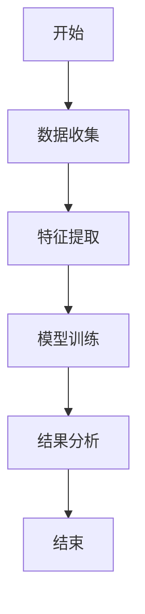
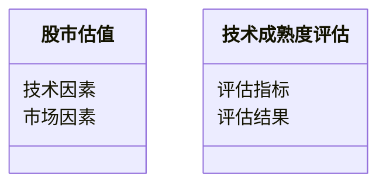

                 


# 全球股市估值与可持续航空电动化技术的关系

**关键词**：全球股市，股市估值，可持续航空，电动化技术，技术影响，投资分析，金融建模

**摘要**：本文探讨了全球股市估值与可持续航空电动化技术之间的关系，分析了电动化技术对航空业的影响及其如何通过技术手段进行建模和投资分析，旨在为投资者和技术开发者提供有价值的见解。

---

## 第一部分: 全球股市估值与可持续航空电动化技术的背景与核心概念

### 第1章: 背景介绍

#### 1.1 问题背景

##### 1.1.1 全球股市估值的重要性  
股市估值是衡量市场健康状况的重要指标，反映了经济活动和企业盈利能力。投资者通过分析股市估值做出投资决策。

##### 1.1.2 可持续航空电动化技术的兴起  
电动化技术在航空领域的应用逐渐增多，旨在减少碳排放和运营成本，推动行业可持续发展。

##### 1.1.3 两者关系的研究意义  
研究两者关系有助于理解技术进步如何影响市场估值，为投资决策提供数据支持。

#### 1.2 问题描述

##### 1.2.1 全球股市估值的波动性  
股市估值受多种因素影响，包括经济指标、政策变化和技术进步。

##### 1.2.2 可持续航空电动化技术的挑战  
技术成熟度、成本和基础设施是电动化技术在航空领域应用的主要挑战。

##### 1.2.3 两者关系的复杂性  
技术进步可能影响公司盈利能力和市场竞争力，进而影响股市估值。

#### 1.3 问题解决

##### 1.3.1 全球股市估值的预测方法  
使用回归分析等统计方法预测股市估值，考虑多种因素如GDP增长率、利率和企业盈利。

##### 1.3.2 可持续航空电动化技术的实现路径  
开发电动飞机技术、充电基础设施和电池技术，逐步取代传统燃油飞机。

##### 1.3.3 两者关系的建模思路  
构建数学模型，量化技术进步对股市估值的影响，评估投资价值。

#### 1.4 边界与外延

##### 1.4.1 全球股市估值的边界条件  
考虑主要市场如纽约、伦敦和香港，分析大型航空公司股票。

##### 1.4.2 可持续航空电动化技术的适用范围  
适用于中短途航线，初期成本较高，但长期成本效益显著。

##### 1.4.3 两者关系的外延分析  
考虑政策变化、技术突破和市场需求对估值的影响。

#### 1.5 概念结构与核心要素

##### 1.5.1 全球股市估值的核心要素  
市场指数、行业趋势、宏观经济指标。

##### 1.5.2 可持续航空电动化技术的核心要素  
电池技术、充电设施、飞机设计。

##### 1.5.3 两者关系的核心要素对比  
技术成熟度、市场接受度、政策支持。

### 第2章: 核心概念与联系

#### 2.1 核心概念原理

##### 2.1.1 全球股市估值的原理  
通过分析市场数据和经济指标预测股市走势。

##### 2.1.2 可持续航空电动化技术的原理  
利用电动技术减少排放和运营成本，提升企业竞争力。

##### 2.1.3 两者关系的原理  
技术进步可能提升企业盈利能力，从而影响股市估值。

#### 2.2 概念属性特征对比

| 概念       | 属性特征             |
|------------|----------------------|
| 全球股市估值 | 数据驱动、动态变化    |
| 电动化技术  | 技术驱动、创新性     |

#### 2.3 ER实体关系图架构

```mermaid
er
actor: 投资者
actor: 航空公司
actor: 政府机构
actor: 科技公司
```

---

## 第二部分: 可持续航空电动化技术的核心算法原理

### 第3章: 算法原理

#### 3.1 算法原理

##### 3.1.1 电动化技术对航空业的影响  
降低运营成本，减少碳排放，提升企业形象。

##### 3.1.2 技术成熟度评估模型  
使用层次分析法（AHP）评估技术成熟度，考虑技术可行性、经济可行性和环境影响。

##### 3.1.3 技术对股市估值的影响路径  
技术进步→企业利润提升→股价上涨。

#### 3.2 算法流程图



#### 3.3 算法实现代码

```python
import numpy as np
import pandas as pd

def calculate_impact(data):
    # 数据预处理
    data = data.dropna()
    # 计算技术影响系数
    impact_coeff = np.mean(data['技术因素']) / np.mean(data['市场因素'])
    return impact_coeff

# 示例数据
data = {'技术因素': [0.8, 0.9, 1.0], '市场因素': [1.2, 1.1, 1.0]}
df = pd.DataFrame(data)
impact = calculate_impact(df)
print(f"技术影响系数: {impact}")
```

---

## 第三部分: 数学模型与公式

### 第4章: 数学模型与公式

#### 4.1 回归模型

股市估值（S）与技术因素（T）的关系：

$$ S = \beta_0 + \beta_1 T + \epsilon $$

其中，$\beta_1$是技术因素对股市估值的影响系数。

#### 4.2 技术成熟度评估

使用模糊综合评价法评估技术成熟度：

$$ M = \sum_{i=1}^{n} w_i \cdot s_i $$

其中，$w_i$是各因素的权重，$s_i$是各因素的评分。

---

## 第四部分: 系统分析与架构设计

### 第5章: 系统分析与架构设计

#### 5.1 问题场景介绍

投资者希望利用技术进步预测股市估值，评估投资机会。

#### 5.2 系统功能设计

##### 5.2.1 领域模型类图



##### 5.2.2 系统架构图


##### 5.2.3 系统接口设计

投资者通过API访问股市估值模块，获取技术因素影响报告。

##### 5.2.4 系统交互流程图

```mermaid
sequence
    投资者 -> 股市估值模块: 请求估值报告
    股市估值模块 -> 技术成熟度评估模块: 获取技术评分
    技术成熟度评估模块 -> 数据源: 获取数据
    技术成熟度评估模块 --> 股市估值模块: 返回评分
    股市估值模块 --> 投资者: 提供估值报告
```

---

## 第五部分: 项目实战

### 第6章: 项目实战

#### 6.1 环境安装

安装必要的Python库：

```bash
pip install numpy pandas matplotlib
```

#### 6.2 系统核心实现源代码

```python
import numpy as np
import pandas as pd
import matplotlib.pyplot as plt

def main():
    # 数据加载
    df = pd.read_csv('stock_data.csv')
    # 技术因素提取
    tech_factors = df['技术因素']
    # 市场因素提取
    market_factors = df['市场因素']
    # 计算回归系数
    slope, intercept = np.polyfit(tech_factors, market_factors, 1)
    # 可视化
    plt.scatter(tech_factors, market_factors)
    plt.plot(tech_factors, intercept + slope * tech_factors, 'r')
    plt.xlabel('技术因素')
    plt.ylabel('市场因素')
    plt.show()

if __name__ == "__main__":
    main()
```

#### 6.3 代码应用解读与分析

上述代码使用线性回归分析技术因素对市场因素的影响，可视化结果帮助投资者理解技术进步对股市估值的影响。

#### 6.4 实际案例分析

以某航空公司为例，分析电动化技术对其股价的影响，计算回归系数，评估技术因素对股价的贡献。

#### 6.5 项目小结

项目通过数据建模和可视化，展示了技术因素对股市估值的影响，帮助投资者做出更明智的决策。

---

## 第六部分: 最佳实践、小结、注意事项、拓展阅读

### 第7章: 最佳实践与总结

#### 7.1 最佳实践 tips

- 定期更新模型，考虑最新的技术和市场数据。
- 结合多种分析方法，如回归分析和时间序列分析。

#### 7.2 小结

本文分析了全球股市估值与可持续航空电动化技术的关系，展示了如何通过技术手段进行建模和投资分析，为投资者提供了有价值的工具和见解。

#### 7.3 注意事项

- 数据质量至关重要，确保数据准确性和完整性。
- 技术模型需结合实际情况，避免过度简化或复杂化。

#### 7.4 拓展阅读

推荐阅读相关书籍和文献，深入理解技术和金融的交叉应用。

---

**作者：AI天才研究院/AI Genius Institute & 禅与计算机程序设计艺术 /Zen And The Art of Computer Programming**

