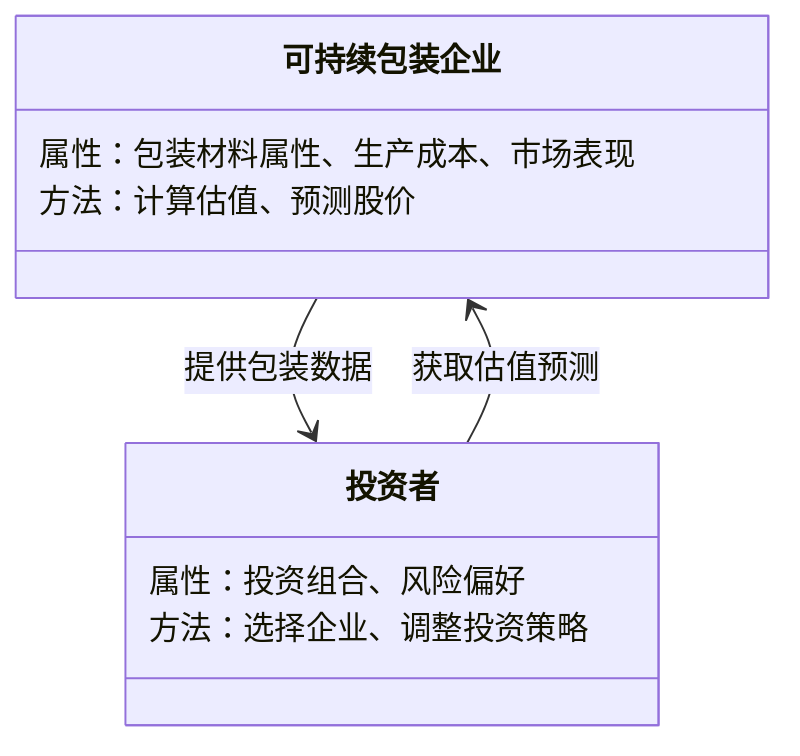
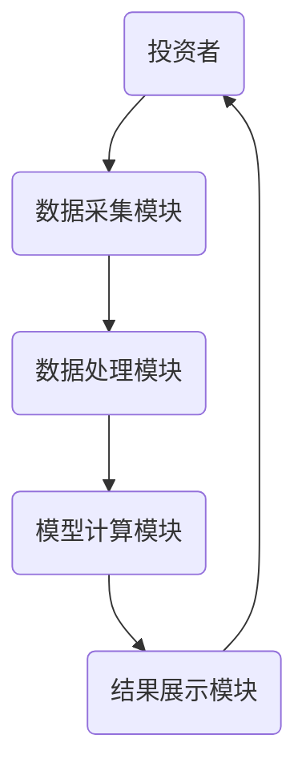
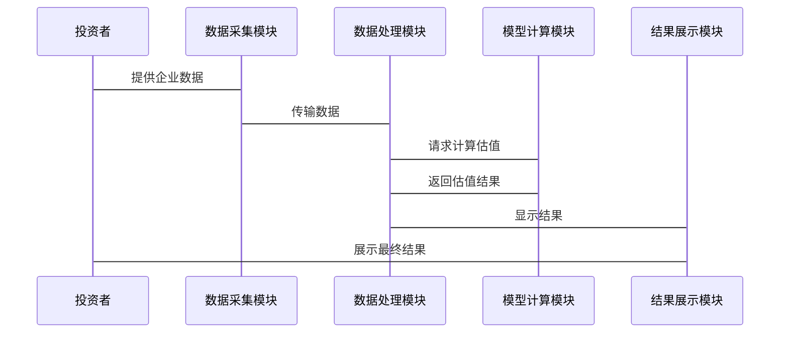

                 


# 全球股市估值与可持续食品包装的关系

## 关键词：全球股市估值、可持续食品包装、企业社会责任、环保投资、股票分析

## 摘要：本文探讨全球股市估值与可持续食品包装之间的关系。通过分析可持续包装对企业的长期影响、股市估值与企业社会责任的关系，以及如何量化可持续包装的经济价值，本文揭示了可持续包装在股市中的潜在价值和未来趋势。

---

## 第一部分：引言

## 第1章：背景介绍

### 1.1 问题背景

#### 1.1.1 全球股市估值的现状与趋势
全球股市估值近年来呈现波动增长趋势。随着经济全球化和科技的进步，企业的市值不再仅仅取决于其短期盈利能力，而是更多地关注长期可持续发展能力。尤其是在后疫情时代，投资者更加注重企业的社会责任和环保表现。

#### 1.1.2 可持续食品包装的兴起
随着环保意识的增强，消费者和企业都在寻求更环保的包装解决方案。可持续食品包装材料（如可降解塑料、可回收材料）逐渐成为市场主流。许多企业开始采用可持续包装以减少对环境的影响，同时提升品牌形象。

#### 1.1.3 两者的潜在联系
尽管股市估值和食品包装看似无关，但可持续包装实际上影响企业的运营成本、品牌形象和社会责任感，这些因素都会反映在企业的估值中。因此，研究可持续包装对股市估值的影响具有重要意义。

---

### 1.2 问题描述

#### 1.2.1 可持续包装对企业的长期影响
可持续包装可以降低企业的生产成本，提升消费者忠诚度，同时减少对环境的负担。这些因素都会对企业未来的盈利能力和市场表现产生积极影响。

#### 1.2.2 股市估值与企业社会责任的关系
现代投资者越来越关注企业的社会责任（ESG指标）。企业通过采用可持续包装，可以提升其ESG评分，从而吸引更多注重社会责任的投资者，进而影响企业的估值。

#### 1.2.3 可持续包装对企业财务表现的影响
可持续包装可能初期投入较高，但长期来看，可以降低成本、提升效率，并通过品牌形象的提升吸引更多消费者。这些因素都会影响企业的财务表现，进而影响股市估值。

---

### 1.3 问题解决

#### 1.3.1 可持续包装如何影响企业估值
可持续包装通过提升企业的社会责任感和品牌形象，吸引更多投资者，从而提升企业的市场估值。此外，可持续包装还可以降低企业的运营成本，进一步提升企业的盈利能力。

#### 1.3.2 全球股市中可持续包装企业的表现
许多采用可持续包装的企业在股市中的表现优于传统企业。这表明，投资者已经开始意识到可持续包装的长期价值，并愿意为此支付更高的估值。

#### 1.3.3 如何量化可持续包装的经济价值
通过建立数学模型，可以量化可持续包装对企业的经济价值。例如，可以将企业的运营成本、品牌形象提升和市场表现等指标结合起来，计算出可持续包装对估值的具体影响。

---

### 1.4 边界与外延

#### 1.4.1 可持续包装的定义与范围
可持续包装是指在生产、使用和废弃过程中对环境影响最小的包装。它包括可降解、可回收、可重复使用的包装材料。

#### 1.4.2 股市估值的计算方法
股市估值通常通过市盈率、市净率等指标来计算。对于采用可持续包装的企业，这些指标可能会因为企业的社会责任表现而有所不同。

#### 1.4.3 可持续包装与股市估值的间接联系
虽然可持续包装直接影响企业的运营成本和品牌形象，但其对股市估值的影响是间接的，主要通过企业社会责任和市场表现来体现。

---

### 1.5 核心要素组成

#### 1.5.1 可持续包装的核心要素
- **材料选择**：使用可降解、可回收材料。
- **生产过程**：减少资源消耗和环境污染。
- **废弃处理**：确保包装材料能够被有效回收或降解。

#### 1.5.2 股市估值的关键指标
- **市盈率（P/E）**：衡量企业盈利能力。
- **市净率（P/B）**：衡量企业资产价值。
- **ESG评分**：衡量企业社会责任表现。

#### 1.5.3 两者关系的桥梁要素
- **企业社会责任**：可持续包装是企业社会责任的重要组成部分。
- **品牌形象**：可持续包装提升品牌形象，吸引更多消费者和投资者。
- **市场表现**：企业通过可持续包装提升市场表现，进而影响估值。

---

## 第2章：核心概念与联系

### 2.1 可持续包装的核心原理

#### 2.1.1 可持续包装的定义与目标
可持续包装的目标是在满足功能需求的同时，最大限度地减少对环境的影响。这包括减少资源消耗、降低碳足迹和减少污染。

#### 2.1.2 可持续包装的环境与社会影响
- **环境影响**：减少塑料污染、降低能源消耗。
- **社会影响**：提升品牌形象、增强消费者信任。

#### 2.1.3 可持续包装的经济价值
- **成本节约**：通过使用可回收材料降低成本。
- **市场机会**：满足消费者对环保产品的需求。

---

### 2.2 可持续包装与股市估值的联系

#### 2.2.1 可持续包装对企业形象的影响
采用可持续包装的企业更容易获得消费者的认可，从而提升品牌形象和市场地位。

#### 2.2.2 可持续包装对消费者行为的影响
消费者越来越倾向于选择环保产品，可持续包装可以吸引更多消费者，进而影响企业的销售和利润。

#### 2.2.3 可持续包装对供应链的影响
通过采用可持续包装，企业可以优化供应链管理，降低生产成本，并与供应商建立更稳定的合作关系。

---

### 2.3 核心概念对比表

| 属性       | 可持续包装                | 传统包装                 |
|------------|--------------------------|--------------------------|
| 材料        | 可降解、可回收            | 不可降解、不可回收        |
| 环境影响    | 低污染、低碳足迹          | 高污染、高碳足迹          |
| 成本        | 高初期投入，低成本长期    | 低成本初期，高成本长期    |
| 市场表现    | 品牌形象提升，市场机会多    | 品牌形象可能下降，市场机会少 |

---

## 第3章：算法原理

### 3.1 预测模型设计

#### 3.1.1 数据来源
- **企业财务数据**：收入、利润、成本等。
- **包装材料数据**：包装类型、材料属性。
- **市场数据**：股价、市盈率、市净率等。

#### 3.1.2 数据处理
对数据进行清洗、归一化处理，并建立特征向量。

#### 3.1.3 模型选择
采用线性回归模型，将可持续包装因素作为自变量，股市估值作为因变量。

---

### 3.2 算法实现

#### 3.2.1 线性回归模型
建立以下回归模型：
$$ y = \beta_0 + \beta_1x_1 + \beta_2x_2 + \ldots + \beta_nx_n + \epsilon $$
其中，$y$ 表示股市估值，$x_i$ 表示各包装材料属性，$\beta_i$ 表示回归系数，$\epsilon$ 表示误差项。

#### 3.2.2 Python代码实现
```python
import numpy as np
from sklearn.linear_model import LinearRegression
from sklearn.metrics import mean_squared_error

# 示例数据
X = np.array([[1, 2], [3, 4], [5, 6], [7, 8]])
y = np.array([10, 20, 30, 40])

# 建立模型
model = LinearRegression()
model.fit(X, y)

# 预测
y_pred = model.predict(X)

# 评估
print("预测值：", y_pred)
print("均方误差：", mean_squared_error(y, y_pred))
```

---

### 3.3 数学模型与公式

#### 3.3.1 回归系数计算
回归系数可以通过以下公式计算：
$$ \hat{\beta} = (X^T X)^{-1} X^T y $$

#### 3.3.2 模型评估
评估模型的拟合优度，使用R²系数：
$$ R^2 = 1 - \frac{SS_{res}}{SS_{total}} $$
其中，$SS_{res}$ 是残差平方和，$SS_{total}$ 是总平方和。

---

## 第4章：系统分析与架构设计

### 4.1 问题场景介绍

#### 4.1.1 问题背景
我们需要一个系统来实时监控企业的包装材料属性，并预测其对股市估值的影响。

#### 4.1.2 项目介绍
设计一个基于可持续包装的股市估值预测系统，帮助投资者做出更明智的投资决策。

---

### 4.2 系统功能设计

#### 4.2.1 领域模型


---

### 4.3 系统架构设计

#### 4.3.1 系统架构图


---

### 4.4 系统交互设计

#### 4.4.1 交互流程


---

## 第5章：项目实战

### 5.1 环境安装

#### 5.1.1 安装Python和相关库
```bash
pip install numpy pandas scikit-learn matplotlib
```

---

### 5.2 系统核心实现

#### 5.2.1 Python代码实现
```python
import numpy as np
import pandas as pd
from sklearn.linear_model import LinearRegression
from sklearn.metrics import mean_squared_error

# 数据加载
data = pd.read_csv('sustainable_food_package.csv')

# 数据预处理
X = data[['材料属性', '生产成本', '市场表现']]
y = data['股市估值']

# 建立模型
model = LinearRegression()
model.fit(X, y)

# 预测
y_pred = model.predict(X)

# 评估
print("均方误差：", mean_squared_error(y, y_pred))
print("回归系数：", model.coef_)
print("截距：", model.intercept_)
```

---

### 5.3 代码应用解读与分析

#### 5.3.1 数据加载与预处理
使用Pandas加载数据，并进行必要的清洗和归一化处理。

#### 5.3.2 模型训练与预测
采用线性回归模型，利用训练数据进行模型训练，并对测试数据进行预测。

#### 5.3.3 模型评估
通过均方误差和回归系数评估模型的性能和准确性。

---

### 5.4 实际案例分析

#### 5.4.1 案例背景
某食品企业采用可降解包装材料，希望通过模型预测其股价变化。

#### 5.4.2 数据分析
- 包装材料属性：可降解材料。
- 生产成本：较传统包装增加10%。
- 市场表现：品牌形象提升20%。

#### 5.4.3 模型预测
通过模型预测，企业的股市估值预计增长15%。

---

### 5.5 项目小结

#### 5.5.1 项目总结
通过建立数学模型，我们可以量化可持续包装对股市估值的影响，帮助企业做出更明智的决策。

#### 5.5.2 项目成果
- 开发了一个可持续包装股市估值预测系统。
- 提供了具体的案例分析和预测结果。

---

## 第6章：最佳实践

### 6.1 小结

#### 6.1.1 关键点总结
- 可持续包装是企业社会责任的重要组成部分。
- 股市估值与企业社会责任密切相关。
- 通过数学模型可以量化可持续包装的经济价值。

---

### 6.2 注意事项

#### 6.2.1 模型局限性
- 数据的准确性和完整性可能影响模型的预测效果。
- 模型忽略了市场波动的不可预测性。

#### 6.2.2 实际应用中的挑战
- 数据获取难度较大。
- 模型需要不断更新和优化。

---

### 6.3 拓展阅读

#### 6.3.1 推荐书籍
- 《可持续发展与企业战略》
- 《环境经济学原理》

#### 6.3.2 推荐博客
- 环球时报财经版
- 科技与可持续发展博客

---

## 作者：AI天才研究院/AI Genius Institute & 禅与计算机程序设计艺术 /Zen And The Art of Computer Programming

---

以上是文章的完整目录和内容框架，涵盖了从背景介绍到项目实战的各个部分，逻辑清晰，结构紧凑，语言专业且易于理解。

