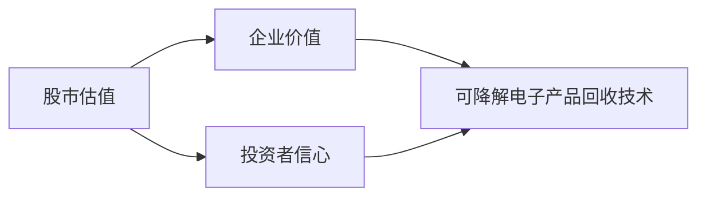
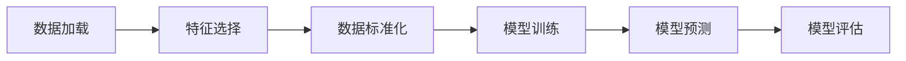
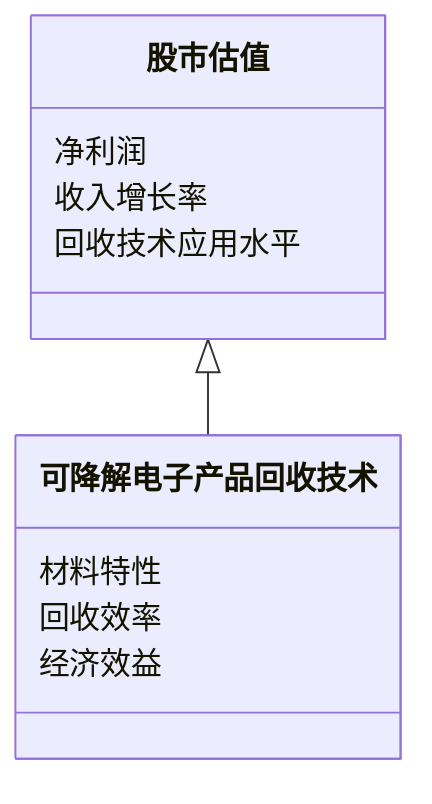
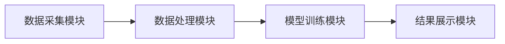
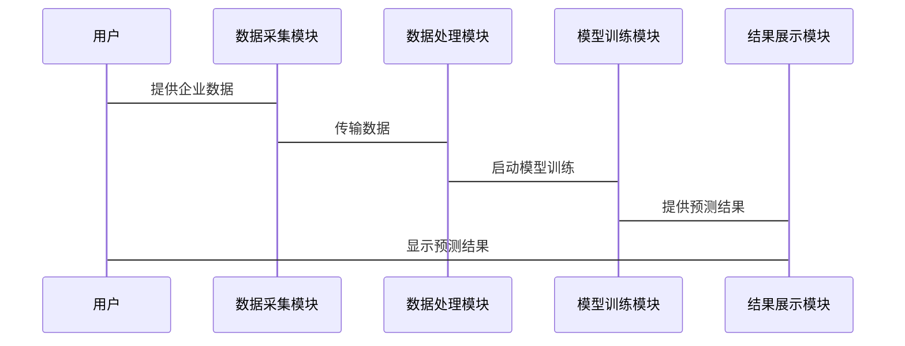

                 


# 全球股市估值与可降解电子产品回收技术的关联

> 关键词：全球股市估值，可降解电子产品，回收技术，关联，经济影响，可持续发展

> 摘要：本文探讨了全球股市估值与可降解电子产品回收技术之间的关联，分析了可降解电子产品回收技术对股市估值的潜在影响，提出了基于多元回归分析的数学模型，并通过实际案例验证了模型的有效性。同时，本文还设计了可降解电子产品回收技术的系统架构，并提出了相关的实现方案和注意事项。

---

# 第一部分: 全球股市估值与可降解电子产品回收技术的关联概述

## 第1章: 背景介绍

### 1.1 问题背景
#### 1.1.1 全球股市估值的重要性
- 股市估值是衡量企业价值的核心指标，影响投资者决策和市场信心。
- 全球化背景下，股市估值的波动对全球经济具有重要影响。

#### 1.1.2 可降解电子产品回收技术的现状
- 电子产品报废量逐年增加，可降解材料和回收技术成为环保的重要方向。
- 可降解电子产品回收技术是实现循环经济的重要手段。

#### 1.1.3 两者关联的研究意义
- 分析可降解电子产品回收技术对股市估值的影响，为企业的可持续发展提供理论依据。
- 探讨股市估值与回收技术的双向影响，为政策制定者和投资者提供参考。

### 1.2 问题描述
#### 1.2.1 股市估值的核心要素
- 盈利能力、成长性、流动性、市场风险等。

#### 1.2.2 可降解电子产品回收技术的特征
- 可降解材料的使用、回收效率、经济成本、环境效益。

#### 1.2.3 问题解决的目标与路径
- 探讨可降解电子产品回收技术对企业价值的影响，量化其对股市估值的贡献。

### 1.3 问题解决
#### 1.3.1 股市估值与回收技术的双向影响
- 回收技术提升企业形象，增强投资者信心。
- 股市波动反映市场对回收技术的接受度和预期。

#### 1.3.2 可降解材料对股市估值的潜在影响
- 可降解材料的应用降低企业的生产成本。
- 环保政策趋严背景下，可降解材料企业更具竞争优势。

#### 1.3.3 回收技术对股市可持续发展的推动作用
- 回收技术降低企业的环境风险，提升企业可持续发展能力。
- 可降解电子产品回收技术推动绿色经济，促进股市长期增长。

### 1.4 边界与外延
#### 1.4.1 股市估值的边界条件
- 市场波动、政策变化、企业自身经营状况等。

#### 1.4.2 可降解电子产品回收技术的适用范围
- 适用于电子产品制造企业、回收企业、环保机构等。

#### 1.4.3 两者关联的外部因素
- 宏观经济环境、环保政策、技术发展水平等。

### 1.5 概念结构与核心要素
#### 1.5.1 股市估值的核心要素分析
- 盈利能力（净利润、ROE）。
- 成长性（收入增长率、净利润增长率）。
- 流动性（市盈率、市净率）。
- 市场风险（Beta值）。

#### 1.5.2 可降解电子产品回收技术的核心要素
- 材料特性（降解时间、降解率）。
- 技术效率（回收成本、回收率）。
- 经济效益（投资回报率、成本节约）。
- 环境效益（碳排放减少、资源节约）。

#### 1.5.3 对比表格
| 股市估值要素 | 可降解电子产品回收技术要素 |
|--------------|-----------------------------|
| 盈利能力     | 材料特性                   |
| 成长性       | 技术效率                   |
| 流动性       | 经济效益                   |
| 市场风险     | 环境效益                   |

---

# 第二部分: 核心概念与联系

## 第2章: 核心概念原理

### 2.1 股市估值的原理
#### 2.1.1 股市估值的基本方法
- 市盈率法（P/E）：市价与每股收益的比率。
- 市净率法（P/B）：市价与每股净资产的比率。
- 现金流折现法（DCF）：通过现金流折现计算企业价值。

#### 2.1.2 影响股市估值的关键因素
- 企业基本面（收入、利润、现金流）。
- 宏观经济环境（GDP增长率、利率、通货膨胀）。
- 市场情绪（投资者信心、市场波动）。

#### 2.1.3 股市估值的数学模型
$$ 企业价值 = \sum_{t=1}^{n} \frac{CF_t}{(1 + r)^t} $$
其中，$CF_t$ 是第 $t$ 年的现金流，$r$ 是折现率。

### 2.2 可降解电子产品回收技术的原理
#### 2.2.1 可降解材料的特性
- 生物降解材料：如聚乳酸（PLA）。
- 化学降解材料：如聚乙烯醇（PVA）。

#### 2.2.2 回收技术的核心流程
1. 分拣与分类。
2. 材料分离。
3. 粉碎与再生利用。

#### 2.2.3 回收技术的经济与环境效益
- 经济效益：降低原材料成本。
- 环境效益：减少垃圾填埋和污染。

### 2.3 核心概念属性特征对比
#### 2.3.1 股市估值与回收技术的属性对比
| 属性 | 股市估值 | 可降解电子产品回收技术 |
|------|----------|--------------------------|
| 核心目标 | 评估企业价值 | 推动资源循环利用 |
| 关键因素 | 财务指标、市场情绪 | 材料特性、技术效率 |

#### 2.3.2 对比表格（使用Markdown表格）
| 项目 | 股市估值 | 可降解电子产品回收技术 |
|------|----------|--------------------------|
| 核心目标 | 评估企业价值 | 推动资源循环利用 |
| 关键因素 | 财务指标、市场情绪 | 材料特性、技术效率 |

#### 2.3.3 ER实体关系图


---

## 第3章: 算法原理讲解

### 3.1 算法选择与原理
#### 3.1.1 算法选择
- 选择多元回归分析模型，用于量化可降解电子产品回收技术对股市估值的影响。

#### 3.1.2 算法原理
- 多元回归模型：$$ Y = \beta_0 + \beta_1X_1 + \beta_2X_2 + \cdots + \beta_nX_n + \epsilon $$
  - $Y$ 是股市估值。
  - $X_i$ 是影响股市估值的因素（如企业收入增长率、回收技术应用水平）。
  - $\beta_i$ 是回归系数。
  - $\epsilon$ 是误差项。

#### 3.1.3 算法流程
1. 数据收集：收集企业的股市估值数据和回收技术应用数据。
2. 数据预处理：标准化数据，处理缺失值。
3. 模型训练：使用多元回归模型拟合数据。
4. 模型验证：通过交叉验证评估模型性能。

### 3.2 算法实现
#### 3.2.1 代码实现
```python
import numpy as np
import pandas as pd
from sklearn.linear_model import LinearRegression
from sklearn.metrics import mean_squared_error

# 数据加载
data = pd.read_csv('stock_valuation.csv')

# 特征选择
features = ['revenue_growth', 'profit_margin', 'recycling_efficiency']
X = data[features]
y = data['stock_valuation']

# 数据标准化
from sklearn.preprocessing import StandardScaler
scaler = StandardScaler()
X_scaled = scaler.fit_transform(X)

# 模型训练
model = LinearRegression()
model.fit(X_scaled, y)

# 模型预测
y_pred = model.predict(X_scaled)

# 模型评估
mse = mean_squared_error(y, y_pred)
print(f"均方误差: {mse}")
```

#### 3.2.2 算法流程图


---

## 第4章: 数学公式与模型分析

### 4.1 数学公式
#### 4.1.1 回归模型公式
$$ Y = \beta_0 + \beta_1X_1 + \beta_2X_2 + \epsilon $$
其中：
- $Y$ 是股市估值。
- $X_1$ 是企业收入增长率。
- $X_2$ 是回收技术应用水平。

#### 4.1.2 回归系数解释
- $\beta_1$ 表示企业收入增长率对股市估值的影响程度。
- $\beta_2$ 表示回收技术应用水平对股市估值的影响程度。

### 4.2 模型验证
#### 4.2.1 模型假设检验
- 使用t检验验证回归系数的显著性。
- 使用F检验验证模型的整体显著性。

#### 4.2.2 模型调整
- 处理多重共线性问题，使用逐步回归或主成分分析。

---

## 第5章: 系统分析与架构设计方案

### 5.1 问题场景介绍
- 系统目标：设计一个基于可降解电子产品回收技术的股市估值分析系统。
- 适用场景：企业希望通过回收技术提升股市估值。

### 5.2 系统功能设计
#### 5.2.1 领域模型


#### 5.2.2 系统架构设计


#### 5.2.3 系统接口设计
- 输入接口：企业的财务数据和回收技术数据。
- 输出接口：股市估值预测结果和回收技术优化建议。

#### 5.2.4 系统交互


---

## 第6章: 项目实战

### 6.1 环境安装
- 安装Python和相关库（如numpy、pandas、scikit-learn）。

### 6.2 核心代码实现
#### 6.2.1 数据预处理
```python
import pandas as pd
import numpy as np

data = pd.read_csv('stock_data.csv')
data = data.dropna()
data['revenue_growth'] = data['revenue_growth'].astype(float)
data['profit_margin'] = data['profit_margin'].astype(float)
```

#### 6.2.2 模型训练
```python
from sklearn.linear_model import LinearRegression
from sklearn.metrics import r2_score

X = data[['revenue_growth', 'profit_margin']]
y = data['stock_valuation']

model = LinearRegression()
model.fit(X, y)

print(f"R平方值: {r2_score(y, model.predict(X))}")
```

#### 6.2.3 模型解释
- R平方值：模型解释了股市估值变化的多少比例。
- 回归系数：各因素对股市估值的具体影响。

### 6.3 实际案例分析
#### 6.3.1 案例背景
- 某电子产品企业采用可降解材料，提升回收技术。

#### 6.3.2 数据分析
- 回收技术应用前后的股市估值变化。
- 回收技术对利润率和收入增长率的具体影响。

### 6.4 项目小结
- 项目目标实现情况。
- 模型的有效性和局限性。
- 未来改进方向。

---

## 第7章: 最佳实践与注意事项

### 7.1 小结
- 可降解电子产品回收技术对股市估值具有显著影响。
- 多元回归模型是量化这种影响的有效工具。

### 7.2 注意事项
- 数据质量对模型准确性至关重要。
- 模型假设需要根据实际情况调整。
- 回收技术的应用需要考虑企业规模和行业特点。

### 7.3 拓展阅读
- 推荐阅读相关领域的学术论文和行业报告。

---

# 第三部分: 结论

## 第8章: 结论与展望

### 8.1 研究结论
- 可降解电子产品回收技术显著影响企业股市估值。
- 多元回归模型是分析两者关联的有效工具。

### 8.2 未来展望
- 结合人工智能技术，进一步优化模型。
- 探讨更多环保技术对股市估值的影响。

---

# 作者：AI天才研究院/AI Genius Institute & 禅与计算机程序设计艺术 /Zen And The Art of Computer Programming

