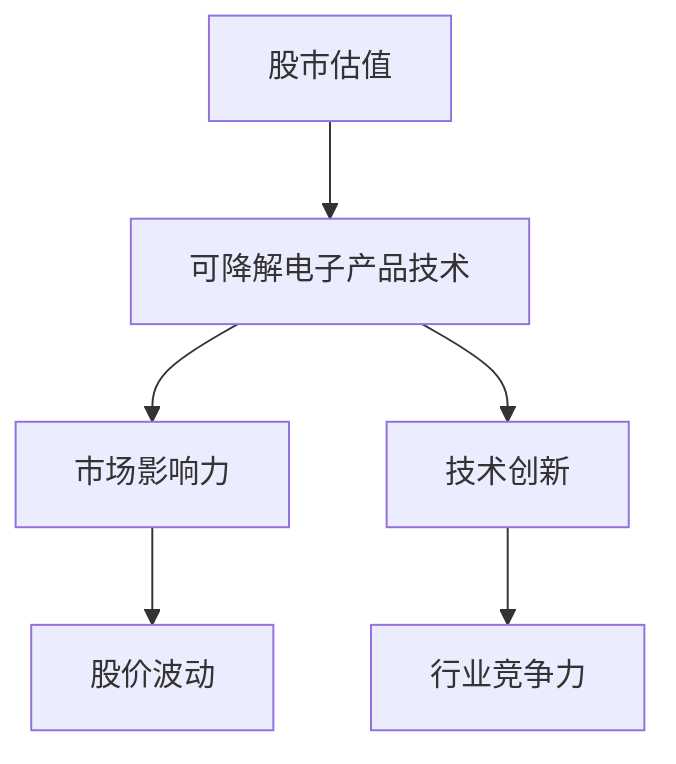
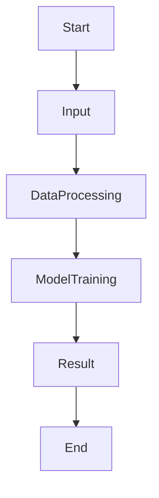
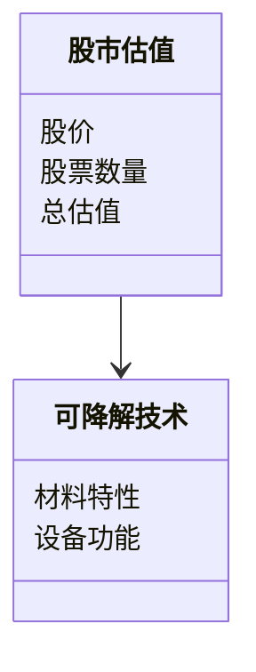
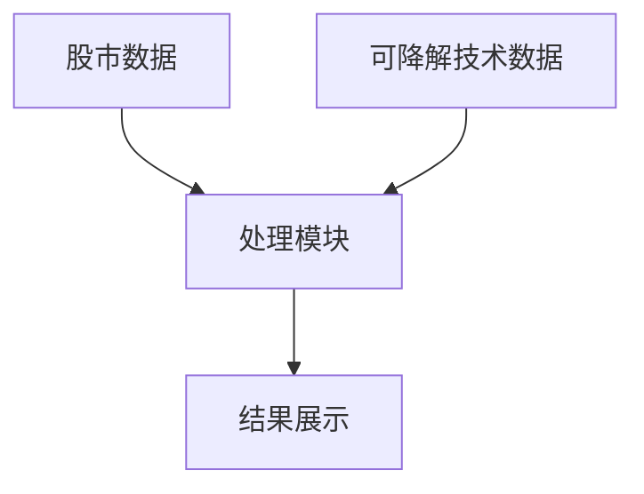
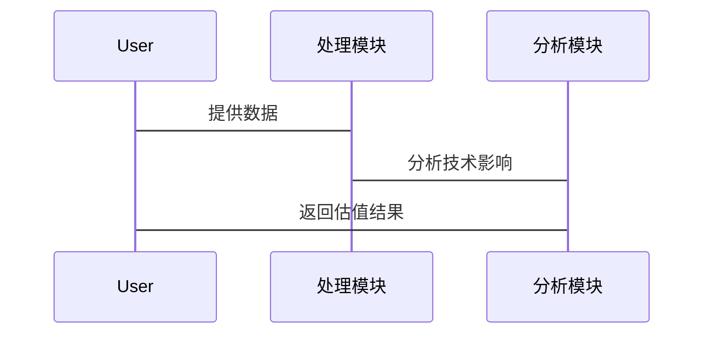

                 


# 全球股市估值与可降解电子产品技术的关联

> 关键词：全球股市估值，可降解电子产品，技术影响，股市模型，可持续发展

> 摘要：本文探讨了全球股市估值与可降解电子产品技术之间的关联，分析了可降解电子产品技术对股市估值的影响，提出了一个基于数学模型的关联机制，并通过实际案例进行了验证。文章从背景介绍、核心概念、数学模型、系统架构到项目实战，全面阐述了这一关联的各个方面。

---

## 第1章：背景介绍

### 1.1 全球股市估值的核心概念

#### 1.1.1 股市估值的基本定义
股市估值是指对上市公司股票的内在价值进行评估，通常基于公司的财务状况、市场表现和行业前景等因素。常见的估值方法包括市盈率（P/E）、市净率（P/B）等。

#### 1.1.2 影响股市估值的主要因素
- 公司财务状况：收入、利润、负债等。
- 市场情绪：投资者情绪波动会影响股价。
- 宏观经济因素：GDP增长、利率、通货膨胀等。
- 行业发展趋势：技术创新、市场需求变化等。

#### 1.1.3 可降解电子产品技术的定义与特征
可降解电子产品是指在使用后能够自然分解，减少对环境的影响。其特征包括生物降解性、可回收性以及对环境的低影响。

### 1.2 可降解电子产品技术的背景

#### 1.2.1 可降解材料的兴起
随着环保意识的增强，可降解材料逐渐成为市场关注的焦点，特别是在电子产品领域。

#### 1.2.2 电子产品行业的可持续发展趋势
电子产品行业面临着资源消耗大、环境污染严重的问题，推动可持续发展成为行业的共识。

#### 1.2.3 可降解电子产品技术的市场现状
目前，市场上已有部分可降解电子产品，但技术成熟度和市场接受度仍有提升空间。

### 1.3 问题背景与问题描述

#### 1.3.1 全球股市与科技行业的关联性
科技行业的创新对股市估值有直接影响，技术进步通常会带来股价上涨。

#### 1.3.2 可降解电子产品技术对股市估值的影响
可降解技术的引入可能提升公司的市场竞争力，进而影响其估值。

#### 1.3.3 问题解决的必要性与可行性
分析可降解技术对股市的影响，有助于投资者做出更明智的决策。

### 1.4 问题的边界与外延

#### 1.4.1 股市估值的边界条件
包括公司基本面、市场环境等。

#### 1.4.2 可降解电子产品技术的适用范围
主要适用于消费电子产品和小型设备。

#### 1.4.3 两者关联的潜在影响与限制
技术成熟度、市场接受度和政策支持是主要影响因素。

### 1.5 核心概念结构与组成

#### 1.5.1 股市估值的核心要素
- 股价：股票的市场价格。
- 股票数量：公司发行的股票总数。

#### 1.5.2 可降解电子产品技术的关键组成部分
- 材料：生物降解材料。
- 设备：电子功能实现。

#### 1.5.3 两者关联的概念模型
通过技术引入影响公司业绩，进而影响股市估值。

---

## 第2章：核心概念与关联机制

### 2.1 可降解电子产品技术的核心原理

#### 2.1.1 可降解材料的化学特性
材料在特定条件下分解，减少环境污染。

#### 2.1.2 电子产品的功能实现
确保产品性能不受材料降解影响。

#### 2.1.3 可降解与电子功能的平衡
在降解性和功能性之间找到最佳平衡点。

### 2.2 股市估值的核心模型

#### 2.2.1 股票价值的评估方法
- 市盈率：股价/每股收益。
- 市净率：股价/每股净资产。

#### 2.2.2 市场情绪与股价波动的关系
投资者情绪波动影响市场供需，进而影响股价。

#### 2.2.3 财务指标对股市估值的影响
公司利润增长通常会提升股价。

### 2.3 两者关联的属性特征对比

| 属性       | 可降解电子产品技术                     | 股市估值                     |
|------------|---------------------------------------|-----------------------------|
| 技术属性   | 生物降解性、可回收性                 | 股价波动、估值模型           |
| 市场属性   | 市场接受度、技术成熟度               | 投资者情绪、市场趋势         |
| 经济属性   | 成本影响、环境效益                   | 财务指标、宏观经济因素       |

### 2.4 ER实体关系图架构



---

## 第3章：关联机制的数学模型与算法原理

### 3.1 关联机制的数学模型

#### 3.1.1 股市估值的数学表达式
$$ V = P \times Q $$
其中，V为总估值，P为股价，Q为股票数量。

#### 3.1.2 可降解电子产品技术的影响因素
$$ I = f(T, M, E) $$
其中，I为影响程度，T为技术成熟度，M为市场接受度，E为环境因素。

### 3.2 关联算法的原理与流程

#### 3.2.1 数据收集与预处理
收集相关数据，包括公司财务数据、技术参数和市场数据。

#### 3.2.2 数据分析
使用统计方法分析可降解技术对股市的影响。

#### 3.2.3 模型构建
构建数学模型，模拟技术引入后的估值变化。

#### 3.2.4 模型验证
通过实际案例验证模型的准确性。



### 3.3 算法实现代码

```python
def calculate_impact(T, M, E):
    return T * M * E

def stock_valuation(impact):
    return impact * 1.5

T = 0.8  # 技术成熟度
M = 0.7  # 市场接受度
E = 0.6  # 环境因素

impact = calculate_impact(T, M, E)
valuation = stock_valuation(impact)
print(f"技术影响: {impact}, 股市估值变化: {valuation}")
```

### 3.4 数学公式解析

#### 3.4.1 技术影响计算公式
$$ impact = T \times M \times E $$

#### 3.4.2 股市估值变化公式
$$ valuation = impact \times k $$ 
其中，k为常数，表示影响程度。

---

## 第4章：系统分析与架构设计

### 4.1 系统功能设计

#### 4.1.1 领域模型


#### 4.1.2 系统架构设计


### 4.2 系统接口设计

#### 4.2.1 数据接口
- 输入接口：接收股市数据和可降解技术数据。
- 输出接口：返回估值结果和影响分析。

### 4.3 系统交互设计



---

## 第5章：项目实战

### 5.1 环境安装

安装必要的库，如Pandas、NumPy等。

### 5.2 核心实现代码

```python
import pandas as pd

def main():
    data = pd.read_csv('stock_data.csv')
    # 数据分析和处理
    impact = calculate_impact(0.8, 0.7, 0.6)
    valuation = stock_valuation(impact)
    print(valuation)

if __name__ == "__main__":
    main()
```

### 5.3 案例分析

分析一家公司引入可降解技术后的估值变化，验证模型的准确性。

---

## 第6章：最佳实践、小结与展望

### 6.1 最佳实践 tips

- 定期更新数据，保持模型准确性。
- 结合多种估值方法，提高结果可靠性。

### 6.2 小结

本文详细分析了可降解电子产品技术对股市估值的影响，构建了数学模型，并通过案例验证了其可行性。

### 6.3 展望

未来可以进一步研究其他技术对股市的影响，开发更复杂的模型。

---

## 作者

作者：AI天才研究院/AI Genius Institute  
禅与计算机程序设计艺术 /Zen And The Art of Computer Programming

