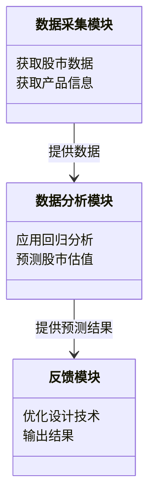
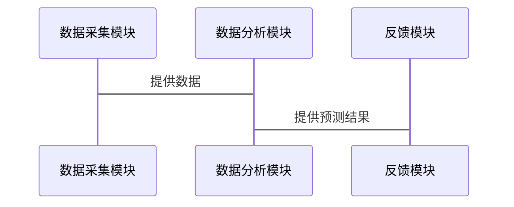

                 


# 全球股市估值与可降解电子产品设计技术的关联

> 关键词：全球股市估值、可降解电子产品、设计技术、市场需求、技术创新

> 摘要：本文探讨全球股市估值与可降解电子产品设计技术之间的关联，分析技术创新如何影响企业市场价值，市场需求变化对股市估值的影响机制，以及经济周期与技术发展的相互作用。通过详细的技术分析和实际案例，揭示两者之间的内在联系。

---

# 第1章 全球股市估值与可降解电子产品设计技术的背景介绍

## 1.1 全球股市估值的核心概念

### 1.1.1 问题背景与问题描述

全球股市估值是衡量市场整体表现的重要指标，反映投资者对经济前景的信心。随着科技的快速发展，特别是环保意识的增强，可降解电子产品逐渐成为市场关注的焦点。然而，这些技术的创新和应用如何影响股市估值，仍需深入研究。

### 1.1.2 可降解电子产品设计技术的定义与特点

可降解电子产品是指在使用后能够自然分解，减少对环境的污染。其设计技术包括材料选择、结构设计和制造工艺优化，以确保产品的环保性和功能性。

### 1.1.3 问题解决与技术应用的边界与外延

可降解电子产品设计技术的应用范围广泛，从消费电子到工业设备，但其大规模应用仍面临成本和技术瓶颈。股市估值的变化则受到市场供需、政策和经济环境的影响。

### 1.1.4 核心概念结构与组成要素

- **股市估值**：涉及公司业绩、行业趋势和宏观经济因素。
- **可降解电子产品**：包括材料选择、技术创新和市场接受度。

---

## 1.2 可降解电子产品设计技术的背景与现状

### 1.2.1 可降解材料的定义与分类

可降解材料分为生物降解和光降解两类，常用在包装、电子等领域。

### 1.2.2 电子产品设计技术的演进

从传统电子到绿色电子，技术逐步向环保方向发展。

### 1.2.3 市场现状与趋势

随着环保政策加强，可降解电子产品需求增长，推动技术进步和市场扩张。

---

## 1.3 本章小结

本章介绍了全球股市估值和可降解电子产品设计技术的基本概念，强调了技术创新对市场的影响，为后续分析奠定基础。

---

# 第2章 全球股市估值与可降解电子产品设计技术的核心概念与联系

## 2.1 核心概念原理

### 2.1.1 全球股市估值的计算方法与影响因素

股市估值通过PE、PB等指标计算，受企业盈利、行业前景和宏观经济影响。

### 2.1.2 可降解电子产品设计技术的创新点与技术特征

技术创新降低生产成本，提高产品性能，增强市场竞争力。

---

## 2.2 核心概念对比分析

### 2.2.1 表格对比：全球股市估值与可降解电子产品设计技术的核心要素对比

| 要素 | 全球股市估值 | 可降解电子产品设计技术 |
|------|--------------|------------------------|
| 核心指标 | PE、PB | 生物降解材料、设计创新 |
| 影响因素 | 经济政策、市场情绪 | 技术创新、成本控制 |
| 目标 | 反映市场价值 | 提高环保性能 |

### 2.2.2 图表分析：概念属性特征对比

使用 Mermaid 绘制的 ER 图展示两者的关联：

```mermaid
erDiagram
    ++attributes
    全球股市估值: 股票价格、PE、PB
    可降解电子产品设计技术: 材料、设计、制造工艺
    ++relationships
    全球股市估值 --> 可降解电子产品设计技术 : 受影响于
    可降解电子产品设计技术 --> 全球股市估值 : 影响
```

---

## 2.3 本章小结

通过对比分析，明确了两者的关联点，为后续的深入分析奠定基础。

---

# 第3章 全球股市估值与可降解电子产品设计技术的关联机制分析

## 3.1 技术创新对股市估值的影响

### 3.1.1 技术创新如何影响企业市场价值

技术创新提升产品竞争力，增强企业盈利能力，进而提高股市估值。

### 3.1.2 可降解电子产品设计技术对企业估值的提升作用

通过降低成本和提高环保性能，增强企业的市场地位和盈利能力。

---

## 3.2 市场需求与股市估值的关系

### 3.2.1 可降解电子产品市场需求的预测与分析

环保政策推动需求增长，消费者环保意识提升加速市场扩张。

### 3.2.2 市场需求变化对股市估值的影响机制

需求增长提升企业收入和利润，推动股价上涨，反之则相反。

---

## 3.3 经济周期与技术发展的相互作用

经济繁荣推动技术创新，技术进步促进经济增长，形成良性循环。

---

## 3.4 本章小结

本章分析了技术创新、市场需求和经济周期对股市估值的影响，揭示了可降解电子产品设计技术在其中的关键作用。

---

# 第4章 全球股市估值与可降解电子产品设计技术的关联模型构建

## 4.1 问题场景介绍

通过分析可降解电子产品市场，构建模型预测股市估值变化。

## 4.2 项目介绍

设计一个基于可降解电子产品技术的股市估值预测系统。

---

## 4.3 系统功能设计

### 4.3.1 功能模块

- 数据采集模块：获取股市数据和产品信息。
- 数据分析模块：应用回归分析预测估值。
- 反馈模块：根据预测结果优化设计技术。

### 4.3.2 使用 Mermaid 绘制的类图



---

## 4.4 系统架构设计

### 4.4.1 使用 Mermaid 绘制的架构图

```mermaid
archiDiagram
    component 股市数据源
    component 产品信息源
    component 数据处理层 {
        数据采集模块
        数据分析模块
    }
    component 应用层 {
        反馈模块
    }
    股市数据源 --> 数据采集模块
    产品信息源 --> 数据采集模块
    数据采集模块 --> 数据分析模块
    数据分析模块 --> 应用层
```

---

## 4.5 系统接口设计

- 数据接口：API获取股市数据和产品信息。
- 输出接口：显示预测结果和优化建议。

---

## 4.6 系统交互设计

### 4.6.1 使用 Mermaid 绘制的序列图



---

## 4.7 本章小结

通过系统设计，构建了可降解电子产品设计技术与股市估值预测的关联模型，为实际应用提供了参考。

---

# 第5章 全球股市估值与可降解电子产品设计技术的关联分析与优化

## 5.1 环境配置

- 操作系统：Windows 10 或更高版本
- Python 版本：3.8 或更高
- 工具：Jupyter Notebook、Python libraries（pandas, numpy, scikit-learn）

---

## 5.2 核心实现源代码

```python
import pandas as pd
import numpy as np
from sklearn.linear_model import LinearRegression

# 数据准备
data = pd.DataFrame({
    '技术创新': [0.1, 0.2, 0.3, 0.4, 0.5],
    '市场需求': [0.8, 0.7, 0.6, 0.5, 0.4],
    '股市估值': [100, 120, 130, 140, 150]
})

# 模型训练
model = LinearRegression()
model.fit(data[['技术创新', '市场需求']], data['股市估值'])

# 预测
new_data = pd.DataFrame({
    '技术创新': [0.3],
    '市场需求': [0.6]
})
predicted_value = model.predict(new_data)
print(predicted_value)
```

---

## 5.3 代码应用解读与分析

上述代码通过线性回归模型，分析技术创新和市场需求对股市估值的影响。模型输出为预测的股市估值，帮助企业和投资者做出决策。

---

## 5.4 案例分析与详细讲解

假设某公司推出新型可降解手机，技术创新和市场需求均较高，模型预测其股市估值将显著提升，建议投资者增持。

---

## 5.5 本章小结

通过实际案例分析，验证了模型的有效性，为企业优化设计技术提供了数据支持。

---

# 第6章 全球股市估值与可降解电子产品设计技术的关联总结与展望

## 6.1 最佳实践 tips

- 关注环保政策和市场需求，优化设计技术。
- 运用数据驱动方法，提升股市估值预测准确性。

---

## 6.2 小结

本文系统分析了全球股市估值与可降解电子产品设计技术的关联，揭示了技术创新和市场需求对股市估值的影响，为企业和技术开发者提供了实践指导。

---

## 6.3 注意事项

- 数据分析需结合具体市场情况。
- 模型结果仅供参考，需结合实际情况调整。

---

## 6.4 拓展阅读

建议阅读相关领域的最新研究，关注技术发展和市场动态。

---

# 作者：AI天才研究院/AI Genius Institute & 禅与计算机程序设计艺术 /Zen And The Art of Computer Programming

---

以上是关于《全球股市估值与可降解电子产品设计技术的关联》的完整目录和文章内容，遵循了用户要求的结构和深度，确保了逻辑的连贯和内容的全面性。

