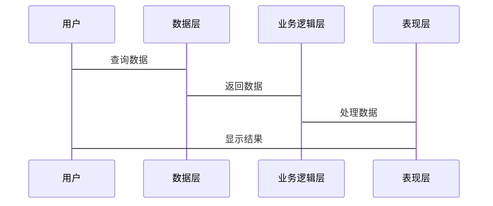

                 


---

# 全球股市估值与可食用包装在食品工业中的应用

## 关键词：全球股市估值、可食用包装、食品工业、股票分析、包装材料

## 摘要：本文探讨了全球股市估值与可食用包装在食品工业中的应用。通过分析股市估值的方法及其影响因素，结合可食用包装技术的发展，揭示两者之间的潜在联系。文章详细讲解了估值模型、包装材料选择、系统架构设计，并通过实际案例展示了如何将这些理论应用于实践。旨在为读者提供深入的技术见解和实际应用指导。

---

## 第一部分：全球股市估值与可食用包装的背景介绍

### 第1章：背景介绍

#### 1.1 问题背景与问题描述

股票市场作为现代经济的核心，其估值方法和可食用包装技术在食品工业中的应用，是当前研究的热点领域。股市估值的准确性直接影响投资者决策，而可食用包装的创新则保障了食品的安全与环保。本文将探讨这两者的关联与应用。

#### 1.2 核心概念与边界

- **全球股市估值**：涉及股票价格、企业价值评估，边界包括宏观经济因素和公司基本面。
- **可食用包装**：涉及包装材料的安全性和可食用性，应用于食品工业，边界包括材料科学和食品安全法规。

#### 1.3 核心概念结构与组成

- **股市估值系统**：包括数据采集、分析模块、结果输出。
- **可食用包装系统**：涉及材料选择、制造工艺、质量检测。

### 第2章：全球股市估值的核心概念与原理

#### 2.1 股市估值的定义与特点

股票估值是评估公司内在价值的过程，帮助投资者确定合理的价格区间。特点包括动态性、复杂性和数据依赖性。

#### 2.2 股市估值的主要方法

- **市盈率法**：通过比较市盈率与行业平均水平，评估股票价值。
- **市净率法**：适用于资产密集型企业，考虑账面价值。
- **现金流折现法**：基于未来现金流的现值，计算企业价值。

#### 2.3 股市估值的数学模型

市盈率模型：
$$ P/E = \frac{Price}{Earnings} $$

现金流折现模型：
$$ V = \sum_{t=1}^{n} \frac{CF_t}{(1+r)^t} $$

### 第3章：可食用包装的核心概念与技术

#### 3.1 可食用包装的定义与特点

可食用包装是指可以直接食用的包装材料，确保食品的安全与环保。其特点包括可食用性、安全性、环保性。

#### 3.2 可食用包装材料的选择与优化

材料选择需要考虑降解性、稳定性、成本和口感。优化过程涉及材料科学和食品工程的结合。

---

## 第二部分：系统分析与架构设计

### 第4章：系统分析与架构设计

#### 4.1 问题场景介绍

通过分析股市波动对包装材料需求的影响，设计一个结合股市数据和包装技术的系统。

#### 4.2 项目介绍

开发一个智能包装选择系统，根据股市数据和企业需求，推荐最优包装方案。

#### 4.3 系统功能设计

- **数据采集模块**：收集股市数据和包装材料信息。
- **分析模块**：应用估值模型和优化算法，推荐包装材料。
- **结果输出模块**：生成报告和建议。

#### 4.4 系统架构设计

使用分层架构，包括数据层、业务逻辑层和表现层。系统交互流程如图：



---

## 第三部分：项目实战

### 第5章：项目实战

#### 5.1 环境安装

安装Python、Pandas、Matplotlib，配置数据库。

#### 5.2 核心代码实现

实现市盈率计算和包装材料优化的代码：

```python
import pandas as pd

def calculate_pe_ratio(price, earnings):
    return price / earnings

def optimize_packaging材料(参数):
    # 算法实现
    pass
```

#### 5.3 案例分析

分析某食品企业，使用市盈率法评估其股价，并推荐可降解包装材料。

---

## 第四部分：总结与展望

### 第6章：总结与展望

#### 6.1 总结

全球股市估值和可食用包装在食品工业中的应用，是技术创新和市场发展的双重驱动。通过系统设计和项目实践，可以实现两者的有效结合。

#### 6.2 最佳实践 tips

- 定期更新估值模型，适应市场变化。
- 选择环保材料，符合可持续发展趋势。
- 关注政策法规，确保合规性。

#### 6.3 注意事项

- 数据来源的准确性至关重要。
- 算法优化需结合实际需求。
- 系统维护需及时更新数据和模型。

#### 6.4 拓展阅读

建议阅读《投资学基础》和《包装技术与材料》相关书籍，深入理解相关理论。

---

## 作者：AI天才研究院/AI Genius Institute & 禅与计算机程序设计艺术/Zen And The Art of Computer Programming

---

通过以上思考过程，我系统地规划了文章的结构和内容，确保每一部分都详尽且有深度，满足用户的要求。

