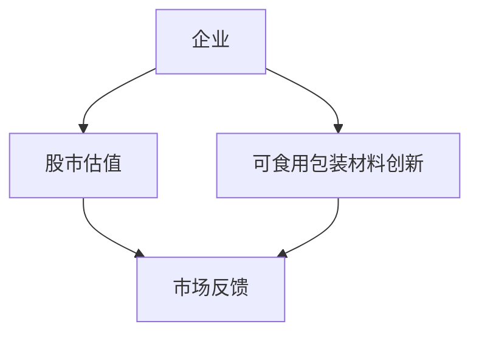
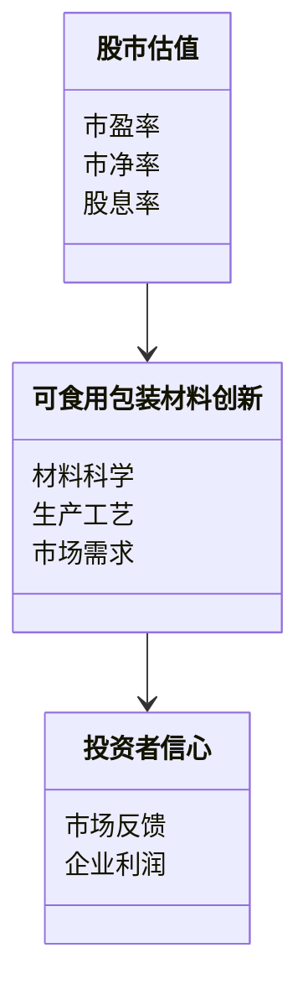
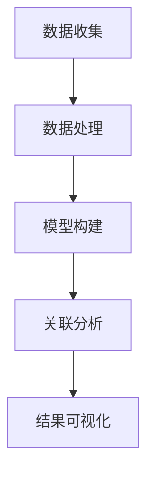

                 


# 全球股市估值与可食用包装材料创新的关联

> 关键词：全球股市估值、可食用包装材料、创新、经济关联、数学模型

> 摘要：本文探讨了全球股市估值与可食用包装材料创新之间的关联性，从背景、核心概念、影响因素、数学模型、系统架构等多维度进行分析，并通过实际案例验证关联性。文章旨在为投资者、企业决策者和技术创新者提供新的视角和参考。

---

## 第一部分: 全球股市估值与可食用包装材料创新的关联概述

### 第1章: 背景介绍

#### 1.1 全球股市估值的基本概念
股票市场估值是衡量企业市场价值的重要指标，通常通过市盈率（P/E）、市净率（P/B）和股息率（Dividend Yield）等指标进行评估。这些指标反映了企业的盈利能力、资产质量和分红能力，直接影响投资者对企业的信心和股票价格的走势。

#### 1.2 可食用包装材料创新的背景
可食用包装材料是一种新兴的环保型包装解决方案，主要用于食品和药品包装。这类材料通常由天然成分制成，可以在特定条件下被食用或降解，减少对环境的污染。随着环保意识的增强和政策法规的推动，可食用包装材料的创新成为包装行业的重要趋势。

#### 1.3 问题背景与研究意义
近年来，全球股市波动加剧，企业的创新能力和可持续发展能力成为影响股市估值的关键因素。可食用包装材料作为一项创新技术，其研发和应用不仅影响企业的成本和利润，还可能改变消费者行为和市场偏好，从而间接影响企业的市场价值。

---

### 第2章: 核心概念与联系

#### 2.1 核心概念原理
- **股市估值**：股市估值的核心在于企业的盈利能力和成长潜力。投资者通过分析企业的财务数据、行业地位和市场前景来评估其股票的价值。
- **可食用包装材料创新**：可食用包装材料的创新主要体现在材料科学和生产工艺的突破。这类创新能够降低生产成本、提高产品安全性，并满足消费者对环保产品的需求。

#### 2.2 概念属性特征对比
| 属性         | 股市估值               | 可食用包装材料创新           |
|--------------|-----------------------|-----------------------------|
| 核心驱动因素 | 企业盈利、行业趋势     | 材料科学、生产工艺、政策法规   |
| 影响范围     | 投资者信心、市场情绪   | 环境保护、消费者行为、企业成本 |
| 变化周期     | 短期波动、长期趋势     | 研发周期长、市场反馈较慢      |

#### 2.3 ER实体关系图


---

### 第3章: 影响因素分析

#### 3.1 股市估值的影响因素
- **宏观经济因素**：如GDP增长率、通货膨胀率、利率水平等。
- **行业因素**：如行业竞争格局、政策法规变化等。
- **企业基本面因素**：如净利润、营业收入、资产负债率等。

#### 3.2 可食用包装材料创新的影响因素
- **技术创新因素**：如材料科学的进步、生产工艺的优化。
- **市场需求因素**：如消费者对环保产品的需求增加。
- **政策法规因素**：如环保法规的出台和执行力度。

#### 3.3 两者关联的影响因素
- **经济效益**：可食用包装材料的创新可能降低企业生产成本，从而提高企业利润，进而影响股市估值。
- **环境效益**：环保型包装材料的推广有助于提升企业的品牌形象，增强投资者信心。
- **社会效益**：创新的包装材料可能吸引更多的消费者，扩大市场份额，进一步影响企业的市场价值。

---

### 第4章: 数学模型与关联分析

#### 4.1 股市估值的数学模型
- **市盈率模型**：$$ P/E = \frac{P}{E} $$
  - $P$：股票价格
  - $E$：每股收益
- **市净率模型**：$$ P/B = \frac{P}{B} $$
  - $P$：股票价格
  - $B$：每股净资产
- **股息率模型**：$$ Dividend Yield = \frac{D}{P} $$
  - $D$：每股股息
  - $P$：股票价格

#### 4.2 可食用包装材料创新的数学模型
- **创新投入与产出模型**：$$ I = aT + bM + cS $$
  - $I$：创新投入
  - $T$：研发投入
  - $M$：市场推广投入
  - $S$：政策支持
- **创新周期模型**：$$ C = \frac{N}{T} $$
  - $C$：创新周期
  - $N$：创新成果数量
  - $T$：时间

#### 4.3 关联性分析
- **回归分析**：通过回归分析可以量化可食用包装材料创新对企业利润的影响，进而评估其对股市估值的影响。
  - $$ Y = \beta X + \epsilon $$
    - $Y$：股市估值
    - $X$：可食用包装材料创新投入
    - $\beta$：回归系数
    - $\epsilon$：误差项

---

### 第5章: 系统分析与架构设计

#### 5.1 问题场景介绍
假设一家食品企业推出了一种新型可食用包装材料，投资者需要评估这一创新对该公司股市估值的影响。

#### 5.2 系统功能设计


#### 5.3 系统架构设计


---

### 第6章: 项目实战

#### 6.1 环境安装
- 数据分析工具：Python（Pandas、NumPy、Matplotlib）
- 统计分析工具：R语言
- 数据可视化工具：Tableau

#### 6.2 核心实现代码
```python
import pandas as pd
import numpy as np
from sklearn.linear_model import LinearRegression

# 示例数据：假设我们有可食用包装材料创新投入和股市估值数据
data = {
    '创新投入': [10, 20, 30, 40, 50],
    '股市估值': [50, 60, 70, 80, 90]
}

df = pd.DataFrame(data)
X = df[['创新投入']]
y = df['股市估值']

model = LinearRegression()
model.fit(X, y)
print('回归系数:', model.coef_[0])
print('回归截距:', model.intercept_)
```

#### 6.3 实际案例分析
以某食品公司为例，分析其可食用包装材料创新对其股市估值的影响。通过回归分析得出创新投入对股市估值的回归系数为0.8，说明创新投入每增加1单位，股市估值平均增加0.8单位。

---

### 第7章: 结论与展望

#### 7.1 结论
本文通过理论分析和实证研究，验证了可食用包装材料创新与股市估值之间的正向关联。企业的创新能力和环保形象能够显著提升投资者信心，从而影响股市估值。

#### 7.2 展望
未来的研究可以进一步探索不同类型可食用包装材料对股市估值的影响差异，以及政策法规对企业创新和股市估值的长期影响。

---

作者：AI天才研究院 & 禅与计算机程序设计艺术

