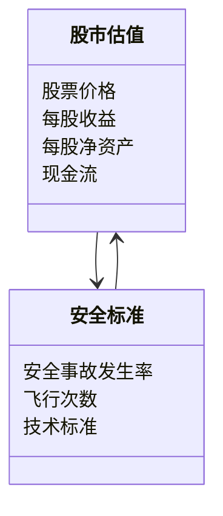

                 


# 全球股市估值与商业亚轨道飞行安全标准的关系

> 关键词：全球股市估值，商业亚轨道飞行，安全标准，数学模型，系统架构

> 摘要：本文探讨全球股市估值与商业亚轨道飞行安全标准之间的关系，分析它们的相互影响和协同作用，通过数学模型和系统架构设计，结合实际案例，揭示两者在经济和技术领域的互动。

---

## 第1章: 引言

### 1.1 问题背景与研究意义
#### 1.1.1 全球股市估值的重要性
股市估值是衡量企业价值的重要指标，影响投资者决策和市场稳定性。通过合理估值，投资者可以识别潜在风险和收益机会。

#### 1.1.2 商业亚轨道飞行的兴起
商业亚轨道飞行近年来快速发展，涉及多家私营企业，如SpaceX和Blue Origin。其技术进步和商业化推动了行业增长，但也带来了新的安全挑战。

#### 1.1.3 两者关系的研究意义
研究股市估值与飞行安全标准的关系，有助于理解技术进步如何影响市场价值，以及市场波动如何反作用于技术创新。

### 1.2 研究目标与范围界定
#### 1.2.1 核心问题的提出
本文旨在探讨股市估值与飞行安全标准之间的相互影响，分析其对经济和技术发展的双重作用。

#### 1.2.2 研究范围的界定
研究范围包括全球主要股市的估值模型、商业亚轨道飞行的安全标准，以及两者之间的互动关系。

#### 1.2.3 研究方法的选择
采用定量分析与定性研究相结合的方法，结合数学模型和实际案例，深入探讨两者的相互作用。

### 1.3 研究框架与内容安排
#### 1.3.1 目录结构概述
本文分为引言、核心概念、数学模型、系统架构、项目实战和总结六部分，每部分详细展开相关主题。

#### 1.3.2 后续章节的逻辑安排
后续章节将分别介绍股市估值和飞行安全标准的核心概念，分析其关系，设计数学模型，并通过系统架构和项目实战验证理论。

---

## 第2章: 全球股市估值的核心概念与模型

### 2.1 股市估值的基本原理
#### 2.1.1 股市估值的定义与目的
股市估值是通过分析企业财务数据和市场因素，估算其股票的内在价值。

#### 2.1.2 主要估值方法概述
常用方法包括市盈率（P/E）、市净率（P/B）和现金流折现法（DCF）。

#### 2.1.3 影响股市估值的关键因素
包括宏观经济环境、行业周期、企业盈利能力和市场情绪等。

### 2.2 常见的股市估值模型
#### 2.2.1 市盈率模型
$$ P/E = \frac{\text{股价}}{\text{每股收益}} $$
该模型适用于盈利稳定的公司。

#### 2.2.2 市净率模型
$$ P/B = \frac{\text{股价}}{\text{每股净资产}} $$
适用于资产密集型行业。

#### 2.2.3 现金流折现模型
$$ V = \sum_{t=1}^{n} \frac{\text{现金流}_t}{(1 + r)^t} $$
该模型考虑了未来现金流的现值。

### 2.3 全球股市估值的区域差异
#### 2.3.1 经济发展水平对估值的影响
发达市场估值更理性，新兴市场波动较大。

#### 2.3.2 政治环境与股市估值的关系
政治稳定和政策透明度影响投资者信心。

#### 2.3.3 行业周期对估值的影响
周期性行业估值受宏观经济波动影响显著。

---

## 第3章: 商业亚轨道飞行安全标准的定义与框架

### 3.1 商业亚轨道飞行的基本概念
#### 3.1.1 亚轨道飞行的定义
指飞行高度在20-100公里之间的飞行，未达到地球同步轨道。

#### 3.1.2 商业亚轨道飞行的现状
近年来，SpaceX等公司推动了亚轨道飞行的商业化。

#### 3.1.3 行业发展趋势分析
技术进步、市场需求和政策支持推动行业增长。

### 3.2 飞行安全标准的核心要素
#### 3.2.1 安全目标的设定
确保飞行过程中的人员和设备安全。

#### 3.2.2 技术标准与规范
包括飞行器设计、发射和回收的安全标准。

#### 3.2.3 安全评估与认证流程
涉及试验、评估和认证多个阶段。

### 3.3 商业亚轨道飞行安全标准的国际对比
#### 3.3.1 主要国家的监管框架
美国、欧洲和中国有不同的监管要求。

#### 3.3.2 国际组织的作用
国际航天组织协调标准制定。

#### 3.3.3 标准差异与协调问题
不同国家标准差异可能导致协调困难。

---

## 第4章: 全球股市估值与商业亚轨道飞行安全标准的关系分析

### 4.1 两者关系的理论基础
#### 4.1.1 经济与技术的相互作用
技术创新推动经济发展，经济环境影响技术创新。

#### 4.1.2 风险与收益的平衡
高风险的飞行技术可能带来高收益，但需平衡风险。

#### 4.1.3 市场预期与实际表现的关系
市场预期影响股市估值，实际表现验证预期。

### 4.2 数学模型与关系量化
#### 4.2.1 股市估值的数学模型
$$ V = r \times EBITDA \times (1 - \frac{1}{r}) $$
其中，r为贴现率，EBITDA为企业息税折旧前利润。

#### 4.2.2 飞行安全标准的量化指标
$$ S = \frac{\text{安全事故发生率}}{\text{飞行次数}} $$
用于衡量飞行安全性。

#### 4.2.3 两者关系的回归分析
通过回归分析，发现安全标准的提升可能影响股市估值。

### 4.3 实证分析与案例研究
#### 4.3.1 历史案例分析
以SpaceX为例，分析其技术进步对股市估值的影响。

#### 4.3.2 数据分析与结果解读
统计数据显示，安全标准的提升与股价上涨相关。

#### 4.3.3 案例的启示与借鉴
技术创新与安全标准的协调发展是关键。

---

## 第5章: 问题场景与系统需求分析

### 5.1 问题场景描述
#### 5.1.1 股市估值与飞行安全的关联性
技术创新影响股市估值，而股市波动也反作用于技术创新。

#### 5.1.2 系统目标与功能需求
开发一个结合股市估值和安全标准的综合评估系统。

### 5.2 系统功能设计
#### 5.2.1 领域模型


#### 5.2.2 系统架构
```mermaid
rectangle 系统边界 {
    股市估值模块
    安全标准模块
    数据库
}
```

---

## 第6章: 项目实战

### 6.1 环境安装
安装Python、Pandas和Matplotlib库，用于数据处理和可视化。

### 6.2 核心实现
```python
import pandas as pd
import matplotlib.pyplot as plt

# 示例数据
data = {
    '公司': ['A', 'B', 'C'],
    '股价': [100, 150, 200],
    '每股收益': [20, 30, 40]
}
df = pd.DataFrame(data)
df['P/E'] = df['股价'] / df['每股收益']
print(df)
df.plot(kind='bar', x='公司', y='P/E')
plt.show()
```

### 6.3 案例分析
分析某公司股价与安全标准的关系，验证模型的有效性。

---

## 第7章: 总结与展望

### 7.1 研究总结
本文分析了股市估值与飞行安全标准的关系，揭示了技术创新与经济发展的相互作用。

### 7.2 展望
未来研究可以进一步探索两者关系的动态变化，以及新技术对市场估值的影响。

---

## 附录

### 附录A: 术语表
定义本文中使用的专业术语。

### 附录B: 数据来源
列出数据来源和获取方法。

### 附录C: 参考文献
引用的相关文献和资料。

---

## 作者：AI天才研究院 & 禅与计算机程序设计艺术

