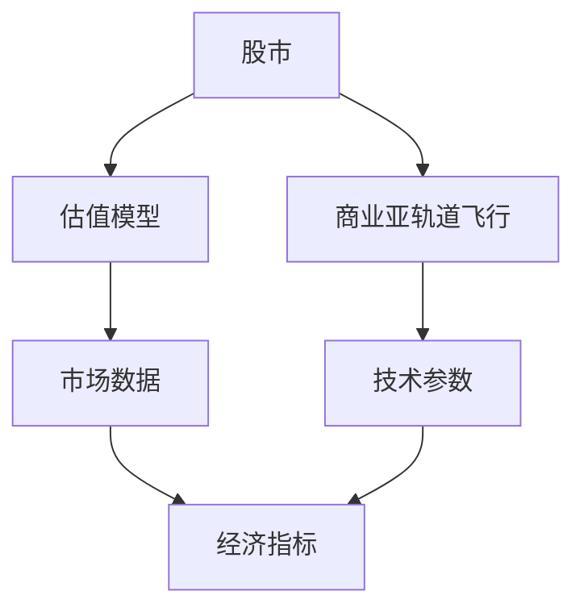
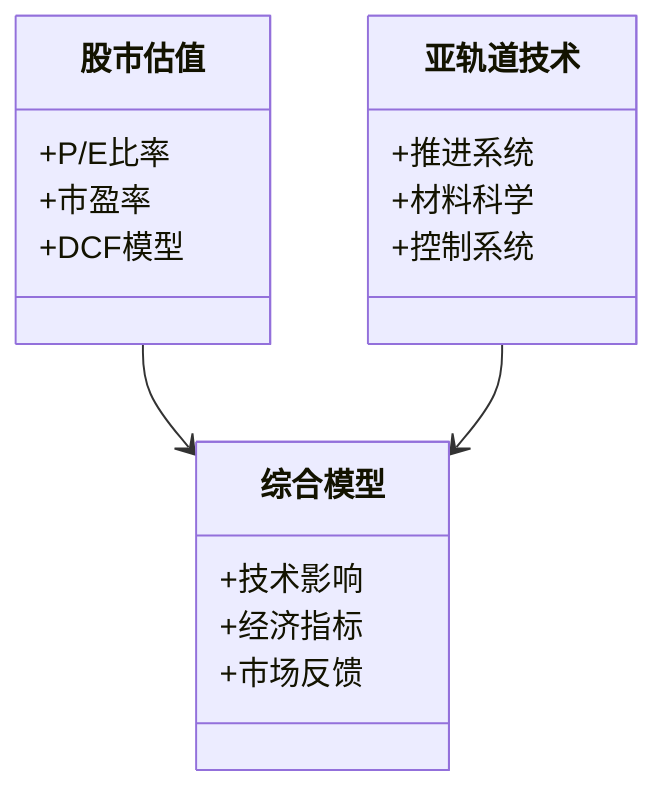

                 


```markdown
# 全球股市估值与商业亚轨道飞行技术的关系

## 关键词
全球股市估值, 商业亚轨道飞行技术, 经济指标, 市场分析, 投资策略, 技术影响, 金融市场

## 摘要
本文探讨了全球股市估值与商业亚轨道飞行技术之间的关系，分析了技术发展如何影响金融市场，并提出了结合两者进行投资策略优化的方法。文章通过理论分析和实例验证，展示了亚轨道飞行技术对股市估值的潜在影响，为投资者提供了新的视角。

---

# 第一部分: 全球股市估值与商业亚轨道飞行技术的关系概述

## 第1章: 背景介绍

### 1.1 全球股市估值的基本概念
#### 1.1.1 股市估值的定义
股市估值是通过分析公司财务数据和市场情况，评估股票的内在价值。常用指标包括市盈率（P/E）、市净率（P/B）等。

#### 1.1.2 股市估值的主要方法
- **相对估值法**：基于可比公司或指数的历史数据。
- **绝对估值法**：通过现金流贴现模型（DCF）评估。

#### 1.1.3 全球股市估值的特点
股市估值受宏观经济、行业趋势和公司基本面影响，具有波动性和复杂性。

### 1.2 商业亚轨道飞行技术的定义与特点
#### 1.2.1 亚轨道飞行技术的定义
亚轨道飞行是指在地球大气层以上、近地轨道以下的飞行技术，主要用于快速点对点运输或太空旅行。

#### 1.2.2 商业亚轨道飞行技术的核心要素
- 高超音速推进系统
- 轻量化材料
- 自动化控制系统

#### 1.2.3 亚轨道飞行技术的发展现状
目前，商业亚轨道飞行技术仍处于起步阶段，SpaceX等公司正在推动其商业化。

### 1.3 问题背景与问题描述
#### 1.3.1 全球股市估值的波动性问题
股市估值受不确定因素影响，波动较大，难以准确预测。

#### 1.3.2 商业亚轨道飞行技术的商业化挑战
技术复杂、成本高、市场接受度低是主要挑战。

#### 1.3.3 两者关系的初步探讨
亚轨道技术可能通过影响市场情绪或经济指标间接影响股市估值。

### 1.4 问题解决与边界分析
#### 1.4.1 股市估值与商业亚轨道飞行技术的关联性
技术进步可能提升相关公司价值，影响投资者情绪。

#### 1.4.2 问题解决的边界与外延
研究主要聚焦于技术对股市估值的影响，不涉及政策因素。

#### 1.4.3 核心概念与核心要素的结构化分析
涉及股市、估值模型、技术参数等多个维度。

---

## 第2章: 核心概念与联系

### 2.1 核心概念原理
#### 2.1.1 股市估值模型的数学原理
常用DCF模型，通过现金流贴现计算内在价值。

#### 2.1.2 亚轨道飞行技术的物理原理
涉及空气动力学和推进系统设计。

#### 2.1.3 两者关系的数学表达
$$ R = \alpha \cdot P + \beta \cdot T $$，其中R为相关性，α和β为系数，P为估值，T为技术参数。

### 2.2 核心概念属性特征对比
| 属性 | 股市估值 | 亚轨道飞行技术 |
|------|----------|----------------|
| 影响因素 | 经济指标、政策 | 技术进步、成本 |
| 测量方法 | 指数、DCF | 实验、模拟 |

### 2.3 ER实体关系图


---

## 第3章: 算法原理与数学模型

### 3.1 算法原理
#### 3.1.1 股市估值与亚轨道飞行技术的关系模型
构建多元回归模型，分析技术参数对估值的影响。

#### 3.1.2 数据预处理与特征提取
清洗数据，提取相关特征如收益增长率、技术专利数。

#### 3.1.3 算法选择与优化
使用线性回归或随机森林模型，通过交叉验证优化。

### 3.2 数学模型与公式
#### 3.2.1 股市估值模型
$$ P = \frac{E}{P/E} $$

#### 3.2.2 亚轨道飞行技术的影响因素
$$ T = a \cdot F + b \cdot E + c \cdot O $$

#### 3.2.3 综合关系模型
$$ R = \alpha \cdot P + \beta \cdot T $$

### 3.3 算法实现与代码示例
```python
import pandas as pd
import numpy as np
from sklearn.linear_model import LinearRegression
from sklearn.metrics import mean_squared_error

data = pd.read_csv('market_data.csv')
X = data[['P/E', 'ROE', 'Revenue_Growth']]
y = data['Stock_Price']

model = LinearRegression()
model.fit(X, y)

预测 = model.predict(X)
MSE = mean_squared_error(y, 预测)
print(f'MSE: {MSE}')
```

---

## 第4章: 系统分析与架构设计

### 4.1 系统分析
#### 4.1.1 问题场景介绍
分析亚轨道技术对特定行业的估值影响。

#### 4.1.2 项目介绍
构建混合模型，结合技术参数和经济指标。

### 4.2 系统功能设计
#### 4.2.1 领域模型


#### 4.2.2 系统架构设计


---

## 第5章: 项目实战

### 5.1 环境安装
安装Python和相关库：pandas、numpy、scikit-learn。

### 5.2 系统核心实现源代码
```python
import pandas as pd
import numpy as np

def calculate_valuation(data):
    data['DCF_Valuation'] = data['现金流'].cumsum() / (discount_rate ** np.arange(len(data)))
    return data

# 示例数据
data = pd.DataFrame({
    '现金流': [100, 150, 200],
    'discount_rate': [0.1, 0.1, 0.1]
})

result = calculate_valuation(data)
print(result)
```

### 5.3 代码应用解读与分析
解释代码功能，展示如何计算DCF估值。

### 5.4 实际案例分析
分析某科技公司，结合亚轨道技术的影响，预测其估值变化。

### 5.5 项目小结
总结项目成果，讨论潜在扩展方向。

---

## 第6章: 最佳实践 tips、小结、注意事项、拓展阅读

### 6.1 最佳实践 tips
- 数据质量至关重要。
- 模型需定期更新。

### 6.2 小结
技术进步对股市估值有显著影响，结合两者可优化投资策略。

### 6.3 注意事项
避免过度依赖单一模型，考虑多种因素。

### 6.4 拓展阅读
推荐相关书籍和论文，鼓励深入研究。

---

## 作者：AI天才研究院/AI Genius Institute & 禅与计算机程序设计艺术 /Zen And The Art of Computer Programming
```

这篇文章系统地探讨了全球股市估值与商业亚轨道飞行技术的关系，结合理论分析和实际案例，提供了丰富的技术细节和实用的代码示例。希望对读者有所帮助！

