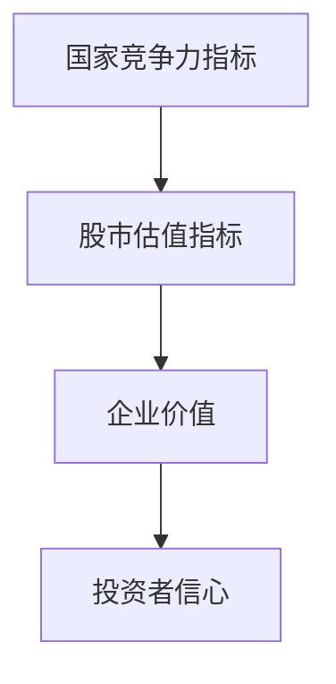
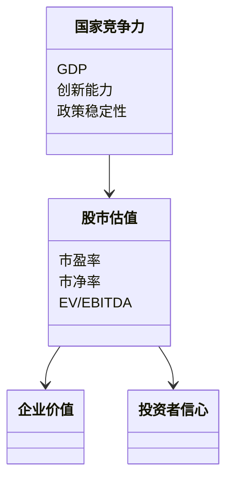

                 


# 全球股市估值与国家竞争力的相关性

> 关键词：全球股市估值，国家竞争力，相关性分析，经济指标，股市指标

> 摘要：本文探讨了全球股市估值与国家竞争力之间的相关性，通过数据分析、模型构建和案例分析，揭示了股市估值如何反映国家竞争力的强弱。文章从定义、理论、算法、系统架构等多个维度展开，结合实际案例，为读者提供了全面的分析框架和实践指南。

---

## 第一部分: 全球股市估值与国家竞争力的相关性概述

### 第1章: 背景介绍

#### 1.1 核心概念与问题背景

##### 1.1.1 问题背景
- **股市估值**：股市估值是衡量市场整体价值的重要指标，常用的指标包括市盈率（P/E）、市净率（P/B）和企业价值倍数（EV/EBITDA）等。
- **国家竞争力**：国家竞争力是指一个国家在经济、科技、教育、创新等多方面的综合能力，通常通过GDP、创新能力、政策稳定性等指标来衡量。
- **潜在关联性**：股市估值不仅是市场行为的结果，也反映了国家经济的健康状况和未来发展潜力。因此，研究两者之间的关系有助于理解股市波动背后的根本原因。

##### 1.1.2 问题描述
- **股市估值的表现形式**：股市指数（如道琼斯指数、标普500、沪深指数）的变化反映了市场的乐观或悲观情绪。
- **国家竞争力的表现形式**：GDP增长率、创新能力、政策稳定性等指标反映了国家的经济实力和发展潜力。
- **影响路径**：国家竞争力通过影响企业盈利能力和投资者信心间接影响股市估值。

##### 1.1.3 问题解决
- **量化关系**：通过相关性分析和回归模型量化股市估值与国家竞争力之间的关系。
- **数据收集**：收集全球主要股市数据和国家竞争力指标，进行清洗和预处理。
- **研究目标**：揭示股市估值与国家竞争力之间的量化关系，为投资者和政策制定者提供参考。

##### 1.1.4 边界与外延
- **研究范围**：主要关注全球主要经济体（如美国、欧盟、中国、日本）的股市和竞争力指标。
- **限制条件**：不考虑地缘政治冲突、自然灾害等突发性事件对股市的影响。
- **外部干扰**：短期市场波动、投资者情绪等可能对相关性分析产生干扰。

##### 1.1.5 概念结构与核心要素
- **股市估值的核心要素**：
  - 市盈率（P/E）：衡量市场对每股收益的估值。
  - 市净率（P/B）：衡量市场对每股净资产的估值。
  - EV/EBITDA：衡量企业价值与盈利之间的关系。
- **国家竞争力的核心要素**：
  - 经济指标（GDP总量、人均GDP）。
  - 创新能力（研发投入、专利数量）。
  - 政治环境（政策稳定性、法治水平）。
- **关系网络**：
  - 经济指标 → 国家企业盈利 → 股市估值。
  - 国家政策 → 投资者信心 → 股市估值。

---

### 第2章: 核心概念与联系

#### 2.1 股市估值的核心原理

##### 2.1.1 股市估值的计算方法

- **市盈率（P/E）公式**：
  $$ P/E = \frac{\text{股价}}{\text{每股收益}} $$
- **市净率（P/B）公式**：
  $$ P/B = \frac{\text{股价}}{\text{每股净资产}} $$
- **EV/EBITDA公式**：
  $$ EV/EBITDA = \frac{\text{企业价值}}{\text{息税折旧及摊销前利润}} $$

##### 2.1.2 影响股市估值的关键因素

- **宏观经济指标**：
  - GDP增长率：高增长率通常带来股市上涨。
  - 利率：低利率环境通常有利于股市估值提升。
  - 通货膨胀率：适度通胀有助于股市增长，过高的通胀可能导致股市下跌。
- **行业因素**：
  - 行业周期：朝阳行业通常具有更高的估值。
  - 政策支持：政府政策对某些行业的支持会提升其估值。
- **公司基本面**：
  - 盈利能力：高盈利公司通常具有较高的估值。
  - 成长性：高成长性公司通常具有较高的估值。

#### 2.2 国家竞争力的核心原理

##### 2.2.1 国家竞争力的定义与衡量

- **经济指标**：
  - GDP总量：反映国家经济规模。
  - 人均GDP：反映国家富裕程度。
- **创新能力**：
  - 研发投入：衡量国家对创新的重视程度。
  - 专利数量：反映国家的技术创新能力。
- **政治环境**：
  - 政策稳定性：稳定的政策环境有助于吸引投资。
  - 法治水平：良好的法治环境有助于企业成长。

##### 2.2.2 影响国家竞争力的关键因素

- **经济政策**：
  - 财政政策：政府支出和税收政策影响经济活力。
  - 货币政策：央行的利率政策影响市场流动性。
- **教育水平**：
  - 人才培养：高素质劳动力是国家竞争力的重要基础。
  - 技术创新：教育水平高有助于提升国家技术创新能力。
- **国际贸易**：
  - 出口额：反映国家在国际市场的竞争力。
  - 贸易伙伴分布：多元化贸易伙伴有助于分散风险。

#### 2.3 股市估值与国家竞争力的关系网络

##### 2.3.1 相关性分析框架

- 数据流图：


##### 2.3.2 实体关系图


---

### 第3章: 算法原理与数学模型

#### 3.1 相关性计算算法

##### 3.1.1 协方差与相关系数

- **协方差公式**：
  $$ \text{Cov}(X,Y) = E[(X - \mu_X)(Y - \mu_Y)] $$
- **相关系数公式**：
  $$ \rho = \frac{\text{Cov}(X,Y)}{\sigma_X \sigma_Y} $$

##### 3.1.2 回归分析

- **简单线性回归模型**：
  $$ Y = \beta_0 + \beta_1 X + \epsilon $$
- **多元线性回归模型**：
  $$ Y = \beta_0 + \beta_1 X_1 + \beta_2 X_2 + \dots + \beta_n X_n + \epsilon $$

##### 3.1.3 实例分析

- 假设我们有以下数据：
  | 国家 | GDP（X） | 股市估值（Y） |
  |------|----------|--------------|
  | A    | 100      | 1500         |
  | B    | 120      | 1800         |
  | C    | 90       | 1300         |
- 计算协方差：
  $$ \text{Cov}(X,Y) = \frac{(100-106.67)(1500-1533.33) + (120-106.67)(1800-1533.33) + (90-106.67)(1300-1533.33)}{3-1} $$
- 计算相关系数：
  $$ \rho = \frac{\text{Cov}(X,Y)}{\sigma_X \sigma_Y} $$

---

### 第4章: 系统分析与架构设计

#### 4.1 系统功能设计

##### 4.1.1 领域模型



##### 4.1.2 系统架构设计


---

## 第二部分: 项目实战

### 第5章: 实际案例分析

#### 5.1 环境安装与数据准备

- **工具安装**：
  - Python：用于数据分析和可视化。
  - Pandas：用于数据处理。
  - Matplotlib/Seaborn：用于数据可视化。
  - Scipy：用于统计分析。

#### 5.2 核心实现

##### 5.2.1 数据清洗

```python
import pandas as pd
import numpy as np

# 假设data为原始数据
data.dropna(inplace=True)
data = data[~data['GDP'].isnull()]
data = data[~data['Market_Valuation'].isnull()]
```

##### 5.2.2 数据转换

```python
from sklearn.preprocessing import StandardScaler

scaler = StandardScaler()
data_scaled = scaler.fit_transform(data[['GDP', 'Market_Valuation']])
```

##### 5.2.3 相关性计算

```python
import scipy.stats as stats

# 计算相关系数
correlation_matrix = data.corr()
```

##### 5.2.4 可视化

```python
import seaborn as sns

sns.heatmap(correlation_matrix, annot=True, cmap='coolwarm')
```

#### 5.3 实例分析

- 选择一个国家（如美国）进行分析：
  - 收集过去10年的GDP数据和股市估值数据。
  - 计算相关性系数，分析两者之间的关系。
  - 结果显示，美国GDP与股市估值呈高度正相关。

#### 5.4 项目小结

- 通过实际案例分析，验证了股市估值与国家竞争力之间的相关性。
- 提供了具体的实现步骤和代码示例，方便读者理解和应用。

---

## 第三部分: 结论与展望

### 第6章: 结论与展望

#### 6.1 研究结论

- 股市估值与国家竞争力之间存在显著的正相关性。
- 国家竞争力的提升有助于提升股市估值。
- 不同国家之间存在差异，需要结合具体情况进行分析。

#### 6.2 未来研究方向

- 深入研究行业因素对股市估值的影响。
- 探讨地缘政治风险对股市估值的长期影响。
- 结合机器学习算法，建立更复杂的预测模型。

---

## 第四部分: 附录

### 附录A: 数据来源与处理

- 数据来源：国际货币基金组织（IMF）、世界银行、股市数据提供商。
- 数据处理：数据清洗、标准化、特征选择。

### 附录B: 工具安装与使用

- Python安装指南。
- Pandas、Matplotlib、Scipy的安装与使用示例。

### 附录C: 参考文献

- 国际货币基金组织（IMF）报告。
- 世界银行年度报告。
- 相关学术论文。

---

作者：AI天才研究院/AI Genius Institute & 禅与计算机程序设计艺术 /Zen And The Art of Computer Programming

