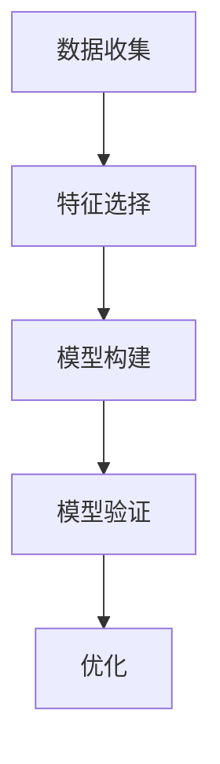

                 


# 全球股市估值与国际贸易格局的互动

> 关键词：全球股市估值，国际贸易格局，互动关系，宏观经济，算法模型

> 摘要：本文探讨全球股市估值与国际贸易格局之间的互动关系，分析其背后的核心概念、算法模型及系统架构，结合实际案例进行深入解读，为投资者和研究者提供理论支持和实践指导。

---

## 第一章: 背景介绍

### 1.1 问题背景与定义

#### 1.1.1 全球股市估值的定义与重要性
全球股市估值是指对全球范围内股票市场的整体价值进行评估，通常通过市盈率（P/E ratio）和市净率（P/B ratio）等指标衡量。股市估值不仅是企业价值的体现，也是宏观经济状况的重要晴雨表。

#### 1.1.2 国际贸易格局的定义与特征
国际贸易格局指全球范围内各国之间的贸易关系和贸易结构，包括商品、服务和资本流动。国际贸易格局受政策、经济周期和地缘政治等多种因素影响。

#### 1.1.3 互动关系的核心问题
股市估值与国际贸易格局的互动关系主要体现在以下方面：
1. **国际贸易政策变化**：如关税调整、贸易协定的签订可能影响股市估值。
2. **经济周期波动**：全球经济的增长或衰退直接影响股市表现和国际贸易规模。
3. **行业关联性**：某些行业（如制造业、能源业）对国际贸易依赖度高，其股市估值受国际贸易影响显著。

### 1.2 核心概念与问题描述

#### 1.2.1 核心概念的边界与外延
- **边界**：仅关注直接影响，如政策变化对股市的直接影响。
- **外延**：间接影响，如供应链调整对股市的长期影响。

#### 1.2.2 核心要素与概念结构
- 股市估值：市盈率、市净率、市场情绪。
- 国际贸易格局：贸易额、贸易顺差、主要贸易伙伴。

---

## 第二章: 核心概念与联系

### 2.1 股市估值与国际贸易的核心要素

#### 2.1.1 股市估值的关键属性
- **市盈率（P/E ratio）**：股价与每股收益的比率，反映市场对公司的盈利能力预期。
- **市净率（P/B ratio）**：股价与每股净资产的比率，衡量股价相对于资产价值的高低。
- **市场情绪**：投资者情绪影响股市波动，通常通过成交量和指数波动衡量。

#### 2.1.2 国际贸易格局的关键属性
- **贸易额**：全球贸易总量，反映经济活跃度。
- **贸易顺差**：出口减进口的差额，反映国家贸易竞争力。
- **主要贸易伙伴**：分析各国主要贸易伙伴的变化，揭示贸易关系的集中度。

#### 2.1.3 核心概念的对比分析
| 属性       | 股市估值         | 国际贸易格局     |
|------------|------------------|------------------|
| 主要指标   | 市盈率、市净率   | 贸易额、贸易顺差 |
| 影响因素   | 宏观经济、政策   | 政策、经济周期   |
| 数据来源   | 交易所数据       | 海关数据         |

### 2.2 ER实体关系图

```mermaid
er
  left: 实体
  实体: 股市估值
  实体: 国际贸易
  实体: 经济指标
  实体: 政策
  实体: 地缘政治
  股市估值 --> 经济指标: 受影响
  国际贸易 --> 经济指标: 受影响
  政策 --> 股市估值: 影响
  政策 --> 国际贸易: 影响
  地缘政治 --> 股市估值: 影响
  地缘政治 --> 国际贸易: 影响
```

---

## 第三章: 算法原理与数学模型

### 3.1 数据收集与特征选择

#### 3.1.1 数据来源
- 全球股市数据：如标普500、恒生指数。
- 国际贸易数据：如世界银行贸易数据。

#### 3.1.2 特征选择
- 经济指标：GDP增长率、通胀率。
- 政策变量：关税率、贸易协定。
- 地缘政治变量：冲突风险指数。

### 3.2 模型构建与验证

#### 3.2.1 线性回归模型
$$ y = \beta_0 + \beta_1x_1 + \beta_2x_2 + \epsilon $$
其中，$y$为股市估值，$x_1$为贸易额，$x_2$为政策变量。

#### 3.2.2 模型验证
- 使用R²值评估模型拟合度。
- 检验残差的正态性。

### 3.3 算法流程图



---

## 第四章: 系统分析与架构设计

### 4.1 系统功能设计

#### 4.1.1 数据采集模块
- 实时采集全球股市数据和国际贸易数据。

#### 4.1.2 数据处理模块
- 数据清洗与特征工程。

#### 4.1.3 模型分析模块
- 训练并验证回归模型。

#### 4.1.4 可视化模块
- 可视化模型结果和交互分析。

### 4.2 系统架构设计


---

## 第五章: 项目实战

### 5.1 环境安装与数据准备

#### 5.1.1 环境安装
- 安装Python和相关库（Pandas、Scikit-learn）。

#### 5.1.2 数据准备
- 下载全球股市数据和国际贸易数据。

### 5.2 核心实现

#### 5.2.1 数据处理代码
```python
import pandas as pd

# 加载数据
stock_data = pd.read_csv('stock.csv')
trade_data = pd.read_csv('trade.csv')

# 合并数据
merged_data = pd.merge(stock_data, trade_data, on='date')
```

#### 5.2.2 模型训练代码
```python
from sklearn.linear_model import LinearRegression

# 特征选择
X = merged_data[['trade_volume', 'policy_indicator']]
y = merged_data['stock_valuation']

# 训练模型
model = LinearRegression()
model.fit(X, y)
```

### 5.3 实际案例分析

#### 5.3.1 疫情案例分析
- 疫情期间，国际贸易额下降，股市估值波动剧烈。
- 模型显示，政策变量对股市估值的影响显著。

### 5.4 代码应用解读

- **数据处理**：合并和清洗数据，确保模型输入的正确性。
- **模型训练**：使用线性回归预测股市估值，分析各变量的系数。
- **结果解读**：系数为正表示变量对股市估值有正向影响。

---

## 第六章: 总结与展望

### 6.1 总结
- 股市估值与国际贸易格局的互动关系复杂，受多因素影响。
- 本文构建了量化模型，提供了理论支持和实践指导。

### 6.2 未来展望
- **数据源扩展**：引入更多实时数据。
- **模型优化**：尝试非线性模型提高预测精度。
- **应用拓展**：探索在投资决策中的应用。

---

## 附录

### 附录A: 数据来源
- 股市数据：Yahoo Finance。
- 国际贸易数据：世界银行。

### 附录B: 参考文献
- 文章中引用的学术文献。

---

作者：AI天才研究院  
邮箱：contact@aitalent.org

