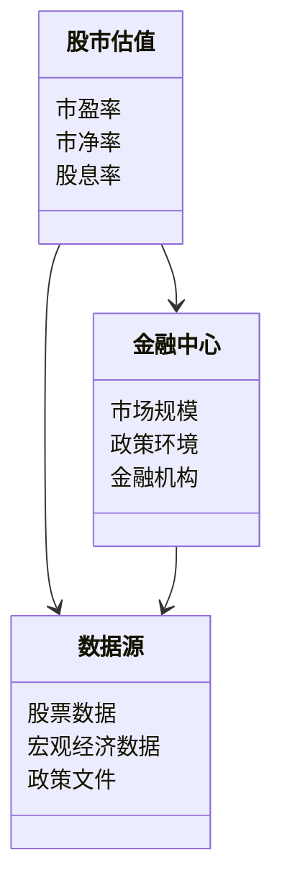
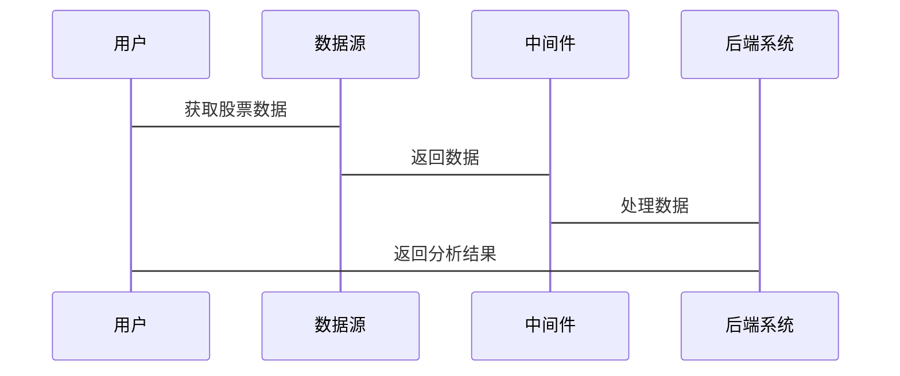

                 


```markdown
# 全球股市估值与国际金融中心竞争的关联

> 关键词：全球股市估值、国际金融中心、金融市场竞争、股市估值模型、金融中心竞争力

> 摘要：本文将深入探讨全球股市估值与国际金融中心竞争之间的关联。通过分析股市估值的核心概念、数学模型、国际金融中心的竞争力要素以及实际案例，我们将揭示两者之间的内在联系，并为理解全球金融市场格局提供新的视角。

---

# 第一部分: 全球股市估值与国际金融中心竞争的背景与概念

## 第1章: 全球股市估值的基本概念

### 1.1 股市估值的定义与意义
#### 1.1.1 股市估值的定义
股市估值是通过对上市公司基本面的分析，对其股票价格的合理性和潜在价值进行评估的过程。它不仅是投资者决策的重要依据，也是反映市场健康状况的重要指标。

#### 1.1.2 股市估值的重要性
股市估值能够帮助投资者识别低估或高估的股票，指导投资决策。同时，它也是衡量市场整体表现和经济状况的重要工具。

#### 1.1.3 股市估值的核心要素
股市估值的核心要素包括市盈率（P/E）、市净率（P/B）、股息率等指标，以及宏观经济环境、行业趋势和公司财务状况等因素。

### 1.2 国际金融中心的定义与特征
#### 1.2.1 国际金融中心的定义
国际金融中心是指在全球金融市场中具有重要地位和影响力的特定城市或地区，通常具有完善的金融体系、活跃的交易市场和强大的资金流动能力。

#### 1.2.2 国际金融中心的主要特征
国际金融中心通常具有以下特征：
- 完善的金融基础设施
- 全球化的金融机构
- 严格的金融监管
- 优越的地理位置

#### 1.2.3 全球主要国际金融中心介绍
全球主要国际金融中心包括纽约、伦敦、上海、东京、新加坡等。每个金融中心都有其独特的竞争优势和发展特点。

---

## 第2章: 全球股市估值与国际金融中心竞争的关联

### 2.1 股市估值与金融中心竞争力的关系
#### 2.1.1 股市估值是金融中心竞争力的晴雨表
股市估值反映了市场参与者的信心和对市场的认可程度，同时也是金融中心竞争力的体现。

#### 2.1.2 金融中心竞争对股市估值的影响
金融中心的竞争直接影响市场的流动性和吸引力，进而影响股市估值。例如，政策优势、税收优惠和基础设施的完善能够吸引更多投资者，提升市场估值。

#### 2.1.3 两者关系的理论框架
通过构建股市估值与金融中心竞争力的理论框架，我们可以更好地理解两者之间的互动关系。例如，金融中心的竞争优势能够提升市场估值，而股市估值的高低反过来也会影响金融中心的吸引力。

### 2.2 全球化背景下的金融市场格局
#### 2.2.1 全球化对金融市场的深远影响
全球化促进了资本的自由流动，使得金融市场更加国际化和一体化。这为国际金融中心的竞争提供了更大的舞台。

#### 2.2.2 主要经济体的金融市场现状
不同经济体的金融市场发展水平和特点各不相同。例如，美国市场的成熟性和创新能力、欧洲市场的稳定性以及亚洲市场的快速增长都为国际金融中心的竞争格局增添了多样性。

#### 2.2.3 金融中心的演变与发展趋势
随着全球化和科技的进步，金融中心的格局也在不断变化。新兴市场崛起、金融科技的应用以及绿色金融的发展正在重塑国际金融中心的竞争态势。

---

## 第3章: 全球股市估值的核心概念与数学模型

### 3.1 股市估值的主要指标
#### 3.1.1 市盈率（P/E）的定义与计算
市盈率是股票价格与每股收益的比值，反映了投资者对股票未来盈利能力的预期。

$$ P/E = \frac{\text{股票价格}}{\text{每股收益}} $$

#### 3.1.2 市净率（P/B）的定义与计算
市净率是股票价格与每股净资产的比值，适用于评估资产密集型企业的估值。

$$ P/B = \frac{\text{股票价格}}{\text{每股净资产}} $$

#### 3.1.3 市销率（P/S）的定义与计算
市销率是股票价格与每股营业收入的比值，适用于评估高成长性企业的估值。

$$ P/S = \frac{\text{股票价格}}{\text{每股营业收入}} $$

### 3.2 股市估值的数学模型
#### 3.2.1 市盈率模型
市盈率模型通过对比同类企业的市盈率水平，判断股票的估值是否合理。

#### 3.2.2 现金流量折现模型（DCF）
DCF模型通过将未来现金流折现，评估企业的内在价值。

$$ \text{企业价值} = \sum_{t=1}^{n} \frac{\text{自由现金流}}{(1+r)^t} + \frac{\text{终值}}{(1+r)^n} $$

#### 3.2.3 综合估值模型
综合估值模型结合多种指标和方法，对企业的价值进行综合评估。

---

## 第4章: 国际金融中心竞争力的核心要素

### 4.1 金融市场规模与流动性
#### 4.1.1 市场规模的定义与衡量标准
市场规模包括股票市场规模、债券市场规模等，反映了金融中心的容量和影响力。

#### 4.1.2 流动性的定义与衡量标准
流动性是指资产在短时间内以合理价格买卖的能力，反映了市场的深度和效率。

#### 4.1.3 市场规模与流动性对金融中心竞争力的影响
市场规模和流动性是金融中心竞争力的重要指标，直接影响市场的吸引力和交易成本。

### 4.2 政策与监管环境
#### 4.2.1 政策环境对金融中心的影响
政策环境包括税收政策、外汇管制、资本流动政策等，影响投资者的决策和市场的开放程度。

#### 4.2.2 监管框架的完善与创新
完善的监管框架能够保护投资者利益，维护市场秩序，而创新的监管手段能够适应金融市场的变化。

#### 4.2.3 政策与监管对股市估值的作用
政策环境直接影响市场的信心和预期，从而影响股市估值。例如，宽松的货币政策通常会推高市场估值。

### 4.3 金融机构与投资者结构
#### 4.3.1 金融机构的多样性与竞争力
金融中心的竞争力离不开多样化的金融机构，包括银行、证券公司、保险公司等。

#### 4.3.2 投资者结构的优化与调整
投资者结构包括机构投资者和散户投资者的比例，影响市场的稳定性和流动性。

#### 4.3.3 金融机构与投资者

---

# 第二部分: 系统分析与架构设计

## 第5章: 系统分析与架构设计方案

### 5.1 问题场景介绍
我们希望通过构建一个系统，分析全球股市估值与国际金融中心竞争的关联，为投资者和政策制定者提供决策支持。

### 5.2 项目介绍
本项目旨在开发一个基于大数据和机器学习的金融分析系统，用于评估全球股市估值和国际金融中心的竞争格局。

### 5.3 系统功能设计
#### 5.3.1 领域模型（Mermaid 类图）


#### 5.3.2 系统架构设计（Mermaid 架构图）


#### 5.3.3 系统接口设计
系统接口包括数据接口（API）、用户界面（UI）和第三方服务接口。

#### 5.3.4 系统交互设计（Mermaid 序列图）


---

## 第6章: 项目实战

### 6.1 环境安装
安装必要的软件和库，包括Python、Pandas、NumPy、Matplotlib等。

### 6.2 核心实现源代码
```python
import pandas as pd
import numpy as np

# 示例：计算市盈率
def calculate_pe(stock_price, earnings_per_share):
    return stock_price / earnings_per_share

# 示例：计算市净率
def calculate_pb(stock_price, book_value_per_share):
    return stock_price / book_value_per_share

# 示例：计算市销率
def calculate_ps(stock_price, revenue_per_share):
    return stock_price / revenue_per_share

# 数据处理
data = pd.DataFrame({
    '股票代码': ['AAPL', 'GOOGL', 'MSFT'],
    '股票价格': [150, 120, 100],
    '每股收益': [4.5, 5.2, 3.8],
    '每股净资产': [25, 30, 20],
    '每股营收': [20, 25, 18]
})

data['市盈率'] = data.apply(lambda x: calculate_pe(x['股票价格'], x['每股收益']), axis=1)
data['市净率'] = data.apply(lambda x: calculate_pb(x['股票价格'], x['每股净资产']), axis=1)
data['市销率'] = data.apply(lambda x: calculate_ps(x['股票价格'], x['每股营收']), axis=1)

print(data)
```

### 6.3 应用解读与分析
通过代码计算不同股票的市盈率、市净率和市销率，分析它们的估值情况，并结合国际金融中心的竞争力进行综合评估。

### 6.4 实际案例分析
以纽约、伦敦和上海为例，分析它们的股市估值与金融中心竞争力的关联。

### 6.5 项目小结
总结项目的实现过程和研究成果，提出进一步优化的方向。

---

# 第三部分: 最佳实践与总结

## 第7章: 总结与展望

### 7.1 研究总结
本文深入分析了全球股市估值与国际金融中心竞争的关联，揭示了两者之间的互动关系，并为理解全球金融市场格局提供了新的视角。

### 7.2 研究局限性
本文的研究主要基于理论分析和案例研究，未来可以结合更多实际数据和模型进行验证。

### 7.3 未来研究方向
未来可以进一步研究新兴市场的崛起、金融科技的应用以及绿色金融的发展对国际金融中心竞争格局的影响。

### 7.4 最佳实践 tips
- 投资者应关注市场估值与金融中心竞争力的双向影响
- 政策制定者应优化监管环境，提升金融中心的竞争力
- 金融机构应加强合作，推动市场的健康发展

---

# 作者：AI天才研究院/AI Genius Institute & 禅与计算机程序设计艺术 /Zen And The Art of Computer Programming
```

