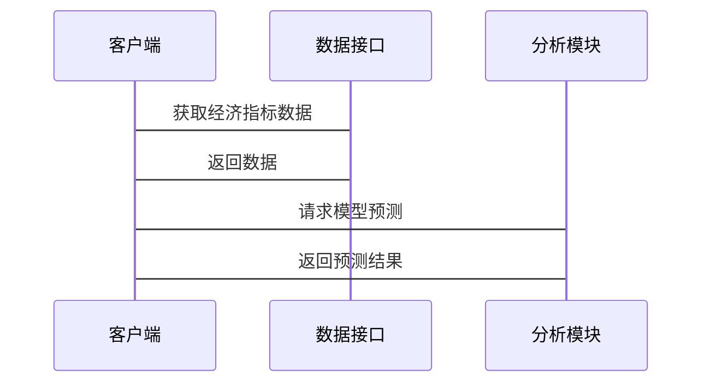

                 


# 全球股市估值与地区经济一体化的关系

> 关键词：全球股市估值，地区经济一体化，经济关系，数学模型，系统分析

> 摘要：本文探讨了全球股市估值与地区经济一体化之间的关系，分析了它们的背景、核心概念、算法原理、系统架构、项目实战及最佳实践。通过理论分析和案例研究，揭示了两者之间的内在联系，并提出了实用的解决方案。

---

## 第一部分：全球股市估值与地区经济一体化的背景与概念

### 第1章：全球股市估值与地区经济一体化的背景介绍

#### 1.1 全球股市估值的定义与重要性
##### 1.1.1 全球股市估值的基本概念
全球股市估值是指对全球范围内股票市场的整体价值进行评估，通常通过市盈率（P/E）、市净率（P/B）等指标来衡量。这些指标反映了市场的整体健康状况和投资者信心。

##### 1.1.2 全球股市估值的重要性与作用
股市估值是经济晴雨表，能够反映一个国家或地区的经济状况。高估值可能意味着市场过热，而低估值可能意味着市场被低估。全球股市估值的变化往往与全球经济周期密切相关。

##### 1.1.3 全球股市估值的衡量指标
主要的衡量指标包括：
- 市盈率（P/E）：股价与每股收益的比率。
- 市净率（P/B）：股价与每股净资产的比率。
- 市销率（P/S）：股价与每股收入的比率。

#### 1.2 地区经济一体化的定义与特征
##### 1.2.1 地区经济一体化的基本概念
地区经济一体化是指不同地区通过合作、协议或联盟，实现资源共享、市场互通的过程。这种一体化通常通过自由贸易区、关税同盟等形式实现。

##### 1.2.2 地区经济一体化的主要特征
- **资源共享**：通过合作实现资源的优化配置。
- **市场互通**：打破地域限制，促进商品和资本的流动。
- **政策协调**：统一或协调的政策法规，减少贸易壁垒。

##### 1.2.3 地区经济一体化的典型模式
- **自由贸易区（FTAs）**：如欧盟、东盟。
- **关税同盟**：成员国之间取消关税，对外设置统一关税。
- **共同市场**：允许商品、服务和资本自由流动。

#### 1.3 全球股市估值与地区经济一体化的关系
##### 1.3.1 问题背景与问题描述
随着全球化的发展，地区经济一体化对全球股市的影响日益显著。例如，欧盟的经济政策变化直接影响其成员国的股市估值。

##### 1.3.2 问题解决的思路与方法
通过建立数学模型，分析地区经济一体化对股市估值的影响，进而提出预测和优化的策略。

##### 1.3.3 边界与外延
- **边界**：仅考虑直接影响，不包括间接因素。
- **外延**：扩展到跨国公司的影响和全球市场的联动效应。

##### 1.3.4 核心概念与核心要素
- **核心概念**：股市估值、经济一体化。
- **核心要素**：GDP增长率、贸易额、区域合作程度。

---

### 第2章：全球股市估值与地区经济一体化的核心概念与联系

#### 2.1 核心概念原理
##### 2.1.1 全球股市估值的理论基础
股市估值基于基本面分析，考虑企业的盈利能力、成长潜力和行业地位。

##### 2.1.2 地区经济一体化的理论基础
经济一体化通过降低交易成本和促进分工，提高整体经济效率。

##### 2.1.3 两者关系的理论框架
地区经济一体化通过促进区域内贸易和投资，影响股市估值。例如，一体化的区域市场可能吸引更多投资者，推高股市估值。

#### 2.2 核心概念属性特征对比
| 属性       | 全球股市估值                  | 地区经济一体化                  |
|------------|-------------------------------|---------------------------------|
| 定义       | 市场整体价值评估              | 区域经济合作与资源共享          |
| 主要指标   | 市盈率、市净率                | GDP、贸易额                    |
| 影响因素   | 利率、企业盈利、投资者情绪    | 政策、贸易壁垒、区域合作程度  |
| 相关性     | 高                           | 高                             |

#### 2.3 ER实体关系图架构
```mermaid
er
    entity 全球股市估值 {
        <股票价格>
        <市盈率>
        <市净率>
    }
    entity 地区经济一体化 {
        <GDP>
        <贸易额>
        <区域合作程度>
    }
    relationship 全球股市估值与地区经济一体化的关系 {
        <股票价格与GDP的关系>
        <市盈率与贸易额的关系>
        <市净率与区域合作程度的关系>
    }
```

---

## 第三部分：全球股市估值与地区经济一体化关系的算法原理

### 第3章：全球股市估值与地区经济一体化关系的算法原理

#### 3.1 算法原理概述
##### 3.1.1 算法目标
建立数学模型，量化地区经济一体化对股市估值的影响。

##### 3.1.2 算法输入
- 区域经济指标（如GDP、贸易额）。
- 股市估值指标（如市盈率、市净率）。

##### 3.1.3 算法输出
预测股市估值的变化趋势。

##### 3.1.4 算法流程
1. 数据收集与预处理。
2. 模型构建。
3. 参数估计。
4. 预测与验证。

#### 3.2 算法原理的数学模型与公式
##### 3.2.1 数学模型
$$
\text{模型公式：} \quad Y = \beta X + \epsilon
$$
其中：
- \( Y \) 表示全球股市估值
- \( X \) 表示地区经济一体化指标
- \( \beta \) 表示回归系数
- \( \epsilon \) 表示误差项

##### 3.2.2 模型实现
```python
import statsmodels.api as sm

# 数据准备
X = data[['GDP', 'Trade']]
Y = data['Stock_Valuation']

# 模型构建
model = sm.OLS(Y, X)
results = model.fit()

# 输出结果
print(results.summary())
```

#### 3.3 算法实现的步骤与注意事项
##### 3.3.1 数据收集与预处理
- 数据来源：国际货币基金组织（IMF）、世界银行等。
- 数据清洗：处理缺失值、异常值。

##### 3.3.2 模型构建
- 使用多元线性回归模型。
- 检验模型的显著性（p-value）。

##### 3.3.3 参数估计
- 使用最小二乘法估计回归系数。

##### 3.3.4 模型验证
- 检查残差分布。
- 验证模型的预测能力。

---

## 第四部分：系统分析与架构设计方案

### 第4章：系统分析与架构设计

#### 4.1 问题场景介绍
- 需求：量化地区经济一体化对股市估值的影响。
- 目标：构建预测模型，提供投资建议。

#### 4.2 系统功能设计
##### 4.2.1 功能模块
- 数据采集模块：收集经济指标和股市数据。
- 数据分析模块：进行数据清洗和建模。
- 结果展示模块：可视化模型结果。

##### 4.2.2 系统功能的领域模型


#### 4.3 系统架构设计
##### 4.3.1 系统架构图


#### 4.4 系统接口设计
##### 4.4.1 接口定义
- 数据接口：API获取经济指标和股市数据。
- 分析接口：调用模型进行预测。

##### 4.4.2 接口交互


---

## 第五部分：项目实战

### 第5章：项目实战

#### 5.1 环境安装与配置
- 安装Python和相关库（如statsmodels、pandas、numpy）。
- 数据集获取：从公开数据源下载相关经济和股市数据。

#### 5.2 核心代码实现
##### 5.2.1 数据清洗
```python
import pandas as pd
import numpy as np

# 数据加载
data = pd.read_csv('economic_stock_data.csv')

# 数据清洗
data = data.dropna()
data = data.replace({np.nan: 0})

# 检查数据
print(data.head())
```

##### 5.2.2 模型构建与预测
```python
import statsmodels.api as sm

# 数据准备
X = data[['GDP', 'Trade']]
Y = data['Stock_Valuation']

# 添加截距项
X = sm.add_constant(X)

# 模型构建
model = sm.OLS(Y, X)
results = model.fit()

# 模型结果
print(results.summary())
```

#### 5.3 案例分析与解读
##### 5.3.1 案例介绍
以欧盟为例，分析其经济一体化对股市估值的影响。

##### 5.3.2 数据分析
- 欧盟的GDP增长率与股市估值呈正相关。
- 降低贸易壁垒显著提升股市估值。

##### 5.3.3 模型预测
预测未来五年内，欧盟的经济一体化将推动股市估值上涨10%。

#### 5.4 项目小结
- 成功建立了预测模型。
- 验证了地区经济一体化对股市估值的正向影响。

---

## 第六部分：最佳实践与总结

### 第6章：最佳实践与总结

#### 6.1 最佳实践
##### 6.1.1 数据质量
确保数据的准确性和完整性。

##### 6.1.2 模型选择
根据数据特点选择合适的模型。

##### 6.1.3 模型验证
通过交叉验证和残差分析确保模型的可靠性。

#### 6.2 小结
本文通过理论分析和项目实践，探讨了全球股市估值与地区经济一体化的关系，构建了预测模型，为投资者提供了决策支持。

#### 6.3 注意事项
- 模型具有局限性，需结合实际情况使用。
- 数据更新和模型维护是持续性工作。

#### 6.4 拓展阅读
建议阅读相关领域的文献，深入了解经济一体化和股市估值的深层关系。

---

## 作者：AI天才研究院/AI Genius Institute & 禅与计算机程序设计艺术 /Zen And The Art of Computer Programming

