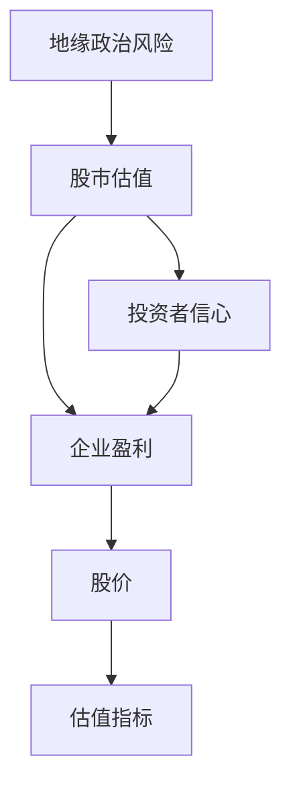
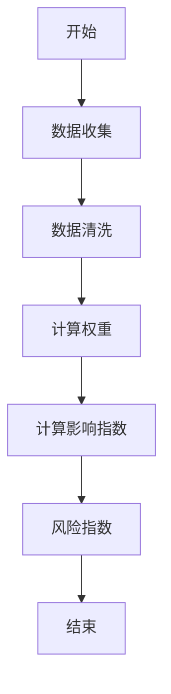
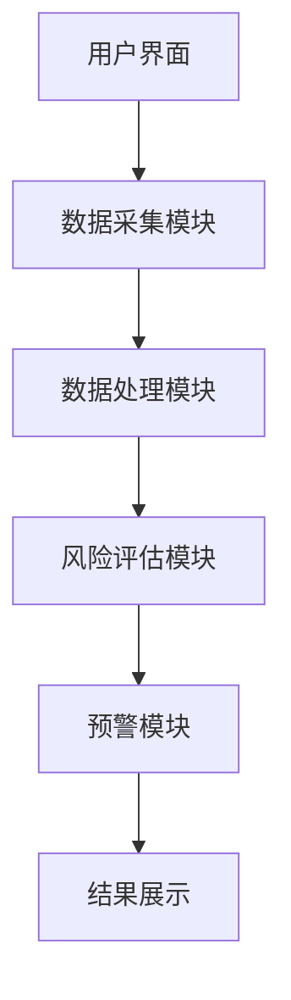

                 


# 全球股市估值与地缘政治风险的关系

## 关键词：全球股市估值、地缘政治风险、经济影响、投资分析、风险管理

## 摘要：本文探讨地缘政治风险如何影响全球股市估值，分析其相互作用机制，并提供量化方法和实际案例，帮助投资者制定风险管理策略。

---

## 第1章：全球股市估值与地缘政治风险的背景

### 1.1 问题背景

#### 1.1.1 全球化经济与股市的重要性

全球经济一体化使得股市成为各国经济的晴雨表。股市不仅反映经济状况，还影响投资决策和资源配置。地缘政治风险作为外部冲击，直接影响股市稳定性。

#### 1.1.2 地缘政治风险的定义与分类

地缘政治风险指因政治冲突、经济制裁、贸易争端等导致的市场不确定性。主要类型包括主权风险、操作风险和政治风险。

#### 1.1.3 问题解决的必要性

随着全球化深入，地缘政治风险对股市的影响日益显著。投资者需了解这些风险的量化方法，以做出明智决策。

### 1.2 问题描述

#### 1.2.1 地缘政治风险对股市的具体影响

通过案例分析，展示地缘政治事件如何引发市场波动，影响估值指标。

#### 1.2.2 股市估值的复杂性

介绍市盈率、市净率等指标，解释其在不同市场环境下的表现。

#### 1.2.3 问题的边界与外延

明确研究范围，如仅考虑直接的经济影响，不包括自然灾害等其他因素。

### 1.3 核心概念与联系

#### 1.3.1 地缘政治风险的核心要素

主权风险、经济制裁、贸易争端等，影响市场参与者的信心和投资行为。

#### 1.3.2 股市估值的关键指标

市盈率、市净率、股息率等，用于衡量市场健康状况和投资价值。

#### 1.3.3 两者关系的结构化分析

通过图表展示地缘政治风险如何通过影响企业盈利、投资者情绪等因素，进而影响股市估值。

---

## 第2章：地缘政治风险与股市估值的核心概念

### 2.1 地缘政治风险的类型

#### 2.1.1 经济制裁

如贸易禁运影响出口企业，导致股价下跌。以案例分析俄罗斯与西方国家的经济制裁为例，展示其对股市的影响。

#### 2.1.2 贸易争端

如中美贸易战如何影响股市估值，尤其是相关行业的市盈率变化。

#### 2.1.3 战争与冲突

地区冲突如何导致市场波动，影响短期估值指标。

### 2.2 股市估值的关键指标

#### 2.2.1 市盈率（P/E）

计算公式：P/E = 市场价/每股收益。解释其在不同风险环境下的表现。

#### 2.2.2 市净率（P/B）

计算公式：P/B = 市场价/每股净资产。用于评估市场是否被高估或低估。

#### 2.2.3 股息率

计算公式：股息率 = 每股股息/股价。反映市场收益能力。

### 2.3 概念属性特征对比表

| 概念       | 属性特征                   |
|------------|---------------------------|
| 地缘政治风险 | 影响范围广、不确定性高       |
| 股市估值     | 受多种因素影响、可量化      |

### 2.4 ER实体关系图



---

## 第3章：地缘政治风险对股市影响的算法模型

### 3.1 事件影响分析

#### 3.1.1 事件权重计算

根据事件的严重性和发生频率，赋予不同权重。例如，战争的权重高于贸易争端。

#### 3.1.2 事件影响指数

计算公式：影响指数 = Σ(权重 × 影响程度)。

### 3.2 风险指数构建

#### 3.2.1 数据预处理

收集历史事件和对应的股市数据，清洗和标准化处理。

#### 3.2.2 风险指数计算

计算公式：风险指数 = Σ(权重 × 影响程度)。

### 3.3 算法流程图



---

## 第4章：量化模型与公式

### 4.1 风险影响公式

计算公式：$$ \text{风险指数} = \sum (w_i \times r_i) $$

### 4.2 股市估值模型

计算公式：$$ \text{预期收益} = \text{无风险利率} + \beta \times (\text{市场收益} - \text{无风险利率}) $$

### 4.3 实例分析

以中美贸易战为例，分析其对某股市的影响，展示模型的应用和结果。

---

## 第5章：系统分析与架构设计

### 5.1 系统功能设计

设计功能模块，如数据采集、风险评估、预警系统等。

### 5.2 系统架构图



---

## 第6章：项目实战

### 6.1 环境安装

安装Python、Pandas、Matplotlib等工具。

### 6.2 核心实现代码

```python
import pandas as pd
import numpy as np

def calculate_risk_index(events):
    weights = {'经济制裁': 0.3, '贸易争端': 0.4, '战争': 0.3}
    risk_index = 0
    for event in events:
        weight = weights.get(event, 0)
        risk_index += weight * events[event]
    return risk_index

events = {'经济制裁': 0.6, '贸易争端': 0.8, '战争': 0.7}
risk_index = calculate_risk_index(events)
print(f"风险指数：{risk_index}")
```

### 6.3 案例分析

分析某地区地缘政治事件对股市的影响，展示数据获取、清洗、分析和可视化过程。

---

## 第7章：最佳实践与小结

### 7.1 关键点回顾

总结地缘政治风险对股市估值的影响机制和量化方法。

### 7.2 风险管理策略

建议投资者如何应对地缘政治风险，如分散投资、关注政策变化等。

### 7.3 长期视角的重要性

强调长期投资的重要性，避免短期波动影响决策。

---

## 第8章：注意事项与拓展阅读

### 8.1 注意事项

提醒读者模型的局限性，如数据质量和模型假设。

### 8.2 拓展阅读

推荐相关书籍和资源，如《风险管理与投资组合》。

---

## 作者：AI天才研究院 & 禅与计算机程序设计艺术

---

以上是《全球股市估值与地缘政治风险的关系》的完整目录大纲，按照逻辑顺序展开，详细分析了各部分内容，确保读者能够系统理解地缘政治风险对股市估值的影响，并掌握实际的分析方法。

