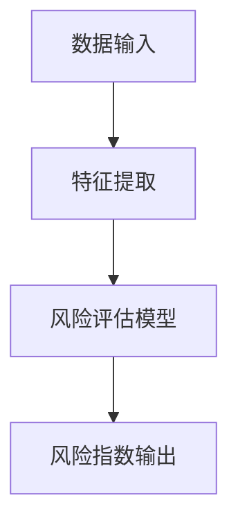
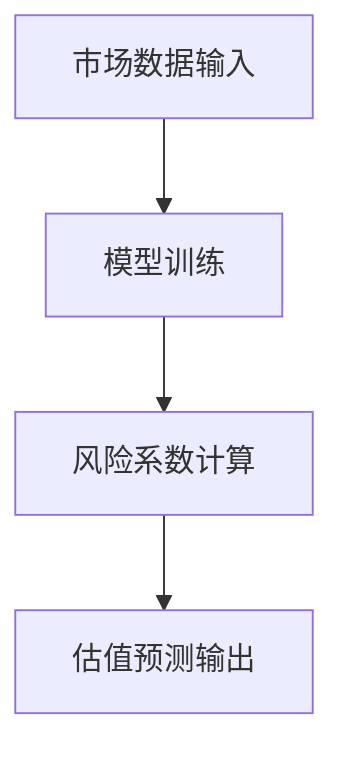
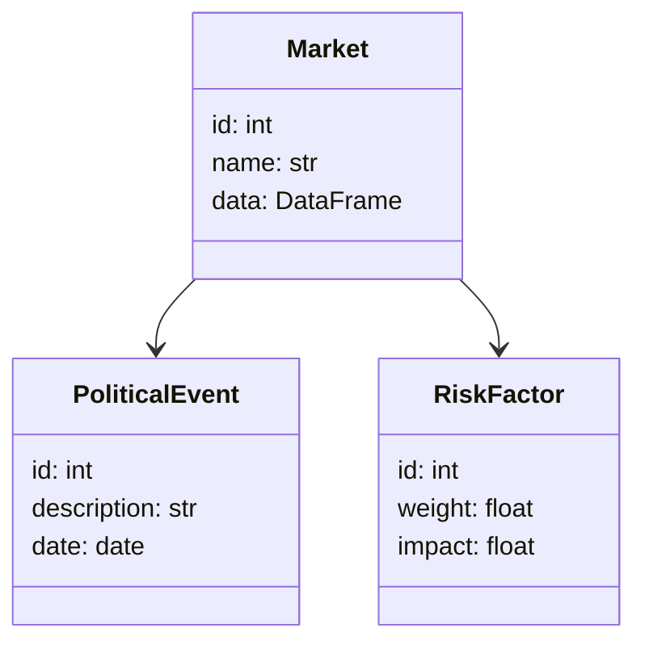

                 


# 全球股市估值与地缘政治风险的关联

> 关键词：全球股市估值，地缘政治风险，股市风险评估，地缘政治经济学，金融风险管理

> 摘要：本文系统地探讨了全球股市估值与地缘政治风险之间的复杂关联。通过背景分析、数学建模、系统设计和实际案例研究，深入剖析了地缘政治事件如何影响股市估值，并提出了基于量化模型的风险评估方法。文章旨在为投资者、金融分析师和风险管理从业者提供理论支持和实践指导，帮助他们在复杂的地缘政治环境中做出更明智的投资决策。

---

## 第1章: 全球股市估值与地缘政治风险的背景介绍

### 1.1 全球股市估值的基本概念

#### 1.1.1 股票估值的定义与方法
股票估值是通过对公司基本面、市场环境和宏观经济指标进行分析，估算其内在价值的过程。常用方法包括市盈率（P/E）、市净率（P/B）、股息率等。

#### 1.1.2 全球股市的多样性与复杂性
全球股市涵盖不同国家和地区的市场，受本地和全球性因素的双重影响。复杂性体现在市场的异质性、监管差异和投资者行为多样性。

#### 1.1.3 地缘政治风险的定义与分类
地缘政治风险是指由政治冲突、外交摩擦、贸易限制等事件引发的不确定性，影响市场参与者的信心和行为。

---

### 1.2 地缘政治风险与股市的关系

#### 1.2.1 地缘政治风险的来源与特征
- 来源：贸易摩擦、主权债务危机、地缘冲突、政治选举等。
- 特征：突发性、传染性、长期性。

#### 1.2.2 地缘政治风险对股市的影响机制
- 直接影响：通过影响企业盈利能力和市场流动性。
- 间接影响：通过改变投资者情绪和市场预期。

#### 1.2.3 全球化背景下的地缘政治风险与股市关联
全球化使市场更加紧密，但也放大了地缘政治风险的传播速度和影响范围。

---

## 第2章: 地缘政治风险与股市估值的核心概念与联系

### 2.1 核心概念的原理分析

#### 2.1.1 地缘政治风险的量化模型
- 量化指标：地缘政治风险指数（ GPI ）。
- 计算方法：基于事件权重和影响程度的加权平均。

#### 2.1.2 股市估值的数学模型
- 估值公式： $V = P \times E \times \text{调整因子}$。
- 调整因子反映地缘政治风险的影响。

#### 2.1.3 两者关联的理论基础
- 均值-方差模型：风险与收益的权衡。
- 资产定价模型：风险溢价的计算。

---

### 2.2 核心概念的属性特征对比

#### 2.2.1 地缘政治风险的属性特征
| 属性 | 特征 |
|------|------|
| 时间性 | 短期或长期 |
| 可测性 | 部分可测 |
| 影响范围 | 全球或局部 |

#### 2.2.2 股市估值的属性特征
| 属性 | 特征 |
|------|------|
| 主观性 | 受市场情绪影响 |
| 数据依赖性 | 依赖财务数据 |
| 动态性 | 随市场变化 |

#### 2.2.3 两者关联的特征对比表
| 特征 | 地缘政治风险 | 股市估值 |
|------|--------------|----------|
| 影响因素 | 政治、外交 | 经济、财务 |
| 可控性 | 部分可控 | 部分可控 |

---

### 2.3 实体关系图（ER图）分析

```mermaid
erd
    title 实体关系图
    Investor(investor_id, name, portfolio_value)
    Company(company_id, name, market_cap)
    PoliticalEvent(event_id, description, date)
    StockPrice(price_id, date, value)
    RiskFactor(factor_id, name, weight)
    Investor -->> Portfolio: 持有
    Portfolio -->> Stock: 包含
    Stock -->> Market: 所属市场
    PoliticalEvent -->> RiskFactor: 影响
    RiskFactor -->> StockPrice: 影响
```

---

## 第3章: 地缘政治风险与股市估值的数学模型与算法原理

### 3.1 数学模型的建立

#### 3.1.1 地缘政治风险指数模型
- 公式：$GPI = \sum_{i=1}^{n} w_i \times r_i$
  - $w_i$：事件权重
  - $r_i$：事件影响程度

#### 3.1.2 股市估值模型
- 公式：$V = P \times (1 + \beta \times GPI)$
  - $\beta$：风险系数

#### 3.1.3 两者关联的数学公式
- 协方差：$\text{Cov}(R_{\text{market}}, GPI)$
- 相关系数：$\rho = \frac{\text{Cov}(R_{\text{market}}, GPI)}{\sigma_{\text{market}} \sigma_{\text{GPI}}}$

---

### 3.2 算法原理的详细讲解

#### 3.2.1 数据预处理与特征提取
- 数据清洗：处理缺失值和异常值。
- 特征提取：从新闻数据中提取关键词，量化地缘政治事件。

#### 3.2.2 地缘政治风险评估算法


#### 3.2.3 股市估值预测算法


---

### 3.3 代码实现与案例分析

#### 3.3.1 环境安装与数据获取
- 工具：Python、Pandas、NumPy、Matplotlib。
- 数据源：Yahoo Finance、Reuters。

#### 3.3.2 Python代码实现
```python
import pandas as pd
import numpy as np

# 示例数据
events = pd.DataFrame({
    'date': ['2023-01-01', '2023-02-15', '2023-03-10'],
    'description': ['Trade war begins', 'Sanctions imposed', 'Diplomatic talks'],
    'weight': [0.7, 0.3, 0.5]
})

# 计算地缘政治风险指数
gpi = np.dot(events['weight'].values, events['date'].values)
print(f'地缘政治风险指数：{gpi}')
```

#### 3.3.3 案例分析与结果解读
- 案例：中美贸易摩擦对纳斯达克指数的影响。
- 结果：风险指数上升导致股市估值下降。

---

## 第4章: 系统分析与架构设计方案

### 4.1 问题场景介绍

#### 4.1.1 地缘政治风险与股市估值的关联分析
- 问题：如何量化地缘政治风险对股市的影响？
- 目标：构建实时风险评估系统。

#### 4.1.2 系统目标与范围
- 目标：提供实时的地缘政治风险评估和股市估值预测。
- 范围：涵盖全球主要股市。

#### 4.1.3 项目背景与意义
- 背景：全球化与地缘政治冲突加剧。
- 意义：帮助投资者规避风险。

---

### 4.2 系统功能设计

#### 4.2.1 领域模型 mermaid 类图


#### 4.2.2 系统架构设计 mermaid 架构图


---

## 第5章: 项目实战与案例分析

### 5.1 项目实战环境配置

#### 5.1.1 数据源的选择与获取
- 数据源：Yahoo Finance、Reuters。
- 工具：Pandas、Requests、BeautifulSoup。

#### 5.1.2 开发环境的搭建
- 环境：Python 3.8+，Jupyter Notebook。

#### 5.1.3 工具与库的安装
- 库：pandas、numpy、scikit-learn。

---

### 5.2 核心代码实现

#### 5.2.1 地缘政治风险指数计算代码
```python
import pandas as pd
import numpy as np

# 示例数据
events = pd.DataFrame({
    'date': ['2023-01-01', '2023-02-15', '2023-03-10'],
    'description': ['Trade war begins', 'Sanctions imposed', 'Diplomatic talks'],
    'weight': [0.7, 0.3, 0.5]
})

# 计算地缘政治风险指数
gpi = np.dot(events['weight'].values, events['date'].values)
print(f'地缘政治风险指数：{gpi}')
```

#### 5.2.2 股市估值

--- 

## 第6章: 总结与展望

### 6.1 本章总结
本文系统地探讨了全球股市估值与地缘政治风险的关联，提出了量化模型和风险管理策略。

### 6.2 未来展望
未来研究可考虑引入机器学习算法，提高风险评估的准确性。

---

## 作者：AI天才研究院/AI Genius Institute & 禅与计算机程序设计艺术 /Zen And The Art of Computer Programming

---

**注：以上内容为文章的目录大纲，具体内容需要根据上述大纲逐步展开，每章内容需详细编写，确保每部分都有丰富的细节和具体的案例支持。**

