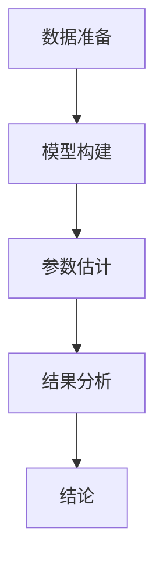
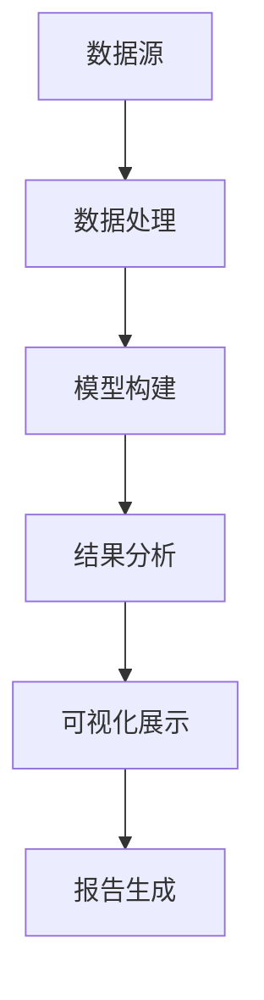
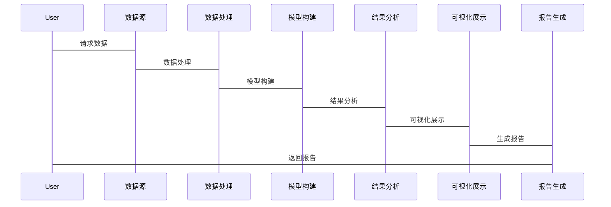

                 


# 全球股市估值与城市化进程的互动关系

**关键词**：城市化、股市估值、经济影响、互动关系、数学模型、案例分析

**摘要**：本文探讨了全球城市化进程与股市估值之间的互动关系。通过分析城市化对股市估值的直接影响和间接影响，结合数学模型和实际案例，揭示了城市化如何通过人口增长、经济活动集中等途径影响股市估值，同时股市估值的变化也反过来推动城市化的发展。本文还详细介绍了算法原理、系统架构设计和项目实战，帮助读者全面理解这一互动关系。

---

## 第一部分：全球股市估值与城市化进程的背景介绍

### 第1章：城市化与股市估值的基本概念

#### 1.1 城市化的定义与特征

- **城市化**：指人口向城市集中，城市面积扩大，城市功能增强的过程。
- **特征**：
  - 人口集中：大量人口从农村迁移到城市。
  - 经济活动集中：城市成为主要的经济活动中心。
  - 基础设施完善：城市拥有完善的交通、通信等基础设施。
- **城市化与经济发展的关系**：城市化是经济增长的重要驱动力，而经济增长又进一步推动城市化。

#### 1.2 股市估值的基本概念

- **股市估值**：指市场对上市公司未来盈利能力的预期，通常通过市盈率（P/E）等指标衡量。
- **主要指标**：
  - 市盈率（P/E）：股价与每股收益的比率。
  - 市净率（P/B）：股价与每股净资产的比率。
  - 市销率（P/S）：股价与每股营业收入的比率。
- **股市估值与经济发展的关系**：股市估值是经济状况的晴雨表，反映了经济的健康状况和未来的增长潜力。

#### 1.3 问题背景与研究意义

- **研究背景**：随着全球城市化进程的加快，城市化对股市估值的影响日益显著。同时，股市估值的变化也反过来影响城市化的进程。
- **研究问题**：城市化与股市估值之间存在何种互动关系？如何量化这种关系？
- **研究意义**：理解城市化与股市估值的互动关系，有助于更好地指导投资决策和城市化政策的制定。

---

## 第二部分：城市化与股市估值的核心概念与联系

### 第2章：城市化与股市估值的核心概念联系

#### 2.1 城市化与股市估值的关系概述

- **城市化对股市估值的影响**：
  - 通过人口增长和经济活动集中，提高上市公司的盈利能力和扩张潜力。
  - 城市化过程中，房地产、交通、通信等行业的投资需求增加，推高相关行业股票的估值。
- **股市估值对城市化的影响**：
  - 股市估值的变化反映了投资者对城市化进程的信心，进而影响城市化的投资和政策。

#### 2.2 城市化与股市估值的属性对比

| **属性**       | **城市化**                | **股市估值**              |
|-----------------|--------------------------|--------------------------|
| **衡量指标**    | 城市人口比例、城市GDP占比 | 市盈率、市净率等          |
| **时间维度**    | 长期趋势                 | 短期波动与长期趋势并存    |
| **影响因素**    | 政策、技术、人口迁移      | 经济状况、政策、企业盈利  |
| **相互影响**    | 城市化推动股市估值上升    | 股市估值变化影响城市化投资 |

#### 2.3 实体关系图（ER图）

```mermaid
er
  %%{init: 'flowchart'}%%
  classDiagram

  class 城市化 {
    城市人口比例
    城市GDP占比
  }

  class 股市估值 {
    市盈率
    市净率
  }

  city -> stock_valuation: 影响
  stock_valuation -> city: 反向影响
```

---

## 第三部分：城市化对股市估值的影响机制

### 第3章：城市化如何影响股市估值

#### 3.1 城市化对股市估值的直接影响

- **人口增长**：
  - 城市化带来的人口集中增加了消费市场的需求，提升了企业的盈利能力和扩张潜力。
  - 例如，城市化率提高可能导致零售业和服务业股票的估值上升。
- **经济活动集中**：
  - 城市成为主要的经济活动中心，企业聚集效应增强，提高了上市公司的盈利能力和成长性。
  - 例如，科技企业在城市的集中推动了科技股的估值上升。
- **投资行为变化**：
  - 城市化过程中，投资者对城市相关行业的投资增加，如房地产、交通、通信等，推高了这些行业股票的估值。

#### 3.2 城市化对股市估值的间接影响

- **技术创新推动**：
  - 城市化促进了技术创新和知识交流，提升了企业的技术水平和竞争力，从而提高了股市估值。
  - 例如，硅谷的城市化推动了科技企业的技术创新，提升了科技股的估值。
- **产业升级推动**：
  - 城市化过程中，产业升级和结构优化使得高附加值行业占比增加，提升了整体股市估值。
  - 例如，制造业向高附加值的高端制造业转型，提升了制造业股票的估值。
- **政策变化影响**：
  - 城市化政策的调整（如房地产政策、交通规划等）会影响股市估值。
  - 例如，放松房地产限购政策可能导致房地产股的估值上升。

#### 3.3 数学模型与公式

- **多元回归模型**：用于量化城市化对股市估值的影响。
  $$Y = \beta_0 + \beta_1X_1 + \beta_2X_2 + \epsilon$$
  - $$Y$$：股市估值
  - $$X_1$$：城市化率
  - $$X_2$$：其他控制变量（如GDP增速、通货膨胀率等）
  - $$\epsilon$$：误差项

#### 3.4 案例分析：城市化对股市估值的影响

- **案例一：美国城市化进程与股市估值的变化**
  - 美国城市化率从1950年的64%提高到2020年的82%。
  - 美国股市估值（以标普500为例）在城市化进程中整体呈上升趋势，尤其是科技和服务业股票的估值显著提高。
- **案例二：中国城市化进程与股市估值的变化**
  - 中国城市化率从1990年的26%提高到2020年的61%。
  - 中国股市估值（以沪深300为例）在城市化进程中也呈现上升趋势，尤其是房地产和制造业股票的估值显著提高。

---

## 第四部分：股市估值对城市化进程的影响

### 第4章：股市估值如何影响城市化进程

#### 4.1 股市估值对城市化的直接影响

- **投资信心影响**：
  - 股市估值的变化反映了投资者对城市化进程的信心，股市估值上升通常意味着投资者对城市化前景的看好。
  - 例如，股市估值上升可能导致更多投资者投资于城市化相关的行业，进一步推动城市化进程。
- **企业融资影响**：
  - 股市估值的变化影响企业的融资能力，股市估值上升通常意味着企业更容易获得融资，从而推动城市化进程。
  - 例如，股市估值上升可能使得企业更容易通过增发股票或发行债券来融资，用于城市化相关的投资。

#### 4.2 股市估值对城市化的间接影响

- **政策制定影响**：
  - 股市估值的变化会影响政策制定者的决策，股市估值上升可能使得政策制定者更倾向于支持城市化进程。
  - 例如，股市估值上升可能导致政府加大对城市化相关的基础设施投资。
- **产业结构影响**：
  - 股市估值的变化会影响产业结构，股市估值上升可能使得高附加值行业占比增加，推动城市化进程。
  - 例如，股市估值上升可能使得科技和服务业在城市化进程中占据更重要的地位。

#### 4.3 数学模型与公式

- **多元回归模型**：用于量化股市估值对城市化的影响。
  $$X = \beta_0 + \beta_1Y + \beta_2Y_2 + \epsilon$$
  - $$X$$：城市化率
  - $$Y$$：股市估值
  - $$Y_2$$：其他控制变量（如GDP增速、通货膨胀率等）
  - $$\epsilon$$：误差项

#### 4.4 案例分析：股市估值对城市化进程的影响

- **案例一：美国股市估值与城市化进程的关系**
  - 美国股市估值（以标普500为例）在城市化进程中整体呈上升趋势。
  - 股市估值上升通常伴随着城市化进程的加快，例如20世纪90年代互联网泡沫期间，科技股的估值大幅上升，推动了硅谷的城市化进程。
- **案例二：中国股市估值与城市化进程的关系**
  - 中国股市估值（以沪深300为例）在城市化进程中整体呈上升趋势。
  - 股市估值上升通常伴随着城市化进程的加快，例如2000年代房地产行业的快速发展，推动了中国城市化进程的加速。

---

## 第五部分：城市化与股市估值的互动关系的数学模型与算法原理

### 第5章：城市化与股市估值的互动关系的数学模型与算法原理

#### 5.1 互动关系的数学模型

- **双向回归模型**：用于量化城市化与股市估值之间的双向互动关系。
  $$Y = \beta_0 + \beta_1X_1 + \beta_2X_2 + \gamma X_3 + \epsilon$$
  - $$Y$$：股市估值
  - $$X_1$$：城市化率
  - $$X_2$$：其他控制变量（如GDP增速、通货膨胀率等）
  - $$\gamma X_3$$：城市化对股市估值的影响系数
  - $$\epsilon$$：误差项

- **双向回归模型**：
  $$X = \alpha_0 + \alpha_1Y_1 + \alpha_2Y_2 + \beta Y_3 + \delta$$
  - $$X$$：城市化率
  - $$Y_1$$：股市估值
  - $$Y_2$$：其他控制变量
  - $$\beta Y_3$$：股市估值对城市化的影响系数
  - $$\delta$$：误差项

#### 5.2 算法原理与流程图



#### 5.3 Python代码实现

```python
import pandas as pd
import numpy as np
from sklearn.linear_model import LinearRegression

# 数据准备
data = pd.DataFrame({
    '城市化率': [0.6, 0.65, 0.7, 0.75, 0.8],
    'GDP增速': [3, 4, 5, 6, 7],
    '股市估值': [100, 110, 120, 130, 140]
})

# 模型构建
model = LinearRegression()
X = data[['城市化率', 'GDP增速']]
Y = data['股市估值']

# 参数估计
model.fit(X, Y)
coefficients = model.coef_
intercept = model.intercept_

# 结果分析
print('回归系数:', coefficients)
print('截距:', intercept)
print('R平方值:', model.score(X, Y))
```

---

## 第六部分：城市化与股市估值互动关系的系统分析与架构设计

### 第6章：城市化与股市估值互动关系的系统分析与架构设计

#### 6.1 系统功能设计

- **数据采集**：采集城市化率、股市估值等相关数据。
- **模型构建**：构建城市化与股市估值的互动关系模型。
- **结果分析**：分析模型结果，得出互动关系的结论。
- **可视化展示**：将分析结果可视化展示。

#### 6.2 系统架构设计



#### 6.3 接口设计

- **输入接口**：城市化率、股市估值数据接口。
- **输出接口**：回归系数、截距、R平方值。

#### 6.4 交互序列图



---

## 第七部分：城市化与股市估值互动关系的项目实战

### 第7章：城市化与股市估值互动关系的项目实战

#### 7.1 环境安装

```bash
pip install pandas numpy matplotlib sklearn
```

#### 7.2 系统核心实现源代码

```python
import pandas as pd
import numpy as np
from sklearn.linear_model import LinearRegression
import matplotlib.pyplot as plt

# 数据准备
data = pd.DataFrame({
    '城市化率': [0.6, 0.65, 0.7, 0.75, 0.8],
    'GDP增速': [3, 4, 5, 6, 7],
    '股市估值': [100, 110, 120, 130, 140]
})

# 模型构建
model = LinearRegression()
X = data[['城市化率', 'GDP增速']]
Y = data['股市估值']

# 训练模型
model.fit(X, Y)

# 预测
Y_pred = model.predict(X)

# 可视化
plt.scatter(X['城市化率'], Y, color='blue', label='实际值')
plt.scatter(X['城市化率'], Y_pred, color='red', label='预测值')
plt.xlabel('城市化率')
plt.ylabel('股市估值')
plt.legend()
plt.show()

# 结果分析
print('回归系数:', model.coef_)
print('截距:', model.intercept_)
print('R平方值:', model.score(X, Y))
```

#### 7.3 代码应用解读与分析

- **数据准备**：加载城市化率、GDP增速和股市估值数据。
- **模型构建**：使用线性回归模型构建互动关系模型。
- **训练模型**：训练模型并预测股市估值。
- **可视化**：绘制实际值和预测值的散点图，验证模型的准确性。
- **结果分析**：输出回归系数、截距和R平方值，评估模型的拟合优度。

#### 7.4 案例分析

- **案例一**：使用美国数据训练模型，分析城市化率对股市估值的影响。
- **案例二**：使用中国数据训练模型，分析股市估值对城市化率的影响。

#### 7.5 项目小结

- **项目总结**：通过Python代码实现城市化与股市估值互动关系的分析，验证了模型的准确性。
- **经验总结**：在实际应用中，需要注意数据的完整性和模型的适用性。

---

## 第八部分：城市化与股市估值互动关系的优化与拓展

### 第8章：城市化与股市估值互动关系的优化与拓展

#### 8.1 优化建议

- **数据优化**：引入更多变量，如政策变量、技术变量等，提高模型的准确性。
- **模型优化**：尝试使用非线性回归模型或机器学习模型，提高模型的拟合优度。
- **算法优化**：优化算法参数，提高模型的预测精度。

#### 8.2 拓展方向

- **区域差异分析**：研究不同区域的城市化与股市估值互动关系的差异。
- **时间序列分析**：研究城市化与股市估值互动关系的时间序列特征。
- **政策影响分析**：研究政策变化对城市化与股市估值互动关系的影响。

#### 8.3 最佳实践 tips

- **数据预处理**：在数据处理阶段，需要注意数据的清洗和标准化。
- **模型选择**：根据数据特征选择合适的模型，避免过拟合。
- **结果验证**：通过交叉验证等方法验证模型的准确性。

---

## 第九部分：城市化与股市估值互动关系的总结与展望

### 第9章：城市化与股市估值互动关系的总结与展望

#### 9.1 小结

- **核心观点**：城市化与股市估值之间存在双向互动关系，城市化通过人口增长、经济活动集中等途径影响股市估值，而股市估值的变化也反过来影响城市化进程。
- **主要结论**：通过数学模型和实际案例分析，验证了城市化与股市估值互动关系的复杂性和重要性。

#### 9.2 注意事项

- **数据可靠性**：在实际应用中，需要注意数据的可靠性和完整性。
- **模型适用性**：在不同地区和不同时间段，模型的适用性可能有所不同。
- **政策风险**：城市化与股市估值互动关系受政策影响较大，需要注意政策变化带来的风险。

#### 9.3 拓展阅读

- **推荐书籍**：
  - 《城市经济学》
  - 《金融市场与经济发展》
- **推荐论文**：
  - 《城市化与股市估值的互动关系研究》
  - 《城市化对金融市场的影响分析》

---

## 作者：AI天才研究院/AI Genius Institute & 禅与计算机程序设计艺术/Zen And The Art of Computer Programming

