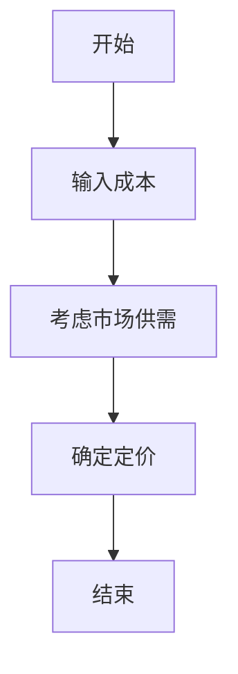
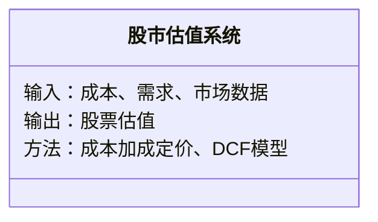

                 


# 全球股市估值与基因治疗定价模式的关系

---

## 关键词：全球股市估值、基因治疗定价模式、股票估值、基因治疗、定价策略

---

## 摘要：  
本文探讨了全球股市估值与基因治疗定价模式之间的关系。通过分析股市估值的核心方法和基因治疗的定价策略，揭示两者在技术原理、市场影响和数学模型上的联系。文章结合数学模型、系统架构设计和实际案例，深入分析了基因治疗定价模式对股市估值的影响，为投资者和生物科技公司提供了新的视角和决策依据。

---

# 第一部分：全球股市估值与基因治疗定价模式的背景与基础

## 第1章：全球股市估值与基因治疗定价模式概述

### 1.1 全球股市估值的现状与挑战  
#### 1.1.1 全球股市估值的基本概念  
股市估值是指通过对公司财务数据和市场环境的分析，评估其股票的内在价值。常见的估值指标包括市盈率（PE）、市净率（P/B）和现金流折现模型（DCF）等。  

#### 1.1.2 当前股市估值的主要方法  
1. **市盈率（PE）**：基于公司当前或预期的每股收益，计算股票的合理价格。  
2. **市净率（P/B）**：基于公司每股净资产，适用于重资产行业。  
3. **现金流折现模型（DCF）**：通过预测公司未来现金流并折现，计算其内在价值。  

#### 1.1.3 股市估值的挑战与不确定性  
股市估值受到市场情绪、宏观经济环境和公司业绩的多重影响，具有高度不确定性。  

### 1.2 基因治疗的发展与定价问题  
#### 1.2.1 基因治疗的定义与技术进展  
基因治疗是一种通过基因编辑技术修复或替换缺陷基因的治疗方法，近年来随着CRISPR技术的发展，基因治疗取得了显著进展。  

#### 1.2.2 基因治疗的市场现状  
基因治疗市场快速增长，但其高研发成本和复杂性使得定价成为难题。  

#### 1.2.3 基因治疗定价的主要挑战  
1. **高研发成本**：基因治疗的研发周期长、成本高。  
2. **市场稀缺性**：基因治疗针对罕见病，市场容量有限。  
3. **政策监管**：定价需符合医保政策和监管要求。  

### 1.3 股市估值与基因治疗定价模式的关系  
#### 1.3.1 两者的联系与区别  
- **联系**：基因治疗的定价影响相关企业的市值，进而影响股市估值。  
- **区别**：股市估值是市场行为，基因治疗定价是企业决策。  

#### 1.3.2 基因治疗定价对股市估值的影响  
基因治疗的高定价可能提升相关企业的市值，但也可能引发市场质疑。  

#### 1.3.3 从定价模式到估值模型的演变  
基因治疗的定价模式为股市估值提供了新的参考指标，推动了估值模型的创新。  

---

## 第2章：股市估值的核心概念与数学模型

### 2.1 股市估值的基本原理  
#### 2.1.1 股票价值的定义  
股票价值是投资者对公司未来现金流的预期折现值。  

#### 2.1.2 股票价值的决定因素  
1. **盈利能力**：净利润率、ROE等指标。  
2. **成长性**：收入和利润的增速。  
3. **市场风险**：Beta系数。  

#### 2.1.3 股票定价的市场机制  
市场机制通过供需关系和投资者情绪影响股票价格。  

### 2.2 常见的股市估值方法  
#### 2.2.1 市盈率（PE）模型  
$$ PE = \frac{\text{股价}}{\text{每股收益}} $$  

#### 2.2.2 市净率（P/B）模型  
$$ P/B = \frac{\text{股价}}{\text{每股净资产}} $$  

#### 2.2.3 现金流折现模型（DCF）  
$$ V = \sum_{t=1}^{n} \frac{CF_t}{(1+r)^t} + \frac{TV}{(1+r)^n} $$  
其中，$V$ 是企业价值，$CF_t$ 是第$t$年的现金流，$r$ 是折现率，$TV$ 是终值。  

### 2.3 基因治疗定价的特殊性  
#### 2.3.1 基因治疗的成本构成  
1. **研发成本**：临床试验、专利费用等。  
2. **生产成本**：基因编辑技术的规模化生产成本。  

#### 2.3.2 基因治疗的定价策略  
1. **成本加成定价法**：$P = C \times (1 + r)$，其中$C$是成本，$r$是加成率。  
2. **市场供需定价法**：根据市场供需关系确定价格。  

---

## 第3章：基因治疗定价模式的数学模型与算法

### 3.1 基因治疗定价的基本模型  
#### 3.1.1 成本加成定价法  
$$ P = C \times (1 + r) $$  

#### 3.1.2 市场供需定价法  
$$ P = a \times Q + b $$  
其中，$Q$是需求量，$a$和$b$是常数。  

### 3.2 基因治疗定价的算法实现  
#### 3.2.1 算法流程图  


#### 3.2.2 算法实现代码  
```python
def gene_treatment_pricing(cost, market_supply):
    # 成本加成定价
    price = cost * (1 + 0.3)  # 假设加成率30%
    # 考虑市场供需调整
    if market_supply > 100:
        price *= 0.9
    elif market_supply < 50:
        price *= 1.1
    return price
```

### 3.3 算法的数学模型与公式  
#### 3.3.1 成本加成定价公式  
$$ P = C \times (1 + r) $$  

#### 3.3.2 市场供需影响的定价公式  
$$ P = a \times Q + b $$  

---

## 第4章：股市估值与基因治疗定价模式的系统架构

### 4.1 系统分析与需求分析  
#### 4.1.1 问题场景介绍  
基因治疗企业的定价策略直接影响其市值，进而影响股市估值。  

#### 4.1.2 项目目标与范围  
构建一个基于基因治疗定价模式的股市估值系统。  

### 4.2 系统架构设计  
#### 4.2.1 分层架构设计  


#### 4.2.2 系统功能设计  
1. 数据采集：收集基因治疗企业的成本、需求和市场数据。  
2. 模型计算：使用成本加成定价和DCF模型计算股票估值。  
3. 结果输出：生成股票估值报告。  

---

## 第5章：基因治疗定价模式对股市估值的案例分析

### 5.1 案例背景  
以某基因治疗公司为例，假设其研发成本为$100$百万，市场需求为$80$。  

### 5.2 定价模型计算  
使用成本加成定价法，假设加成率为30%：  
$$ P = 100 \times 1.3 = 130 $$  

### 5.3 股票估值计算  
使用DCF模型计算企业价值：  
$$ V = \sum_{t=1}^{5} \frac{CF_t}{(1+0.1)^t} + \frac{TV}{(1+0.1)^5} $$  
假设$CF_t = 30$百万，$TV = 200$百万，计算得出企业价值为$150$百万。  

### 5.4 结果分析  
基因治疗定价对股市估值的影响显著，需结合市场环境和企业策略进行调整。  

---

## 第6章：总结与展望

### 6.1 研究总结  
基因治疗定价模式对股市估值具有重要影响，需结合数学模型和实际案例进行深入分析。  

### 6.2 研究的局限性  
本文仅考虑了基因治疗的定价策略，未涉及更复杂的市场因素。  

### 6.3 未来研究方向  
1. 结合更多市场变量进行定价模型优化。  
2. 研究基因治疗定价对投资者行为的影响。  

---

## 作者：AI天才研究院/AI Genius Institute & 禅与计算机程序设计艺术/Zen And The Art of Computer Programming

