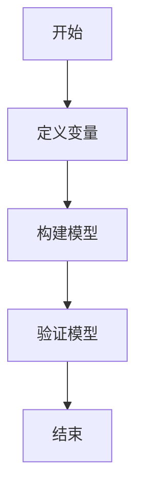
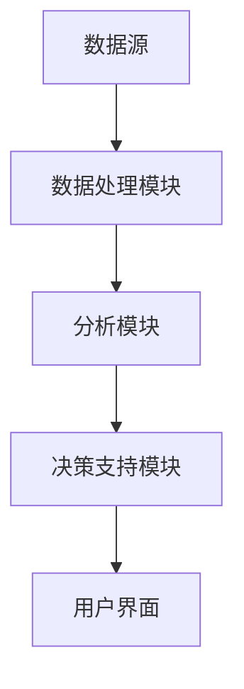

                 


# 全球股市估值与基因疗法保险覆盖模式的关系

> 关键词：全球股市估值、基因疗法、保险覆盖模式、数学模型、系统架构

> 摘要：本文探讨全球股市估值与基因疗法保险覆盖模式之间的关系，通过分析基因疗法的技术进步、市场需求以及保险覆盖模式对股市估值的影响，构建数学模型和系统架构，结合实际案例分析，为投资者和保险公司提供参考。

---

## 引言

全球股市估值与基因疗法保险覆盖模式的关系是一个复杂的交叉领域，涉及金融、生物技术和保险等多个领域。随着基因疗法的快速发展，其在医疗领域的应用越来越广泛，而保险覆盖模式的创新也在不断影响股市估值。本文将从背景介绍、核心概念、数学模型、系统设计、项目实战等方面，详细探讨这一关系。

---

## 第一部分：全球股市估值与基因疗法保险覆盖模式的背景介绍

### 第1章：全球股市估值的基本概念

#### 1.1 股市估值的定义与重要性

股市估值是指对上市公司股票的内在价值进行评估的过程，是投资者进行投资决策的重要依据。股市估值的准确性直接影响市场的资源配置效率和投资者的收益。

#### 1.2 股市估值的主要方法

- **相对估值法**：通过比较公司与同行业公司的市盈率、市净率等指标进行估值。
- **绝对估值法**：基于公司未来的现金流，使用贴现模型（如DCF模型）进行估值。
- **指数估值法**：通过分析市场整体指数的波动情况来评估股市的整体估值水平。

### 第2章：基因疗法的发展现状

#### 2.1 基因疗法的定义与技术特点

基因疗法是一种通过修改患者基因组来治疗疾病的方法，具有精准治疗、疗效持久等技术优势，但也面临技术复杂性和高昂成本的挑战。

#### 2.2 基因疗法的临床应用现状

基因疗法已在遗传病、癌症等领域取得显著进展，但其大规模应用仍受制于技术成熟度和成本问题。

---

## 第二部分：基因疗法保险覆盖模式与股市估值的关系

### 第3章：基因疗法对股市估值的影响

#### 3.1 基因疗法的技术进步对股市估值的推动作用

基因疗法的技术突破可以显著提升相关公司的股票价值，吸引更多投资者。

#### 3.2 基因疗法的市场需求对股市估值的影响

市场需求的增加会推动相关股票价格上涨，但市场需求的波动也会带来股市估值的不确定性。

### 第4章：保险覆盖模式对基因疗法的影响

#### 4.1 保险覆盖模式的类型

- **按揭式保险**：患者分期支付保险费用。
- **结果导向保险**：根据治疗效果支付保险费用。

#### 4.2 保险覆盖模式对基因疗法推广的作用

保险覆盖的扩展可以降低患者的经济负担，促进基因疗法的广泛应用，从而提升相关公司的股市估值。

---

## 第三部分：基因疗法保险覆盖模式的数学模型与算法

### 第5章：基因疗法保险覆盖模式的数学模型

#### 5.1 成本-效果分析模型

构建基因疗法的治疗成本与治疗效果之间的关系模型，评估保险覆盖的经济效益。

#### 5.2 风险评估模型

通过概率分析模型，评估基因疗法治疗失败的风险及其对保险覆盖的影响。

#### 5.3 数学模型的mermaid流程图



---

## 第四部分：系统分析与架构设计

### 第6章：基因疗法保险覆盖模式的系统架构

#### 6.1 系统功能设计

- 数据收集模块：收集基因疗法的成本、效果等数据。
- 分析模块：利用数学模型分析保险覆盖的经济效益。
- 决策支持模块：为保险公司和投资者提供决策支持。

#### 6.2 系统架构设计



---

## 第五部分：项目实战与案例分析

### 第7章：基因疗法保险覆盖模式的项目实现

#### 7.1 环境配置

安装必要的Python库，如numpy、pandas、scikit-learn。

#### 7.2 数据处理与建模

使用Python代码对基因疗法的成本数据进行分析，构建成本-效果模型。

```python
import numpy as np
import pandas as pd

# 假设df为基因疗法数据
df = pd.DataFrame({
    '治疗成本': [100000, 150000, 200000],
    '治疗效果': [0.8, 0.9, 0.7]
})

# 计算成本-效果比
cost_effectiveness = df['治疗成本'] / df['治疗效果']
print(cost_effectiveness)
```

#### 7.3 案例分析

以某家基因疗法公司为例，分析其保险覆盖模式对股市估值的影响。

---

## 结论与展望

本文系统探讨了全球股市估值与基因疗法保险覆盖模式的关系，通过数学模型和系统架构设计，分析了保险覆盖模式对股市估值的具体影响。未来的研究可以进一步结合更多实际案例，优化数学模型，为投资者和保险公司提供更精准的决策支持。

---

## 作者信息

作者：AI天才研究院/AI Genius Institute & 禅与计算机程序设计艺术 /Zen And The Art of Computer Programming

---

本文通过详细分析基因疗法的技术进步、保险覆盖模式的创新及其对股市估值的影响，为相关领域的研究者和实践者提供了有价值的参考。

