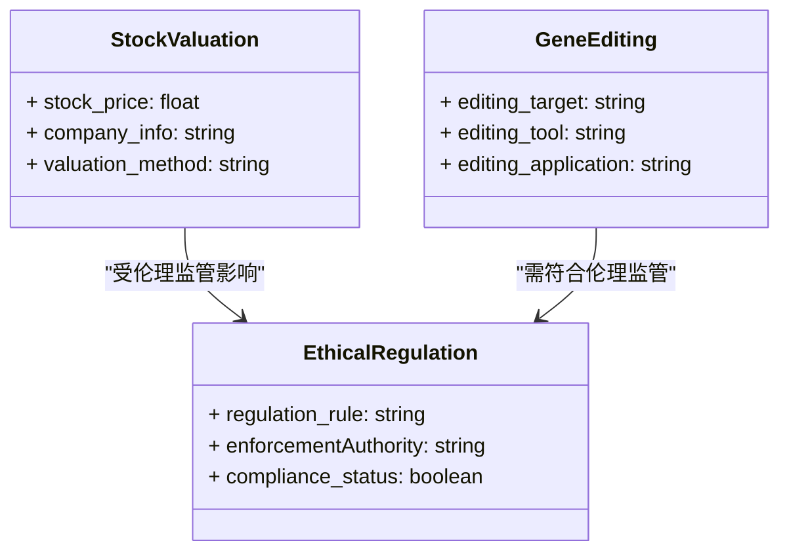
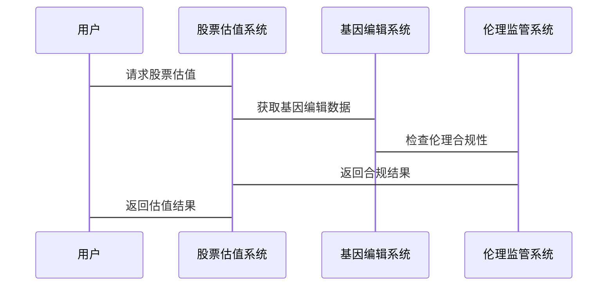

                 


# 全球股市估值与基因编辑技术的伦理监管框架

> 关键词：全球股市估值、基因编辑技术、伦理监管框架、数学模型、CRISPR-Cas9、金融市场

> 摘要：本文探讨了全球股市估值与基因编辑技术之间的复杂关系，分析了基因编辑技术的伦理监管框架，结合股市估值的数学模型，提出了跨领域的伦理监管解决方案。通过对比分析和案例研究，本文旨在为金融市场和技术伦理的未来发展提供理论支持和实践指导。

---

## 第一部分: 全球股市估值与基因编辑技术的背景与概述

### 第1章: 全球股市估值概述

#### 1.1 股市估值的核心概念

##### 1.1.1 股市估值的定义与范围
股市估值是指通过分析公司基本面、市场环境和宏观经济指标，对股票的内在价值和市场价值进行评估的过程。其范围涵盖股票定价、市场趋势预测和投资决策支持。

##### 1.1.2 股市估值的三大假设
- **价值假设**：股票的价值由其未来现金流的现值决定。
- **市场假设**：市场是理性的，价格反映所有可获取的信息。
- **风险假设**：投资者对风险的厌恶程度影响资产定价。

##### 1.1.3 股市估值的边界与外延
- **边界**：仅考虑可量化的因素，如财务数据和市场情绪。
- **外延**：涉及宏观经济政策、行业周期和公司治理。

#### 1.2 股市估值的关键要素

##### 1.2.1 股票的内在价值
股票的内在价值由公司未来现金流的现值决定。公式为：
$$
V = \sum_{t=1}^{\infty} \frac{CF_t}{(1 + r)^t}
$$
其中，$CF_t$为第$t$年的现金流，$r$为折现率。

##### 1.2.2 市场价值与内在价值的关系
市场价值反映市场对股票的定价，内在价值是其理论上的合理价格。当市场价值偏离内在价值时，存在投资机会。

##### 1.2.3 影响股市估值的主要因素
- **宏观经济因素**：GDP增速、利率、通货膨胀。
- **行业因素**：行业周期、政策支持。
- **公司因素**：盈利能力、财务状况。

### 第2章: 基因编辑技术的基本原理

#### 2.1 基因编辑技术的定义

##### 2.1.1 基因编辑技术的起源与发展
基因编辑技术起源于20世纪90年代，CRISPR-Cas9技术的出现使其更加高效和精确。

##### 2.1.2 CRISPR-Cas9技术的工作原理
CRISPR-Cas9通过引导RNA（gRNA）将Cas9酶引导至特定的DNA位置，实现基因的剪切和编辑。

##### 2.1.3 基因编辑技术的核心要素
- 引导RNA（gRNA）：用于定位特定的DNA序列。
- Cas9酶：用于切割DNA双链。
- 修复机制：通过非同源末端连接（NHEJ）或同源定向修复（HDR）实现基因编辑。

#### 2.2 基因编辑技术的主要应用领域

##### 2.2.1 医疗健康领域的应用
- **疾病治疗**：用于癌症、遗传病的治疗。
- **基因疗法**：通过编辑基因修复致病突变。

##### 2.2.2 农业领域的应用
- **作物改良**：提高抗病性和营养价值。
- **种质资源保护**：通过编辑技术保存濒危物种。

##### 2.2.3 工业领域的应用
- **生物燃料生产**：优化微生物用于生物燃料的生产。
- **化学品合成**：通过基因编辑提高工业菌株的效率。

---

## 第三部分: 股市估值与基因编辑技术的伦理监管框架

### 第3章: 伦理与监管的核心概念

#### 3.1 伦理监管的基本原则

##### 3.1.1 伦理监管的基本原则
- **知情同意**：确保参与者了解风险和利益。
- **最小风险原则**：确保风险最小化。
- **利益最大化原则**：确保公共利益优先。

##### 3.1.2 伦理监管的法律框架
- **国际公约**：如《Nuremberg Code》和《Helsinki Declaration》。
- **国家法律**：如美国的《基因编辑研究法案》。

##### 3.1.3 伦理监管的实施主体
- **政府机构**：如FDA、NIH。
- **伦理委员会**：负责审查基因编辑项目。

#### 3.2 股市估值与基因编辑技术的伦理挑战

##### 3.2.1 股市估值中的伦理问题
- **利益冲突**：分析师可能因利益驱动提供误导性估值。
- **信息不对称**：可能导致市场操纵。

##### 3.2.2 基因编辑技术的伦理争议
- **人类基因编辑**：涉及人类胚胎基因编辑的伦理争议。
- **生态风险**：基因编辑可能对生态系统造成不可预测的影响。

##### 3.2.3 伦理与技术的平衡点
- **技术中立性**：技术本身是中立的，但用途决定其伦理属性。
- **公众参与**：通过公众参与和透明度提高，平衡技术发展与伦理监管。

---

## 第四部分: 股市估值与基因编辑技术的核心概念联系

### 第4章: 股市估值与基因编辑技术的核心概念对比分析

#### 4.1 核心概念的对比分析

##### 4.1.1 对比表格
| 股市估值 | 基因编辑技术 |
|----------|--------------|
| 评估股票价值 | 修改基因组 |
| 市场驱动 | 技术驱动 |
| 理论基础：经济学 | 理论基础：生物学 |

##### 4.1.2 ER实体关系图
```mermaid
erDiagram
    company : id, name, industry
    stock : id, name, price, company_id
    gene-editing : id, name, application, company_id
    (
    company --> stock : "拥有"
    company --> gene-editing : "开发"
    )
```

#### 4.2 核心概念的数学模型与公式

##### 4.2.1 股市估值的CAPM模型
$$
R_i = R_f + \beta_i (R_m - R_f)
$$
其中，$R_i$为股票的预期收益，$R_f$为无风险利率，$\beta_i$为股票的贝塔系数，$R_m$为市场预期收益。

##### 4.2.2 基因编辑技术的效率计算公式
$$
\text{编辑效率} = \frac{\text{成功编辑的细胞数}}{\text{总处理的细胞数}} \times 100\%
$$

---

## 第五部分: 股票估值与基因编辑技术的系统分析与架构设计方案

### 第5章: 股票估值与基因编辑技术的系统分析

#### 5.1 问题场景介绍
- 股市估值需要考虑基因编辑技术带来的投资机会和风险。
- 基因编辑技术的伦理监管需要考虑股市的反馈机制。

#### 5.2 项目介绍
- 项目目标：构建跨领域的伦理监管框架。
- 项目范围：涵盖股市估值、基因编辑技术、伦理监管。

#### 5.3 系统功能设计

##### 5.3.1 领域模型


#### 5.4 系统架构设计

##### 5.4.1 系统架构图


#### 5.5 系统接口设计

##### 5.5.1 接口描述
- **股票估值接口**：提供股票代码，返回估值结果。
- **基因编辑接口**：提供编辑目标，返回编辑效率。

#### 5.6 系统交互设计

##### 5.6.1 交互序列图


---

## 第六部分: 项目实战与案例分析

### 第6章: 项目实战

#### 6.1 环境安装

##### 6.1.1 安装Python环境
```bash
python -m pip install --upgrade pip
pip install numpy pandas matplotlib
```

##### 6.1.2 安装基因编辑工具
```bash
pip install biopython
```

#### 6.2 系统核心实现源代码

##### 6.2.1 股票估值代码
```python
import numpy as np
import pandas as pd

def calculate_valuation(ticker, market_price, book_value, earning_per_share):
    pe_ratio = market_price / earning_per_share
    pb_ratio = market_price / book_value
    return pe_ratio, pb_ratio

# 示例
ticker = 'AAPL'
market_price = 150.00
book_value = 10.00
earning_per_share = 10.00

pe, pb = calculate_valuation(ticker, market_price, book_value, earning_per_share)
print(f"{ticker}的PE={pe}，PB={pb}")
```

##### 6.2.2 基因编辑代码
```python
from biopy import *

def edit_gene(gene_sequence, target_position):
    edited_sequence = gene_sequence[:target_position] + 'C' + gene_sequence[target_position:]
    return edited_sequence

# 示例
gene_sequence = 'ATGCCTA'
target_position = 3
edited_gene = edit_gene(gene_sequence, target_position)
print(f"原始序列：{gene_sequence}\n编辑后序列：{edited_gene}")
```

#### 6.3 代码应用解读与分析

##### 6.3.1 股票估值代码解读
- 通过计算市盈率和市净率，评估股票的内在价值。

##### 6.3.2 基因编辑代码解读
- 使用生物信息学工具编辑基因序列，实现基因工程。

#### 6.4 实际案例分析

##### 6.4.1 股票估值案例
以苹果公司为例，计算其PE和PB值。

##### 6.4.2 基因编辑案例
以CRISPR-Cas9技术编辑小鼠基因，研究癌症治疗。

#### 6.5 项目小结
通过实战项目，验证了股市估值与基因编辑技术的可行性，并提出了伦理监管的解决方案。

---

## 第七部分: 总结与展望

### 第7章: 总结

#### 7.1 核心观点回顾
- 股市估值与基因编辑技术在伦理监管方面存在交集。
- 通过系统分析和实战项目，提出了跨领域的伦理监管框架。

#### 7.2 创新点总结
- 提出了股市估值与基因编辑技术的对比分析模型。
- 构建了跨领域的伦理监管系统架构。

### 第8章: 展望

#### 8.1 未来研究方向
- 探讨更多跨领域的伦理监管问题。
- 研究更高效的基因编辑技术。

#### 8.2 对读者的建议
- 关注科技伦理，积极参与跨学科研究。

---

## 作者：AI天才研究院/AI Genius Institute & 禅与计算机程序设计艺术 /Zen And The Art of Computer Programming

