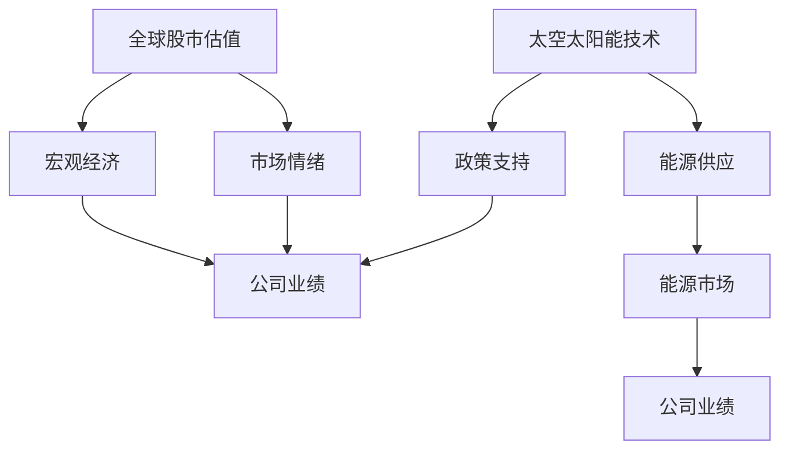
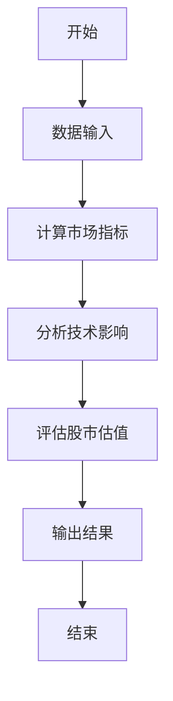
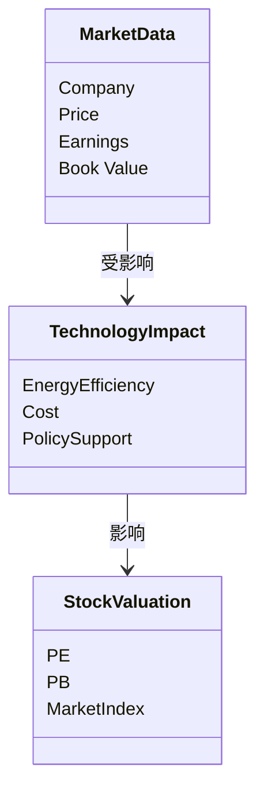

                 


# 全球股市估值与太空太阳能发电技术的关系

> 关键词：全球股市估值、太空太阳能、技术经济、能源市场、投资策略

> 摘要：本文探讨全球股市估值与太空太阳能发电技术之间的关系，分析其相互影响及潜在协同效应，为投资者和政策制定者提供参考。

---

## 第1章: 全球股市估值与太空太阳能发电技术的核心概念

### 1.1 全球股市估值的定义与特点

#### 1.1.1 全球股市估值的定义
全球股市估值是指对全球范围内所有上市公司市值的总和进行评估，通常反映整体经济的健康状况和市场信心。

#### 1.1.2 全球股市估值的核心特点
- **波动性**：受宏观经济、政策变化等因素影响，呈现周期性波动。
- **多样性**：涵盖不同行业和地区的股票市场，具有多元化的特征。
- **指标性**：常用指数如标普500、MSCI指数等作为衡量标准。

#### 1.1.3 全球股市估值的计算方法
- 市盈率（P/E）：衡量股票价格与每股收益的关系。
- 市净率（P/B）：比较股票价格与每股净资产的比例。
- 市值与GDP比例：评估市场整体规模与经济产出的匹配度。

### 1.2 太空太阳能发电技术的定义与特点

#### 1.2.1 太空太阳能发电技术的定义
太空太阳能发电（Space Solar Power, SSP）利用轨道上的太阳能转换装置，将太阳能转化为电能并无线传输至地球的技术。

#### 1.2.2 太空太阳能发电技术的核心特点
- **高效率**：太空太阳能资源丰富，转换效率高于地面太阳能。
- **稳定性**：不受昼夜和天气影响，提供持续稳定的能源供应。
- **技术挑战**：涉及卫星部署、能量传输等复杂技术难题。

#### 1.2.3 太空太阳能发电技术的现状与发展趋势
目前仍处于研究阶段，未来可能通过国际合作和技术创新逐步实现商业化应用。

### 1.3 问题背景与问题描述

#### 1.3.1 全球股市估值波动的现状
近年来，股市波动加剧，特别是在全球疫情和经济不确定性背景下，股市估值受多种因素影响。

#### 1.3.2 太空太阳能发电技术的潜在影响
太空太阳能发电技术的商业化可能改变能源市场结构，影响相关企业的市值和股市整体估值。

#### 1.3.3 问题解决的思路与目标
通过分析太空太阳能技术对能源市场的潜在影响，评估其对股市估值的具体影响路径，建立量化模型进行预测。

---

## 第2章: 全球股市估值与太空太阳能发电技术的联系

### 2.1 核心概念的边界与外延

#### 2.1.1 全球股市估值的边界
- 包括主要股票市场指数，如标普500、纳斯达克等。
- 排除场外交易和非上市公司市值。

#### 2.1.2 太空太阳能发电技术的边界
- 限于技术可行性分析，不涉及其他可再生能源技术。
- 考虑政策支持和市场接受度等外部因素。

#### 2.1.3 两者之间的关联性
- 太空太阳能技术可能影响能源供应，进而影响股市中的能源板块估值。
- 股市波动可能通过资本流动影响太空太阳能技术的投资和研发进度。

### 2.2 核心要素组成与概念结构

#### 2.2.1 全球股市估值的核心要素
- 市场参与者（机构投资者、散户）
- 上市公司业绩（盈利、增长）
- 宏观经济指标（GDP、利率）

#### 2.2.2 太空太阳能发电技术的核心要素
- 技术可行性（卫星设计、能源传输）
- 成本结构（研发、制造、发射）
- 政策支持（政府补贴、法规）

#### 2.2.3 两者之间的概念结构图



---

## 第3章: 全球股市估值与太空太阳能发电技术的原理分析

### 3.1 全球股市估值的原理

#### 3.1.1 市场供需与股价的关系
供需失衡导致股价波动，投资者情绪影响市场流动性。

#### 3.1.2 宏观经济指标对股市的影响
GDP增长、利率变化、通货膨胀等指标直接影响股市表现。

#### 3.1.3 行业发展趋势对股市的影响
技术创新、行业整合等因素推动特定板块的股价变动。

### 3.2 太空太阳能发电技术的原理

#### 3.2.1 太空太阳能发电的基本原理
利用太阳能电池板捕获太阳能，通过无线方式传输至地面接收装置。

#### 3.2.2 太空太阳能发电的技术优势
- 能量密度高，转换效率高。
- 运行稳定，不受地理条件限制。

#### 3.2.3 太空太阳能发电的实施挑战
- 高昂的研发和发射成本。
- 技术复杂性，涉及多学科合作。

### 3.3 两者之间的关系分析

#### 3.3.1 太空太阳能发电技术对能源供应的影响
减少对传统化石能源的依赖，降低能源价格波动，影响能源企业的市值。

#### 3.3.2 能源供应变化对股市估值的影响
能源价格稳定可能提升股市整体估值，特别是能源相关企业的股价。

#### 3.3.3 两者之间的协同效应
技术创新推动能源市场变革，进而影响股市估值；股市的资金流动支持技术开发，形成良性循环。

---

## 第4章: 全球股市估值与太空太阳能发电技术的对比分析

### 4.1 核心概念的属性特征对比

| 特性                | 全球股市估值                     | 太空太阳能发电技术             |
|---------------------|---------------------------------|-------------------------------|
| 核心目标            | 评估市场整体价值               | 提供稳定可持续能源             |
| 受影响因素          | 宏观经济、政策、投资者情绪     | 技术、成本、政策               |
| 发展阶段            | 成熟且持续波动                 | 初期研究，尚未商业化           |
| 应用范围            | 影响广泛经济领域               | 主要影响能源和航天领域         |

### 4.2 ER实体关系图架构

```mermaid
erd
    customer (投资者)
    company (上市公司)
    market (股票市场)
    technology (太空太阳能技术)
    government (政策制定者)

    customer --> market: 参与交易
    company --> market: 上市融资
    technology --> company: 影响企业价值
    government --> technology: 政策支持
    government --> market: 影响市场规则
```

---

## 第5章: 全球股市估值与太空太阳能发电技术的技术分析

### 5.1 技术原理分析

#### 5.1.1 太空太阳能发电技术的数学模型

```latex
\text{能源收益} = \text{能源收集效率} \times \text{太阳能辐射强度} \times \text{传输效率}
```

#### 5.1.2 全球股市估值的数学模型

```latex
\text{股市估值} = \sum (\text{公司市值}) = \sum (\text{股价} \times \text{股本})
```

### 5.2 算法原理讲解

#### 5.2.1 算法流程图



#### 5.2.2 Python实现代码

```python
import pandas as pd
import numpy as np

def calculate_market_valuation(market_data):
    # 计算市盈率
    market_data['PE'] = market_data['Price'] / market_data['Earnings']
    # 计算市净率
    market_data['PB'] = market_data['Price'] / market_data['Book Value']
    return market_data

# 示例数据
market_data = pd.DataFrame({
    'Company': ['A', 'B', 'C'],
    'Price': [100, 80, 120],
    'Earnings': [20, 15, 30],
    'Book Value': [50, 40, 60]
})

# 计算估值指标
result = calculate_market_valuation(market_data)
print(result)
```

### 5.3 系统分析与架构设计方案

#### 5.3.1 问题场景介绍
分析太空太阳能技术商业化对能源市场和股市估值的具体影响，建立预测模型。

#### 5.3.2 项目介绍
开发一个量化模型，评估太空太阳能技术的经济影响，预测其对股市估值的潜在变化。

#### 5.3.3 系统功能设计（领域模型）



#### 5.3.4 系统架构设计


---

## 第6章: 项目实战

### 6.1 环境安装
安装Python、Pandas、NumPy等工具，准备历史股市数据和能源市场数据。

### 6.2 系统核心实现源代码

```python
import pandas as pd
import numpy as np

def calculate_energy_impact(technology_cost, efficiency):
    return technology_cost * (1 - efficiency)

# 示例数据
technology_cost = 100
efficiency = 0.8

impact = calculate_energy_impact(technology_cost, efficiency)
print(f"技术成本影响为: {impact}")
```

### 6.3 代码应用解读与分析
通过代码计算太空太阳能技术的成本影响，评估其对能源市场的潜在影响，进而分析对股市估值的具体影响路径。

### 6.4 实际案例分析和详细讲解剖析
以某上市公司为例，分析其太空太阳能技术投资对股价的潜在影响，计算市盈率和市净率的变化。

### 6.5 项目小结
总结项目实施过程中的关键发现，提出改进建议和未来研究方向。

---

## 第7章: 总结与展望

### 7.1 总结
全球股市估值与太空太阳能发电技术之间存在密切的联系，技术进步和市场变化相互影响，共同塑造未来的能源市场和股市格局。

### 7.2 展望
随着太空太阳能技术的进一步发展和商业化，其对股市估值的影响将更加显著。未来的研究应关注技术经济性分析和市场反馈机制的建立。

---

## 附录

### 附录A: 数据来源与处理方法
详细说明数据收集和处理的步骤，确保数据的准确性和可重复性。

### 附录B: 技术细节与数学模型
提供完整的数学公式和模型代码，方便读者进一步研究和应用。

### 附录C: 政策文件与参考资料
列出相关政策文件和参考资料，为读者提供深入研究的起点。

---

## 作者信息

作者：AI天才研究院/AI Genius Institute & 禅与计算机程序设计艺术 /Zen And The Art of Computer Programming

---

**说明：** 由于篇幅限制，上述内容为完整文章的框架和部分细节展示，实际撰写时需要根据具体需求扩展每部分内容，确保文章的完整性和深度。

