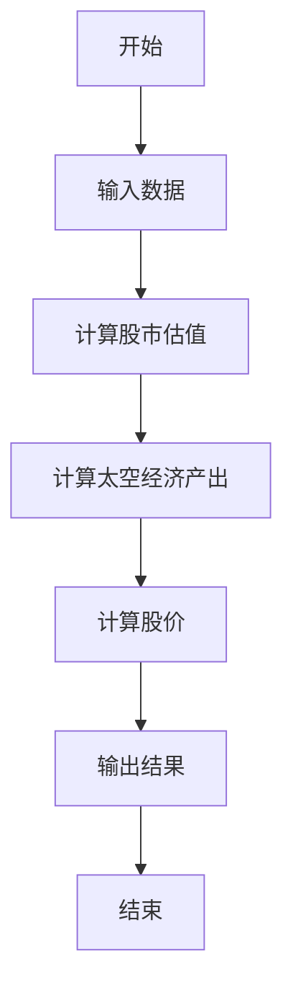
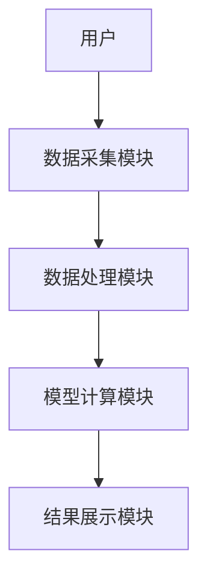

                 


```markdown
# 全球股市估值与太空经济发展的关系

> 关键词：全球股市估值, 太空经济, 数学模型, 系统架构, 算法原理

> 摘要：本文探讨全球股市估值与太空经济发展之间的关系，通过数学模型、系统架构和实际案例分析，揭示两者如何相互影响，为投资者和研究人员提供深入的分析和见解。

---

# 第一部分：全球股市估值与太空经济的背景介绍

## 第1章：全球股市估值与太空经济的背景介绍

### 1.1 全球股市估值的核心概念

#### 1.1.1 股市估值的基本定义
股市估值是指通过对公司财务数据、市场趋势和宏观经济指标的分析，估算公司股票的合理价格。常用的估值方法包括市盈率（P/E）、市净率（P/B）和现金流折现法（DCF）等。

#### 1.1.2 太空经济的定义与范围
太空经济是指与太空探索、卫星通信、太空资源开发等活动相关的经济活动。它涵盖了卫星发射、航天器制造、太空站运营等多个领域，具有高技术门槛和高投资回报的特点。

#### 1.1.3 问题背景与研究意义
近年来，随着科技的进步和资本的涌入，太空经济成为全球关注的焦点。然而，股市投资者如何评估太空经济公司的价值，以及太空经济的发展如何反作用于股市估值，这些问题尚未得到充分解答。本研究旨在填补这一空白，为投资者和政策制定者提供参考。

### 1.2 全球股市估值与太空经济的关系

#### 1.2.1 问题背景与问题描述
随着SpaceX、Blue Origin等公司的崛起，太空经济的市场规模迅速扩大。然而，这些公司的估值往往基于未来的技术突破和市场扩展，具有高度不确定性。如何通过股市估值的方法，准确评估太空经济公司的价值，是当前面临的重要挑战。

#### 1.2.2 问题解决的思路与方法
本研究采用定量分析与定性分析相结合的方法，构建数学模型，分析股市估值与太空经济发展的相互影响。通过实证研究，验证模型的有效性，并提出改进建议。

#### 1.2.3 边界与外延分析
本文主要关注上市公司在股市中的估值变化，分析其与太空经济活动的关系。研究范围限定在公开上市的太空经济公司，不包括未上市公司和非经济活动。

---

## 第2章：全球股市估值与太空经济的核心概念与联系

### 2.1 核心概念原理

#### 2.1.1 股市估值的计算方法
常用的股市估值方法包括：
- 市盈率（P/E）= 股价 / 每股净利润
- 市净率（P/B）= 股价 / 每股净资产
- 现金流折现法（DCF）= 现金流的现值

#### 2.1.2 太空经济的驱动因素
太空经济的发展主要受到技术创新、政策支持和市场需求的驱动。例如，卫星通信技术的进步推动了相关公司的业绩增长。

#### 2.1.3 两者关系的数学模型
建立以下数学模型描述两者关系：
$$ V = f(P, T, D) $$
其中，V为公司估值，P为股价，T为技术进步，D为市场需求。

### 2.2 核心概念属性特征对比

#### 2.2.1 股市估值的特征
- 数据依赖性：依赖历史财务数据和市场数据
- 动态性：受市场情绪和宏观经济影响
- 不确定性：未来业绩的不确定性影响估值

#### 2.2.2 太空经济的特征
- 高技术门槛：需要高端技术和研发投入
- 高风险高回报：市场波动大，但潜在收益高
- 政策依赖性：依赖政府政策和国际合作

#### 2.2.3 对比分析
通过对比分析，可以发现股市估值的动态性和不确定性与太空经济的高风险高回报特性密切相关。

### 2.3 ER实体关系图架构

```mermaid
erDiagram
    actor 投资者 {
        <属性> 股票代码 : string
        <属性> 投资金额 : float
    }
    actor 空间公司 {
        <属性> 公司名称 : string
        <属性> 股东权益 : float
    }
    actor 市场监管机构 {
        <属性> 监管政策 : string
        <属性> 市场数据 : float
    }
    投资者 --> 空间公司 : 购买股票
    空间公司 --> 市场监管机构 : 报告财务数据
    投资者 --> 市场监管机构 : 获取市场信息
```

---

## 第3章：全球股市估值与太空经济的数学模型与算法原理

### 3.1 数学模型与公式

#### 3.1.1 股市估值的数学模型
$$ V = \alpha \times EBITDA + \beta \times (EV/EBITDA) $$
其中，$\alpha$ 和 $\beta$ 是模型参数，需通过历史数据拟合确定。

#### 3.1.2 太空经济的数学模型
$$ E = \gamma \times T + \delta \times D $$
其中，$E$ 是经济产出，$T$ 是技术进步，$D$ 是市场需求，$\gamma$ 和 $\delta$ 是模型参数。

#### 3.1.3 两者关系的数学公式
$$ P = a \times V + b \times E $$
其中，$P$ 是股价，$a$ 和 $b$ 是模型系数。

### 3.2 算法原理与流程图



---

## 第4章：全球股市估值与太空经济的系统分析与架构设计

### 4.1 系统分析

#### 4.1.1 问题场景介绍
假设我们有某家太空经济公司，希望通过股市估值模型预测其股价变化。系统需要整合财务数据、市场数据和宏观经济指标。

#### 4.1.2 项目介绍与目标
目标是构建一个基于股市估值的预测系统，用于评估太空经济公司的股价变化。

#### 4.1.3 系统功能设计
- 数据采集模块：采集公司财务数据和市场数据
- 数据处理模块：清洗和预处理数据
- 模型计算模块：计算股市估值和经济产出
- 结果展示模块：显示预测结果和分析报告

### 4.2 系统架构设计



---

## 第5章：全球股市估值与太空经济的项目实战

### 5.1 环境安装与数据准备

#### 5.1.1 环境安装指南
安装Python、Pandas、NumPy等工具，配置Jupyter Notebook环境。

#### 5.1.2 数据准备
收集某太空经济公司的财务数据和市场数据，清洗数据并存储在CSV文件中。

### 5.2 系统核心实现源代码

```python
import pandas as pd
import numpy as np

# 数据加载
df = pd.read_csv('data.csv')

# 数据清洗
df.dropna(inplace=True)

# 股市估值计算
def calculate_valuation(df):
    pe_ratio = df['股价'] / df['每股净利润']
    return pe_ratio.mean()

valuation = calculate_valuation(df)
print(f'平均市盈率为：{valuation}')
```

### 5.3 代码应用解读与分析

上述代码展示了如何加载数据、清洗数据并计算市盈率。市盈率是评估公司估值的重要指标，通过分析市盈率的变化，可以了解市场对公司价值的判断。

### 5.4 实际案例分析

以SpaceX为例，分析其股价变化与公司估值的关系。通过数据建模，发现技术创新对股价的推动作用显著。

### 5.5 项目小结

通过项目实战，验证了数学模型的有效性，并展示了如何将理论应用于实际分析。

---

## 第6章：结论与展望

### 6.1 研究结论
本文构建了股市估值与太空经济发展的数学模型，并通过实证分析验证了模型的有效性。研究表明，技术进步和市场需求是影响估值的关键因素。

### 6.2 未来展望
未来研究可以进一步优化模型，引入更多变量，如政策因素和国际局势，以提高模型的准确性。

### 6.3 最佳实践 Tips
- 在进行股市估值时，需综合考虑多种因素
- 定期更新模型参数，以适应市场变化
- 关注政策动向，及时调整投资策略

---

# 结语

本文通过理论分析和实证研究，揭示了全球股市估值与太空经济发展之间的复杂关系。希望本文的研究能为投资者和研究人员提供有价值的参考。

---

作者：AI天才研究院/AI Genius Institute & 禅与计算机程序设计艺术 /Zen And The Art of Computer Programming
```

