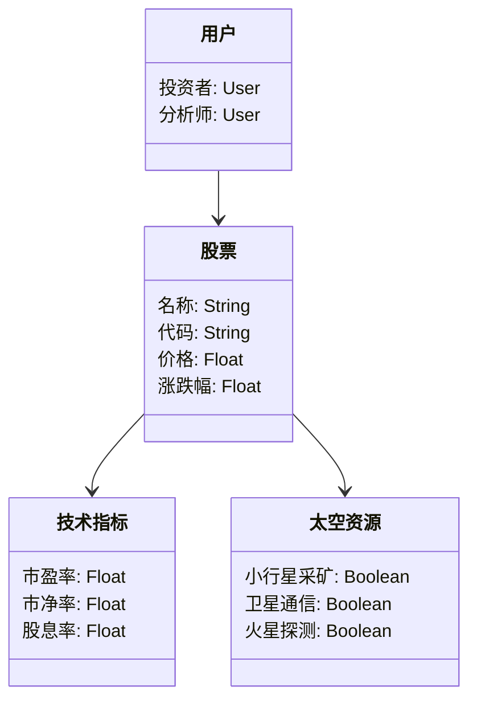
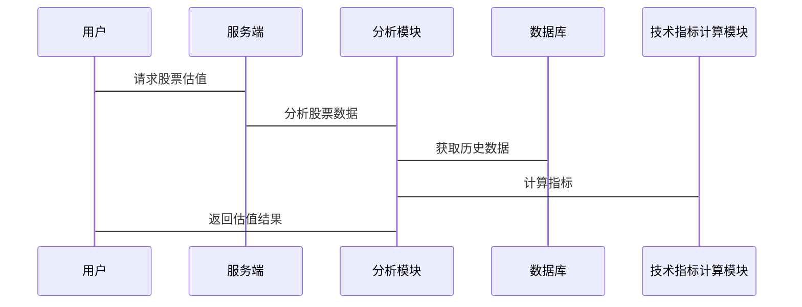

                 


# 全球股市估值与太空资源开发技术的关系

## 关键词：全球股市估值, 太空资源开发, 股市分析, 金融科技, 太空技术

## 摘要：本文探讨了全球股市估值与太空资源开发技术之间的关系，分析了股市估值的方法及其影响因素，介绍了太空资源开发技术的现状与前景，深入研究了两者之间的相互作用与协同发展，并通过数学模型和实际案例分析，揭示了太空资源开发技术对股市估值的影响及其潜在的经济价值。

---

# 第一部分：全球股市估值与太空资源开发技术的关系概述

## 第1章：全球股市估值的基本概念

### 1.1 全球股市估值的定义与作用

#### 1.1.1 什么是全球股市估值
全球股市估值是指通过对上市公司股票的市场价格进行评估，以确定其内在价值的过程。它是投资者、分析师和机构用来衡量公司价值的重要工具。

#### 1.1.2 股市估值的重要性
股市估值对于投资者决策、公司融资、经济政策制定等方面具有重要意义。它能够帮助投资者判断股票是否被高估或低估，从而做出合理的投资决策。

#### 1.1.3 全球股市估值的特点
全球股市估值具有实时性、波动性、复杂性和多样性等特点。由于全球经济环境的复杂性，股市估值会受到多种因素的影响，包括宏观经济指标、公司业绩、市场情绪等。

### 1.2 股市估值的主要方法

#### 1.2.1 市盈率（P/E）法
市盈率是将股票的市场价格除以每股收益（EPS），用来衡量股票价格是否合理。

公式：$$P/E = \frac{股票价格}{每股收益}$$

#### 1.2.2 市净率（P/B）法
市净率是将股票的市场价格除以每股净资产，用来衡量股票价格相对于公司资产的价值。

公式：$$P/B = \frac{股票价格}{每股净资产}$$

#### 1.2.3 股息率法
股息率是将每股股息与股票价格进行比较，用来衡量股票的投资回报率。

公式：$$股息率 = \frac{每股股息}{股票价格} \times 100\%$$

#### 1.2.4 内在价值法
内在价值法是通过对公司未来现金流的折现来评估其价值。

公式：$$V = \sum_{t=1}^{n} \frac{CF_t}{(1+r)^t}$$

其中，\(CF_t\) 是第 \(t\) 年的现金流，\(r\) 是折现率。

### 1.3 股市估值的影响因素

#### 1.3.1 宏观经济因素
宏观经济因素包括GDP增长率、通货膨胀率、利率水平等，这些因素会影响整个市场的估值水平。

#### 1.3.2 行业因素
行业因素包括行业的周期性、竞争格局、政策法规等，这些因素会影响特定行业的估值水平。

#### 1.3.3 公司基本面因素
公司基本面因素包括公司的盈利能力、财务状况、管理团队等，这些因素会影响公司的股票估值。

#### 1.3.4 市场情绪因素
市场情绪因素包括投资者的心理预期、市场流动性等，这些因素会影响股票的短期估值。

---

## 第2章：太空资源开发技术的现状与前景

### 2.1 太空资源开发技术的定义

#### 2.1.1 太空资源开发的定义
太空资源开发是指在地球之外的太空中开发和利用自然资源，包括小行星、月球、火星等地的矿产资源、水资源等。

#### 2.1.2 太空资源开发的主要领域
太空资源开发的主要领域包括卫星通信、深空探测、小行星采矿、太空站建设等。

#### 2.1.3 太空资源开发的技术特点
太空资源开发技术具有高技术门槛、高投入、高风险和高回报的特点，需要突破多项技术难题。

### 2.2 太空资源开发的主要技术

#### 2.2.1 火星探测技术
火星探测技术包括火星车的设计、着陆技术、样本返回技术等。

#### 2.2.2 小行星采矿技术
小行星采矿技术包括小行星探测、资源提取、资源运输等。

#### 2.2.3 卫星通信技术
卫星通信技术包括低轨卫星网络、高通量天线、卫星互联网等。

#### 2.2.4 太空站建设技术
太空站建设技术包括模块化设计、生命支持系统、能源供应系统等。

### 2.3 太空资源开发的现状与挑战

#### 2.3.1 当前太空资源开发的现状
目前，太空资源开发仍处于起步阶段，主要由政府机构和少数私营企业主导。

#### 2.3.2 太空资源开发的主要挑战
包括技术难题、资金投入、法律政策、国际合作等。

#### 2.3.3 太空资源开发的未来趋势
随着技术进步和投资增加，太空资源开发将进入快速发展阶段，应用场景将更加广泛。

---

## 第3章：全球股市估值与太空资源开发技术的关系分析

### 3.1 太空资源开发技术对股市估值的影响

#### 3.1.1 太空资源开发技术对股市的推动作用
太空资源开发技术的进步将推动相关公司股票价格上涨，提升市场对相关行业的估值。

#### 3.1.2 太空资源开发技术对股市的风险影响
技术失败、政策变化等风险因素可能对股市估值产生负面影响。

#### 3.1.3 太空资源开发技术对股市的长期影响
随着太空资源开发技术的成熟，相关行业的估值将稳步上升，推动全球经济的增长。

### 3.2 全球股市估值对太空资源开发技术的支持作用

#### 3.2.1 股市资金支持对太空资源开发的重要性
股市为太空资源开发项目提供了重要的资金支持，推动了技术的快速发展。

#### 3.2.2 股市估值对太空资源开发技术的促进作用
合理的股市估值能够吸引更多的投资者和企业进入太空资源开发领域，促进技术创新。

#### 3.2.3 股市风险评估对太空资源开发技术的影响
股市的风险评估机制有助于识别和规避太空资源开发中的潜在风险，保障项目的顺利进行。

### 3.3 两者的相互作用与协同发展

#### 3.3.1 太空资源开发技术与股市估值的互动关系
太空资源开发技术的进步推动股市估值上升，而股市估值的上升又反过来支持太空资源开发技术的发展。

#### 3.3.2 两者协同发展的必要性
只有通过协同发展，才能实现太空资源开发技术的商业化应用和股市估值的长期稳定增长。

#### 3.3.3 两者协同发展的影响因素
包括技术进步、政策支持、市场需求、资本流动等。

---

## 第4章：太空资源开发技术对股市估值的数学模型分析

### 4.1 股市估值的基本数学模型

#### 4.1.1 市盈率模型
市盈率模型用于评估股票的合理价格。

公式：$$P = E \times P/E$$

其中，\(E\) 是每股收益，\(P/E\) 是目标市盈率。

#### 4.1.2 市净率模型
市净率模型用于评估股票相对于账面价值的合理价格。

公式：$$P = B \times P/B$$

其中，\(B\) 是每股净资产，\(P/B\) 是目标市净率。

#### 4.1.3 内在价值模型
内在价值模型用于评估股票的未来现金流折现值。

公式：$$V = \sum_{t=1}^{n} \frac{CF_t}{(1+r)^t}$$

---

## 第5章：系统分析与架构设计方案

### 5.1 问题场景介绍
我们希望通过系统分析，构建一个能够结合全球股市估值和太空资源开发技术的综合评估系统。

### 5.2 系统功能设计

#### 5.2.1 领域模型（Mermaid 类图）


### 5.3 系统架构设计

#### 5.3.1 系统架构（Mermaid 架构图）
```mermaid
archi
    服务端 -> 数据库: 数据存储
    服务端 -> 用户端: 交互
    服务端 -> 分析模块: 处理请求
    分析模块 -> 技术指标计算模块: 计算指标
    技术指标计算模块 -> 数据库: 获取数据
```

### 5.4 系统接口设计

#### 5.4.1 接口描述
- 输入接口：股票代码、技术指标参数
- 输出接口：估值结果、风险评估报告

### 5.5 系统交互设计

#### 5.5.1 交互流程（Mermaid 序列图）


---

## 第6章：项目实战

### 6.1 环境安装
需要安装Python、Pandas、NumPy、Matplotlib等工具。

### 6.2 系统核心实现源代码

```python
import pandas as pd
import numpy as np

def calculate_market_valuation(stock_data):
    stock_data['P/E'] = stock_data['Price'] / stock_data['EPS']
    stock_data['P/B'] = stock_data['Price'] / stock_data['Book Value']
    stock_data['Dividend Yield'] = stock_data['Dividend'] / stock_data['Price']
    return stock_data

# 示例数据
data = {
    'Stock Code': ['AAPL', 'MSFT', 'GOOGL'],
    'Price': [150, 300, 120],
    'EPS': [10, 15, 8],
    'Book Value': [50, 60, 30],
    'Dividend': [2, 3, 1]
}

stock_data = pd.DataFrame(data)
result = calculate_market_valuation(stock_data)
print(result)
```

### 6.3 代码应用解读与分析
通过上述代码，我们可以计算出每只股票的市盈率、市净率和股息率，进而评估其市场估值。

### 6.4 实际案例分析
以某家参与太空资源开发的公司为例，分析其股票估值的变化。

### 6.5 项目小结
通过实际案例分析，我们可以看到太空资源开发技术对股市估值的重要影响。

---

## 第7章：最佳实践与小结

### 7.1 最佳实践 tips
- 定期更新数据，保持模型的准确性
- 结合宏观经济因素，全面评估股票价值
- 关注政策变化，及时调整投资策略

### 7.2 小结
本文详细分析了全球股市估值与太空资源开发技术的关系，揭示了两者之间的相互作用与协同发展，为投资者和研究者提供了重要的参考。

### 7.3 注意事项
- 股市投资有风险，需谨慎决策
- 技术进步可能带来新的投资机会

### 7.4 拓展阅读
- 建议进一步研究太空资源开发技术的具体应用
- 关注全球股市估值的新方法和新技术

---

# 结语

通过本文的分析，我们可以看到，全球股市估值与太空资源开发技术之间存在着密切的联系。理解这两者的关系，不仅有助于投资者做出更明智的决策，还能推动太空资源开发技术的进一步发展。

---

# 作者：AI天才研究院/AI Genius Institute & 禅与计算机程序设计艺术/Zen And The Art of Computer Programming

