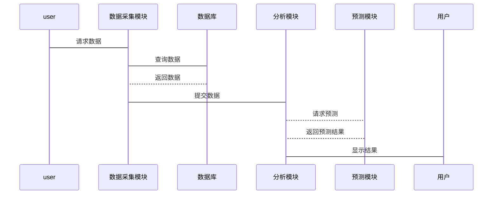

                 


# 全球股市估值与太空资源开发法律框架的关系

> 关键词：全球股市估值、太空资源开发、法律框架、市场分析、金融法律

> 摘要：本文探讨了全球股市估值与太空资源开发法律框架之间的复杂关系，分析了法律框架如何影响股市估值，以及股市估值对太空资源开发的反馈作用。通过案例分析、系统设计和项目实战，深入揭示了两者之间的相互作用和影响。

---

# 第一部分: 全球股市估值与太空资源开发法律框架的关系

## 第1章: 背景介绍

### 1.1 问题背景
#### 1.1.1 全球股市估值的重要性
全球股市估值是衡量市场健康状况的重要指标，影响投资者决策和经济政策。股市估值的波动反映了经济环境的变化，尤其是科技和法律因素的驱动。

#### 1.1.2 太空资源开发的法律框架
太空资源开发涉及国际法和各国国内法律，如《外空条约》和美国的太空资源法案。法律框架的不明确性对投资和市场估值产生直接影响。

#### 1.1.3 问题的提出与研究意义
随着太空探索的商业化，法律框架的不确定性增加了市场风险。研究股市估值与法律框架的关系，有助于优化投资策略，推动法律的完善。

#### 1.1.4 问题的边界与外延
研究聚焦于股市估值与法律框架的相互作用，排除了其他经济因素的影响。

### 1.2 问题描述
#### 1.2.1 全球股市估值的核心要素
包括市盈率（P/E）、市净率（P/B）、市值等指标。

#### 1.2.2 太空资源开发的法律框架
涵盖国际法、各国立法和法律挑战。

#### 1.2.3 问题解决的路径与方法
通过分析法律对市场的影响，构建数学模型，模拟市场反应。

### 1.3 核心概念结构与组成
#### 1.3.1 核心概念对比分析
| 概念 | 全球股市估值 | 太空资源开发法律框架 |
|------|--------------|------------------------|
| 定义 | 市场整体价值评估 | 调整太空资源开发的权利和义务 |
| 影响 | 投资者信心 | 政府政策和企业行为 |

#### 1.3.2 实体关系图（ER图）
```mermaid
erDiagram
    actor 投资者 {
        <name>
        <资产>
    }
    actor 政府机构 {
        <法规>
        <政策>
    }
    actor 企业 {
        <太空项目>
        <市场估值>
    }
    market Market {
        <市盈率>
        <市净率>
    }
    regulation LegalFramework {
        <国际法>
        <国内法>
    }
   投资者-->Market : 影响估值
    政府机构-->LegalFramework : 制定法规
    企业-->Market : 受法规影响
```

---

## 第2章: 全球股市估值的核心概念与原理

### 2.1 全球股市估值的基本概念
#### 2.1.1 市场估值的定义与分类
市场估值是基于市盈率、市净率等指标，评估市场的整体价值。

#### 2.1.2 市盈率与市净率的计算公式
市盈率 = 股价 / 每股收益  
市净率 = 股价 / 每股净资产

#### 2.1.3 市场指数与个股估值的关系
市场指数反映整体市场表现，个股估值基于其特性和市场环境。

### 2.2 太空资源开发的法律框架
#### 2.2.1 太空资源开发的国际法框架
《外空条约》规定太空资源用于和平目的，未明确所有权。

#### 2.2.2 各国太空资源开发法律的对比
美国允许商业开采，俄罗斯和中国有相关立法，但不够明确。

#### 2.2.3 太空资源开发的法律挑战
缺乏统一的国际法律，各国立法不一致。

### 2.3 核心概念的对比分析
#### 2.3.1 核心概念对比表格
| 概念 | 定义 | 影响因素 | 重要性 |
|------|------|----------|--------|
| 市场估值 | 市场整体价值 | 经济指标、政策 | 投资决策 |
| 法律框架 | 调整权利义务 | 国际法、政策 | 企业行为 |

#### 2.3.2 实体关系图（ER图）
```mermaid
erDiagram
    Market {
        <市盈率>
        <市净率>
    }
    LegalFramework {
        <国际法>
        <国内法>
    }
    Market --> LegalFramework : 受法律影响
    LegalFramework --> Market : 影响估值
```

---

## 第3章: 全球股市估值与太空资源开发法律框架的关系分析

### 3.1 全球股市估值与太空资源开发的相互作用
#### 3.1.1 太空资源开发对股市估值的影响
法律框架的明确性影响投资者信心，进而影响股市估值。

#### 3.1.2 全球股市估值对太空资源开发的反馈作用
股市估值波动影响企业融资能力，进而影响太空项目进展。

#### 3.1.3 两者关系的动态变化
法律框架的调整可能引发股市波动，而股市反应又推动法律的进一步完善。

### 3.2 全球股市估值与太空资源开发法律框架的相互影响
#### 3.2.1 法律框架对股市估值的直接影响
明确的法律框架降低投资风险，提升市场估值。

#### 3.2.2 股市估值对法律框架的间接影响
股市波动推动政府调整法律框架，以稳定市场。

#### 3.2.3 两者关系的复杂性与多样性
法律框架的复杂性和股市估值的多样性使得两者关系难以简单概括。

### 3.3 案例分析
#### 3.3.1 太空资源开发法律框架变化对股市的影响
美国通过太空资源法案后，相关企业股价上涨。

#### 3.3.2 全球股市估值波动对太空资源开发的启示
股市波动反映了投资者对法律框架的预期。

#### 3.3.3 经典案例的详细解读
美国SpaceX的估值受《外空条约》的影响。

---

## 第4章: 全球股市估值与太空资源开发法律框架的影响因素

### 4.1 经济因素
#### 4.1.1 经济周期对股市估值的影响
经济繁荣时股市估值上升，经济衰退时下降。

#### 4.1.2 太空资源开发成本与收益的经济分析
高成本和高回报并存，影响企业的投资决策。

#### 4.1.3 经济政策对法律框架的调整作用
政府通过政策调整法律框架，影响股市估值。

### 4.2 法律因素
#### 4.2.1 法律框架对股市估值的调节作用
明确的法律框架降低风险，提升估值。

#### 4.2.2 太空资源开发的法律风险与机遇
法律风险影响企业投资，法律机遇推动市场增长。

#### 4.2.3 法律框架的不确定性对股市的影响
不确定性增加市场波动，降低估值。

---

## 第5章: 系统分析与架构设计方案

### 5.1 问题场景介绍
分析法律框架变化对股市估值的影响，构建模型预测市场反应。

### 5.2 项目介绍
开发一个结合股市估值和法律框架的系统，模拟市场反应。

### 5.3 系统功能设计
- 数据采集模块：收集股市数据和法律框架信息。
- 分析模块：计算市盈率、市净率，评估法律影响。
- 预测模块：模拟市场反应，预测估值变化。

### 5.4 系统架构设计


### 5.5 系统接口设计
- 数据接口：与数据库交互。
- 用户接口：显示分析结果和预测模型。

### 5.6 系统交互序列图


---

## 第6章: 项目实战

### 6.1 环境安装
- 安装Python和相关库（Pandas、Matplotlib）。

### 6.2 核心实现源代码
```python
import pandas as pd
import matplotlib.pyplot as plt

# 数据加载
data = pd.read_csv('market_data.csv')

# 计算市盈率和市净率
data['PE'] = data['股价'] / data['每股收益']
data['PB'] = data['股价'] / data['每股净资产']

# 绘制图表
plt.figure(figsize=(10, 6))
plt.plot(data['日期'], data['PE'], label='PE')
plt.plot(data['日期'], data['PB'], label='PB')
plt.xlabel('日期')
plt.ylabel('比率')
plt.legend()
plt.show()
```

### 6.3 代码应用解读与分析
代码展示了如何计算市盈率和市净率，并可视化其变化趋势。

### 6.4 案例分析
分析某国太空资源开发法律变化对股市的影响，解释代码输出。

### 6.5 项目小结
项目展示了如何将法律框架与股市估值结合，提供决策支持。

---

## 第7章: 总结与展望

### 7.1 总结
本文探讨了全球股市估值与太空资源开发法律框架的关系，分析了其相互作用和影响因素。

### 7.2 小结
通过案例分析和系统设计，揭示了法律框架对股市估值的重要性。

### 7.3 注意事项
在实际应用中，需考虑更多变量，如国际政治因素。

### 7.4 拓展阅读
建议阅读更多关于金融建模和国际法的书籍。

---

作者：AI天才研究院/AI Genius Institute & 禅与计算机程序设计艺术 /Zen And The Art of Computer Programming

