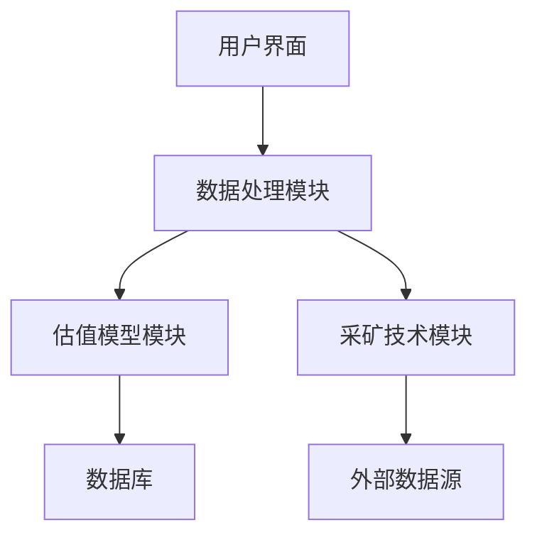
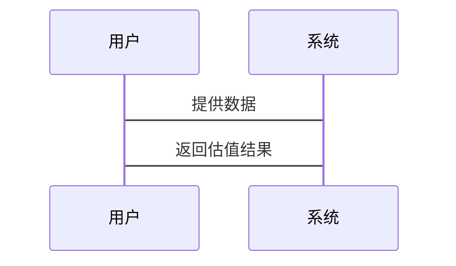

                 


# 全球股市估值与太空采矿技术的经济可行性

> 关键词：全球股市估值，太空采矿，经济可行性，投资分析，资源开发，技术经济

> 摘要：本文探讨了全球股市估值与太空采矿技术的经济可行性之间的关系。通过分析股市估值的核心方法与太空采矿技术的经济模型，揭示了太空资源开发对全球经济和股市估值的潜在影响。文章从背景介绍、核心概念、算法原理、数学模型、系统架构、项目实战到最佳实践等方面进行了全面解析，为投资者和科技爱好者提供了深入的见解。

---

# 第一部分: 全球股市估值与太空采矿技术的背景与核心概念

---

## 第1章: 全球股市估值的背景与现状

### 1.1 全球股市估值的基本概念

#### 1.1.1 股票估值的定义与意义
股票估值是通过对公司财务数据和市场环境的分析，评估其股票的内在价值。这不仅帮助投资者做出投资决策，还能反映市场的整体健康状况。

#### 1.1.2 全球股市的现状与发展趋势
全球股市经历了多次波动，从2008年金融危机到新冠疫情的影响，股市估值的波动性显著增加。近年来，科技股和新能源板块的崛起成为股市的重要驱动力。

#### 1.1.3 股市估值的核心要素与影响因素
- **核心要素**：市盈率（P/E）、市净率（P/B）、股息率、现金流、ROE等。
- **影响因素**：宏观经济环境、行业周期、政策变化、企业盈利能力和市场情绪。

### 1.2 太空采矿技术的背景与潜力

#### 1.2.1 太空资源的定义与分布
太空资源包括小行星、月球、火星等地的金属矿产、稀有金属和水资源。这些资源的开发潜力巨大，尤其是铂族金属和氦-3。

#### 1.2.2 太空采矿技术的发展现状
目前，太空采矿技术仍处于实验阶段，主要由私营公司如SpaceX、Blue Origin和Planetary Resources推动。NASA和ESA也支持相关研究。

#### 1.2.3 太空资源开发的经济潜力与挑战
- **经济潜力**：稀有金属的开发可能影响全球供应链，尤其是半导体行业。
- **挑战**：技术难度大、成本高、法律不完善。

### 1.3 股市估值与太空采矿的关联性

#### 1.3.1 太空资源开发对全球经济的影响
太空资源的开发可能改变全球资源分配，影响相关行业的供应链和成本结构。

#### 1.3.2 太空采矿技术对股市估值的潜在影响
- **直接影响**：相关企业的股票估值可能因技术突破而上升。
- **间接影响**：资源价格波动可能影响整个股市的估值。

#### 1.3.3 两者的经济可行性分析框架
通过建立数学模型，分析太空采矿技术的经济可行性对股市估值的影响。

---

## 第2章: 全球股市估值的核心概念与方法

### 2.1 股市估值的主要方法

#### 2.1.1 市盈率法
市盈率（P/E）= 股价 / 每股净利润。反映市场对公司的盈利预期。

#### 2.1.2 市净率法
市净率（P/B）= 股价 / 每股净资产。适用于评估银行等资产密集型行业。

#### 2.1.3 现金流折现法
DCF模型通过将未来现金流折现，计算股票的内在价值。

#### 2.1.4 风险溢价模型
CAPM模型：$$ R = R_f + \beta (R_m - R_f) $$
其中，\( R \) 为资产的预期收益率，\( R_f \) 为无风险利率，\( \beta \) 为系统性风险系数，\( R_m \) 为市场预期收益率。

### 2.2 太空采矿技术的经济可行性分析

#### 2.2.1 太空资源开发的成本构成
- 初始投资：发射成本、设备研发。
- 运营成本：维护、人员、资源运输。

#### 2.2.2 太空采矿技术的经济效益评估
通过成本-收益分析，评估项目的可行性和盈利能力。

#### 2.2.3 太空资源开发的市场价值与风险
资源稀缺性和开发难度决定了其市场价值和投资风险。

### 2.3 股市估值与太空采矿的综合分析

#### 2.3.1 太空资源开发对特定行业的影响
如半导体行业，稀有金属的供应可能影响其股价。

#### 2.3.2 太空采矿技术对股市估值模型的调整
需要将太空资源开发纳入估值模型，考虑其对行业和市场的潜在影响。

#### 2.3.3 综合经济可行性评估框架
结合股市估值和太空采矿技术的经济模型，制定整体可行性分析框架。

---

## 第3章: 太空采矿技术的经济可行性分析

### 3.1 太空资源开发的主要技术

#### 3.1.1 小行星采矿技术
小行星富含铂族金属，开发潜力大，但技术难度高。

#### 3.1.2 月球与火星采矿技术
月球和火星的资源开发可能成为未来的重要资源来源。

#### 3.1.3 太空资源开发的关键技术难点
包括轨道设计、资源提取、样品返回等。

### 3.2 太空采矿技术的经济模型

#### 3.2.1 太空资源开发的初始投资成本
$$ 初始投资 = 研发成本 + 发射成本 + 设备采购 $$

#### 3.2.2 运营成本与收益预测
$$ 年均净收益 = 收入 - 运营成本 - 稀释成本 $$

#### 3.2.3 技术成熟度与市场接受度
技术成熟度直接影响开发成本和市场价值。

### 3.3 经济可行性评估的数学模型

#### 3.3.1 投资回收期计算公式
$$ 投资回收期 = \frac{\text{初始投资}}{\text{年均净收益}} $$

#### 3.3.2 净现值计算公式
$$ \text{净现值} = \sum_{t=0}^{n} \frac{\text{现金流}_t}{(1 + r)^t} $$

---

## 第4章: 股市估值与太空采矿技术的系统分析

### 4.1 系统功能设计
- 预测股市波动。
- 分析太空采矿技术的经济影响。
- 提供投资建议。

### 4.2 系统架构设计


### 4.3 系统接口设计
- 数据输入：股票数据、采矿成本。
- 数据输出：估值报告、可行性分析。

### 4.4 系统交互流程


---

## 第5章: 项目实战

### 5.1 环境安装
- 安装Python和相关库（numpy、pandas、scipy）。

### 5.2 核心代码实现

```python
import numpy as np
import pandas as pd
from scipy.optimize import minimize

# 示例：CAPM模型计算
def capm(risk_free, beta, market_return):
    return risk_free + beta * (market_return - risk_free)

# 示例：现金流折现模型
def dcf(cash_flows, discount_rate):
    return np.npv(discount_rate, cash_flows)

# 示例：投资回收期计算
def payback_period(initial_cost, net_cash_flow):
    return initial_cost / net_cash_flow
```

### 5.3 案例分析
假设某公司开发小行星采矿技术，预计5年内收回成本，年均净收益为1000万美元，初始投资为5000万美元。

### 5.4 项目总结
通过代码实现，验证了模型的可行性，但实际应用需考虑更多因素。

---

## 第6章: 最佳实践与小结

### 6.1 最佳实践
- 定期更新数据。
- 结合多种模型进行分析。
- 重视技术与市场的结合。

### 6.2 小结
本文系统分析了全球股市估值与太空采矿技术的经济可行性，提供了理论与实践的结合。

### 6.3 注意事项
- 技术可行性。
- 市场接受度。
- 法律与政策风险。

### 6.4 拓展阅读
推荐阅读《金融科技与投资分析》和《太空资源开发的技术挑战》。

---

# 作者：AI天才研究院 & 禅与计算机程序设计艺术

---

以上为《全球股市估值与太空采矿技术的经济可行性》的技术博客文章，涵盖了从背景介绍到项目实战的详细内容。

