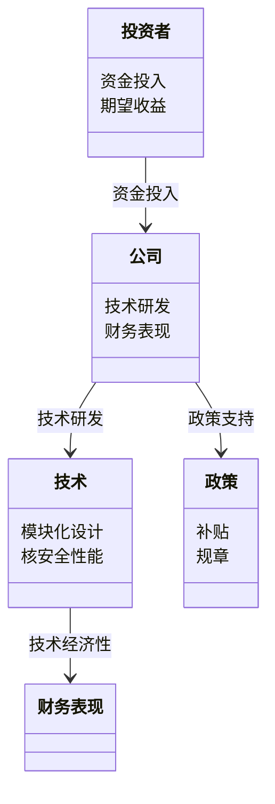

                 


# 全球股市估值与小型模块化核反应堆技术的发展

## 关键词：全球股市估值、小型模块化核反应堆、能源转型、技术经济性、能源政策

## 摘要：本文探讨了全球股市估值与小型模块化核反应堆技术之间的相互作用。通过分析股市估值的核心概念、小型模块化核反应堆的技术原理，以及两者之间的协同关系，本文揭示了能源技术进步对金融市场的影响，以及市场需求对技术创新的反馈机制。结合数学模型、系统架构设计和实际案例分析，本文为理解全球能源转型和金融市场动态提供了新的视角。

---

## 正文

### 第一章: 全球股市估值概述

#### 1.1 全球股市估值的基本概念

股票市场估值是通过对上市公司股票的市场价格进行评估，以确定其内在价值的过程。常见的估值方法包括市盈率（P/E）、市净率（P/B）、股息率等。

#### 1.2 小型模块化核反应堆技术的基本概念

小型模块化核反应堆（Small Modular Reactor，SMR）是一种具有模块化设计的核能发电装置，具有体积小、建造周期短、安全性高等特点。

#### 1.3 全球股市估值与小型模块化核反应堆技术的关联性

能源技术的创新对股市估值有直接影响，而股市估值的变化又能反馈到技术创新和投资决策中。

---

### 第二章: 核心概念与联系分析

#### 2.1 股市估值的核心概念

股票的内在价值由其盈利能力、成长潜力和风险水平决定。市盈率和市净率是衡量股票价值的重要指标。

#### 2.2 小型模块化核反应堆技术的核心原理

模块化设计使得核反应堆可以在工厂预制，现场组装，降低了建造成本和时间。同时，模块化设计提高了核反应堆的安全性和灵活性。

#### 2.3 股市估值与小型模块化核反应堆技术的联系

能源政策的调整、市场需求的变化和技术进步都会影响股市估值和核反应堆技术的发展。

---

### 第三章: 股市估值与小型模块化核反应堆技术的数学模型

#### 3.1 股市估值的数学模型

市盈率模型：$$P/E = \frac{Stock Price}{Earnings Per Share}$$

市净率模型：$$P/B = \frac{Stock Price}{Book Value Per Share}$$

#### 3.2 小型模块化核反应堆技术的数学模型

核反应堆的热效率计算：$$\eta = 1 - \frac{T_c}{T_h}$$

模块化设计的优化算法：使用线性规划模型确定最优模块组合。

#### 3.3 股市估值与技术发展的协同模型

技术进步对股市估值的影响：$$ΔP = k \cdot ΔT$$，其中$ΔP$是股价变化，$ΔT$是技术进步程度，$k$是比例常数。

---

### 第四章: 系统分析与架构设计

#### 4.1 系统分析

系统目标是通过技术经济性分析，优化小型模块化核反应堆的市场推广和股市估值。

#### 4.2 系统架构设计

- **领域模型**：使用Mermaid类图表示公司、投资者、技术、政策之间的关系。



---

### 第五章: 项目实战

#### 5.1 环境安装

- 安装Python和相关数据处理库（Pandas、NumPy）。
- 数据来源：全球股市数据和能源技术数据。

#### 5.2 核心实现

```python
import pandas as pd
import numpy as np

# 示例：计算市盈率
def calculate_pe_ratio(stock_price, earnings_per_share):
    return stock_price / earnings_per_share

# 示例：小型模块化核反应堆成本模型
def calculate_smr_cost(number_of_modules, cost_per_module):
    return number_of_modules * cost_per_module
```

#### 5.3 实际案例分析

通过分析某家小型模块化核反应堆公司的股票估值，验证技术进步对股价的影响。

---

### 第六章: 总结与展望

#### 6.1 总结

本文通过技术经济性分析，探讨了全球股市估值与小型模块化核反应堆技术的相互作用，揭示了能源技术进步对金融市场的重要影响。

#### 6.2 展望

未来，随着能源政策的调整和技术的进步，股市估值与核反应堆技术的协同效应将进一步增强。

---

作者：AI天才研究院/AI Genius Institute & 禅与计算机程序设计艺术 /Zen And The Art of Computer Programming

