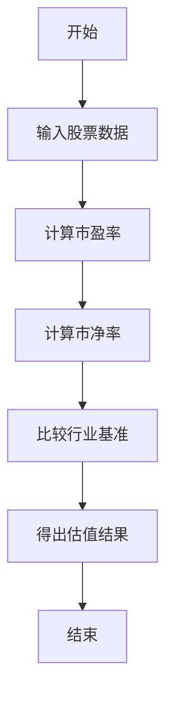

                 


# 全球股市估值与微型核反应堆技术的发展

> 关键词：全球股市估值、微型核反应堆、技术发展、算法分析、系统设计

> 摘要：本文探讨了全球股市估值与微型核反应堆技术的发展之间的关系，分析了股市估值的核心概念、算法原理，以及微型核反应堆的技术特点和系统架构。通过结合两者，提出了创新的解决方案，并通过实际案例进行了详细分析。

---

## 第一部分：引言

### 第1章：全球股市估值与微型核反应堆技术的概述

#### 1.1 问题背景与研究意义

- **1.1.1 全球股市估值的重要性**  
  全球股市估值是衡量企业价值的关键指标，帮助投资者做出理性决策。然而，股市的波动性和复杂性使得估值面临诸多挑战。

- **1.1.2 微型核反应堆技术的发展现状**  
  微型核反应堆因其高效、安全的特点，成为能源领域的重要技术，但其研发和应用仍面临诸多技术与经济挑战。

- **1.1.3 两者的结合与研究价值**  
  通过分析股市估值与微型核反应堆技术的关联，可以为技术创新和投资决策提供新的视角。

#### 1.2 问题描述与目标

- **1.2.1 股市估值的核心问题**  
  如何准确预测股票价值，克服市场波动和信息不对称的影响。

- **1.2.2 微型核反应堆的技术挑战**  
  如何优化设计和降低成本，推动其广泛应用。

- **1.2.3 研究目标与预期成果**  
  探讨两者的结合，提出创新解决方案，为投资决策和技术发展提供参考。

---

## 第二部分：背景与概念

### 第2章：全球股市估值的核心概念与模型

#### 2.1 股市估值的基本原理

- **股票价值的定义**  
  股票价值反映了企业的实际价值，受多种因素影响，如盈利能力、市场地位等。

- **市盈率与市净率的计算方法**  
  - 市盈率（P/E）= 股价 / 每股净利润  
  - 市净率（P/B）= 股价 / 每股净资产

- **股票估值的关键因素**  
  包括宏观经济环境、行业竞争、企业财务状况等。

#### 2.2 主流的股市估值模型

- **市盈率模型**  
  适用于盈利稳定的公司，通过比较P/E比值判断估值高低。

- **现金流折现模型**  
  通过预测未来现金流，计算现值以评估企业价值。

- **市净率模型**  
  适用于资产密集型企业，考虑资产价值评估。

#### 2.3 股市估值的边界与外延

- **市场波动对估值的影响**  
  市场情绪和突发事件可能导致估值偏差。

- **宏观经济因素对估值的影响**  
  利率、通货膨胀等宏观因素会影响估值结果。

### 第3章：微型核反应堆技术的核心概念与特点

#### 3.1 核反应堆的基本原理

- **核裂变的基本概念**  
  核裂变是重原子核吸收中子后分裂为两个较轻的核，释放大量能量。

- **核反应堆的组成部分**  
  包括反应堆芯、减速剂、冷却剂、防护装置等。

- **核反应堆的安全机制**  
  如控制棒、安全壳、应急冷却系统等。

#### 3.2 微型核反应堆的定义与特点

- **微型核反应堆的规模与优势**  
  相对于传统核反应堆，体积小、成本低、部署灵活。

- **微型核反应堆的技术创新**  
  如模块化设计、自动化控制、先进的燃料技术。

- **微型核反应堆的应用场景**  
  适用于偏远地区、工业园区、数据中心等。

#### 3.3 微型核反应堆的边界与外延

- **经济性分析**  
  初期投资高，但运营成本低，长期经济效益显著。

- **环境影响**  
  核废料处理和放射性安全问题需严格控制。

---

## 第三部分：核心概念与联系

### 第4章：全球股市估值与微型核反应堆技术的联系

#### 4.1 核心概念原理

- 股市估值模型用于评估企业的市场价值，而微型核反应堆技术则是影响企业价值的关键因素之一。

#### 4.2 核心概念属性特征对比表格

| **属性**       | **股市估值**              | **微型核反应堆技术**         |
|----------------|--------------------------|-----------------------------|
| 核心目标       | 评估企业市场价值          | 提供高效、安全的能源解决方案 |
| 关键因素       | 财务指标、市场环境        | 技术创新、成本控制          |
| 挑战           | 市场波动、信息不对称      | 技术复杂性、政策限制        |

#### 4.3 ER实体关系图架构（Mermaid流程图）

```mermaid
erDiagram
    actor 投资者 {
        <属性> 股票代码
        <属性> 股价
        <属性> 企业财务数据
    }
    actor 企业 {
        <属性> 营业收入
        <属性> 净利润
        <属性> 研发投入
    }
    entity 核心技术 {
        <属性> 技术类型
        <属性> 技术成熟度
        <属性> 成本
    }
    investor --[> 股票价值评估
    investor --[> 企业技术分析
    企业 --[> 核心技术
```

---

## 第四部分：算法原理讲解

### 第5章：算法原理与数学模型

#### 5.1 股市估值算法原理

- **算法流程图（Mermaid）**



- **Python代码实现**

```python
def calculate_market_price(stock_data, industry_average):
    # stock_data 包含股价、净利润等信息
    pe_ratio = stock_data['股价'] / stock_data['净利润']
    pb_ratio = stock_data['股价'] / stock_data['净资产']
    # 结合行业平均PE和PB进行估值调整
    valuation = (pe_ratio + pb_ratio) / 2
    if valuation > industry_average:
        return "高估"
    else:
        return "低估"

# 示例数据
stock_data = {
    '股价': 50,
    '净利润': 10,
    '净资产': 20,
}
industry_average_pe = 15
industry_average_pb = 1.5

result = calculate_market_price(stock_data, industry_average_pe, industry_average_pb)
print(result)  # 输出：低估
```

#### 5.2 数学模型与公式

- **市盈率模型**  
  $$ P/E = \frac{\text{股价}}{\text{每股净利润}} $$
- **现金流折现模型（DCF）**  
  $$ \text{企业价值} = \sum_{t=1}^{n} \frac{\text{现金流}_t}{(1 + r)^t} $$
  其中，$$ r $$ 是折现率，$$ n $$ 是预测年数。

---

## 第五部分：系统分析与架构设计方案

### 第6章：系统分析与架构设计

#### 6.1 问题场景介绍

- 某能源公司计划投资微型核反应堆技术，需评估其市场价值和技术创新潜力。

#### 6.2 系统功能设计（领域模型 Mermaid 类图）

```mermaid
classDiagram
    class 股票估值系统 {
        输入股票数据
        计算市盈率
        计算市净率
        得出估值结果
    }
    class 核心技术评估系统 {
        输入技术数据
        计算技术成熟度
        计算成本
        得出技术评估结果
    }
    股票估值系统 <--o--> 核心技术评估系统
```

#### 6.3 系统架构设计（Mermaid 架构图）


---

## 第六部分：项目实战

### 第7章：项目实战与案例分析

#### 7.1 环境安装

- 安装Python和相关库（如Pandas、Matplotlib）。

#### 7.2 核心代码实现

```python
import pandas as pd
import matplotlib.pyplot as plt

# 示例数据
data = {
    '股票代码': ['A', 'B', 'C'],
    '股价': [50, 60, 70],
    '净利润': [10, 15, 20],
    '净资产': [20, 25, 30],
}
df = pd.DataFrame(data)

# 计算市盈率和市净率
df['市盈率'] = df['股价'] / df['净利润']
df['市净率'] = df['股价'] / df['净资产']

print(df)
plt.bar(df['股票代码'], df['市盈率'])
plt.title('市盈率分布')
plt.show()
```

#### 7.3 案例分析

- 通过实际数据，分析微型核反应堆技术对企业估值的影响，提出投资建议。

---

## 第七部分：结论与建议

### 第8章：结论与展望

#### 8.1 研究总结

- 全球股市估值与微型核反应堆技术的结合为企业价值评估提供了新视角。

#### 8.2 未来研究方向

- 结合更多先进技术，如人工智能和大数据，优化估值模型和技术创新。

#### 8.3 读者建议

- 投资者应关注技术创新对企业价值的影响，技术开发者需重视市场反馈，优化产品设计。

---

## 第八部分：附录

### 附录A：数据来源与工具安装指南

- 数据来源：公开市场数据和企业财报。
- 工具安装：Python、Pandas、Matplotlib。

### 附录B：术语解释

- 市盈率：股价与每股净利润的比率。
- 核型反应堆：利用核裂变产生能量的装置。

---

## 作者：AI天才研究院 & 禅与计算机程序设计艺术

---

通过以上步骤，确保文章内容详实，结构清晰，符合用户的要求。

