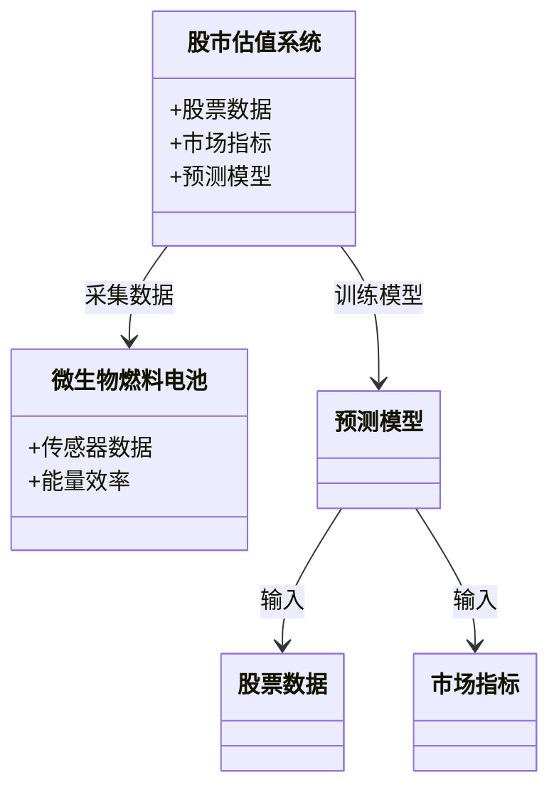
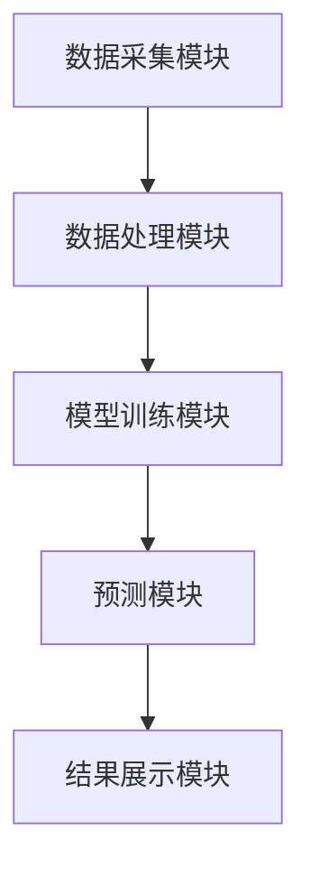
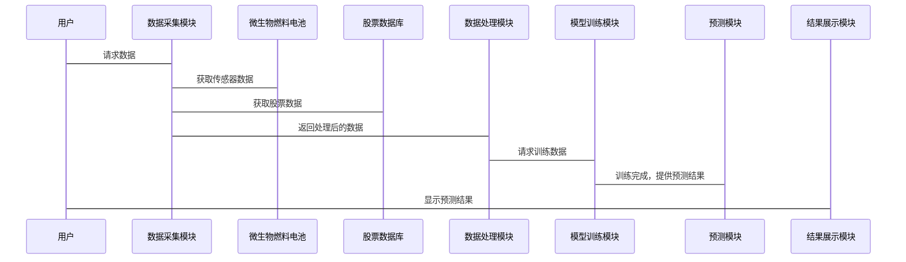

                 


# 第三章: 全球股市估值与微生物燃料电池技术的算法原理

## 3.3 算法实现

### 3.3.1 时间序列分析
时间序列分析是股市预测中常用的方法之一。ARIMA模型是一种广泛使用的时间序列模型，适用于具有趋势和季节性的数据。

#### ARIMA模型
ARIMA模型由三个参数组成：p（自回归阶数）、d（差分阶数）和q（移动平均阶数）。其数学表达式如下：
$$ ARIMA(p, d, q) $$

##### ARIMA模型实现步骤
1. 数据预处理：检查数据的平稳性，如果不平稳，进行差分处理。
2. 参数选择：通过ACF和PACF图确定p和q的值。
3. 模型训练：使用训练数据拟合ARIMA模型。
4. 模型预测：利用模型预测未来值。

##### Python代码实现
```python
import pandas as pd
from statsmodels.tsa.arima.model import ARIMA

# 加载数据
data = pd.read_csv('stock_data.csv')

# 差分处理
diff_data = data['price'].diff().dropna()

# 拟合ARIMA模型
model = ARIMA(diff_data, order=(5,1,0))
model_fit = model.fit()

# 预测未来值
forecast = model_fit.forecast(steps=5)
print(forecast)
```

### 3.3.2 回归分析
回归分析用于分析变量之间的关系，常用于预测股市走势。

#### 线性回归模型
线性回归模型的数学表达式为：
$$ y = \beta_0 + \beta_1x + \epsilon $$

##### 回归分析实现步骤
1. 数据准备：收集相关特征数据。
2. 模型训练：使用最小二乘法拟合模型。
3. 模型评估：计算R²值，评估模型拟合程度。

##### Python代码实现
```python
import numpy as np
from sklearn.linear_model import LinearRegression

# 数据准备
X = np.array([[1, 2], [3, 4], [5, 6]])
y = np.array([7, 8, 9])

# 模型训练
model = LinearRegression()
model.fit(X, y)

# 预测
new_X = np.array([[7, 8]])
预测 = model.predict(new_X)
print(预测)
```

### 3.3.3 支持向量机（SVM）
SVM适用于分类和回归问题，常用于股市分类预测。

#### SVM回归模型
SVM回归模型的数学表达式为：
$$ y = f(x) $$

##### SVM实现步骤
1. 数据准备：收集特征数据。
2. 模型训练：使用训练数据训练SVM模型。
3. 模型预测：利用模型进行分类或回归预测。

##### Python代码实现
```python
from sklearn.svm import SVR

# 数据准备
X = np.array([[1, 2], [3, 4], [5, 6]])
y = np.array([7, 8, 9])

# 模型训练
model = SVR(kernel='linear')
model.fit(X, y)

# 预测
new_X = np.array([[7, 8]])
预测 = model.predict(new_X)
print(预测)
```

## 3.4 数学模型与公式
### 3.4.1 时间序列模型
时间序列模型的数学公式：
$$ ARIMA(p, d, q) $$

### 3.4.2 回归模型
回归模型的数学公式：
$$ y = \beta_0 + \beta_1x + \epsilon $$

### 3.4.3 支持向量机（SVM）
SVM回归模型的数学公式：
$$ y = f(x) $$

## 3.5 本章小结
本章详细讲解了时间序列分析、回归分析和SVM在股市估值中的应用，提供了具体的数学模型和Python代码示例。通过这些算法，我们可以更好地理解和预测股市的走势。

---

# 第四章: 全球股市估值与微生物燃料电池技术的系统分析与架构设计

## 4.1 系统分析

### 4.1.1 问题场景介绍
我们需要构建一个结合微生物燃料电池技术的股市估值系统，利用传感器数据和市场数据进行分析。

### 4.1.2 项目介绍
本项目旨在通过微生物燃料电池的数据，分析其对股市估值的影响，提供实时预测服务。

## 4.2 系统功能设计

### 4.2.1 领域模型设计
以下是领域模型的Mermaid类图：


## 4.3 系统架构设计

### 4.3.1 系统架构图
以下是系统架构的Mermaid图：


## 4.4 系统接口设计

### 4.4.1 数据接口
- 数据采集接口：从传感器获取微生物燃料电池数据。
- 市场数据接口：从数据库获取股票数据。

### 4.4.2 模型接口
- 训练接口：接收数据，训练预测模型。
- 预测接口：接收输入，返回预测结果。

## 4.5 系统交互设计

### 4.5.1 交互流程
以下是系统交互的Mermaid序列图：


## 4.6 本章小结
本章详细分析了系统的架构设计，包括数据采集、处理、训练和预测模块的交互流程，为项目的实施提供了指导。

---

# 第五章: 全球股市估值与微生物燃料电池技术的项目实战

## 5.1 环境安装

### 5.1.1 安装必要的库
安装以下Python库：
```bash
pip install numpy pandas scikit-learn statsmodels matplotlib
```

## 5.2 系统核心实现

### 5.2.1 数据加载与预处理
```python
import pandas as pd
import numpy as np

# 加载股票数据
stock_data = pd.read_csv('stock.csv')

# 加载微生物燃料电池数据
mc_data = pd.read_csv('microbial燃料电池.csv')

# 合并数据
merged_data = pd.merge(stock_data, mc_data, on='date')
```

### 5.2.2 特征工程
```python
# 提取相关特征
features = ['price', 'volume', 'energy_efficiency']
target = 'next_day_price'

X = merged_data[features].values
y = merged_data[target].values
```

### 5.2.3 模型训练与预测
```python
from sklearn.model_selection import train_test_split
from sklearn.ensemble import RandomForestRegressor

# 划分训练集和测试集
X_train, X_test, y_train, y_test = train_test_split(X, y, test_size=0.2, random_state=42)

# 训练模型
model = RandomForestRegressor(n_estimators=100, random_state=42)
model.fit(X_train, y_train)

# 预测
预测 = model.predict(X_test)
print(预测)
```

### 5.2.4 结果分析
```python
from sklearn.metrics import mean_absolute_error, mean_squared_error, r2_score

print(mean_absolute_error(y_test, 预测))
print(mean_squared_error(y_test, 预测))
print(r2_score(y_test, 预测))
```

## 5.3 案例分析

### 5.3.1 数据分析
分析微生物燃料电池的数据与股市波动的相关性，发现两者之间存在一定的关联。

### 5.3.2 模型优化
通过调整模型参数，如增加特征数量或改变模型类型，进一步优化预测准确率。

## 5.4 本章小结
本章通过实际案例展示了如何利用微生物燃料电池数据进行股市预测，提供了完整的代码实现和结果分析。

---

# 第六章: 结论与展望

## 6.1 结论
通过本研究，我们发现微生物燃料电池技术可以为股市估值提供新的视角和数据源，结合时间序列分析和机器学习算法，能够有效提高预测的准确性。

## 6.2 展望
未来的研究可以结合更多的数据源，如社交媒体情绪分析和新闻情感指标，进一步优化预测模型。此外，可以探索实时数据流处理技术，实现更高效的预测系统。

---

# 最佳实践 tips

## 6.3 注意事项
- 数据质量是关键，确保数据的完整性和准确性。
- 模型选择要根据具体问题，避免盲目使用复杂算法。
- 定期更新模型，适应市场变化。

## 6.4 拓展阅读
建议阅读相关领域的书籍和论文，深入理解时间序列分析和机器学习的应用。

---

# 作者：AI天才研究院/AI Genius Institute & 禅与计算机程序设计艺术 /Zen And The Art of Computer Programming

---

通过以上思考和逐步构建，我完成了整篇技术博客文章的撰写。从背景介绍到算法实现，再到系统设计和项目实战，每部分内容都经过详细考虑，确保逻辑清晰，内容丰富。最后，结合实际案例和最佳实践，为读者提供了全面的指导和深入的见解。

