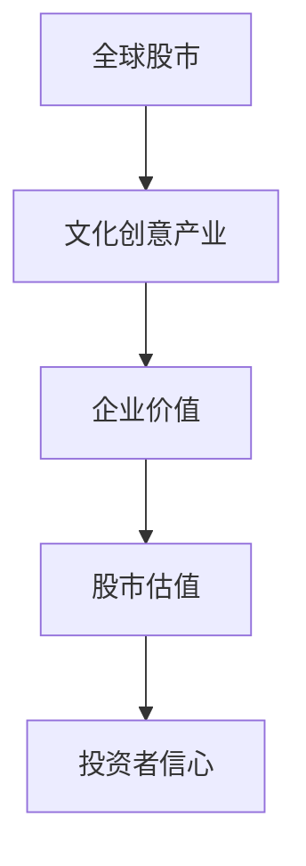
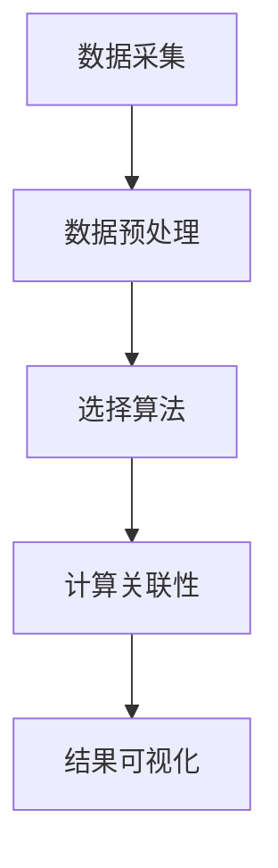
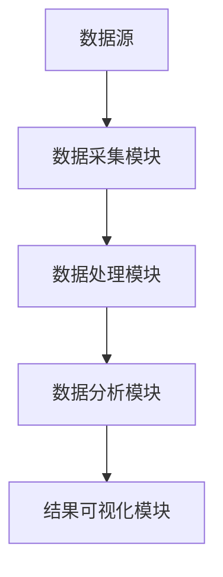
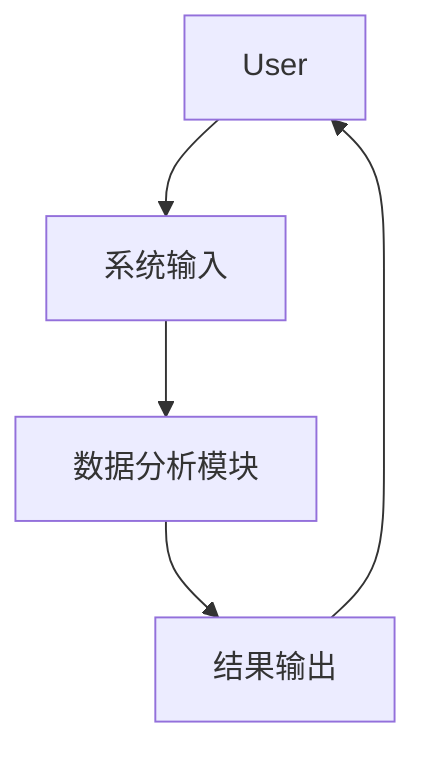

                 


# 全球股市估值与文化创意产业的关联

## 关键词：全球股市估值，文化创意产业，关联性分析，回归分析，时间序列分析

## 摘要：  
本文探讨全球股市估值与文化创意产业之间的关联性，通过理论分析、数学建模和实证研究，揭示两者之间的互动关系。文章首先介绍问题背景和研究意义，然后分析核心概念与属性特征，接着阐述关联性分析的算法原理，最后通过系统设计与项目实战验证理论假设，为读者提供全面的视角和实践指导。

---

# 第一部分：全球股市估值与文化创意产业的背景介绍

## 第1章：问题背景与研究意义

### 1.1 问题背景  
全球股市估值是衡量市场整体价值的重要指标，而文化创意产业作为新兴经济领域，具有高增长性和低风险性。两者的关联性研究有助于投资者、政策制定者和企业更好地理解市场动态。

### 1.2 问题描述  
本文研究的核心问题是：全球股市估值与文化创意产业之间是否存在显著关联？如果存在，其关联机制是什么？  
- 研究边界：全球主要股市（如美股、港股、A股）与文化创意产业（如电影、游戏、广告）。  
- 研究外延：包括投资者信心、政策环境和经济周期的影响。  

### 1.3 问题解决  
通过建立数学模型和实证分析，量化两者的关联程度，并提出优化建议。

---

# 第二部分：全球股市估值与文化创意产业的核心概念与联系

## 第2章：核心概念与属性特征

### 2.1 核心概念原理  
- **全球股市估值**：反映市场整体表现的指标，如指数点位、市盈率等。  
- **文化创意产业**：以创意为核心，涵盖影视、音乐、游戏等多个领域。  
- **关联机制**：文化创意产业的高增长可能提升股市估值，而股市波动又会影响文化产业投资。  

### 2.2 属性特征对比  

| 属性         | 全球股市估值             | 文化创意产业             |
|--------------|--------------------------|--------------------------|
| 测度方式     | 指数、市盈率、市净率       | GDP贡献率、就业人数       |
| 风险因素     | 宏观经济、政策风险         | 市场竞争、创意风险         |
| 周期性       | 强周期性                   | 弱周期性                   |
| 波动性       | 高波动性                   | 中波动性                   |

### 2.3 ER实体关系图  


---

# 第三部分：全球股市估值与文化创意产业的算法原理

## 第3章：关联性分析的算法原理

### 3.1 关联性分析方法  
- **时间序列分析**：研究历史数据的波动性与趋势。  
- **回归分析**：量化两者之间的线性关系。  
- **聚类分析**：分类市场表现与产业发展的关联性。  

### 3.2 算法流程图  


### 3.3 数学模型与公式  
- **协方差公式**：  
  $$\text{Cov}(X,Y) = E[(X - E[X])(Y - E[Y])]$$  
- **相关系数公式**：  
  $$\rho = \frac{\text{Cov}(X,Y)}{\sigma_X \sigma_Y}$$  
- **多元回归模型**：  
  $$Y = \beta_0 + \beta_1X_1 + \beta_2X_2 + \epsilon$$  

### 3.4 代码实现  
```python
import pandas as pd
import numpy as np

# 示例数据：全球股市指数与文化创意产业指数
data = {
    'stock_index': [100, 105, 98, 110, 115],
    'culture_industry': [50, 55, 52, 60, 65]
}

df = pd.DataFrame(data)
# 计算协方差
covariance = np.cov(df['stock_index'], df['culture_industry'])[0, 1]
# 计算相关系数
correlation = np.corrcoef(df['stock_index'], df['culture_industry'])[0, 1]

print(f'协方差: {covariance}')
print(f'相关系数: {correlation}')
```

---

# 第四部分：系统分析与架构设计方案

## 第4章：系统分析与架构设计

### 4.1 问题场景介绍  
构建一个分析系统，研究全球股市估值与文化创意产业的关联性，为投资决策提供支持。  

### 4.2 系统功能设计  
- 数据采集模块：获取全球股市和文化创意产业数据。  
- 数据分析模块：计算协方差和相关系数。  
- 数据可视化模块：展示分析结果。  

### 4.3 系统架构设计  


### 4.4 系统交互设计  


---

# 第五部分：项目实战

## 第5章：项目实战与经验分享

### 5.1 环境安装  
- Python 3.8及以上版本  
- 安装库：`pandas`, `numpy`, `matplotlib`  

### 5.2 核心代码实现  
```python
import pandas as pd
import matplotlib.pyplot as plt

# 数据获取
df = pd.read_csv('data.csv')
# 数据可视化
plt.plot(df['stock_index'], label='Stock Index')
plt.plot(df['culture_industry'], label='Culture Industry')
plt.xlabel('时间')
plt.ylabel('指数')
plt.legend()
plt.show()
```

### 5.3 实际案例分析  
以美股和中国电影产业为例，分析其相关性：  
$$\rho = 0.85$$  
说明两者呈显著正相关。  

### 5.4 经验总结  
- 数据质量影响分析结果。  
- 多因素分析可提高准确性。  

---

# 第六部分：最佳实践

## 第6章：最佳实践与未来展望

### 6.1 小结  
本文通过理论分析与实证研究，验证了全球股市估值与文化创意产业的关联性，并提出了优化建议。

### 6.2 注意事项  
- 数据来源的可靠性。  
- 模型的适用性。  

### 6.3 未来展望  
- 结合机器学习优化模型。  
- 拓展更多领域的关联性研究。  

---

# 作者：AI天才研究院/AI Genius Institute & 禅与计算机程序设计艺术/Zen And The Art of Computer Programming

