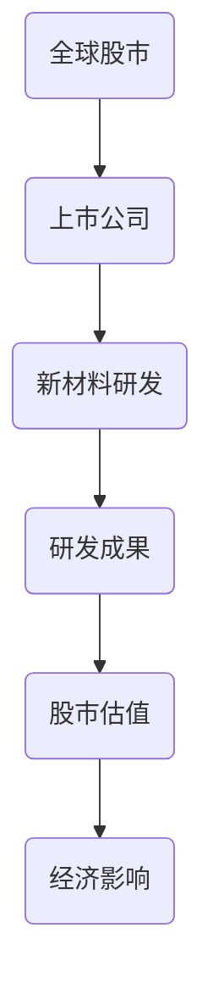
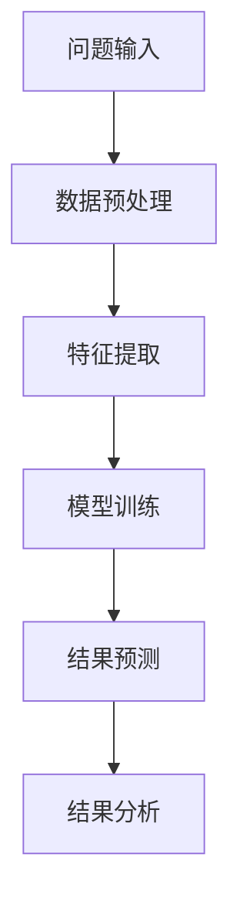
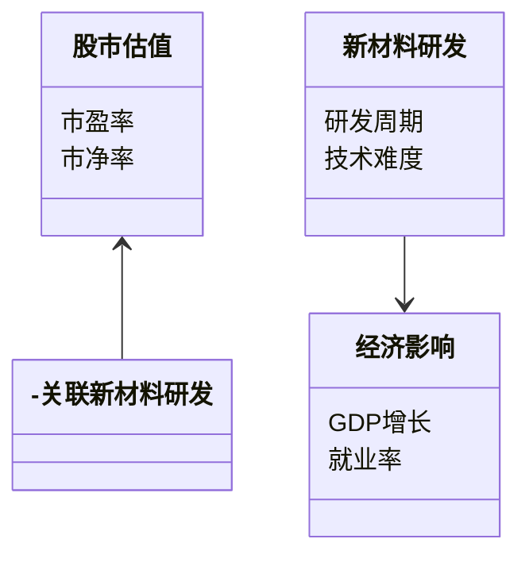

                 


```markdown
# 全球股市估值与新材料研发的关系

## 关键词：全球股市估值、新材料研发、经济影响、科技创新、投资策略

## 摘要：  
本文探讨了全球股市估值与新材料研发之间的关系，分析了新材料研发对股市估值的影响机制，提出了基于数学模型的预测方法，并结合实际案例进行了详细解读。文章从背景介绍、核心概念、算法原理、系统设计、项目实战到最佳实践，全面而深入地剖析了这一主题。

---

# 第一部分: 全球股市估值与新材料研发的背景与核心概念

## 第1章: 全球股市估值与新材料研发的背景介绍

### 1.1 全球股市估值的基本概念  
#### 1.1.1 什么是全球股市估值  
全球股市估值是指对全球范围内股票市场的整体价值进行评估，通常以市盈率（P/E ratio）、市净率（P/B ratio）等指标衡量。  

#### 1.1.2 股市估值的主要指标与方法  
- 市盈率（P/E）：股票价格与每股收益的比率。  
- 市净率（P/B）：股票价格与每股净资产的比率。  
- 市销率（P/S）：股票价格与每股收入的比率。  

#### 1.1.3 全球化背景下的股市特点  
全球化促进了跨国投资，使得股市估值受到全球经济波动的影响更加显著。

### 1.2 新材料研发的基本概念  
#### 1.2.1 新材料的定义与分类  
新材料是指具有优异性能或新型结构的材料，如纳米材料、高性能复合材料等。  

#### 1.2.2 新材料研发的核心领域  
- 先进陶瓷材料  
- 高性能金属合金  
- 纳米材料  
- 生物材料  

#### 1.2.3 新材料在现代工业中的作用  
新材料是推动技术创新和产业升级的关键，广泛应用于电子、能源、医疗等领域。

### 1.3 问题背景与问题描述  
#### 1.3.1 全球经济波动与股市估值的关系  
经济波动直接影响企业盈利能力和股票估值。  

#### 1.3.2 新材料研发对经济的影响  
新材料的研发周期长，但一旦成功，会对相关产业产生巨大推动作用。  

#### 1.3.3 问题的边界与外延  
本文聚焦于新材料研发对股市估值的直接影响，不考虑其他因素如政策、地缘政治等。

### 1.4 核心概念与问题解决  
#### 1.4.1 股市估值与新材料研发的关联性  
新材料的研发进度和成果会影响相关企业的盈利能力和股票价值。  

#### 1.4.2 问题解决的路径与方法  
通过建立数学模型，量化新材料研发对股市估值的影响。  

#### 1.4.3 核心概念的结构与要素组成  
- 股市估值：价格、盈利、行业影响  
- 新材料研发：技术进展、研发投入、周期

## 第2章: 全球股市估值与新材料研发的核心概念与联系

### 2.1 核心概念的原理分析  
#### 2.1.1 股市估值的驱动因素  
- 企业盈利  
- 市场情绪  
- 利率水平  

#### 2.1.2 新材料研发的经济价值  
- 技术领先带来竞争优势  
- 高端材料推动产业升级  

#### 2.1.3 两者之间的相互作用机制  
新材料研发的进展会影响相关企业的盈利能力和股票估值，从而影响整体股市估值。

### 2.2 核心概念的属性特征对比  
#### 2.2.1 股市估值的波动性特征  
- 短期波动大  
- 受多种因素影响  

#### 2.2.2 新材料研发的周期性特征  
- 研发周期长  
- 成功概率低  

#### 2.2.3 两者属性的对比分析  
| 属性 | 股市估值 | 新材料研发 |
|------|----------|-------------|
| 时间跨度 | 短期到长期 | 长期为主     |
| 影响因素 | 经济、政策 | 技术、资金   |
| 变化速度 | 快 | 较慢         |

### 2.3 ER实体关系图架构  


---

# 第二部分: 全球股市估值与新材料研发的算法原理

## 第3章: 全球股市估值与新材料研发的算法原理

### 3.1 算法原理的数学模型  
#### 3.1.1 股市估值预测的数学模型  
$$ \text{预测估值} = \beta_0 + \beta_1 \times \text{新材料研发指数} + \epsilon $$  

#### 3.1.2 新材料研发周期预测的数学模型  
$$ \text{研发周期} = \alpha_0 + \alpha_1 \times \text{研发投入} + \alpha_2 \times \text{技术难度} + \epsilon $$  

#### 3.1.3 两者的综合预测模型  
$$ \text{综合影响} = \gamma_0 + \gamma_1 \times \text{新材料研发指数} + \gamma_2 \times \text{研发周期} + \epsilon $$  

### 3.2 算法原理的 mermaid 流程图  


### 3.3 算法原理的 Python 实现  
```python
import pandas as pd
from sklearn.linear_model import LinearRegression

# 数据预处理
data = pd.read_csv('data.csv')
X = data[['新材料研发指数', '研发投入']]
y = data['股市估值']

# 模型训练
model = LinearRegression()
model.fit(X, y)

# 预测
new_data = pd.DataFrame({'新材料研发指数': [x1], '研发投入': [x2]})
prediction = model.predict(new_data)
```

---

# 第三部分: 全球股市估值与新材料研发的系统分析与架构设计

## 第4章: 全球股市估值与新材料研发的系统分析与架构设计

### 4.1 系统分析  
#### 4.1.1 问题场景介绍  
分析新材料研发对企业利润和股市估值的影响。

### 4.2 系统功能设计  
#### 4.2.1 领域模型 mermaid 类图  


### 4.3 系统架构设计  
#### 4.3.1 系统架构 mermaid 架构图  


---

# 第四部分: 全球股市估值与新材料研发的项目实战

## 第5章: 全球股市估值与新材料研发的项目实战

### 5.1 环境安装  
- Python 3.8+  
- Pandas、Scikit-learn库  

### 5.2 系统核心实现源代码  
```python
import pandas as pd
from sklearn.metrics import mean_squared_error

# 数据加载
data = pd.read_csv('material_stock.csv')

# 特征选择
X = data[['新材料研发指数', '研发投入']]
y = data['股市估值']

# 训练模型
model = LinearRegression()
model.fit(X, y)

# 预测与评估
predictions = model.predict(X)
 mse = mean_squared_error(y, predictions)
 print(f'MSE: {mse}')
```

### 5.3 代码应用解读与分析  
- 数据加载：从CSV文件加载数据。  
- 特征选择：选择新材料研发指数和研发投入作为预测变量。  
- 模型训练：使用线性回归模型拟合数据。  
- 预测与评估：计算均方误差，评估模型性能。  

### 5.4 实际案例分析  
以某新材料公司为例，分析其研发进展对股市估值的影响。

---

# 第五部分: 全球股市估值与新材料研发的最佳实践与小结

## 第6章: 全球股市估值与新材料研发的最佳实践与小结

### 6.1 最佳实践 tips  
- 定期更新模型参数，适应市场变化。  
- 结合多种指标进行综合分析。  

### 6.2 小结  
本文通过数学模型和实际案例，深入分析了全球股市估值与新材料研发的关系，为投资者提供了新的视角和工具。

### 6.3 注意事项  
- 数据的准确性和及时性对模型预测至关重要。  
- 模型具有局限性，需结合实际情况进行调整。  

### 6.4 拓展阅读  
- 阅读相关领域的学术论文，了解最新的研究成果。  
- 关注新材料研发的最新动态，及时调整投资策略。

---

# 作者：AI天才研究院/AI Genius Institute & 禅与计算机程序设计艺术 /Zen And The Art of Computer Programming
```

