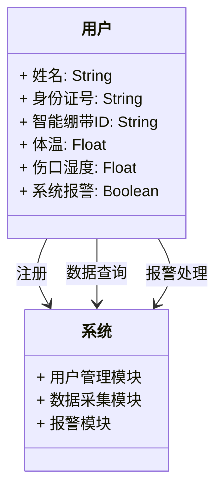
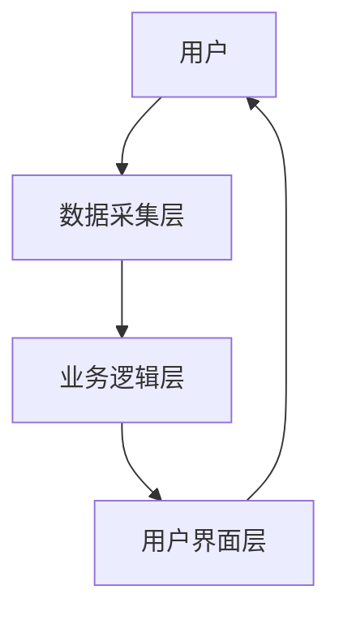
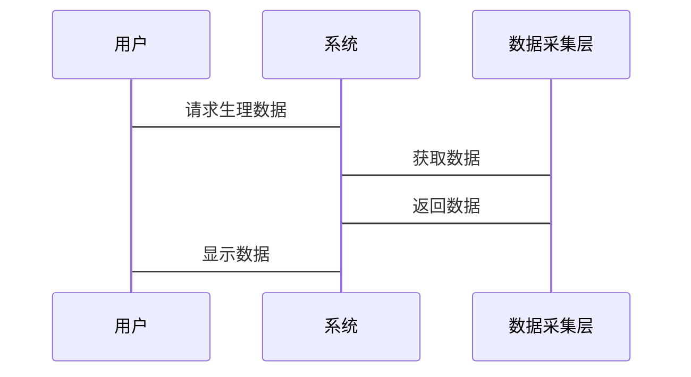

                 


# 全球股市估值与柔性电子在医疗监测中的应用

## 关键词
- 全球股市估值
- 柔性电子
- 医疗监测
- 股票定价模型
- 机器学习

## 摘要
本文探讨了全球股市估值与柔性电子在医疗监测中的应用。首先，分析了全球股市估值的背景、核心概念和常用方法，包括市盈率、市净率、现金流折现模型等，并介绍了股市波动预测的算法。其次，详细阐述了柔性电子的基本概念、材料与技术，及其在医疗监测中的应用，如智能绷带和可穿戴设备。最后，通过系统架构设计和项目实战，展示了如何将柔性电子技术应用于医疗监测系统，并提出了未来的研究方向。

---

## 第一部分: 全球股市估值与分析

### 第1章: 全球股市估值的背景与概念

#### 1.1 股市估值的基本概念

##### 1.1.1 股市估值的定义与意义
股市估值是指通过对公司基本面分析和市场趋势分析，确定股票的内在价值或市场价格的过程。其意义在于帮助投资者做出理性的投资决策，避免因市场波动或情绪影响而产生误判。

##### 1.1.2 全球股市的多样性与特点
全球股市分布广泛，包括纽约证券交易所、纳斯达克、伦敦证交所等。不同市场的特点各异，如美国市场的科技股占比较高，而新兴市场的增长潜力更大。

##### 1.1.3 股市估值的核心要素
- 公司财务状况：收入、利润、资产负债表。
- 行业地位：市场占有率、竞争优势。
- 宏观经济环境：GDP增速、利率水平、通货膨胀。
- 市场情绪：投资者心理、市场流动性。

#### 1.2 股市估值的理论基础

##### 1.2.1 股票定价模型的概述
股票定价模型是股市估值的核心工具，主要包括基本面模型和市场模型。

##### 1.2.2 市盈率与市净率的计算方法
- 市盈率（P/E）= 股价 / 每股收益。
- 市净率（P/B）= 股价 / 每股净资产。

##### 1.2.3 股市估值与宏观经济的关系
宏观经济指标如GDP、利率、通货膨胀率直接影响股市估值。例如，低利率环境通常会推高市盈率。

#### 1.3 股市估值的主要方法

##### 1.3.1 市盈率法与市净率法
市盈率法适用于盈利稳定的公司，市净率法适用于资产-heavy的公司。

##### 1.3.2 现金流折现法（DCF模型）
DCF模型通过将未来现金流折现，计算公司内在价值。公式为：
$$ V = \sum_{t=1}^{n} \frac{CF_t}{(1 + r)^t} + \frac{TV}{(1 + r)^n} $$
其中，$CF_t$ 是第 t 年的现金流，$r$ 是折现率，$TV$ 是终值。

##### 1.3.3 相对估值法与行业比较法
相对估值法通过比较同类公司，找出估值差异。行业比较法则是将公司估值与行业平均水平对比。

---

### 第2章: 全球股市估值的数学模型与算法

#### 2.1 股票定价的数学模型

##### 2.1.1 股票内在价值的计算公式
股票的内在价值可以通过股利折现模型（DDM）计算：
$$ V = \frac{D}{k - g} $$
其中，$D$ 是股利，$k$ 是折现率，$g$ 是股利增长率。

##### 2.1.2 股票价值与市场价值的关系
股票的市场价格围绕其内在价值波动，市场价值 = 内在价值 + 市场情绪溢价。

##### 2.1.3 股市估值的误差分析
误差主要来自假设条件的偏差，如增长率和折现率的估计不准确。

#### 2.2 股市指数的构建与分析

##### 2.2.1 指数构建的基本原理
股票指数是选取一定数量的股票，以反映市场整体走势。常见的指数有沪深300、标普500。

##### 2.2.2 市场指数的权重分配
权重分配方法包括市值加权、等权重和对冲权重。

##### 2.2.3 指数的实时计算与更新
指数实时计算需要考虑成分股的实时价格和权重，定期调整成分股以保持代表性。

#### 2.3 股市波动预测的算法

##### 2.3.1 时间序列分析模型
使用ARIMA模型预测股市波动：
$$ ARIMA(p, d, q) $$
其中，p 是自回归阶数，d 是差分阶数，q 是移动平均阶数。

##### 2.3.2 随机游走模型
随机游走模型认为股价变化是随机的，无法预测：
$$ P_{t} = P_{t-1} + \epsilon $$

##### 2.3.3 机器学习在股市预测中的应用
机器学习模型如LSTM用于时间序列预测：
```python
import numpy as np
from tensorflow.keras.models import Sequential
from tensorflow.keras.layers import LSTM, Dense

model = Sequential()
model.add(LSTM(50, input_shape=(timesteps, features)))
model.add(Dense(1))
model.compile(loss='mean_squared_error', optimizer='adam')
```

---

### 第3章: 全球股市估值的系统架构与实现

#### 3.1 股市估值系统的需求分析

##### 3.1.1 系统目标与功能需求
目标：提供实时估值和预测功能。
功能需求：数据采集、模型训练、结果输出。

##### 3.1.2 系统性能与可扩展性
需要高计算能力和数据存储能力，支持分布式架构。

##### 3.1.3 系统的输入输出与接口设计
输入：股票数据、市场数据。
输出：估值结果、预测报告。
接口：API接口与数据库接口。

#### 3.2 股市估值系统的架构设计

##### 3.2.1 分层架构设计
分为数据层、计算层和应用层。

##### 3.2.2 数据流与模块划分
数据采集模块、模型训练模块、结果展示模块。

##### 3.2.3 系统的高可用性设计
采用负载均衡和容灾备份，确保系统稳定运行。

#### 3.3 股市估值系统的实现

##### 3.3.1 数据采集与预处理
使用爬虫采集数据，清洗数据并填充缺失值。

##### 3.3.2 模型训练与部署
训练股票估值模型，并部署到云平台。

##### 3.3.3 系统的测试与优化
测试系统性能和准确性，优化算法和架构。

---

## 第二部分: 柔性电子在医疗监测中的应用

### 第4章: 柔性电子的基本概念与技术

#### 4.1 柔性电子的定义与特点

##### 4.1.1 柔性电子的定义
柔性电子是指基于柔性材料的电子设备，具有可弯曲、可拉伸的特性。

##### 4.1.2 柔性电子与传统电子的区别
传统电子器件 rigid，柔性电子具备柔性。

##### 4.1.3 柔性电子的核心技术
材料技术、工艺技术、电路设计技术。

#### 4.2 柔性电子的材料与工艺

##### 4.2.1 柔性材料的种类与特性
材料包括聚酰亚胺、PDMS、 graphene 等。

##### 4.2.2 柔性电子的制造工艺
工艺包括蒸镀、印刷、转移印刷等。

##### 4.2.3 柔性电子的可靠性与寿命
需要具备高可靠性和长寿命，适应复杂环境。

#### 4.3 柔性电子在医疗领域的潜力

##### 4.3.1 柔性电子在医疗监测中的优势
可穿戴性、舒适性、实时监测能力。

##### 4.3.2 柔性电子在医疗领域的应用现状
广泛应用于心电监测、血糖监测、压力监测等。

##### 4.3.3 柔性电子的未来发展方向
集成化、智能化、多功能化。

---

### 第5章: 柔性电子在医疗监测中的应用

#### 5.1 智能绷带与 wound monitoring

##### 5.1.1 智能绷带的设计与实现
使用柔性传感器监测伤口愈合情况。

##### 5.1.2 智能绷带的功能与优势
实时监测温度、湿度、压力，预防感染。

#### 5.2 可穿戴设备与健康监测

##### 5.2.1 可穿戴设备的种类
智能手表、健身手环、医疗贴片。

##### 5.2.2 可穿戴设备的核心技术
低功耗设计、数据传输技术。

##### 5.2.3 可穿戴设备的临床应用
心率监测、血压监测、运动监测。

#### 5.3 柔性电子的医疗监测系统

##### 5.3.1 系统设计与功能模块
数据采集模块、信号处理模块、用户界面模块。

##### 5.3.2 系统的实时监测能力
高灵敏度、低延迟、高准确性。

---

## 第6章: 柔性电子医疗监测系统的系统分析与设计

### 6.1 系统背景与项目介绍

#### 6.1.1 系统背景
柔性电子在医疗监测中的应用越来越广泛，特别是在慢性病管理和术后康复中。

#### 6.1.2 项目介绍
开发一款基于柔性电子的可穿戴医疗监测设备，实现对患者生理参数的实时监测。

### 6.2 系统功能设计

#### 6.2.1 领域模型设计
使用Mermaid类图描述系统中的实体和关系。



#### 6.2.2 系统架构设计
采用分层架构，包括数据采集层、业务逻辑层和用户界面层。



#### 6.2.3 系统接口设计
定义RESTful API接口，如：
- POST /users: 注册用户
- GET /data: 获取生理数据
- PUT /alarms: 设置报警阈值

#### 6.2.4 系统交互设计
使用Mermaid序列图描述用户与系统的交互。



---

## 第7章: 项目实战与最佳实践

### 7.1 项目实战

#### 7.1.1 环境安装与配置
安装必要的开发工具和库，如Python、TensorFlow、Mermaid工具。

#### 7.1.2 系统核心实现

##### 7.1.2.1 数据采集模块
使用Arduino采集生理数据，并通过蓝牙传输到手机。

##### 7.1.2.2 数据处理模块
对数据进行清洗和特征提取，使用机器学习模型预测异常情况。

##### 7.1.2.3 报警模块
当生理指标超出阈值时，系统触发报警，并通过短信或APP通知用户。

#### 7.1.3 代码实现

##### 数据采集模块
```python
import serial
import time

ser = serial.Serial('COM3', 9600)

while True:
    data = ser.readline().decode().strip()
    if data:
        print(f"接收到数据: {data}")
    time.sleep(1)
```

##### 数据处理模块
```python
from sklearn.ensemble import IsolationForest

model = IsolationForest(n_estimators=100, random_state=42)
model.fit(X_train)
y_pred = model.predict(X_test)
```

##### 报警模块
```python
import smtplib
from email.mime.text import MIMEText

server = smtplib.SMTP('smtp.gmail.com', 587)
server.starttls()
server.login('user@example.com', 'password')
msg = MIMEText('警报：体温异常')
msg['Subject'] = '警报'
msg['To'] = 'user@example.com'
server.sendmail('user@example.com', 'user@example.com', msg.as_string())
server.quit()
```

#### 7.1.4 实际案例分析
分析一个真实案例，如糖尿病患者使用智能绷带监测伤口情况，系统实时监测并报警。

### 7.2 最佳实践

#### 7.2.1 关键技术总结
- 灵敏的传感器设计。
- 高效的数据处理算法。
- 可靠的报警机制。

#### 7.2.2 注意事项
- 数据隐私保护。
- 系统的可穿戴性和舒适性。
- 系统的稳定性和可靠性。

#### 7.2.3 拓展阅读
推荐相关书籍和论文，如《Flexible Electronics in Healthcare》。

---

## 结论

本文详细探讨了全球股市估值与柔性电子在医疗监测中的应用。通过分析股市估值的核心概念、算法和系统设计，以及柔性电子的技术特点和实际应用，展示了这两领域的深度融合潜力。未来，随着技术的进步，柔性电子在医疗监测中的应用将更加广泛，股市估值方法也将更加智能化和精准化。

---

## 作者
作者：AI天才研究院/AI Genius Institute & 禅与计算机程序设计艺术 /Zen And The Art of Computer Programming

--- 

感谢您的阅读，希望这篇文章能为您提供有价值的信息和启发！

