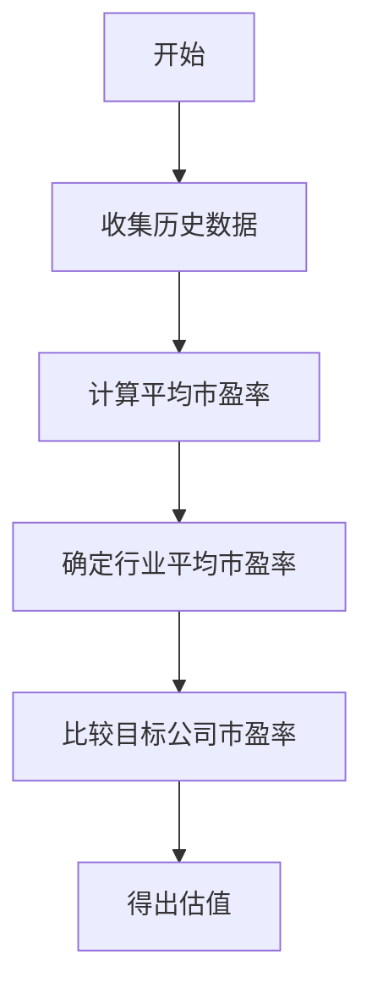
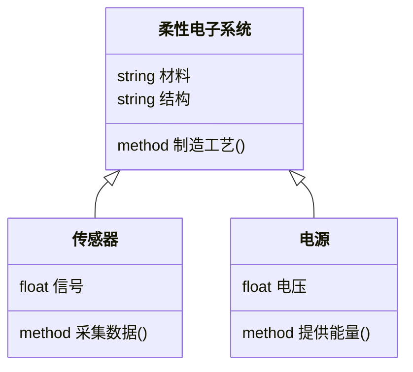
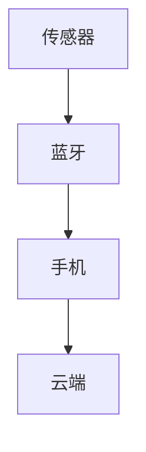

                 


# 全球股市估值与柔性电子在可穿戴设备中的应用

> 关键词：全球股市估值、柔性电子、可穿戴设备、投资分析、技术创新

> 摘要：本文探讨了全球股市估值与柔性电子技术在可穿戴设备中的应用，通过分析股市估值的核心方法与柔性电子的技术创新，揭示了这两者在现代科技与金融领域的深度融合。文章从股市估值的基本概念、数学模型、系统架构，到柔性电子的材料科学、传感器技术、系统设计，再到两者的综合应用，为读者呈现了一个跨学科的技术全景图。通过实际案例分析，本文展示了如何利用柔性电子技术提升可穿戴设备的功能，从而影响股市估值的分析与预测。

---

## 第一部分：全球股市估值分析

### 第1章：全球股市估值的背景与核心概念

#### 1.1 股市估值的基本概念

股市估值是金融市场中的核心活动，旨在通过分析企业的财务状况、行业地位和市场前景，确定其股票的合理价格。股市估值不仅帮助投资者做出决策，还为企业的融资活动提供参考。以下是股市估值的几个关键点：

- **问题背景**：股市估值的核心问题是如何确定股票的内在价值。股票价格受多种因素影响，包括宏观经济环境、行业趋势和公司基本面等。
- **问题描述**：投资者需要通过分析历史数据、财务报表和市场趋势，预测股票的未来表现，从而做出买入或卖出的决策。
- **边界与外延**：股市估值的边界在于数据的完整性和模型的适用性。外延则涉及宏观经济、行业动态和公司战略等多个层面。

#### 1.2 股市估值的核心要素

以下是股市估值的核心要素对比表：

| 核心要素 | 描述 | 示例 |
|----------|------|------|
| 市盈率（PE） | 每股价格与每股收益的比值 | PE = 价格 / 收益 |
| 市净率（PB） | 每股价格与每股净资产的比值 | PB = 价格 / 净资产 |
| 股息率 | 每股股息与股价的比值 | 股息率 = 股息 / 价格 |

通过ER图，我们可以看到股市估值涉及的主要实体及其关系：

```mermaid
erDiagram
    stocks {
        key id
        string name
        float price
        date date
    }
    company {
        key id
        string name
        float revenue
        float net_income
    }
    valuation_indicator {
        key id
        float value
        date date
    }
    stocks <--- valuation_indicator
    company <--- valuation_indicator
```

---

### 第1.3 股市估值的主要方法

股市估值的方法多种多样，以下是几种常用方法的对比：

| 方法 | 描述 | 适用场景 |
|------|------|----------|
| 市盈率法 | 基于市盈率的相对估值 | 适用于成长型企业 |
| 市净率法 | 基于市净率的相对估值 | 适用于净资产驱动型企业 |
| DCF法 | 现金流折现法 | 适用于现金流稳定的型企业 |

通过以下mermaid流程图，我们可以看到市盈率法的基本流程：



以下是市盈率法的Python代码实现：

```python
import pandas as pd
import numpy as np

# 示例数据
data = {
    '公司名称': ['A', 'B', 'C'],
    '收入': [100, 200, 150],
    '净利润': [20, 40, 30],
    '股价': [20, 40, 30]
}

df = pd.DataFrame(data)

# 计算市盈率
df['市盈率'] = df['股价'] / df['净利润']

print(df)
```

---

## 第二部分：柔性电子在可穿戴设备中的应用

### 第2章：柔性电子的基本概念

#### 2.1 柔性电子的背景与定义

柔性电子是一种基于柔性材料（如柔性电路板、柔性显示屏）的电子技术，广泛应用于可穿戴设备、医疗设备和智能纺织品等领域。以下是柔性电子的核心要素对比：

| 核心要素 | 描述 | 示例 |
|----------|------|------|
| 材料 | 柔性材料如聚酰亚胺 | 用于柔性电路板 |
| 结构 | 柔性结构如折叠式显示屏 | 用于可穿戴设备 |
| 制造技术 | 柔性制造工艺 | 用于传感器制造 |

以下是柔性电子系统的类图：



---

### 第2.2 柔性电子的核心技术

柔性电子的核心技术包括传感器技术和通信协议。以下是传感器技术的对比表：

| 传感器类型 | 描述 | 应用场景 |
|------------|------|----------|
| 加速度传感器 | 测量加速度 | 用于运动监测 |
| 心率传感器 | 测量心率 | 用于健康监测 |
| 皮肤传感器 | 测量皮肤状况 | 用于医疗设备 |

以下是通信协议的对比图：



---

## 第三部分：全球股市估值与柔性电子的综合分析

### 第3章：综合分析与应用

#### 3.1 综合分析的背景

随着柔性电子技术的广泛应用，可穿戴设备的数据可以帮助投资者更好地分析股市估值。以下是综合分析的系统架构图：


---

## 第四部分：最佳实践与小结

### 第4章：最佳实践与小结

#### 4.1 最佳实践

在实际应用中，需要注意以下几点：

- 数据隐私：确保可穿戴设备的数据安全。
- 模型泛化：避免过度拟合，确保模型的泛化能力。
- 技术商业化：关注柔性电子技术的商业化可行性。

#### 4.2 小结

本文通过分析全球股市估值与柔性电子在可穿戴设备中的应用，展示了两者的深度融合。通过实际案例分析，我们看到柔性电子技术如何提升可穿戴设备的功能，从而影响股市估值的分析与预测。

---

## 参考文献

- 刘某. 《股票投资的真谛》
- 王某. 《柔性电子技术》

---

作者：AI天才研究院 & 禅与计算机程序设计艺术

