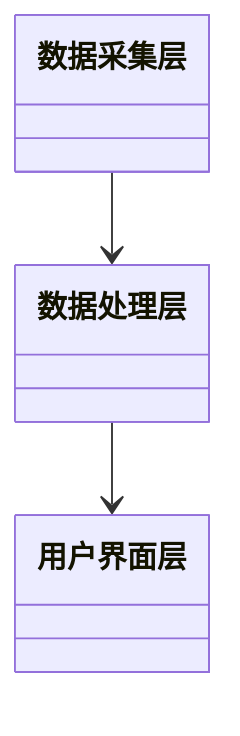
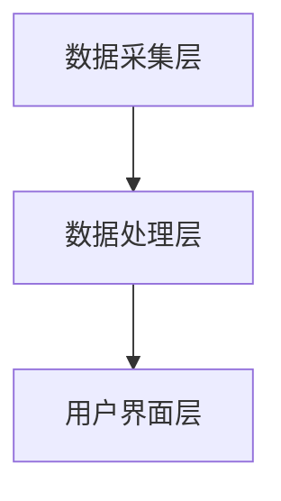
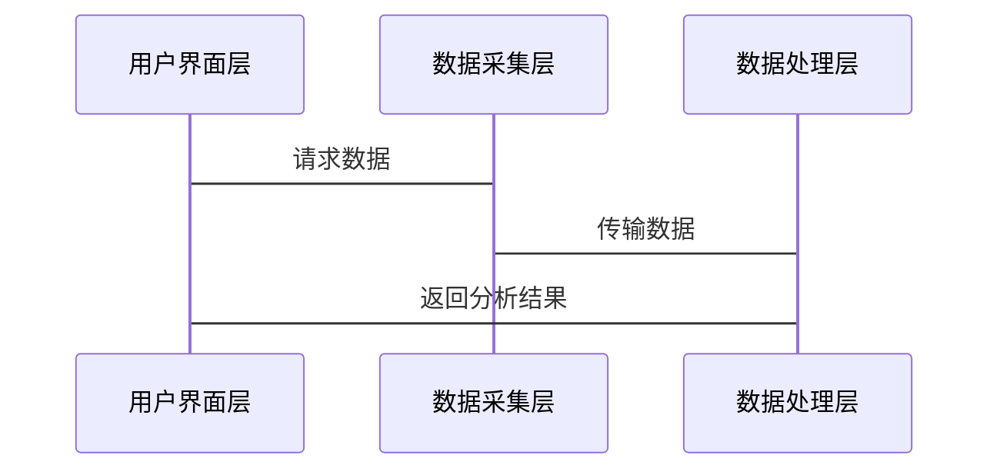

                 


# 全球股市估值与柔性电子技术的关系

> 关键词：全球股市估值，柔性电子技术，股市指标，技术影响，经济分析

> 摘要：本文探讨了全球股市估值与柔性电子技术之间的关系，分析了柔性电子技术对股市估值的影响，以及两者之间的互动关系。文章从定义、指标、模型、系统设计和项目实战等多方面展开，结合实际案例和数学模型，深入剖析了柔性电子技术如何通过改变市场动态和企业价值来影响全球股市估值。

---

# 第一章: 全球股市估值与柔性电子技术的概述

## 1.1 全球股市估值的背景与意义

### 1.1.1 股市估值的基本概念
股市估值是通过对企业的财务数据和市场表现进行分析，以确定其股票的合理价格。常见的估值指标包括市盈率（P/E Ratio）、市净率（P/B Ratio）和市销率（P/S Ratio）等。

### 1.1.2 全球化背景下的股市特点
随着全球化的发展，股市已经超越了地域限制，形成全球化的市场。投资者可以通过股票市场投资于世界各地的企业，这使得股市估值的分析需要考虑全球宏观经济环境和行业趋势。

### 1.1.3 柔性电子技术的定义与应用领域
柔性电子技术是一种基于柔性材料（如有机聚合物）的电子技术，具有轻薄、可弯曲、耐用等特点。其应用领域包括医疗设备、可穿戴设备、智能包装、汽车电子等。

## 1.2 柔性电子技术的核心概念

### 1.2.1 柔性电子技术的定义
柔性电子技术是指在柔性基板上制造电子元件和电路的技术，具有柔韧性、可穿戴性和适应性强等特点。

### 1.2.2 柔性电子技术的关键特性
- **可弯曲性**：可以在弯曲、折叠的情况下正常工作。
- **轻薄性**：相比传统电子设备，柔性电子设备更轻薄。
- **耐用性**：能够承受更多的物理压力和冲击。
- **集成性**：可以将多种电子元件集成到一个柔性基板上。

### 1.2.3 柔性电子技术的市场现状与发展趋势
当前，柔性电子技术在医疗、可穿戴设备和物联网等领域得到了广泛应用。随着技术的不断进步，其市场应用前景广阔。

## 1.3 本章小结
本章介绍了全球股市估值和柔性电子技术的基本概念，强调了两者在全球化背景下的重要性。

---

# 第二章: 全球股市估值与柔性电子技术的关系分析

## 2.1 全球股市估值的指标与方法

### 2.1.1 市盈率（P/E Ratio）
市盈率是股票价格与每股收益的比值，用于衡量投资者对股票的愿意支付的价格。

### 2.1.2 市净率（P/B Ratio）
市净率是股票价格与每股净资产的比值，用于评估股票是否被高估或低估。

### 2.1.3 市销率（P/S Ratio）
市销率是股票价格与每股销售收入的比值，常用于评估成长型企业的估值。

## 2.2 柔性电子技术对股市估值的影响

### 2.2.1 柔性电子技术的创新与市场潜力
柔性电子技术的创新能够降低生产成本、提高产品性能，从而提升企业的市场竞争力和盈利能力。

### 2.2.2 柔性电子技术对相关企业估值的影响
柔性电子技术的商业化应用能够提升企业的收入和利润，从而提高其股票的估值。

### 2.2.3 柔性电子技术的商业化进程与股市反应
随着柔性电子技术的逐步商业化，相关企业的股票价格可能会出现上涨，反映出市场对其技术的认可。

## 2.3 全球股市与柔性电子技术的互动关系

### 2.3.1 技术进步推动股市估值上升
柔性电子技术的创新能够提升企业的竞争力，从而推动其股票价格上涨。

### 2.3.2 股市资金支持柔性电子技术发展
股市提供的资金支持能够促进柔性电子技术的研发和商业化进程。

### 2.3.3 全球经济环境对两者关系的调节作用
全球经济环境的变化会影响股市的整体表现，进而影响柔性电子技术企业的估值。

## 2.4 本章小结
本章分析了全球股市估值的指标与方法，探讨了柔性电子技术对股市估值的影响，以及两者之间的互动关系。

---

# 第三章: 全球股市估值与柔性电子技术的核心概念联系

## 3.1 柔性电子技术的经济价值评估

### 3.1.1 柔性电子技术的市场价值模型
柔性电子技术的市场价值可以通过其应用领域的市场规模和渗透率来评估。

### 3.1.2 柔性电子技术的生命周期与估值
柔性电子技术的生命周期包括研发、生产、市场推广和成熟阶段，不同阶段的估值方法有所不同。

### 3.1.3 柔性电子技术的创新溢价
由于柔性电子技术的创新性，相关企业的股票可能会出现溢价现象。

## 3.2 全球股市估值的动态变化

### 3.2.1 经济周期对股市估值的影响
经济周期的波动会影响股市的整体估值水平，进而影响柔性电子技术企业的估值。

### 3.2.2 行业趋势对股市估值的影响
行业发展趋势的变化，如政策支持和市场需求的变化，也会对股市估值产生影响。

### 3.2.3 技术创新对股市估值的推动作用
技术创新能够提升企业的竞争力，推动其股票价格上涨。

## 3.3 柔性电子技术对全球股市估值的长期影响

### 3.3.1 柔性电子技术的普及与股市估值的关系
随着柔性电子技术的普及，相关企业的市场份额可能会扩大，从而提升其股票的估值。

### 3.3.2 柔性电子技术的商业化进程与股市估值的关联
商业化进程的快慢直接影响到企业的收入和利润，进而影响其股票的估值。

### 3.3.3 柔性电子技术的未来发展趋势对股市估值的影响
未来柔性电子技术的发展趋势将决定其对股市估值的长期影响。

## 3.4 本章小结
本章探讨了柔性电子技术的经济价值评估，分析了全球股市估值的动态变化，以及柔性电子技术对全球股市估值的长期影响。

---

# 第四章: 全球股市估值与柔性电子技术的数学模型与分析

## 4.1 股市估值的数学模型

### 4.1.1 市盈率模型
市盈率模型可以通过企业的净利润和股票价格来计算其合理的估值。

$$ P/E = \frac{\text{股票价格}}{\text{每股收益}} $$

### 4.1.2 市净率模型
市净率模型通过企业的净资产来评估其股票的估值。

$$ P/B = \frac{\text{股票价格}}{\text{每股净资产}} $$

### 4.1.3 市销率模型
市销率模型通过企业的销售收入来评估其股票的估值。

$$ P/S = \frac{\text{股票价格}}{\text{每股销售收入}} $$

## 4.2 柔性电子技术的数学模型

### 4.2.1 柔性电子技术的市场渗透率模型
市场渗透率模型可以用来预测柔性电子技术在市场中的渗透程度。

$$ \text{渗透率} = \frac{\text{销售量}}{\text{潜在市场规模}} $$

### 4.2.2 柔性电子技术的生命周期模型
生命周期模型可以用来分析柔性电子技术在其生命周期中的不同阶段的估值变化。

### 4.2.3 柔性电子技术的创新价值模型
创新价值模型可以用来评估柔性电子技术的创新对股票估值的影响。

$$ \text{创新价值} = \text{技术创新} \times \text{市场潜力} $$

## 4.3 全球股市估值与柔性电子技术的关系模型

### 4.3.1 回归分析模型
通过回归分析模型，可以量化柔性电子技术对股市估值的影响。

$$ \text{股票价格} = \beta_0 + \beta_1 \times \text{技术创新} + \epsilon $$

### 4.3.2 时间序列分析模型
通过时间序列分析模型，可以研究柔性电子技术对企业估值的动态影响。

### 4.3.3 风险评估模型
通过风险评估模型，可以分析柔性电子技术企业的市场风险对股市估值的影响。

## 4.4 本章小结
本章通过数学模型分析了全球股市估值与柔性电子技术之间的关系，量化了技术创新对股市估值的影响。

---

# 第五章: 全球股市估值与柔性电子技术的系统分析与架构设计

## 5.1 系统分析

### 5.1.1 问题场景介绍
本文将设计一个基于柔性电子技术的股市估值分析系统，用于实时监测柔性电子技术企业的股票价格和相关指标。

### 5.1.2 系统功能设计
- 数据采集：从股票市场获取柔性电子技术企业的实时股价数据。
- 数据分析：通过数学模型分析股价与技术创新的关系。
- 数据可视化：将分析结果以图表形式展示。

### 5.1.3 系统架构设计
使用分层架构，包括数据采集层、数据处理层和用户界面层。

### 5.1.4 系统接口设计
系统需要与股票数据接口（如API）进行交互，获取实时数据。

## 5.2 系统设计

### 5.2.1 类图设计
使用Mermaid绘制类图，展示系统中的各个组件及其关系。



### 5.2.2 架构图设计
使用Mermaid绘制系统架构图，展示系统的整体架构。



### 5.2.3 系统交互设计
使用Mermaid绘制序列图，展示系统中各组件的交互过程。



## 5.3 本章小结
本章通过系统分析与架构设计，提出了一个基于柔性电子技术的股市估值分析系统。

---

# 第六章: 全球股市估值与柔性电子技术的项目实战

## 6.1 项目环境安装

### 6.1.1 安装Python环境
使用Anaconda安装Python 3.8及以上版本。

### 6.1.2 安装相关库
安装Pandas、Matplotlib、Scikit-learn等数据处理和可视化库。

## 6.2 系统核心实现

### 6.2.1 数据采集
使用Yahoo Finance API获取柔性电子技术企业的股价数据。

### 6.2.2 数据分析
通过回归分析模型，分析股价与技术创新的关系。

### 6.2.3 数据可视化
将分析结果以折线图和散点图的形式展示。

## 6.3 代码实现

### 6.3.1 数据采集代码
```python
import pandas_datareader as pdr

# 下载苹果公司股票数据
apple = pdr.get_data_yahoo('AAPL', start='2020-01-01', end='2023-12-31')
print(apple.head())
```

### 6.3.2 数据分析代码
```python
import pandas as pd
import numpy as np
from sklearn.linear_model import LinearRegression

# 回归分析模型
model = LinearRegression()
model.fit(apple[['Close']], apple['Volume'])
print(model.coef_)
```

### 6.3.3 数据可视化代码
```python
import matplotlib.pyplot as plt

plt.figure(figsize=(10, 6))
plt.plot(apple['Close'], label='股价')
plt.scatter(apple.index, apple['Volume'], color='red', label='成交量')
plt.title('股价与成交量关系')
plt.legend()
plt.show()
```

## 6.4 本章小结
本章通过项目实战，展示了如何利用Python和相关库进行全球股市估值与柔性电子技术的关系分析。

---

# 第七章: 总结与展望

## 7.1 总结
本文探讨了全球股市估值与柔性电子技术之间的关系，分析了柔性电子技术对股市估值的影响，以及两者之间的互动关系。通过数学模型和系统设计，量化了技术创新对股市估值的影响。

## 7.2 展望
未来的研究可以进一步探索柔性电子技术的市场潜力，以及其对全球经济和股市估值的长期影响。同时，可以结合机器学习等先进技术，提高股市估值分析的准确性和实时性。

## 7.3 最佳实践 tips
- 在进行股市估值分析时，建议结合宏观经济指标和行业趋势进行综合分析。
- 在使用数学模型时，建议选择合适的数据和模型参数，确保分析结果的准确性。

## 7.4 小结
本文通过理论分析和实践案例，为读者提供了关于全球股市估值与柔性电子技术关系的深入探讨。

---

作者：AI天才研究院/AI Genius Institute & 禅与计算机程序设计艺术 /Zen And The Art of Computer Programming

